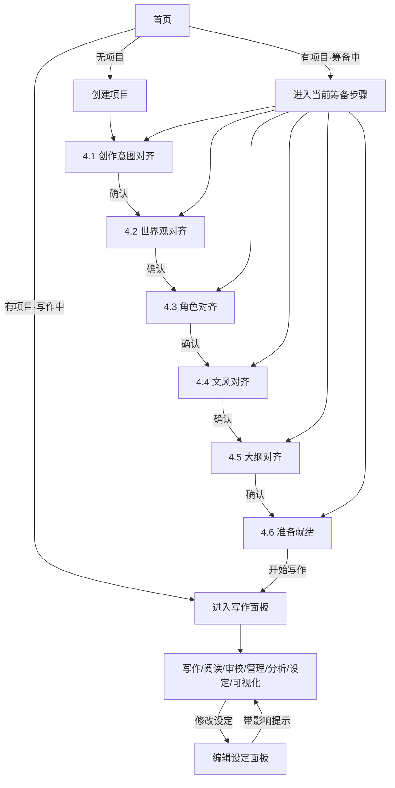

# 墨染 产品设计方案

> 状态：设计中 — 待审阅

---

## 一、产品核心认知

墨染的核心是 AI 写作。用户来墨染，是因为需要 AI 来创作。

每一个步骤的本质不是"用户填信息"，而是**用户与 AI 的对齐过程**——让 AI 充分理解用户的创作意图，才能写出用户想要的作品。

### 对齐三模式

| 模式 | 场景 | 交互形态 |
|------|------|----------|
| AI 主导 | 用户没想法，让 AI 发散 | AI 生成方案 → 用户挑选/调整 |
| AI 辅助 | 用户有模糊想法 | 用户输入 → AI 扩展补充 → 用户确认 |
| 用户教导 AI | 用户已有完整构思 | 用户表达 → AI 复述理解 → 用户纠正 → 直到 AI 真正理解 |

**无论哪种模式，步骤数不会减少。** 目的是对齐，不是收集信息。即使用户不需要脑暴，也需要与 AI 交流让 AI 理解其想法——只是对齐方式不同。

---

## 二、两阶段模型

### 阶段一：项目筹备（对齐引导）

写作前，用户与 AI 就各个创作维度逐步达成共识：

```
创建项目 → 创作意图对齐 → 世界观对齐 → 角色对齐 → 文风对齐 → 大纲对齐 → 准备就绪
```

每一步是**对话式对齐**，不是表单填写。

### 阶段二：正式写作（自由面板）

对齐完成后，AI 已充分理解创作意图，进入自由创作管理模式：

```
写作 / 阅读 / 审校 / 管理 / 分析 / 设定 / 可视化 —— 随意切换
```

---

## 三、项目生命周期

项目有明确的阶段状态，驱动 UI 行为：

```
planning → intent → world → characters → style → outline → ready → active
```

| 状态 | 含义 | 可进入的界面 |
|------|------|-------------|
| `planning` | 刚创建，尚未开始对齐 | 筹备向导 |
| `intent` | 正在进行创作意图对齐 | 筹备向导 |
| `world` | 正在进行世界观对齐 | 筹备向导 |
| `characters` | 正在进行角色对齐 | 筹备向导 |
| `style` | 正在进行文风对齐 | 筹备向导 |
| `outline` | 正在进行大纲对齐 | 筹备向导 |
| `ready` | 筹备完成，等待用户确认开始 | 筹备向导（汇总页） |
| `active` | 正式写作中 | 全部 7 面板 |

阶段只能**前进或停留**，不能回退（但可以在写作阶段重新编辑设定内容）。

---

### 3.x 通用交互组件：多方案切换

筹备阶段的每个对齐步骤中，AI 可能一次输出多个候选方案（如多个创作意图方向、多套世界观框架、多种角色阵容）。所有步骤共用以下交互规范：

**触发条件**：AI 在对话中产出 ≥2 个完整方案卡片时，右侧面板自动启用 Tab 切换。

**交互规则**：

| 要素 | 规则 |
|------|------|
| Tab 栏位置 | 右侧卡片顶部，紧贴标题下方 |
| Tab 样式 | 选中态：navy 底色 + 白字；未选中态：透明底 + 灰字 |
| Tab 标签 | 默认 `方案一` `方案二` `方案三`…；AI 可自定义名称（如 `记忆碎片线` `双重身份线`） |
| 最大方案数 | 5 个（超出时 AI 需先收敛再输出） |
| 单方案退化 | 仅 1 个方案时，Tab 栏不显示，退化为当前单卡片模式 |
| 底部按钮 | 多方案时显示 **"采用此方案并继续 →"**；单方案时显示原 "确认XX并继续 →" |
| 对话联动 | 用户在对话中追问 → AI 可更新当前 Tab 内容或新增 Tab |
| 卡片编辑 | 用户可直接在当前选中方案的卡片上编辑微调 |
| 方案删除 | 每个 Tab 右侧有 × 关闭按钮（至少保留 1 个方案） |

**数据存储**：所有方案均保存在后端。用户"采用"某方案后，该方案标记为 `selected`，其余标记为 `archived`。已归档方案可在"历史方案"抽屉中查看恢复。

---

## 四、筹备阶段各步骤

### 4.0 创建项目

建立项目容器，确定基本方向。

**必填**：项目名称

**题材选择**：预设卡片 + 自定义

预设题材及其作用：

| 题材 | 影响 |
|------|------|
| 玄幻 | 世界观模板偏重力量体系、宗门结构；角色模板偏修炼者 |
| 都市 | 世界观精简（现实背景）；角色模板偏职业/社会关系 |
| 言情 | 角色模板偏感情线；文风建议偏细腻 |
| 科幻 | 世界观模板偏科技设定；文风建议偏硬朗 |
| 悬疑 | 大纲模板偏线索/谜题结构；文风建议偏紧凑 |
| 历史 | 世界观模板偏朝代/制度；文风建议偏厚重 |
| 同人 | 提示用户提供原作参考，可调用析典分析 |
| 自定义 | 不预设任何模板，完全由对齐过程产生 |

题材的作用是**智能默认**，不是约束。选了玄幻也可以写成玄幻言情，对齐过程会自然调整。

**可选**：一句话灵感（如"一个失忆的杀手在异世界重新开始"）、目标篇幅

创建后立即进入 4.1 创作意图对齐。

### 4.1 创作意图对齐（灵犀）

**目的**：让 AI 理解用户想写什么样的故事。

**UI 形态**：对话面板（左侧对话流 + 右侧结果卡片）。多方案时右侧启用 Tab 切换（见 §3.x 通用交互组件）。

**流程**：
1. 进入时 AI 根据题材和灵感（如有）开场：
   - 有灵感 → "我理解你想写的是……让我展开几个方向"
   - 无灵感 → "这个题材下有几个有趣的故事方向，你看哪个吸引你"
2. AI 展开方向时，每个方向生成独立的创作意图卡片，右侧自动出现 Tab 切换
3. 每张创作意图卡片包含：
   - 核心冲突
   - 故事卖点（标签形式，可多个）
   - 基调/情绪
   - 目标读者感受
4. 用户可：
   - 点击 Tab 切换浏览不同方案
   - 在当前方案卡片上直接编辑微调
   - 在对话中要求 AI 修改某个方案或新增方案
   - 关闭不满意的方案（Tab 上 × 按钮）
5. 用户点击"采用此方案并继续" → 当前方案标记为 `selected`，进入下一步

**三种路径自然切换**：
- 用户说"帮我想几个方向" → AI 主导，输出 2-3 个方案 Tab
- 用户说"我想写一个……" → AI 辅助，仅输出 1 个方案（Tab 栏不显示）
- 用户贴了大段构思 → AI 转为复述确认模式，1 个方案

**完成标准**：用户点击"采用此方案并继续"（多方案）或"确认创作意图并继续"（单方案）

### 4.2 世界观对齐（匠心）

**目的**：AI 理解故事发生在什么样的世界。

**UI 形态**：对话面板（左侧对话 + 右侧世界观文档）

#### 世界观文档结构

世界观文档由**基础层 + 子系统**两部分构成：

**基础层**（所有题材共有）：

| 字段 | 说明 | 示例 |
|------|------|------|
| 世界名称 | 故事世界的名字或代号 | 苍穹大陆、近未来上海 |
| 时代背景 | 所处时间段与文明阶段 | 修仙纪元末期、2087年后量子革命 |
| 核心规则 | 这个世界最根本的运行法则 | "灵气浓度决定一切"、"AI 不可伤人" |
| 地理概貌 | 世界的空间结构 | 三大洲七域、环形空间站群 |
| 社会概貌 | 基本的社会组织形态 | 宗门制、联邦制、家族制 |
| 世界矛盾 | 世界层面的核心冲突 | 灵气枯竭、种族战争、资源争夺 |

**子系统**（根据题材智能推荐，用户可增删）：

子系统是世界观中**需要详细设计的独立体系**。不同题材需要不同的子系统组合。

#### 子系统引导机制

匠心根据题材**自动推荐**子系统组合，但不强制——用户可以删减不需要的，也可以添加推荐之外的。

**各题材的默认子系统推荐**：

| 题材 | 推荐子系统 | 说明 |
|------|-----------|------|
| 玄幻 | 力量体系、宗门/势力、种族、天材地宝、禁忌/禁区 | 重设定，子系统是玄幻的核心竞争力 |
| 科幻 | 科技树、星际政治、种族/文明、能源体系 | 硬科幻需要自洽的技术逻辑 |
| 都市 | 势力分布、特殊规则（如有超自然元素）| 轻设定，子系统可选 |
| 言情 | 社会阶层、家族关系 | 极轻设定，多数可省略 |
| 悬疑 | 组织架构、线索/谜题体系、信息壁垒 | 侧重信息流动的规则 |
| 历史 | 朝廷/官制、军事体系、经济体系、礼制 | 需要考据支撑 |

**每个子系统的标准字段**：

```
子系统名称：力量体系
├── 体系概述：一句话描述核心逻辑
├── 等级划分：层级结构（如练气→筑基→金丹→...）
├── 晋级规则：如何从一级到下一级
├── 核心资源：驱动体系运转的资源（灵石、功法、天赋）
├── 限制/代价：使用力量的代价或上限
├── 与故事的关联：这个体系如何服务于情节推进
└── 备注：其他补充
```

不同子系统的字段不同，上面是力量体系的例子。每种子系统有自己的字段模板：

- **势力/宗门**：势力名称、层级、领袖、核心成员、领地/势力范围、与其他势力关系、内部矛盾、当前状态（活跃/衰弱/覆灭/合并）
- **种族**：种族名称、特征、天赋/弱点、文化特点、种族间关系
- **科技树**：技术领域、发展阶段、关键技术、社会影响、技术限制
- **社会阶层**：阶层划分、流动性、阶层间矛盾、特权/限制

#### 地点体系

世界观文档中的地点不是简单列表，而是**层级树 + 连接关系**的结构（已有能力）：

```
地点卡片：
├── 名称 + 别名[]
├── 类型（城市/山脉/宫殿/密境/...）
├── 重要性：主要 / 中等 / 次要
├── 状态：活跃 / 已毁 / 废弃 / 被占领（已有能力，写作过程中自动追踪）
├── 描述 + 感官细节（视/听/嗅/触）
├── 空间布局
├── 上级地点（支持嵌套：大陆 → 国 → 城 → 街 → 店）
├── 连接关系：
│   ├── 目标地点
│   ├── 连接类型（陆路/水路/传送门/密道/空间裂隙/...）
│   ├── 是否双向
│   └── 描述（如"需渡过忘川河"）
├── 关联角色[]
├── 标签[]
└── 首次出场章节
```

用户在对齐阶段只需确认**核心地点**（故事主要发生地），细节地点会在写作过程中由载史自动积累。

#### 术语表

世界观对齐过程中产生的**专有名词**自动收录到术语表（已有能力）：

| 字段 | 说明 |
|------|------|
| 术语 | 专有名词 |
| 别名[] | 该术语的其他称呼 |
| 类别 | 地点 / 组织 / 力量体系 / 头衔 / 物品 / 概念 / 自定义 |
| 定义 | 简短释义 |
| 约束 | 使用规则（如"灵根只能在12岁前觉醒"）|
| 首次出场 | 章节号 |

术语表的作用：
- 写作时 AI 保持用词一致（不会把"灵根"写成"灵脉"）
- 审校时明镜检查术语使用是否正确
- 用户可在对齐阶段预定义核心术语，写作过程中载史会自动补充新出现的术语

#### 世界状态演化（写作阶段自动追踪）

对齐阶段确认的是**初始世界设定**。进入写作后，载史会逐章记录世界状态变化（已有能力）：

| 追踪字段 | 说明 |
|---------|------|
| 故事内日期 | 当前章节的故事时间 |
| 季节/天气/时段 | 环境氛围 |
| 重大世界事件 | 本章发生的世界级事件 |
| 环境备注 | 环境变化记录 |

这些数据由载史自动提取，不需要用户手动维护。在对齐阶段用户只需关注**初始世界设定**，演化追踪是后续自动能力。

#### 用户自定义子系统

用户可以在对话中或直接在右侧文档中**新增自定义子系统**。

**对话方式**：
> 用户："我这个世界有一套独特的契约体系，人与灵兽之间要签订灵魂契约。"
> 匠心："理解了，这是一个关键设定。我帮你建一个'契约体系'子系统。"
> → 匠心自动创建子系统，提出字段建议（契约类型/等级/代价/解除条件…）
> → 用户确认或修改

**直接操作方式**：
右侧世界观文档底部有「+ 添加子系统」按钮：
1. 用户点击 → 弹出空白子系统模板
2. 输入子系统名称 → 匠心根据名称智能推荐字段结构
3. 用户填写/修改 → 保存

**删除/隐藏**：每个子系统卡片右上角有折叠和删除操作。删除前确认，折叠的子系统不会影响后续写作但保留数据。

#### 世界观对齐流程（详细）

1. **初始化**：匠心读取创作意图和题材，生成世界观初稿：
   - 填充基础层字段
   - 根据题材推荐子系统组合，每个子系统生成框架内容
   - 右侧文档实时展示
2. **对话细化**：用户与匠心逐项讨论
   - 匠心会主动追问关键设定的自洽性："你的力量体系最高境界是什么？有天花板吗？"
   - 用户可以随时说"这个不需要这么详细"或"这里需要展开"
3. **自洽检查**：匠心在对话过程中自动检测矛盾
   - "你前面说灵气稀薄，但这里又有大量灵兽，它们的灵气从哪来？"
   - 用户选择修改或解释
4. **用户扩展**：用户新增自定义子系统或修改推荐子系统的字段结构
5. **确认**：用户满意后点击确认 → 进入角色对齐

**轻量路径**：用户可说"这个世界就是现代都市，没什么特殊设定"，匠心生成极简文档（仅基础层，无子系统），快速通过。

**完成标准**：用户确认世界观文档（基础层 + 至少已审阅推荐子系统）

### 4.3 角色对齐（匠心）

**目的**：AI 理解核心角色的身份、心理、关系和阵营归属。

**UI 形态**：对话面板（左侧对话 + 右侧角色卡片列表）

#### 角色卡片结构（多层次）

每个角色卡片包含三个层次的设定：

**第一层：基础档案**

| 字段 | 说明 |
|------|------|
| 姓名 | 全名 |
| 别名[] | 外号、称号、化名 |
| 角色定位 | 主角 / 反派 / 配角 / 龙套 |
| 身份 | 在故事世界中的社会身份 |
| 性格 | 核心性格特征 |
| 背景 | 出场前的人生经历 |
| 传记 | 角色从出生到故事开始前的完整叙事档案（由匠心生成，是后续推导心理模型的基础）|
| 目标[] | 故事中追求的目标（可多个）|
| 弧线类型 | 正向弧（成长）/ 负向弧（堕落）/ 平坦弧（坚守）/ 腐化弧（被环境改变）|
| 首次出场 | 角色首次出场的章节号 |

**第二层：心理模型（角色 DNA）**

这是墨染的核心角色设计方法论（已有能力），驱动角色行为的深层逻辑。在 Dickens 中称为 **Character DNA**，是角色弧线自动演化的基础。

**四维心理框架（WANT/NEED/LIE/GHOST）**：

| 维度 | 含义 | 示例（以林冲为例）|
|------|------|----------------|
| GHOST（创伤源）| 角色过去的关键创伤事件 | 高衙内调戏妻子，上司陷害 |
| WOUND（内心伤口）| 创伤留下的深层恐惧 | 对权力体制的恐惧与不信任 |
| LIE（错误信念）| 角色因创伤而持有的错误认知 | "忍让就能保全" |
| WANT（表面欲望）| 角色以为自己想要的 | 安稳度日，不惹事端 |
| NEED（真实需要）| 角色真正需要学会的 | 反抗不公，为自己而战 |

**LIE → TRUTH 的转化就是角色弧线的本质。** 匠心在对齐阶段会引导用户思考这四个维度，而不仅是"性格好不好"。

**LIE 对峙系统（已有能力，角色弧线的自动驾驶仪）**：

角色的 LIE 不是一次性打破的，而是经历**四个阶段**的状态机：

```
established（确立）→ challenged（受到挑战）→ cracking（开始瓦解）→ shattered（彻底粉碎）
```

这套系统在写作阶段由载史自动追踪，但对齐阶段用户需要理解其机制：

| 字段 | 说明 |
|------|------|
| LIE 摘要 | 角色信奉的错误信念的一句话概括 |
| LIE 当前状态 | established / challenged / cracking / shattered |
| 压力阈值 | 角色需要经历多少次对峙才会进入下一阶段（防止弧线太快或太慢） |
| LIE 防御机制 | 角色面对真相时如何自我欺骗（如：合理化、转移注意、愤怒否认） |
| 破绽信号（tell）| 角色在 LIE 动摇时会暴露的行为细节（如：摸脖子、说话结巴、回避眼神）|
| LIE 对峙次数 | 已经被挑战了多少次 |
| 上次对峙章节 | 最近一次 LIE 受到冲击的章节号（防止连续施压，保证节奏） |

**行为控制字段**：

| 字段 | 说明 |
|------|------|
| 默认行为模式 | 角色在日常状态下的行为倾向（如"谨小慎微"、"目空一切"）|
| 压力反应 | 角色在极端压力下的行为模式（如"暴怒攻击"、"逃避沉默"）|
| 反常系数（0-1）| 角色偏离默认行为的概率——0 极度稳定，1 极度不可预测。控制写作时角色行为的"惊喜感" |
| LIE 敏感度（0-1）| 角色多容易被迫面对自己的错误信念——影响弧线推进节奏 |
| 弧线进度（0-1）| 从 LIE 到 TRUTH 走了多远——由系统自动追踪，用户不需要手动调整 |
| B线角色 | 专门负责挑战主角 LIE 的角色（如：鲁智深之于林冲）|
| B线功能 | B线角色如何挑战主角（如"用行动示范什么是真正的勇敢"）|

**行为特征（quirks）**：

| 字段 | 说明 |
|------|------|
| 口头禅 | 角色标志性的口头语 |
| 习惯动作[] | 下意识的小动作（如"总是摸腰间的剑柄"）|
| 怪癖[] | 个性化的行为特征（如"从不和女人对视"）|

这些看似小的行为特征，对 AI 写作极为重要——它们让角色在文字中"活"起来，而不是千人一面。匠心在生成角色时会自动推导这些特征，用户可以调整。

**第三层：社会关系网络**

角色不是孤立存在的，需要明确其在故事社会结构中的位置：

**势力/阵营归属**：

```
势力卡片：
├── 势力名称
├── 势力状态：活跃 / 衰弱 / 覆灭 / 合并
├── 领袖（关联角色）
├── 核心成员[]（关联角色）
├── 领地/势力范围
├── 变化记录（写作过程中自动追踪）
```

一个角色可以属于某个势力，也可以是无势力的独行者。势力系统与世界观中的势力/宗门子系统是同一套数据——对齐阶段在世界观中建立的势力，到角色阶段自然关联。

**角色关系（双层系统）**：

| 层次 | 说明 | 示例 |
|------|------|------|
| 静态关系 | 角色间的基本关系定义 + 关系描述 + 张力来源 | 林冲 → 鲁智深：结拜兄弟，"一个忍一个莽，互为镜像" |
| 动态关系 | 逐章追踪：关系强度(0-1) + 关系描述演化 + 本章变化原因 | 第1章：0.3 "初识" → 第10章：0.9 "过命交情"，因"野猪林救命" |

对齐阶段用户只需定义**静态关系**（谁和谁是什么关系 + 关系描述），动态演化在写作过程中由载史自动追踪。

动态关系追踪的完整字段（已有能力）：
- **关系强度**：0-1 数值，量化亲密/敌对程度
- **关系描述**：随剧情演化的文字描述（不只是初始定义，会逐章更新）
- **变化原因**：本章导致关系变化的具体事件

关系可以是：
- 人际关系（朋友、对手、师徒、恋人、仇敌…）
- 势力关系（同阵营、敌对阵营、暗中合作…）
- 特殊关系（B线角色——专门挑战主角 LIE 的人）

#### 角色对齐流程（详细）

1. **主角设计**：匠心基于意图和世界观，提议主角方案
   - 先生成传记（biography）→ 再推导四维心理模型
   - 右侧展示完整角色卡片（三个层次）
   - 对话中讨论调整，直到用户认可
2. **核心配角**：主角确认后，匠心建议 2-3 个关键配角
   - 每个配角至少有第一层（基础档案）和关键关系
   - 反派角色建议也做四维心理模型（好的反派需要好的动机）
3. **势力/阵营**：如世界观中有势力子系统，匠心引导角色归属
   - "林冲属于哪个阵营？"
   - 同时建立势力内部的角色层级关系
4. **关系网络**：匠心基于所有已确认角色，自动生成关系图草稿
   - 右侧展示角色关系图（简化版，标注关键关系）
   - 用户可调整：添加/删除关系线、修改关系类型
5. **确认**：用户满意后点击确认 → 进入文风对齐

**轻量路径**：用户可以只做第一层基础档案就确认，四维心理模型和关系网络由匠心在后续写作过程中逐步完善。

#### 角色状态演化（写作阶段自动追踪）

对齐阶段确认的是**角色初始设定**。进入写作后，载史会逐章追踪角色状态变化（已有能力）：

| 追踪字段 | 说明 |
|---------|------|
| 当前位置 | 角色在哪里 |
| 情绪状态 | 当前的情绪/心理状态 |
| 已知信息[] | 角色目前知道什么（信息差管理）|
| 能力/境界 | 力量等级变化 |
| 能力列表[] | 角色当前拥有的具体能力 |
| 物品/装备[] | 角色持有物 |
| 身体状况 | 是否受伤、存活状态（含死亡章节记录）|
| 本章变化[] | 角色在本章发生的所有变化（独立于上述各字段，便于快速回顾）|
| LIE 对峙状态 | 四阶段状态机（established→challenged→cracking→shattered）+ 弧线进度(0-1) |
| 关系演化 | 与其他角色的关系强度(0-1) + 变化描述（见下方关系系统）|

这些由载史两阶段归档自动提取（Haiku 筛选 + Sonnet 深度归档），审校时明镜会检查角色行为是否与心理模型一致。

**最低要求**：至少 1 个主角卡片（第一层基础档案）确认

**完成标准**：用户确认至少主角卡片 + 关键关系

### 4.4 文风对齐

**目的**：AI 理解叙事风格。

**UI 形态**：选项卡片 + 试写预览（混合式，非纯对话）

**流程**：
1. 展示文风维度卡片，每个维度可选：
   - **视角**：第一人称 / 第三人称限制 / 第三人称全知 / 多视角
   - **时态**：过去时 / 现在时
   - **语气**：严肃 / 轻快 / 幽默 / 讽刺 / 抒情 / 冷峻
   - **节奏**：快节奏 / 中等 / 慢热
   - **参考作品**：可输入作品名，调用析典分析提取风格特征
2. 选择后 AI 基于当前设定**试写 200 字示例段落**
3. 用户阅读示例，确认"味儿对了"或继续调整
4. 可多次试写直到满意

**完成标准**：用户确认示例段落的风格

### 4.5 大纲对齐（匠心）

**目的**：AI 理解故事走向。

**UI 形态**：对话面板（左侧对话 + 右侧大纲文档）

**流程**：
1. 用户选择大纲粒度：
   - **轻量起稿**：开篇冲突 + 3-5 个关键转折点 + 结局方向
   - **详细大纲**：完整故事弧（起承转合）+ 前 3-5 章细纲
2. 匠心基于所有前序对齐结果生成大纲初稿
3. 右侧展示可编辑的大纲结构
4. 对话中讨论调整节奏、伏笔、高潮位置等

**完成标准**：用户确认大纲

### 4.6 准备就绪

**目的**：最终确认，正式开始写作。

**UI 形态**：汇总仪表盘

**展示内容**：
- 创作意图摘要
- 世界观概要
- 角色列表（头像/姓名/一句话介绍）
- 文风配置
- 大纲结构
- 每项旁边有"编辑"入口，可跳回对应步骤修改

**操作**：
- 「开始写作」按钮 → 项目状态切换为 `active`，进入写作面板
- 如有缺失项，按钮旁显示提示但不强制阻断

---

## 五、页面结构

### 5.1 首页（项目启动台）

首页是**项目启动台**，不是功能仪表盘。

#### 无项目

```
┌─────────────────────────────────────┐
│                                     │
│         墨染 MoRan                  │
│      AI 长篇小说创作平台            │
│                                     │
│    ┌──────────────────────┐         │
│    │  ✨ 开始创作第一部作品  │         │
│    └──────────────────────┘         │
│                                     │
│    简短说明：3 步图示                │
│    创建 → 与 AI 对齐 → 开始写作     │
│                                     │
└─────────────────────────────────────┘
```

#### 有项目

```
┌─────────────────────────────────────┐
│  我的作品                  [+ 新建]  │
│                                     │
│  ┌─ 最近 ─────────────────────┐     │
│  │ 📖 仙路逆行                │     │
│  │ 玄幻 · 筹备中(3/6) · 昨天  │     │
│  │ → 继续角色设定              │     │
│  └─────────────────────────────┘     │
│                                     │
│  ┌─────────────┐ ┌─────────────┐    │
│  │ 📖 都市密码   │ │ 📖 星际迷途   │    │
│  │ 悬疑·写作中  │ │ 科幻·12章   │    │
│  │ → 继续写作   │ │ → 继续写作   │    │
│  └─────────────┘ └─────────────┘    │
└─────────────────────────────────────┘
```

**关键设计**：
- 最近项目突出显示，带下一步动作提示（"继续角色设定" / "继续写第13章"）
- 项目卡片显示当前阶段：筹备中(进度) / 写作中(章节数)
- 点击项目 → 根据阶段进入对应界面：
  - 筹备中 → 进入当前步骤的对齐面板
  - 写作中 → 进入写作面板

### 5.2 筹备阶段界面

#### 整体布局

```
┌──────┬──────────────────────────────────┐
│ 侧栏  │              主区域                │
│      │                                  │
│ 📝意图 │  ┌─ 对话流 ──────┬─ 结果面板 ──┐  │
│ 🌍世界 │  │              │             │  │
│ 👤角色 │  │  AI: ...     │  [意图卡片]  │  │
│ ✒️文风 │  │  你: ...     │  核心冲突:   │  │
│ 📋大纲 │  │  AI: ...     │  故事卖点:   │  │
│ ✅就绪 │  │              │  基调:       │  │
│      │  │  [输入框]     │  [确认]      │  │
│      │  └──────────────┴─────────────┘  │
│      │                                  │
│ ─────│                                  │
│ 🔒写作 │                                  │
│ 🔒阅读 │                                  │
│ ...  │                                  │
└──────┴──────────────────────────────────┘
```

#### 侧边栏

筹备阶段的侧边栏分两区：

**上区 — 筹备步骤**：
- 显示 6 个步骤图标，当前步骤高亮
- 已完成步骤带 ✓ 标记，可点击回看/修改
- 未到达步骤灰色但可点击跳转（不强制线性）

**下区 — 写作工具（锁定）**：
- 灰色折叠显示"完成设定后解锁"
- 提供窥探感，让用户知道后续还有什么

#### 对话面板

采用**对话流 + 结果面板**双栏布局：

- **左侧对话流**：用户与 AI 的对话历史，支持多轮交互
- **右侧结果面板**：当前步骤的结构化产出（卡片/文档），实时随对话更新
- **底部输入框**：用户输入区，支持文本输入

对话流不是聊天气泡堆砌，而是有结构的对齐过程——AI 的回复中会嵌入可操作的元素（选项按钮、可编辑区域）。

### 5.3 写作阶段界面

项目状态变为 `active` 后：

#### 侧边栏切换

筹备步骤收起，替换为 7 个功能面板：

| 图标 | 面板 | 说明 |
|------|------|------|
| 📖 | 阅读 | 浏览已完成章节 |
| ✍️ | 写作 | 触发写作与流式输出 |
| 🔍 | 审校 | 查看审校结果 |
| 🗂️ | 管理 | 项目统计与数据管理 |
| 📊 | 分析 | 参考作品分析 |
| ⚙️ | 设定 | 世界观/角色/大纲（可重新编辑） |
| 🗺️ | 可视化 | 关系图/地图/时间线 |

底部保留一个"项目设定"入口，可回到筹备阶段的汇总页查看/修改设定。

#### 各面板空状态

每个面板在无数据时显示有意义的引导，而非假数据：

| 面板 | 空状态文案 | 行动按钮 |
|------|-----------|---------|
| 阅读 | 还没有章节。写完第一章后在这里阅读。 | 去写第一章 |
| 写作 | 万事俱备，开始创作吧。 | 写下第一章 |
| 审校 | 完成章节后，明镜会给出审校意见。 | —（无按钮） |
| 管理 | 写作数据将在这里实时呈现。 | —（显示项目基本信息） |
| 分析 | 积累写作内容后可查看趋势分析。 | —（无按钮） |
| 设定 | （直接显示已对齐的设定内容，可编辑） | — |
| 可视化 | 角色和剧情积累后可生成关系图。 | —（无按钮） |

---

## 六、数据策略

### 移除所有 demo 假数据

当前问题：所有路由返回硬编码的 demo 数据（42 章、128K 字、成本数据），无论项目是否有真实内容。

**方案**：
- 所有路由返回**真实数据**，空项目返回零值
- 统计数据仅展示实际写作产生的数据
- 前端根据数据量决定展示形态（零值 → 空状态引导；有值 → 正常展示）

### 写作阶段才有的设定编辑

进入写作阶段后修改设定（世界观/角色/大纲），显示提示：
> "这些修改不会自动改写已完成章节，但会影响后续写作上下文。"

---

## 七、关键交互流转



---

## 八、与现有系统的对应关系

| 产品步骤 | 后端 Agent | 当前状态 |
|---------|-----------|---------|
| 创作意图对齐 | 灵犀 (lingxi) | 引擎已实现，需接入对话 UI |
| 世界观对齐 | 匠心 (jiangxin) | 引擎已实现，需接入对话 UI |
| 角色对齐 | 匠心 (jiangxin) | 引擎已实现，需接入对话 UI |
| 文风对齐 | 风格引擎 (style) + 析典 (xidian) | 引擎已实现，需新建选项+试写 UI |
| 大纲对齐 | 匠心 (jiangxin) | 引擎已实现，需接入对话 UI |
| 写作 | 执笔 (zhibi) | 引擎+面板已实现 |
| 审校 | 明镜 (mingjing) | 引擎+面板已实现 |
| 归档 | 载史 (zaishi) | 引擎已实现 |
| 参考分析 | 析典 (xidian) | 引擎+面板已实现 |

核心缺口：**对话式对齐 UI**（对话面板 + 结果面板的双栏布局）是全新组件。
