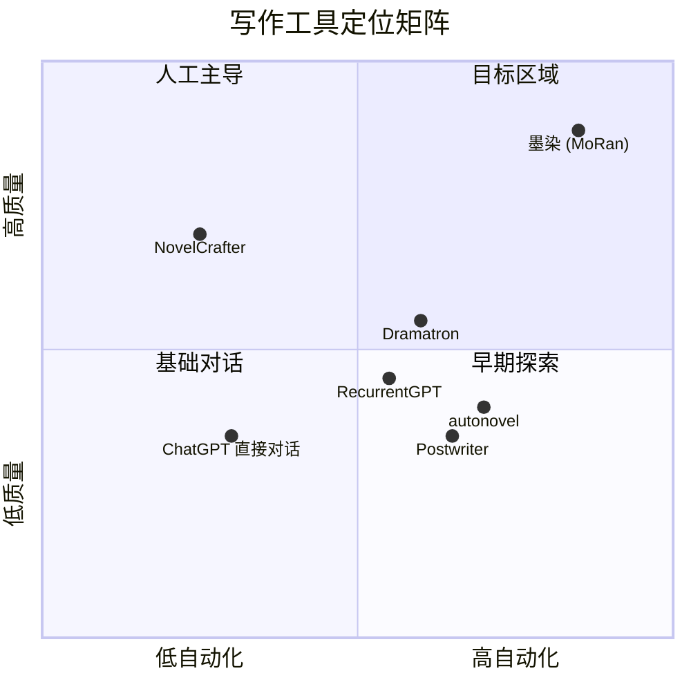

# 新项目设计文档 · §1 项目定位与命名

> 本文档为分段设计文档的第一部分。各节独立成文，最终合并为完整设计方案。

---

## 1.1 项目命名

### 主选：**墨染** (MoRan)

> 墨——笔墨、文章、书写的载体；染——渲染、浸润、潜移默化。

**命名理据**：

- **墨** 是中文写作最核心的意象，代表文字本身（"墨客"、"笔墨纸砚"、"泼墨"）
- **染** 暗含 AI 的工作方式——不是机械生成，而是浸润、渲染，如同墨在宣纸上自然晕开
- "墨染"在中文里有"墨迹渲染"的视觉意象，对应 AI 逐字生成的过程
- 二字简洁，容易记忆，`moran` 作为包名/域名可用性高
- 无已知同名开源项目冲突

**备选**：

| 名称 | 含义 | 评价 |
|------|------|------|
| 锦书 (JinShu) | "云中谁寄锦书来"——精美的书信/文章 | 偏书信，格局偏小 |
| 著墨 (ZhuMo) | 着笔、下笔 | 动词感强，但发音近"注目" |
| 千卷 (QianJuan) | "读书破万卷"——海量写作能力 | 偏阅读而非写作 |
| 织章 (ZhiZhang) | 编织章节——多Agent协作如织锦 | 太工具化，缺乏文气 |
| 栖墨 (QiMo) | 墨香栖息之所 | 意境好但偏静态 |

### 英文标识

- 包名：`moran`
- GitHub 仓库：`moran` 或 `moran-ai`
- CLI 命令：`moran`

---

## 1.2 项目定位

### 一句话定义

> **墨染** —— AI 驱动的长篇小说自动化写作系统，以多 Agent 协作与深度记忆管理，实现 300 万字以上高质量创作。

### 核心定位



**墨染占据的独特位置**：高自动化 + 高质量。

现有方案的不足：
- **ChatGPT/Claude 直接对话**：无记忆管理，超过 5 万字即上下文崩溃
- **NovelCrafter 等人类辅助工具**：质量可控但几乎无自动化
- **学术系统 (Dramatron/RecurrentGPT)**：PoC 阶段，无法实际生产长篇
- **开源写作 Agent (autonovel/Postwriter)**：早期阶段，470⭐/165⭐，记忆管理薄弱

### 目标用户

**Phase 1（自用）**：项目创始人，验证核心能力
**Phase 2（开源）**：

| 用户群 | 需求 |
|--------|------|
| 网文作者 | 辅助创作、大纲优化、审校润色、保持日更节奏 |
| 独立创作者 | 长篇小说从零到完成的全流程自动化 |
| AI 写作研究者 | 可复现的长篇生成系统、记忆管理实验平台 |
| 内容工作室 | 批量高质量内容生产 |

---

## 1.3 设计目标（硬性）

| 编号 | 目标 | 量化指标 |
|------|------|----------|
| G1 | 超长篇写作 | 单部作品 ≥ 300 万字（~1500 章 × 2000 字/章） |
| G2 | 写作质量 | 去 AI 味，Jaggers 三轮审校通过率 ≥ 80% 首轮 |
| G3 | 题材覆盖 | 都市/仙侠/科幻/悬疑/历史/言情 —— 风格引擎可切换 |
| G4 | 记忆一致性 | 第 1500 章仍能正确引用第 3 章埋下的伏笔 |
| G5 | 上下文效率 | 单章写作上下文 ≤ 64K tokens，其中有效信息占比 ≥ 70% |
| G6 | 容错与恢复 | 任意中断后 `/resume` 恢复，零数据丢失 |
| G7 | WebUI | 写作/阅读/审校/纠正全流程可视化操作 |
| G8 | 成本可控 | 单章 API 成本可追踪、可限制 |

---

## 1.4 核心理念

### 从 Dickens 继承的经验

Dickens 项目验证了以下理念的可行性，墨染将全面继承：

1. **谁产出谁修改** —— Agent 职责隔离，总指挥不直接写作
2. **每轮必存** —— 所有产出即时持久化，对抗会话脆弱性
3. **单决策点** —— 每次只向用户抛出一个决策，降低认知负荷
4. **跨模型族审校** —— 不同模型家族审校消除同源偏见
5. **人物先行** —— 传记法角色设计，拒绝模板化

### 超越 Dickens 的新增理念

6. **统一记忆网关 (UNM)** —— 所有写入经过 ManagedWrite 管线，解决 Dickens 的熵增失控
7. **预算驱动上下文** —— 不是"塞满上下文窗口"，而是"按场景需求精准分配 token 预算"
8. **螺旋检测** —— 自动识别审校螺旋、膨胀螺旋、矛盾螺旋并中断恢复
9. **增长策略分化** —— 6 大数据类别各有独立增长控制策略，而非一刀切
10. **WebUI 原生** —— 不再是 TUI 附属品，写作/阅读/审校体验是一等公民

---

## 1.5 与 Dickens 的关系

```
Dickens (OpenCode Plugin)          墨染 (独立系统)
─────────────────────────          ──────────────────
OpenCode 插件架构                   独立部署，WebUI 原生
50 万字设计目标                     300 万字设计目标
BGM 增长管理（已废弃）               UNM 统一记忆网关
对话式 Agent 委派                   OpenCode SDK 编排 + 自建 WebUI
TUI 为主                           WebUI 为主
6 Agent (固定)                      Agent 体系可扩展
单项目单会话                        多项目管理
无成本追踪                          API 成本追踪与限制
```

**墨染不是 Dickens 2.0**——它是吸收 Dickens 验证过的写作能力后的全新系统。代码不会直接复用，但设计智慧、Agent prompt、写作知识库将完整迁移。

---

## 1.6 框架选型（已确认）

**选定方案：OpenCode SDK 后端 + 自建 WebUI**

- Agent 编排层复用 OpenCode 已验证的多模型管理、会话持久化、权限隔离能力
- WebUI 完全自主设计，不受 TUI 架构限制
- MIT 协议，开源无法律风险
- 写作系统的工作流本质是线性管线 + 审校重试循环，OpenCode 的对话式编排完全够用

详细技术分析见 §2 技术栈与架构总览。
