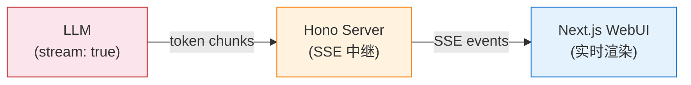
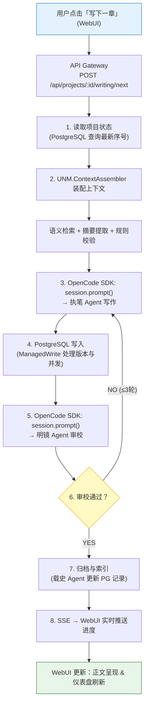
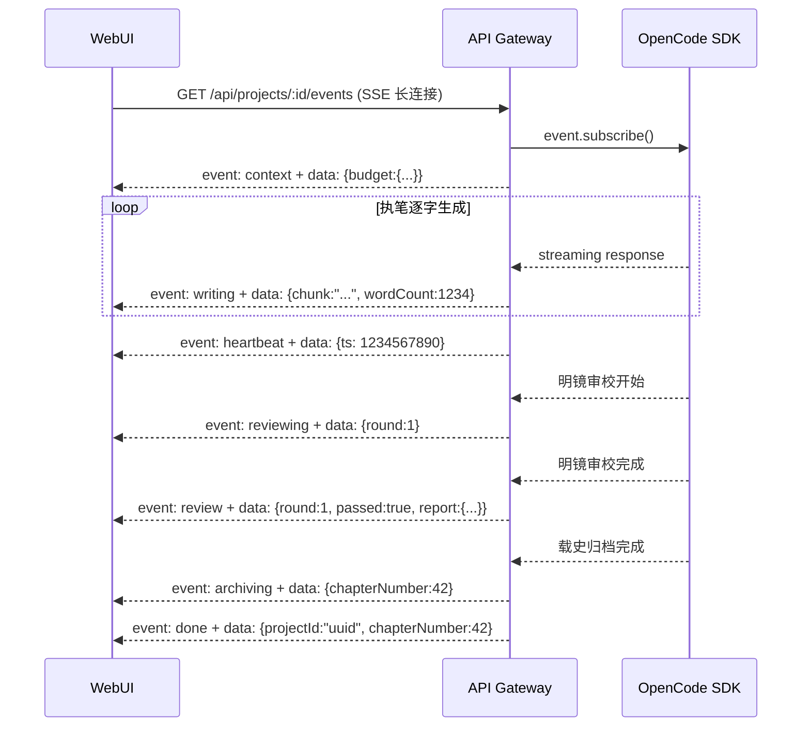
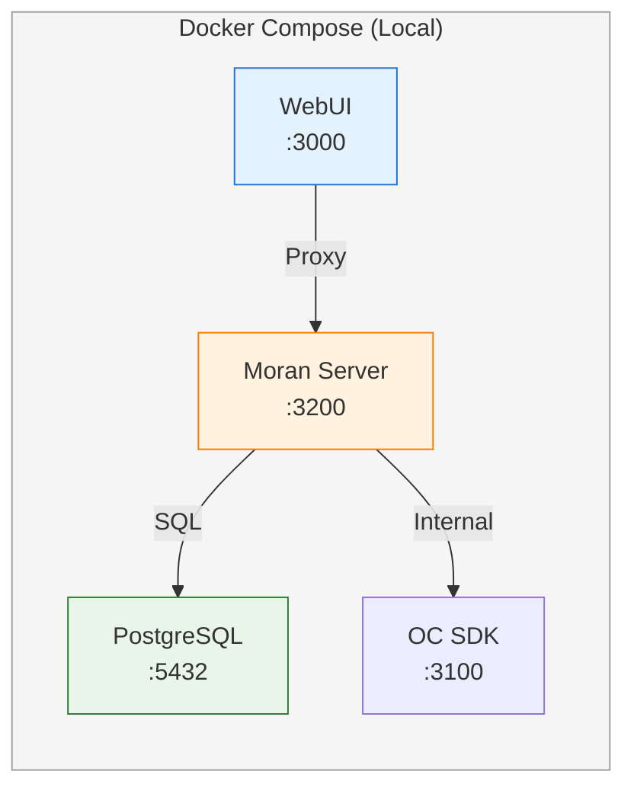
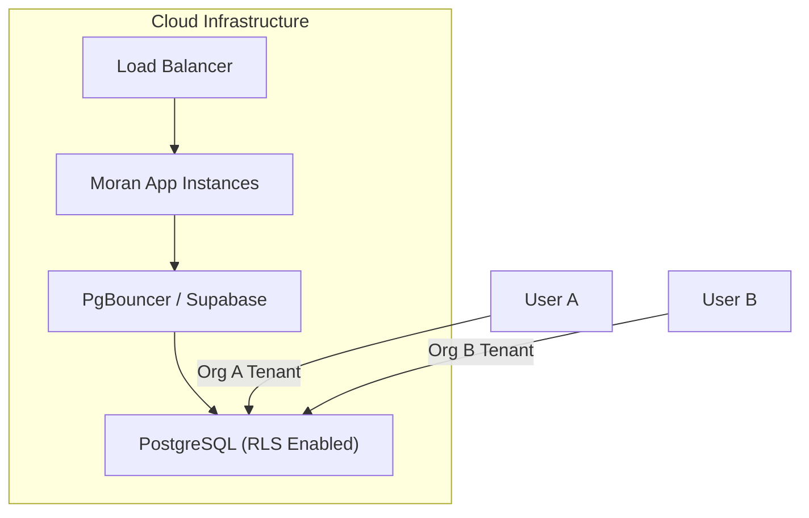

# 新项目设计文档 · §2 技术栈与架构总览

> 已确认方案：OpenCode SDK 后端 + 自建 WebUI + 全数据库存储 + Docker 部署

---

## 2.1 技术栈选择

### 后端：OpenCode SDK (TypeScript)

| 层 | 选型 | 理由 |
|---|---|---|
| Agent 编排 | OpenCode SDK (`@opencode-ai/sdk`) | MIT 开源，已验证的多模型管理、会话持久化、权限隔离 |
| LLM 调用 | OpenCode 内置（基于 Vercel `ai` 包） | Provider 抽象层，config 切换模型零代码 |
| 记忆引擎 | **自建**（UNM 统一记忆网关） | 核心竞争力，300万字级别无现成方案 |
| ORM | Drizzle ORM | TypeScript-first，类型安全；schema 定义即类型；支持迁移与 RLS 策略定义 |
| 持久化 | **PostgreSQL (Docker)** | 全数据库方案。WebUI 后文件可读性不再是优势，PG 在查询、并发、一致性维护上全面碾压 SQLite |
| 运行时 | Bun | @moran/core 和 @moran/server 原生运行时，性能优于 Node.js |

### 前端：自建 WebUI

| 层 | 选型 | 理由 |
|---|---|---|
| 框架 | Next.js 15 (App Router) | SSR + API Routes，全栈一体，Node.js 运行时保证极致稳定性 |
| UI 库 | shadcn/ui + Tailwind CSS v4 | 可定制、无依赖锁定、适合阅读/写作界面 |
| 状态管理 | Zustand | 轻量、直觉、适合中等复杂度应用 |
| 实时通信 | SSE (Server-Sent Events) | OpenCode SDK 原生支持 `event.subscribe()`，单向推流够用 |
| 富文本编辑 | Tiptap (ProseMirror) | 章节编辑/批注/审校标记的工业级方案 |
| Markdown 渲染 | react-markdown + rehype | 大纲/角色/世界观文档展示 |

### 为什么不用其他方案

| 放弃方案 | 理由 |
|----------|------|
| LangGraph (Python) | 写作工作流相对线性，不需要复杂的图状态机；且需要跨语言通信增加维护成本 |
| Dify/Coze | DAG 不支持环、状态仅会话级，无法实现长达 300 万字的精细记忆管理 |
| 纯 OpenCode 插件 | WebUI 受限于 TUI 架构，无法提供沉浸式的写作、阅读与审校视觉体验 |
| SQLite + 文件系统 | WebUI 架构下文件直观性让位于数据一致性；多用户/多 Agent 并发写入时 SQLite 极易锁定 |

---

## 2.2 整体架构

```mermaid
graph TB
    subgraph DockerEnv["Docker 容器环境 (Compose)"]
        subgraph WebUI["WebUI Container (Next.js)"]
            W1["写作面板<br/>(Tiptap)"]
            W2["阅读面板<br/>(Markdown)"]
            W3["项目管理<br/>(Dashboard)"]
        end

        subgraph Server["Server Container (Bun/TS)"]
            Gateway["API Gateway (Hono)<br/>REST + SSE"]
            
            subgraph Core["墨染核心 Core"]
                Orchestrator["编排控制器"]
                Bridge["Session-Project 桥接"]
                
                subgraph OC["OpenCode SDK (嵌入式)"]
                    OCSDK["SDK Client/Server"]
                    Agents["Agent 定义<br/>墨衡 | 灵犀 | 匠心..."]
                end

                subgraph UNM["UNM 记忆引擎"]
                    MW["ManagedWrite"]
                    CA["ContextAssembler"]
                    Tiers["多级缓存与检索"]
                end
            end
        end

        subgraph Storage["Storage Container"]
            PG["PostgreSQL<br/>(Chapters, Characters, Meta...)"]
        end

        WebUI -->|"REST / SSE"| Gateway
        Gateway --> Orchestrator
        Orchestrator --> OC
        OC --> UNM
        UNM --> PG
        Bridge --> OC
        Bridge --> PG
    end

    style WebUI fill:#e3f2fd,stroke:#1976d2
    style Server fill:#fff3e0,stroke:#f57c00
    style OC fill:#fafafa,stroke:#9e9e9e
    style UNM fill:#fce4ec,stroke:#c62828
    style Storage fill:#e8f5e9,stroke:#2e7d32
    style DockerEnv stroke-dasharray: 5 5
```



---

## 2.3 流式写作管道

墨染的核心体验之一是**流式写作呈现**——执笔 Agent 生成的文字逐字/逐句实时显示在 WebUI 上，而非等整章完成后一次性展示。

### 三层流式管道架构



| 层级 | 技术 | 实现方式 |
|------|------|----------|
| **LLM 调用层** | OpenCode SDK / Vercel AI SDK | `stream: true` 开启流式，返回 `ReadableStream<TextDelta>` |
| **后端中继层** | Hono `streamSSE()` | 将 LLM chunk 转为 SSE event，附加元数据（stage、chapterNumber、wordCount） |
| **前端渲染层** | React `useEffect` + `EventSource` | 逐 chunk 追加到编辑区，配合自动滚动和光标效果 |

### SSE 事件协议

所有流式事件通过统一的 SSE endpoint 推送：`GET /api/projects/:id/events`

```typescript
// SSE Event 类型定义
type SSEEvent =
  | { type: 'context';    data: { budget: BudgetAllocation } }         // 上下文装配完成
  | { type: 'writing';    data: { chunk: string; wordCount: number } } // 执笔逐字输出
  | { type: 'reviewing';  data: { round: number } }                    // 审校开始
  | { type: 'review';     data: { passed: boolean; report: ReviewReport } } // 审校结果
  | { type: 'archiving';  data: {} }                                   // 归档开始
  | { type: 'done';       data: { chapterNumber: number } }            // 全流程完成
  | { type: 'error';      data: { message: string; recoverable: boolean } } // 错误
  | { type: 'heartbeat';  data: {} }                                   // 保活心跳 (30s)
```

### 后端流式中继

```typescript
// @moran/server/src/routes/events.ts
import { streamSSE } from 'hono/streaming';

app.get('/api/projects/:id/events', (c) => {
  return streamSSE(c, async (stream) => {
    // 心跳保活
    const heartbeat = setInterval(() => {
      stream.writeSSE({ event: 'heartbeat', data: '{}' });
    }, 30_000);

    // 订阅 OpenCode SDK 的流式事件
    const unsubscribe = orchestrator.subscribe(projectId, (event) => {
      stream.writeSSE({
        event: event.type,
        data: JSON.stringify(event.data),
      });
    });

    // 清理
    stream.onAbort(() => {
      clearInterval(heartbeat);
      unsubscribe();
    });
  });
});
```

### 流式中断与续写

- **用户暂停**：前端发送 `POST /api/projects/:id/writing/pause`，后端中止当前 LLM 调用，已生成内容保存为草稿
- **断线重连**：前端 `EventSource` 自动重连，通过 `Last-Event-ID` 头恢复，后端从上次偏移量继续推送
- **续写**：用户编辑已生成内容后，发送 `POST /api/projects/:id/writing/continue`，执笔从用户编辑点继续生成

### 章节最终存储

流式过程中文字在前端实时展示，但**章节内容仅在执笔完成整章后一次性写入 PostgreSQL**。流式只影响呈现过程，不影响数据持久化策略。

---

## 2.4 数据流

### 写一章的完整数据流



### 实时通信流



> **协议要求**：所有 SSE 事件使用命名事件通道（`event: xxx`），共 8 类事件：`context`, `writing`, `reviewing`, `review`, `archiving`, `done`, `error`, `heartbeat`。详见 §2.3。

---

## 2.4 OpenCode SDK 集成方式

### 嵌入式部署

墨染后端通过嵌入式方式启动 OpenCode SDK，使其作为内部服务运行，同时利用其原生的 Agent 管理能力。

```typescript
// @moran/server/src/opencode.ts
import { createOpencode } from "@opencode-ai/sdk"

const { client, server } = await createOpencode({
  port: 3100,
  config: {
    // Agent 定义、模型配置、权限控制从数据库或环境变量加载
  }
})

// 核心操作：创建写作会话
const session = await client.session.create({
  body: { title: `章节写作会话` }
})
```

### 与 UNM 的接口边界

```
OpenCode SDK 负责:              UNM 记忆引擎负责:
─────────────────               ──────────────────
✅ Agent 定义与调度              ✅ 上下文装配（从 PG 提取关键信息）
✅ 模型调用与流式响应             ✅ 数据存取控制（写入 PG 与版本管理）
✅ 会话持久化 (内部使用)           ✅ 增长策略（处理长篇数据的膨胀）
✅ 权限控制                     ✅ 语义检索（pgvector 预留支持）
✅ SSE 事件转发                  ✅ 一致性追踪（伏笔/角色状态同步）
```

**原则：OpenCode 管 AI 交互的生命周期，UNM 管小说业务数据的持久化与结构化记忆。**

### Session-Project 桥接

由于 OpenCode 的 Session 语义是“对话”，而小说是“项目”，我们通过 Bridge 层将两者关联。所有项目数据存放在 PostgreSQL 中，OpenCode 的 Session ID 仅作为执行上下文的引用。

```typescript
// @moran/core/src/db/schema.ts (Drizzle)
export const projects = pgTable('projects', {
  id: uuid('id').primaryKey(),
  title: text('title').notNull(),
  currentSessionId: text('current_session_id'), // 关联 OpenCode Session
  status: projectStatusEnum('status').default('active'),
  // ... 其他元数据
});

export const chapters = pgTable('chapters', {
  id: uuid('id').primaryKey(),
  projectId: uuid('project_id').references(() => projects.id),
  content: text('content'),
  version: integer('version').default(1),
});
```

---

## 2.5 部署架构

### Phase 1：开发/自用 (Docker Compose)



### Phase 2：开源发布

提供生产级 `docker-compose.yml`，包含健康检查与自动重启策略。用户只需：
1. `git clone` 仓库
2. `cp .env.example .env` 并填入模型 API Keys
3. `docker compose up -d`
4. 访问 `http://localhost:3000` 即可开始创作

### Phase 3：平台化 (RLS 架构)



利用 PostgreSQL 的 Row Level Security (RLS) 实现原生的多租户隔离，无需在业务层编写复杂的 `where user_id = ...` 逻辑。

---

## 2.6 技术风险与缓解

| 风险 | 严重度 | 缓解方案 |
|------|--------|----------|
| PostgreSQL 运维复杂度 | 低 | 通过 Docker 镜像封装，提供一键部署脚本，用户无需感知数据库安装细节 |
| Docker 环境依赖 | 中 | 提供详细的安装文档，支持 Docker Desktop (Win/Mac) 和原生 Linux 环境 |
| OpenCode SDK API 不稳定 | 中 | 封装一层轻量级的 SDK Adapter，隔离核心业务与 SDK 调用 |
| SSE 长连接断开 | 低 | 前端实现自动重连机制，通过消息序号确保流式数据不丢失 |
| 多用户并发冲突 | 中 | Phase 3 通过 RLS 解决隔离问题；Phase 1/2 利用 PG 事务锁保证一致性 |

---

## 2.7 关键技术决策记录

| 编号 | 决策 | 理由 | 日期 |
|------|------|------|------|
| TD-01 | 选择 OpenCode SDK | 写作流程适合 Agent 协作模式，SDK 提供了成熟的模型管理能力 | 2026-04-13 |
| TD-02 | 自建 WebUI | 写作与审校需要极致的视觉反馈与交互控制，TUI 无法承载 | 2026-04-13 |
| TD-04 | **全数据库存储 (PostgreSQL)** | (更新) 废弃文件系统存储。PG 支持高并发写入、原子事务、JSONB 扩展，且 RLS 简化了多租户开发 | 2026-04-14 |
| TD-08 | **PostgreSQL 替代 SQLite** | 满足 WebUI 的 C/S 架构需求，提供更强的搜索能力 (FTS) 与向量预留 (pgvector) | 2026-04-14 |
| TD-09 | **Docker 一键部署** | 屏蔽 PG 和多服务配置的复杂度，保证开发、测试与生产环境的高度一致性 | 2026-04-14 |
| TD-10 | **引入 Drizzle ORM** | 追求极致的 TypeScript 类型安全，Schema 即文档，简化数据库迁移流程 | 2026-04-14 |
| TD-07 | Session-Project 桥接 | 分离 AI 交互（Session）与业务实体（Project），利用 SDK 原生能力的同事保留业务灵活性 | 2026-04-13 |
| TD-11 | **流式写作管道** | 三层管道 (LLM→Hono SSE→EventSource)，执笔始终 stream:true，实时呈现写作过程，提升沉浸感 | 2026-04-14 |
