# 新项目设计文档 · §3 核心引擎：记忆与控制

> 本节是 UNM（统一叙事记忆）设计在墨染系统中的落地方案。完整理论推导见 `docs/unm-design.md`（1685行）。

---

## 3.1 问题本质

一个 300 万字的小说项目会产生大量衍生数据：角色档案、世界设定、章节摘要、伏笔线索、审校教训……**如果不控制写入，数据会无限膨胀；如果不精选读取，上下文会被噪音淹没。**

Dickens 的教训：只在读取侧做 54K 截断，写入侧零控制。结果是教训文件只增不减、设定无限膨胀、一致性追踪 O(C×M) 二次增长。

**墨染的解法：写入侧和读取侧双重控制。**

---

## 3.2 统一数据模型：MemorySlice

所有叙事数据统一为 `MemorySlice`——系统中最小的可寻址记忆单元。

```typescript
interface MemorySlice {
  // 身份
  id: string                    // 唯一标识
  category: Category            // 六大类别之一
  scope: "global" | "arc" | "chapter"  // 作用域

  // 控制
  stability: "immutable" | "canon" | "evolving" | "ephemeral"
  tier: "HOT" | "WARM" | "COLD"
  priorityFloor: number         // 0-100，最低优先级保障

  // 内容
  text: string                  // 实际内容
  charCount: number             // 字符数（预计算）
  freshness: number             // 新鲜度（0-1，衰减）
  relevanceTags: string[]       // 关联标签（角色名、地点等）

  // 溯源
  sourceChapter?: number        // 产生于哪一章
  sourceAgent?: string          // 哪个 Agent 写入
  createdAt: number             // 创建时间戳
  updatedAt: number             // 最后更新时间戳
}
```

### 六大类别

| 类别 | 说明 | 增长特征 | 示例 |
|------|------|----------|------|
| `guidance` | 写作指引、审校教训 | 高频产生，需要淘汰 | "避免在对话中使用'不由自主'" |
| `world` | 世界观设定 | 低频、高稳定性 | 力量体系、地理、历史 |
| `characters` | 角色档案 | 中频，随剧情演化 | 性格、关系、状态变化 |
| `consistency` | 伏笔、线索、时间线 | 每章增长，需要归结 | "第3章提到的古剑→第45章揭示来历" |
| `summaries` | 章节/弧段/全书摘要 | 线性增长，滑动窗口 | 每章500-800字摘要 |
| `outline` | 大纲、弧段计划 | 低频，扩展有上限 | 当前弧段章节详案 |

### 三层存储

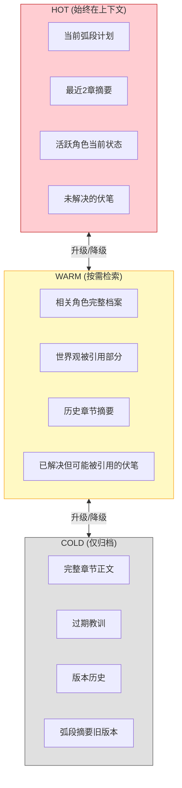

---

## 3.3 ManagedWrite：写入网关

**所有数据写入必须经过 ManagedWrite，无例外。**

### 5 阶段管线

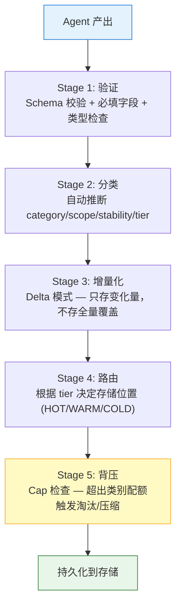

### Cap 验证（背压机制）

每个类别有独立的 token 配额：

```typescript
const DEFAULT_CAPS: Record<Category, CapConfig> = {
  guidance:    { hot: 2000,  warm: 5000,   cold: Infinity },
  world:       { hot: 4000,  warm: 15000,  cold: Infinity },
  characters:  { hot: 6000,  warm: 30000,  cold: Infinity },
  consistency: { hot: 3000,  warm: 20000,  cold: Infinity },
  summaries:   { hot: 4000,  warm: 25000,  cold: Infinity },
  outline:     { hot: 5000,  warm: 10000,  cold: Infinity },
}
```

**超出配额时**：不拒绝写入，而是触发该类别的增长策略（§3.5）降级/淘汰/压缩旧数据。

---

## 3.4 ContextAssembler：上下文装配

每次写章需要给写手 Agent 提供上下文。**不是塞满窗口，而是按场景需求精准分配。**

### 3 阶段管线

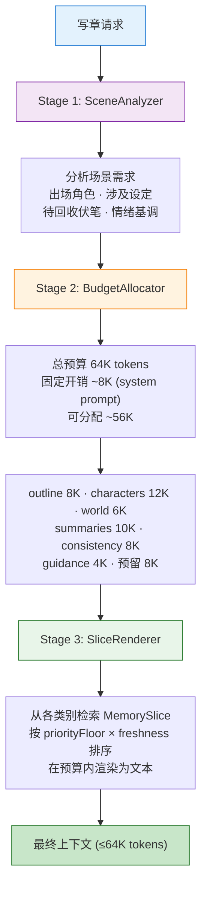

### 检索策略

| 类别 | 检索方式 | 排序依据 |
|------|----------|----------|
| guidance | 全量 HOT + 按相关性从 WARM | freshness × relevance |
| world | 按场景标签匹配 | stability（canon 优先） |
| characters | 出场角色全量 + 关系网内角色摘要 | 是否出场 > 关系距离 |
| consistency | 未解决伏笔全量 + 按章距衰减的已解决 | urgency × proximity |
| summaries | 最近 N 章全量 + 弧段摘要 + 全书概要 | 时间递减 |
| outline | 当前弧段计划全量 | — |

---

## 3.5 各类别增长控制策略

每个类别有独立的增长控制策略，不一刀切。

### guidance（写作指引/教训）—— 引导衰减制

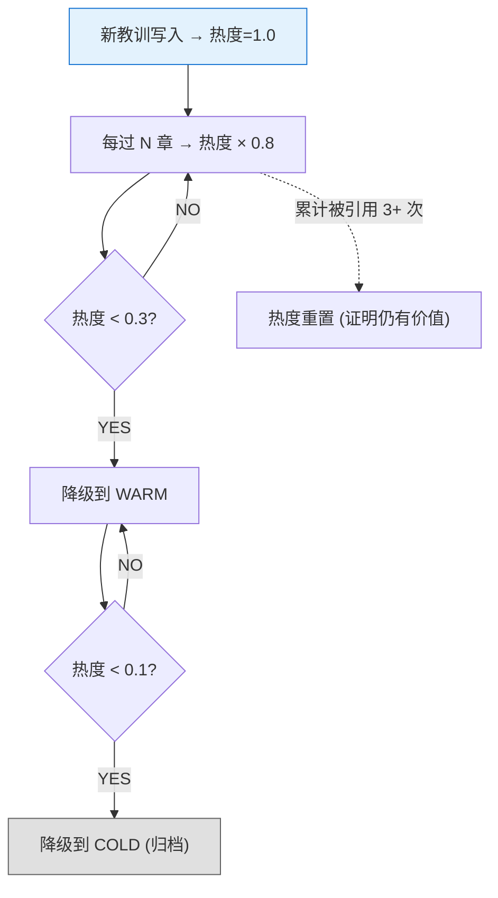

**解决的问题**：Dickens 的教训只增不减，200章后有数百条过期教训占满上下文。

### world（世界设定）—— Canon 保护制

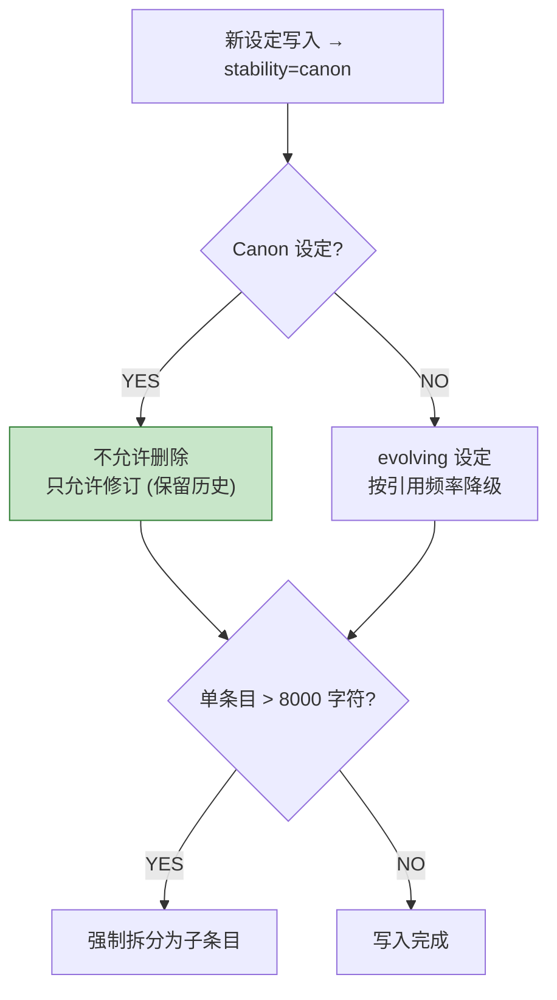

### characters（角色）—— 活跃度制

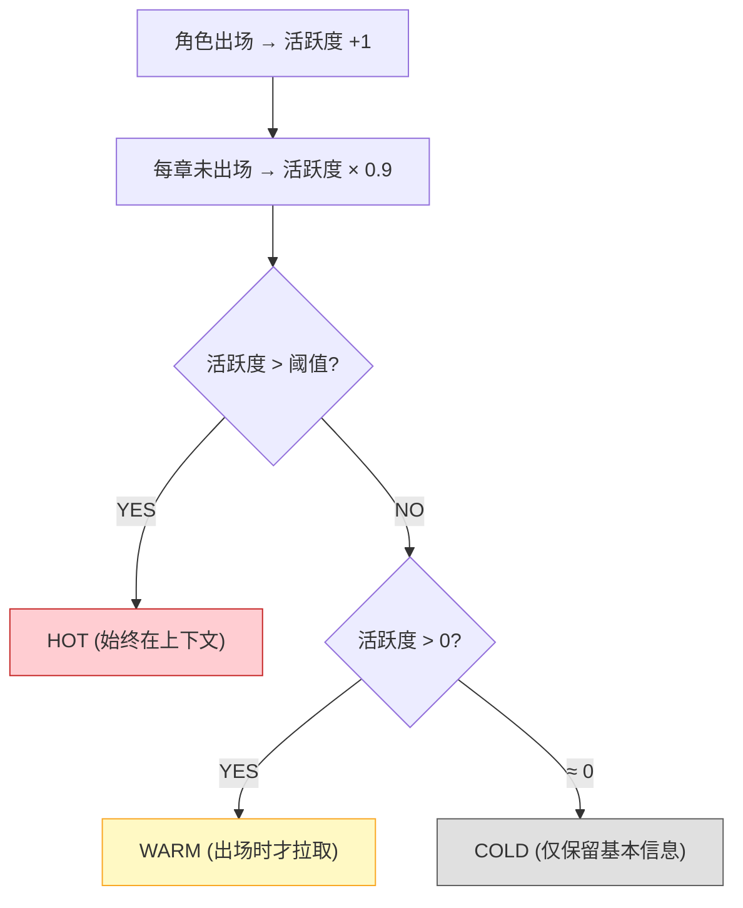

### consistency（一致性追踪）—— 状态机制

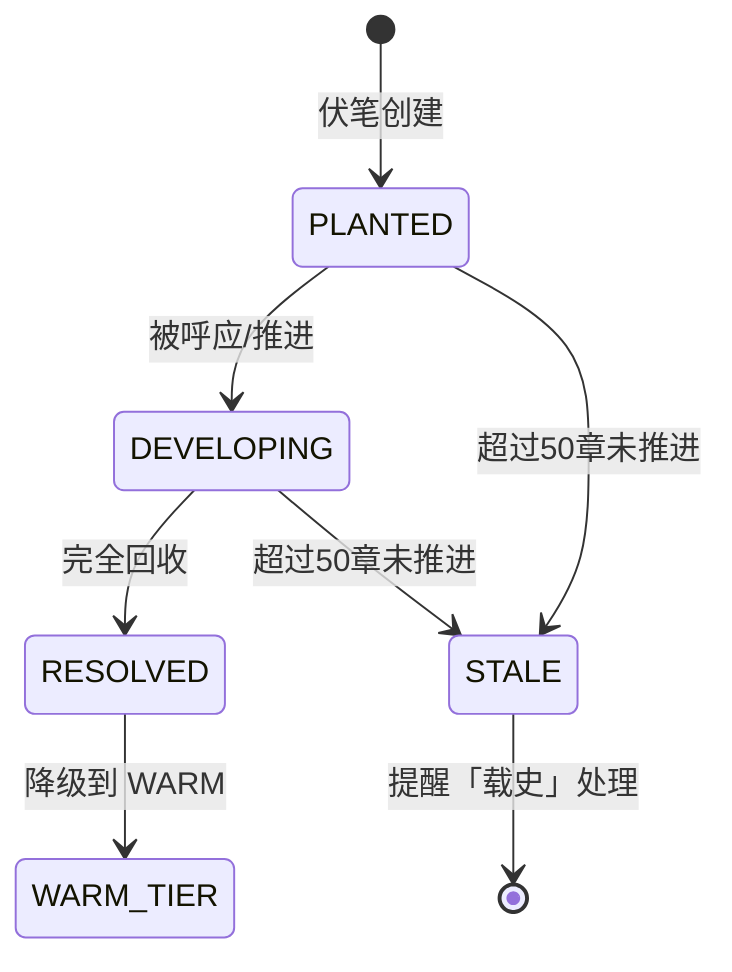

### summaries（摘要）—— 滑动窗口制

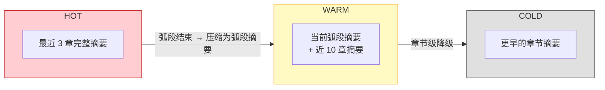

### outline（大纲）—— 扩展上限制

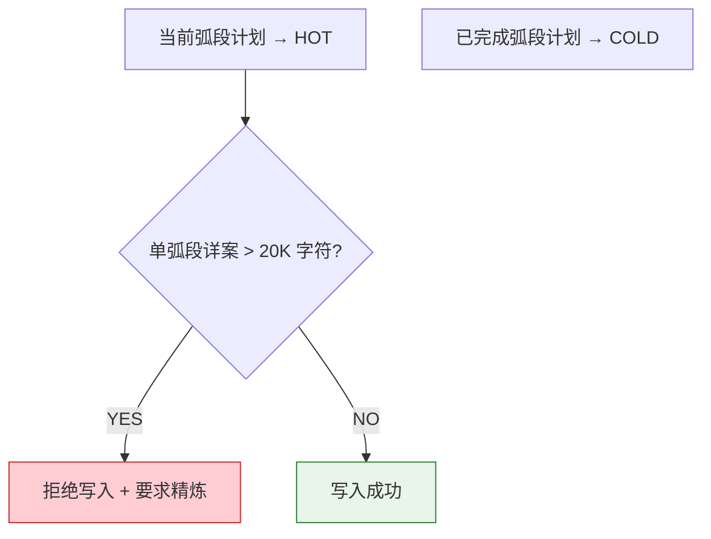

---

## 3.6 螺旋检测与恢复

### 三种螺旋模式

| 螺旋类型 | 检测条件 | 恢复策略 |
|----------|----------|----------|
| **审校螺旋** | 同一章审校 > 3 轮仍不通过 | 中断审校，保留当前版本，标记为"需人工审阅" |
| **膨胀螺旋** | 单类别 Cap 连续 3 次触发背压 | 强制执行该类别的淘汰策略，生成压力报告 |
| **矛盾螺旋** | 同一实体出现 > 2 条矛盾记录 | 冻结该实体的写入，提交用户裁决 |

### 压力报告

当螺旋检测触发时，生成可读报告推送到 WebUI：

```
⚠️ 膨胀螺旋检测 — consistency 类别

当前状态:
  HOT: 2,847 / 3,000 tokens (94.9%)
  WARM: 18,234 / 20,000 tokens (91.2%)

触发原因: 连续 3 章 Cap 被触发
根因分析: 第 120-145 章产生了 47 条伏笔，仅 12 条已解决

建议操作:
  1. 审查 STALE 伏笔（35条），标记确认放弃的
  2. 将已解决伏笔批量降级到 COLD
  3. 合并相关伏笔（如"古剑来历"和"古剑锻造者"可合并）
```

---

## 3.7 版本管理

### 双轨版本策略

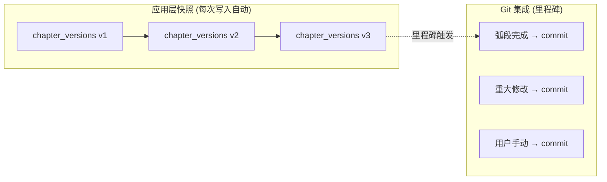

**为什么不全用 Git**：每次 Agent 写入都 commit 太重。应用层快照轻量（`chapter_versions` 表自动记录），Git 用于里程碑。

### 回滚能力

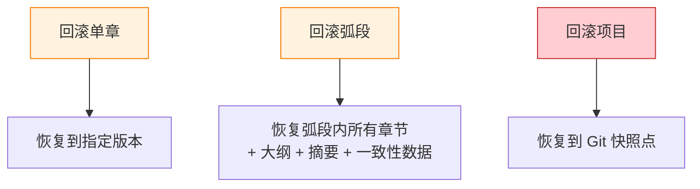

---

## 3.8 与 Dickens 的对比

| 维度 | Dickens | 墨染 (UNM) |
|------|---------|------------|
| 写入控制 | 无 | ManagedWrite 5阶段管线 |
| 上下文装配 | 固定 54K 预算 + 硬编码优先级 | SceneAnalyzer → BudgetAllocator → SliceRenderer |
| 数据增长 | 不控制 | 6类别独立策略 |
| 螺旋检测 | 无 | 3种螺旋模式自动检测+恢复 |
| 版本管理 | safe-write（仅保存，无回滚） | 双轨（应用层快照 + Git 里程碑） |
| 摘要层级 | 章节/弧段/全书（固定3层） | MemorySlice + tier（动态分层） |
| 伏笔追踪 | 手动 JSON | 状态机（PLANTED→DEVELOPING→RESOLVED→STALE） |
| 角色管理 | 全量档案，无活跃度 | 活跃度制，HOT/WARM/COLD 自动分层 |

---

## 3.9 实现优先级

| 优先级 | 模块 | 说明 |
|--------|------|------|
| P0 | MemorySlice 数据模型 | 所有后续模块的基础 |
| P0 | ManagedWrite 管线 | 写入控制是核心 |
| P0 | ContextAssembler 基础版 | 先实现固定预算分配，后续加 SceneAnalyzer |
| P1 | guidance 衰减策略 | 解决最高频的增长问题 |
| P1 | summaries 滑动窗口 | 章节摘要是最常用的上下文 |
| P1 | 审校螺旋检测 | 防止无限循环 |
| P2 | characters 活跃度 | 优化角色上下文精准度 |
| P2 | consistency 状态机 | 伏笔管理升级 |
| P2 | 膨胀/矛盾螺旋检测 | 长篇才会遇到 |
| P3 | Git 里程碑集成 | 应用层快照够用时可延后 |
| P3 | SceneAnalyzer 智能分析 | BudgetAllocator 静态规则先行 |
