# 新项目设计文档 · §4 Agent 体系与写作流程

> 所有 Agent 使用中文命名，opencode.json 中的 agent ID 使用拼音。
> 本节是墨染的核心设计——覆盖 Agent 体系、写作流程(Plantser Pipeline)、审校系统、知识库子系统、风格引擎。

---

## 4.1 Agent 命名体系

墨染采用**单写手 + 风格配置**方案（详见 [4.4 设计决策](#44-执笔-zhibi--章节写作与风格引擎)），共 10 个 Agent：

### 核心团队（5 个，每次写作必参与）

| Agent | ID | 角色 | 命名理据 |
|-------|----|------|----------|
| **墨衡** | `moheng` | 总指挥 / 编排者 | 衡——权衡、平衡。编排者需要权衡全局调度 |
| **灵犀** | `lingxi` | 创意脑暴 | "心有灵犀一点通"——灵感碰撞 |
| **匠心** | `jiangxin` | 世界/角色/结构设计 | "独具匠心"——精密构造 |
| **执笔** | `zhibi` | 唯一写手（接受风格配置） | 执笔——握笔书写，唯一的创作者 |
| **明镜** | `mingjing` | 多维审校 | "明镜高悬"——不放过任何瑕疵 |

### 支撑团队（3 个，每次写作必参与）

| Agent | ID | 角色 | 命名理据 |
|-------|----|------|----------|
| **载史** | `zaishi` | 摘要/归档/一致性追踪 | 载入史册——记录与传承 |
| **博闻** | `bowen` | 知识查证与知识库管理 | "博闻强识"——广博的知识 |
| **析典** | `xidian` | 参考作品深度分析 | "析"——剖析，"典"——经典。剖析经典之作的写作技法 |

### 可选团队（2 个，按需启用）

| Agent | ID | 角色 | 适用场景 |
|-------|----|------|----------|
| **书虫** | `shuchong` | 普通读者评审 | 模拟真实读者的阅读体验反馈 |
| **点睛** | `dianjing` | 专业文学批评 | "画龙点睛"——深度诊断问题根因 |

### 设计决策：为什么是单写手？

**来自实际项目的教训**：在《穿越后宫奇遇记》中，第一章经历了 42 个版本，写手从 daiyu→无标记→宝玉→混合→daiyu→baoyu 多次切换。每次切换导致：
1. **上下文断裂**——新写手不了解前一写手的会话积累
2. **风格跳跃**——不同模型的文笔差异明显
3. **调试困难**——无法判断是"写手能力问题"还是"上下文不足问题"

**墨染方案**：单写手（执笔）+ 风格配置。不同题材/风格通过配置目录切换（混合格式：YAML 约束 + 散文描述 + 示例段落），而非切换 Agent 实例。每个风格有诗意子名（如"执笔·剑心"），写手的会话上下文始终连续。详见 §4.4。

---

## 4.2 Agent 协作架构

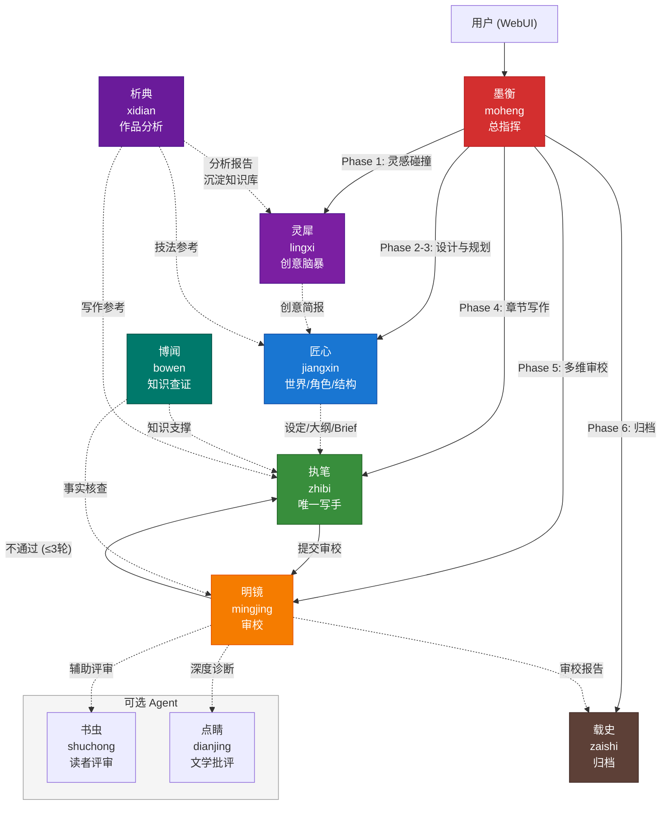

### 信息流向原则

Agent 之间**不直接通信**，所有数据通过持久化层传递：

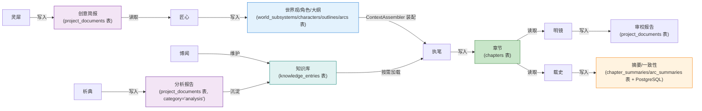

**原则**：Agent 只通过读写数据库通信，不依赖会话上下文传递。任意 Agent 崩溃不影响其他 Agent 的数据。

---

## 4.3 各 Agent 详细设计

### 4.3.1 墨衡 (moheng) — 总指挥

**职责**：编排写作全流程，调度其他 Agent，管理项目全局状态，响应用户指令。

| 属性 | 值 |
|------|-----|
| 模型 | Claude Sonnet 4.6（平衡推理能力与成本） |
| 温度 | 0.3（稳定、可控） |
| 权限 | 读取全部 · **写入禁止**（不产出任何创意内容） · 工具调用全部 · Agent 调度全部 |

**核心规则**：

1. **谁产出谁修改** — 墨衡永不直接写/改创意、设定、正文。一切创意产出必须委派给对应 Agent
2. **单决策点** — 每次只向用户抛出一个决策，等待回复后再推进
3. **每轮必存** — 确保每个 Agent 产出即时持久化到数据库，不依赖会话记忆
4. **螺旋检测** — 监控同一章审校轮次，超过 3 轮自动中断并请求人工介入

**墨衡编排的阶段**：

| 阶段 | 触发条件 | 调度目标 | 产出 |
|------|----------|----------|------|
| Phase 1: 灵感碰撞 | 用户发起新项目 | 灵犀 | `project_documents` (category='brief') |
| Phase 2: 世界设计 | 创意简报确认 | 匠心 | `world_subsystems` 表 |
| Phase 3: 角色与结构 | 世界观就绪 | 匠心 | `characters` + `outlines`/`arcs` 表 |
| Phase 4: 章节写作 | 大纲就绪 / 上一章归档完成 | 执笔 | `chapters` 表 |
| Phase 5: 多维审校 | 章节提交 | 明镜 (+ 书虫/点睛) | `project_documents` (category='review') |
| Phase 6: 归档 | 审校通过 | 载史 | `chapter_summaries` + 一致性数据表 |

**新增能力（相比 Dickens）**：
- 螺旋检测与自动中断
- 弧段边界自动暂停（弧段最后一章归档后，暂停等待用户审核下个弧段计划）
- 成本追踪汇报（每章完成后报告 token 消耗和预估成本）
- 与 WebUI 的 SSE 实时状态推送

### 4.3.2 灵犀 (lingxi) — 创意脑暴

**职责**：从零开始生成故事概念，发散→聚焦→结晶出创意简报。

| 属性 | 值 |
|------|-----|
| 模型 | Claude Opus 4.6（最高创造力） |
| 温度 | 0.9（最大发散） |
| 权限 | 读取：项目元信息、**知识库（consumers 含"灵犀"的析典沉淀）** · 写入：`project_documents` 表 · 工具：moran_document |

**工作流**：


**创意简报产出格式**：

```yaml
title: "书名候选（3-5个）"
genre: "主类型 / 子类型"
logline: "一句话梗概（25字以内）"
core_conflict: "核心冲突"
unique_hook: "独特卖点（与同类作品的差异点）"
tone: "整体基调描述"
target_audience: "目标读者画像"
estimated_scale: "预估篇幅/章节数"
concepts:
  - name: "方案A"
    premise: "前提设定"
    what_if: "极端推演结果"
    risk: "潜在风险"
  - name: "方案B"
    # ...
```

**从 Dickens 继承**：Micawber 的发散→聚焦→结晶三阶段方法论。
**新增**：结构化创意简报格式、题材风格标签系统、独特卖点（Unique Hook）强制要求。

### 4.3.3 匠心 (jiangxin) — 世界/角色/结构设计

**职责**：世界观构建、角色深度设计、故事结构规划（弧段/爆点/伏笔链）。

| 属性 | 值 |
|------|-----|
| 模型 | Claude Sonnet 4.6（结构化推理强） |
| 温度 | 0.6（创意与结构的平衡） |
| 权限 | 读取全部、**知识库（consumers 含"匠心"的析典沉淀 + 题材知识）** · 写入：`world_subsystems/characters/outlines/arcs` 表 · 工具：moran_world/moran_character/moran_outline |

**三大设计领域**：

#### A. 世界观构建

**来自实际项目的经验**：《穿越后宫奇遇记》的 worldbuilding 目录包含 11 个子系统（3500+ 行），远超初始设定的"固定几项"。实际写作中不断涌现新设定：后宫等级、特殊能力、朝廷政治体系、经济系统、时间线等。

**墨染方案**：世界设定采用**开放式子系统**，用户可随时添加新的设定维度：

```yaml
# 世界观子系统注册 (world_settings 表, section='subsystem:*')
# 示例记录：
- section: subsystem:power-system
  name: 力量体系
  tags: [核心, 战斗]
- section: subsystem:social-hierarchy
  name: 社会等级
  tags: [核心, 社会]
- section: subsystem:economy
  name: 经济系统
  tags: [扩展, 社会]
  # 用户可随时通过 WebUI 或 API 添加新子系统...
```

#### B. 角色设计

**方法论**：人物先行 — 传记法设计 + 心理画像 + 非功能性特征。

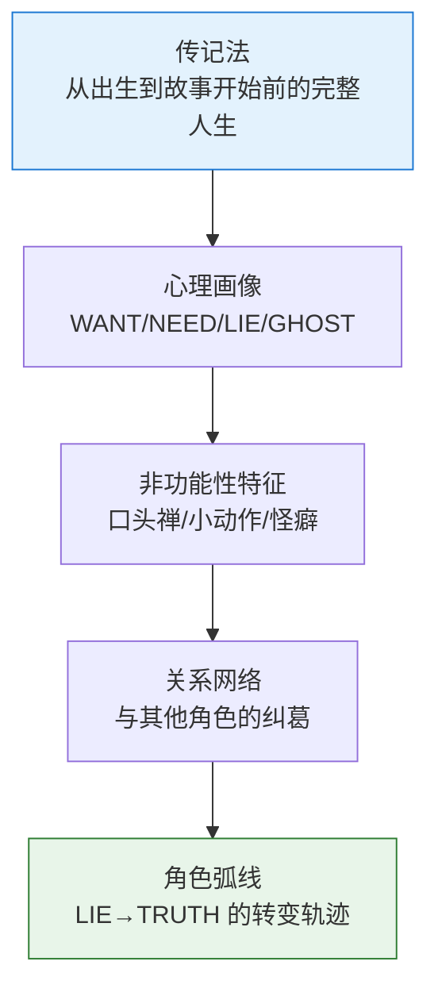

每个角色必须包含的**四维心理模型**：

| 维度 | 含义 | 示例 |
|------|------|------|
| WANT | 表面渴望（角色自以为想要的） | "成为最强修仙者" |
| NEED | 真实需求（角色真正需要的） | "接纳自己的平凡" |
| LIE | 信奉的谎言（驱动行为的错误信念） | "只有强大才能被爱" |
| GHOST | 创伤来源（LIE 的根源事件） | "幼年被强者抛弃" |

#### C. 结构规划

**弧段-章节两级规划**：

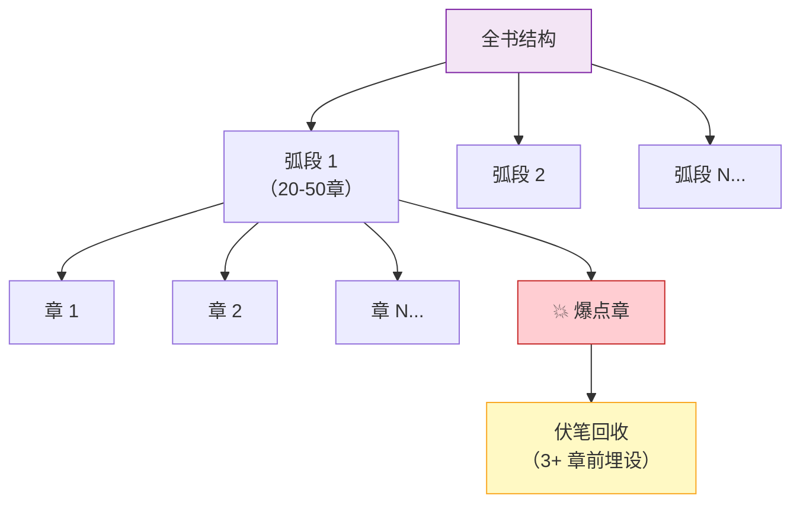

**弧段计划产出格式**：

每个弧段必须包含：
1. **弧段目标**：本弧段要解决的核心冲突
2. **爆点设计**：至少 1 个高潮点，标注在具体章节位置
3. **伏笔清单**：需要在本弧段埋设的伏笔（标注预计回收弧段）
4. **角色发展**：参与角色的 LIE→TRUTH 进度
5. **章节概要**：每章 2-3 句话的方向性描述（非严格约束）

**从 Dickens 继承**：Wemmick 的世界观/角色/结构设计能力、整体审查流程。
**新增**：四维心理模型（WANT/NEED/LIE/GHOST）、开放式世界子系统、弧段计划标准格式。

---

## 4.4 执笔 (zhibi) — 章节写作与风格引擎

执笔是墨染唯一的写作 Agent，也是整个系统最核心的产出者。

### 基本配置

| 属性 | 值 |
|------|-----|
| 模型 | 可配置（默认 Claude Opus 4.6，支持切换至 Kimi K2、本地模型等） |
| 温度 | **动态**（见温度场景化策略） |
| 权限 | 读取：ContextAssembler 装配的上下文（≤64K tokens）· 写入：`chapters` 表 · 工具：write_chapter |

### 写作约束

1. 接收 ContextAssembler 装配好的上下文，**不自行检索**——所有需要的信息已在上下文中
2. 遵循知识库中的写作指南（按需加载，详见 §4.11）
3. 遵循风格配置文件中的风格指令
4. 写完后执行 Anti-AI 自检清单
5. **内容创作最重要，字数不是严格把控目标**

### 流式输出模式

执笔 Agent 的 LLM 调用**始终使用流式模式** (`stream: true`)，这是墨染写作沉浸感的核心技术基础。

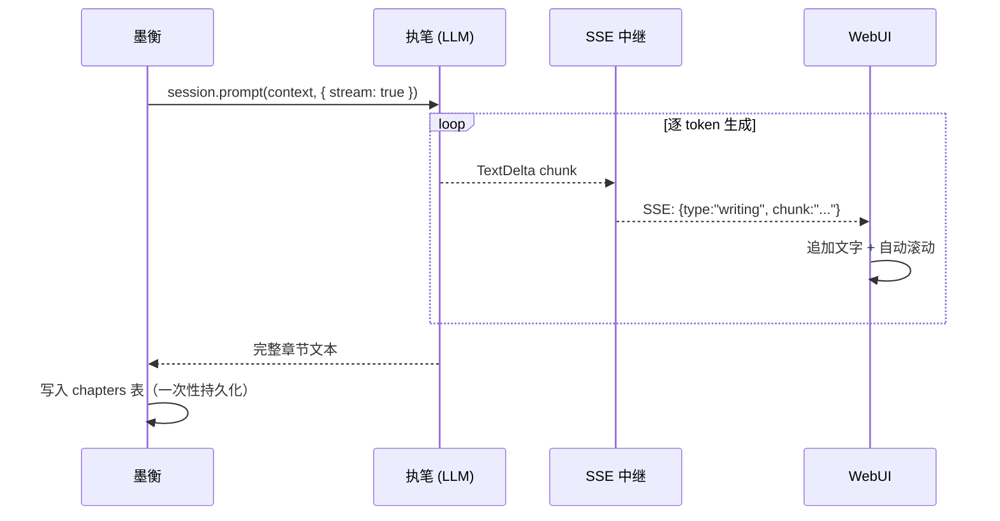

**关键设计点**：
- **流式只用于呈现**：WebUI 实时看到逐字输出，但数据库写入发生在整章完成后
- **中断安全**：用户可随时暂停，已生成的 partial 文本保存为草稿状态（`chapters.status = 'draft'`）
- **续写能力**：暂停后用户可编辑已生成内容，再触发续写，执笔从编辑点后继续（上下文包含用户修改）
- **字数实时统计**：每个 chunk 的累计字数通过 SSE 推送，前端实时显示"已生成 X 字"

### 温度场景化策略

**来自调研的关键发现**：固定温度 0.8 是所有章节质量不稳定的重要原因。不同类型的章节需要不同的创作"放飞度"。

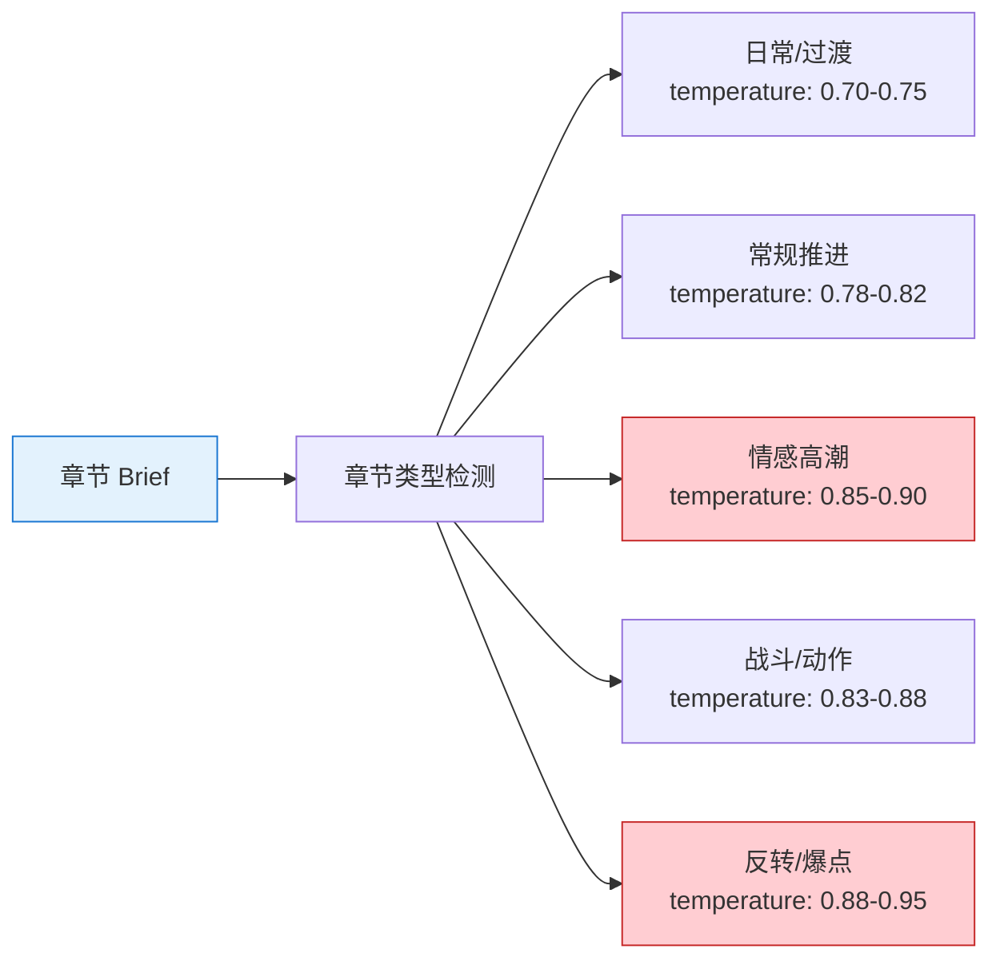

| 章节类型 | 温度范围 | 理由 |
|----------|----------|------|
| 日常/过渡 | 0.70-0.75 | 需要稳定、连贯，不需要太多惊喜 |
| 常规推进 | 0.78-0.82 | 平衡稳定与创意 |
| 情感高潮 | 0.85-0.90 | 需要更强的情感表达力和意外性 |
| 战斗/动作 | 0.83-0.88 | 需要节奏变化和招式创新 |
| 反转/爆点 | 0.88-0.95 | 最大化惊喜感和创意突破 |

温度由墨衡根据章节 Brief 中的类型标签自动设定，执笔自身不决定温度。

### 风格引擎

**设计决策**：用配置文件控制风格，而非多个写手实例。每个风格配置有一个**诗意子名**，用户写作时 WebUI 显示为"执笔·云墨"、"执笔·剑心"等，让写作体验更有仪式感。

#### 风格子名机制

每个预设风格有一个诗意的中文子名，作为该风格配置的标识。子名的选取原则：

1. **两字**，有诗意和画面感
2. 与题材的核心意象相关
3. 用户自定义风格时可自取子名

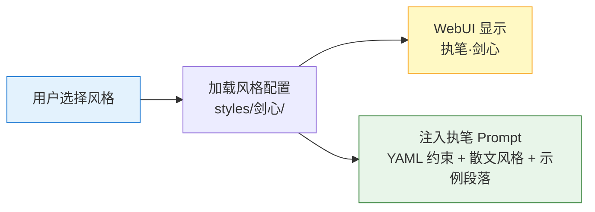

#### 预设风格

| 风格 | 子名 | 显示名 | 题材 | 核心特征 | 命名理据 |
|------|------|--------|------|----------|----------|
| 通用 | 云墨 | 执笔·云墨 | 默认/万用 | 均衡文风、自然流畅 | 云——自由灵动；墨——笔墨功底 |
| 仙侠 | 剑心 | 执笔·剑心 | 修仙/武侠 | 古风语感、修炼体系、战斗场景 | 剑心——武侠精神内核 |
| 科幻 | 星河 | 执笔·星河 | 硬核/太空 | 硬核设定、科技描写、哲学思辨 | 星河——宇宙尺度的想象力 |
| 言情 | 素手 | 执笔·素手 | 情感/关系 | 情感细腻、关系推拉、氛围渲染 | 素手——纤细敏感的触觉 |
| 都市 | 烟火 | 执笔·烟火 | 现代/职场 | 现代语感、快节奏、职场/社会 | 人间烟火——市井百态 |
| 悬疑 | 暗棋 | 执笔·暗棋 | 推理/惊悚 | 伏笔密集、信息不对称、推理链条 | 暗中布棋——悬念推理 |
| 历史 | 青史 | 执笔·青史 | 朝堂/古代 | 时代语感、历史细节、朝堂博弈 | 青史留名——历史厚重感 |
| 恐怖 | 夜阑 | 执笔·夜阑 | 惊悚/克苏鲁 | 感官压迫、心理暗示、节奏控制 | 夜阑人静——恐惧蔓延 |
| 喜剧 | 谐星 | 执笔·谐星 | 轻松/搞笑 | 节奏明快、反差幽默、角色互动 | 谐——诙谐；星——闪光 |

用户可自定义风格并自取子名（如"执笔·朝歌"），WebUI 提供子名输入框。

#### 风格配置：混合格式设计

**来自调研的关键发现**（arXiv:2408.02442）：纯 JSON/YAML 会损害 LLM 推理能力，纯自由文本一致性只有 ~85%。**混合格式**是创意写作场景的最佳选择：

- **结构化 YAML**：放机器可执行的约束（对话标签、禁忌词、POV 类型、温度参数、上下文权重）
- **散文描述**：放风格感觉、语调气质、节奏要求等需要 LLM "理解"而非"执行"的内容
- **示例段落**：做 few-shot teaching，比任何描述都更精准地传达风格

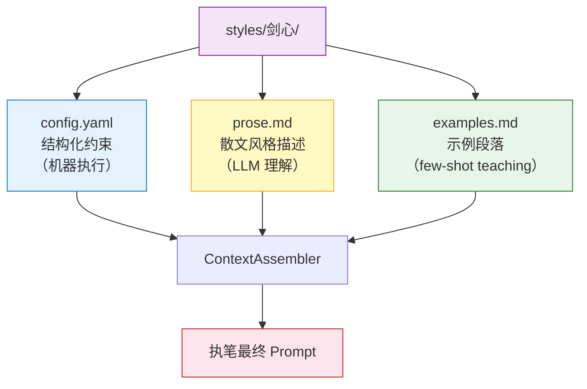

每个**内置**风格配置是一个**目录**（而非单一文件），包含三个文件，随代码库发布（只读静态资源）：

```
@moran/agents/styles/       # 内置预设（只读，随代码发布）
├── 云墨/                    # 通用/默认
│   ├── config.yaml          # 结构化约束
│   ├── prose.md             # 散文风格描述
│   └── examples.md          # 示例段落
├── 剑心/                    # 仙侠
│   ├── config.yaml
│   ├── prose.md
│   └── examples.md
├── 星河/                    # 科幻
│   └── ...
└── ...
```

> **用户自定义风格**通过 WebUI 设定面板创建，存储在 PostgreSQL `style_configs` 表中（JSON 格式），不写入文件系统。内置预设可被用户 fork 到 DB 后自由修改。

#### 混合格式完整示例：执笔·剑心（仙侠）

**① config.yaml — 结构化约束**

```yaml
# styles/剑心/config.yaml
meta:
  name: 剑心
  display: 执笔·剑心
  genre: 仙侠
  description: 修仙、武侠、东方玄幻
  version: 1

# 必选专项模块（风格强绑定）
modules:
  - fight-choreography       # 战斗编排专项
  - cultivation-system       # 修炼体系描写专项
  - ancient-chinese-tone     # 古风语感专项

# 审校特别关注点（传递给明镜）
reviewer_focus:
  - "力量体系一致性——境界能力不可越级"
  - "战斗场景节奏感——拒绝流水账式招数罗列"
  - "修炼等级逻辑——突破需要铺垫"

# 上下文权重加成（传递给 ContextAssembler）
context_weights:
  world: 1.5           # 世界观需要更多 token（修炼体系复杂）
  character: 1.2       # 角色需要更多 token（多角色势力关系）
  plot: 1.0            # 情节默认权重

# 基调控制（0-1 连续值）
tone:
  humor: 0.3           # 幽默不是通篇，是某个不经意的瞬间
  tension: 0.7         # 高张力基线（仙侠需要紧迫感）
  romance: 0.4         # 适度感情线
  dark: 0.2            # 微暗

# 禁忌词/表达（绝对不允许出现）
forbidden:
  words: ["赛博", "量子", "数据库", "代码"]   # 现代科技词汇
  patterns: ["他不禁.{0,10}不禁", "仿佛.*仿佛"]   # 短距离重复
  
# 鼓励的表达方式
encouraged:
  - "以自然意象比喻修炼感受（山川/风雨/日月）"
  - "战斗中穿插心理活动，而非纯招式罗列"
```

**② prose.md — 散文风格描述**

```markdown
# 执笔·剑心 · 风格指引

## 语调气质

剑心的文字应当有「清冽山泉」的质感——不华丽堆砌，但每一句都有骨骼。
仙侠叙事的核心不是"仙"，而是"侠"：是凡人向天问道的倔强，是弱者不屈的脊梁。

写修仙世界时，不要沉迷于体系的"设定感"，而要写出修炼者的**孤独**。
漫长的岁月，寂静的山巅，一个人面对天地——这种孤独感才是仙侠的底色。

## 节奏要求

仙侠的节奏是「松-紧-爆」的螺旋：
- 日常段落要有闲笔，写山间的风、溪边的鱼、师兄弟的打趣。这些"无用"的段落是爆点的蓄力。
- 战斗段落要短句、断句、一气呵成。像剑出鞘——没有犹豫。
- 突破/顿悟段落放慢到极致，用通感和意象流写出内心的翻涌。

## 对话风格

古风语感不等于文言文。目标是"带有古意的白话"：
- 用"你"而非"汝"，用"知道"而非"知晓"（除非角色设定如此）
- 长辈说话可以更文雅，少年说话可以更直白
- 每个角色有独特的口癖或说话节奏（如总是先叹气再说话、习惯反问）

## 世界融入

修炼体系要像呼吸一样自然地融入叙事——不要"讲设定"，要"活设定"：
- ❌ "炼气期分为九层，每层需要积累一定的灵力..."
- ✅ 他盘膝坐在崖边，体内灵力如涓涓细流，距离第三层的那道坎还差最后一口气。可这口气，他已经憋了三个月。
```

**③ examples.md — 示例段落**

```markdown
# 执笔·剑心 · 示例段落

> 以下段落展示剑心风格的目标文风。执笔应学习其中的语感、节奏和表达方式，而非照搬内容。

## 日常段落示例

山间的雾还没散。
李长安坐在石阶上，手里攥着半个冷馒头，看师弟们在演武场上比划。刀光剑影间，偶尔有人摔个跟头，引起一阵哄笑。
他咬了口馒头，觉得今天的雾比昨天浓。
三师兄从他身后走过，扔下一句"发什么呆"，没等回答就走远了。李长安想说我在看雾，但三师兄向来不听人把话说完。

## 战斗段落示例

剑来。
没有起手式。青锋从鞘中滑出的瞬间，空气被撕裂出一道白痕。
对面的黑衣人后退半步——不是躲，是本能。人在死亡逼近时不需要大脑下令，脊椎骨自己会做决定。
李长安没有追。他收剑，看着剑刃上一缕头发缓缓飘落。
"下次，"他说，"不是头发。"

## 突破/顿悟段落示例

那道坎就在那里。
他能感觉到它——像一层薄冰覆在湖面上，灵力在冰下涌动，差的只是一个裂口。三个月了，他试过猛冲，试过缓渗，试过不管不顾地硬撞。冰面纹丝不动。
今天他什么都没做。只是坐在崖边，看云从脚下流过去。
风从东边来，带着山下镇子里炊烟的味道。有人在做饭。可能是面条，也可能是馄饨。他想起小时候，娘总是在黄昏时喊他回家吃饭——
冰裂了。
不是他打破的。是他放下了。
灵力如春水化冻，从丹田漫过四肢百骸。他听见自己骨骼里发出细微的咔咔声，像冰面上蔓延的裂纹。
第三层。
```

#### 文风档案拆分方案

**来自实际项目的教训**：《穿越后宫奇遇记》的文风档案从 v1.1 迭代到 v2.6（680 行），每次发现问题都在档案上"打补丁"，导致档案膨胀且写手 prompt 过长。

**墨染方案**：拆分为**核心原则** + **可插拔专项模块**：

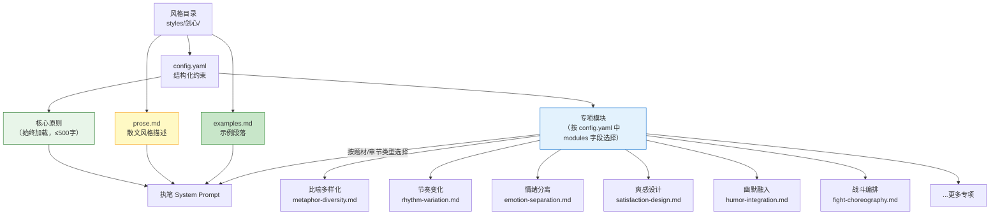

**核心原则**（始终生效，≤500 字）：
- 感官先行
- 动作电影感
- 间接心理（通过行为和环境暗示内心，而非直接陈述）
- 句式多样性（禁止连续使用相同句式结构）
- 对话辨识度（每个角色的说话方式有独特标记）

**专项模块**（每个 200-400 字，按需选择 2-3 个加载）：
- 按**题材**选择（`config.yaml` 中 `modules` 字段固定绑定）：战斗编排(武侠/仙侠)、科技描写(科幻)、推理链条(悬疑)
- 按**章节类型**选择（墨衡根据 Brief 动态加载）：情感高潮时加载"情绪分离"模块、日常章节加载"幽默融入"模块
- 按**问题修复**选择（lessons 驱动）：如果 lessons 记录了"比喻单一"问题，临时加载"比喻多样化"模块

#### ContextAssembler 如何装配风格上下文

风格配置的三个文件按不同优先级装入执笔 prompt：

| 来源 | 位置 | token 预算 | 优先级 |
|------|------|-----------|--------|
| `config.yaml` 结构化约束 | System Prompt 头部 | ~200 tokens | 最高（始终加载） |
| 核心原则（全局） | System Prompt | ~500 tokens | 高（始终加载） |
| `prose.md` 散文描述 | System Prompt 风格区 | ~800 tokens | 高（始终加载） |
| `examples.md` 示例段落 | System Prompt 尾部 few-shot | ~1200 tokens | 中（加载 1-2 个最相关示例） |
| 专项模块 | System Prompt 模块区 | 每个 ~400 tokens | 按需加载 2-3 个 |

**总风格上下文 ≤ 3500 tokens**，占 64K 总预算的 ~5.5%，给章节上下文留出充足空间。

用户可通过 WebUI 设定面板创建自定义风格（fork 内置预设或从零创建），自定义风格存储在 PostgreSQL `style_configs` 表中，也可在预设基础上 override 特定字段。

### 多版本择优机制

**来自调研的核心方法**：不依赖单次生成"一击命中"，而是生成多版本后择优。

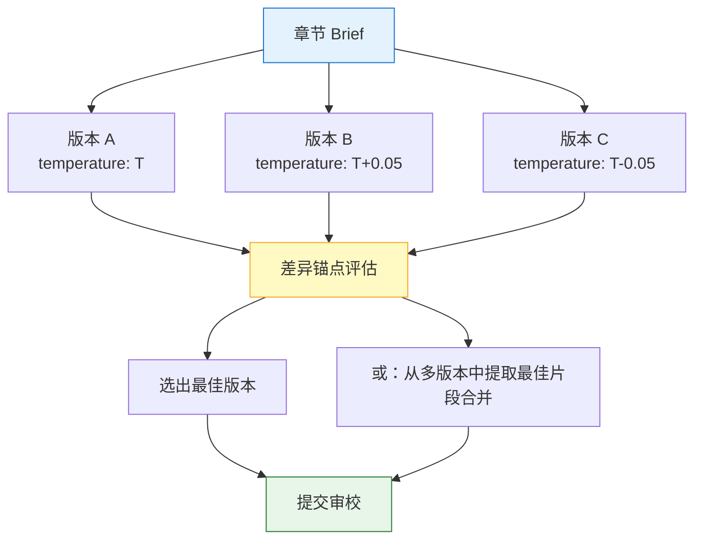

**策略**：
- 默认生成 **1 个版本**（常规章节，节省成本）
- **爆点章/高潮章**自动生成 **2-3 个版本**（多版本择优）
- 用户可在 WebUI 中手动触发"多版本生成"
- **差异锚点评估**：不是简单打分，而是找出各版本的独特亮点和不同处理方式，选择综合最佳

**成本控制**：多版本生成只在关键章节启用，日常章节保持单版本，整体成本增加 ≤30%。

---

## 4.5 明镜 (mingjing) — 多维审校系统

明镜是质量守门人。与 Dickens 的 Jaggers 三轮审校相比，墨染的审校系统经过**根本性重设计**——直接针对实际项目中暴露的审校盲区。

### 基本配置

| 属性 | 值 |
|------|-----|
| 模型 | **跨模型族**（与执笔不同家族，消除同源偏见） |
| 温度 | 0.15-0.25（严格、一致，不同轮次微调） |
| 权限 | 读取全部、**知识库（consumers 含"明镜"的析典沉淀 + 经验教训）** · 写入：`project_documents` 表 · 工具：moran_document |

### 来自实际项目的审校教训

**问题 1：审校通过标准偏低**
- 《穿越后宫奇遇记》第 1 章以 7.2 分"通过（带伤）"，对话辨识度仅 6 分
- 用户仍觉得"呆板"——说明审校系统**漏检了"呆板度"维度**

**问题 2：25 条 lessons 本应在审校阶段拦截**
- 句式模板化（"不是A而是B"）、五感堆砌、口述设定、重复心理活动、技术细节过多、情感告知式描写
- 这些问题**应该在审校时被检测到**，而非依赖事后 lessons 积累

**问题 3：审校反馈格式不标准**
- Dickens 的审校反馈是自由格式文本，执笔难以精确定位和修改
- 需要**结构化反馈格式**

### 四轮审校流程

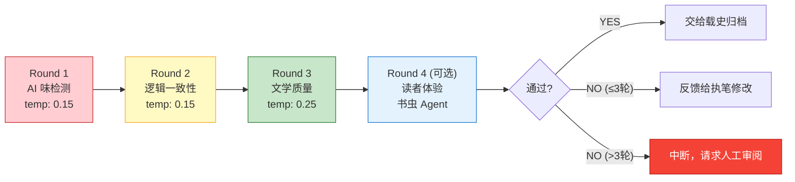

### Round 1：AI 味检测（核心改进）

**检测维度**（从调研和 25 条 lessons 中提炼）：

| 检测项 | 方法 | 来源 |
|--------|------|------|
| **Burstiness（句长变化率）** | 统计相邻句子长度的标准差。AI 文本倾向于均匀句长 | 调研：AI味量化指标 |
| **句式单一度** | 检测连续段落是否使用相同句式结构（如连续"他XXX"开头） | lesson les-002: 句式模板化 |
| **情感告知式** | 检测"他感到..."、"她心中..."等直接告知内心的表达 | lesson les-022: 情感告知式 |
| **五感堆砌** | 检测是否在同一段内密集罗列多种感官描写 | lesson les-004: 五感堆砌 |
| **口述设定** | 检测是否通过角色对话直接"讲解"世界观设定 | lesson les-007: 口述设定 |
| **重复心理** | 检测同一内心独白是否在短距离内重复出现 | lesson les-008/021: 重复心理 |
| **黑名单词汇** | 检测已知 AI 高频词（"仿佛"、"不禁"、"竟然"过度使用等） | Dickens anti-ai-patterns.md |
| **中英混杂** | 检测非必要的英文词汇混入中文叙述 | lesson les-020: 中英混杂 |

**Burstiness 计算方法**：

```
burstiness = std(sentence_lengths) / mean(sentence_lengths)

- burstiness < 0.3  → ⚠️ 疑似 AI（句长过于均匀）
- burstiness 0.3-0.6 → ✅ 正常范围
- burstiness > 0.6  → ✅ 人类写作特征明显
```

### Round 2：逻辑一致性

| 检测项 | 方法 |
|--------|------|
| 角色行为一致性 | 对照角色 WANT/NEED/LIE 检查行为是否符合人设 |
| 时间线连续性 | 对照时间线数据检查时序是否矛盾 |
| 世界观遵守 | 对照世界设定检查力量体系/社会规则是否违规 |
| 伏笔连续性 | 检查已植入伏笔的状态变化是否合理 |
| 空间一致性 | 角色位置移动是否合理（不能"瞬移"） |

### Round 3：文学质量（核心改进）

**评分维度**（RUBRIC 框架，每项 1-10 分）：

| 维度 | 权重 | 检测方法 |
|------|------|----------|
| 叙事节奏 | 15% | 场景转换频率、紧张-松弛交替、段落长度变化 |
| 冲突张力 | 15% | 是否有明确的冲突推进、悬念维持、利益碰撞 |
| 人物深度 | 15% | 行为是否体现内在矛盾、是否有性格层次 |
| 对话自然度 | 15% | 每个角色说话是否有辨识度、是否"一人分饰N角" |
| 情感共鸣 | 15% | 情感是否通过行为/环境间接传达（而非直接告知） |
| **呆板度检测** | 15% | **新增**：行为可预测性、情感同时性、反期待缺失 |
| 创意独特性 | 10% | 是否有超出预期的处理方式、是否有"金句" |

**呆板度检测（解决核心痛点）**：

| 子维度 | 含义 | 检测信号 |
|--------|------|----------|
| 行为可预测性 | 角色行为是否完全按"标准反应"走 | 如果读者能100%预测下一步→呆板 |
| 情感同时性 | 同一时刻是否存在矛盾情感 | 人类常有"又气又心疼"的复杂情感，AI 倾向单一情感 |
| 反期待时刻 | 是否有打破读者预期的瞬间 | 每章至少有 1 个"等等，我没想到"的时刻 |
| 非理性行为 | 是否有非理性但合乎人设的行为 | 人类会冲动、犯蠢、做出不合逻辑但合乎情感的选择 |

### Round 4（可选）：读者体验测试

由书虫 Agent（模拟普通读者）执行，不做技术分析，只凭阅读感受回答：

1. 这章你想不想继续往下读？（0-10）
2. 有没有哪个地方让你走神了？
3. 有没有哪个瞬间打动你了？
4. 你觉得哪个角色最有趣？

### 审校反馈格式标准化

**四层结构**（从调研中确定）：

```yaml
feedback:
  - issue: "第3段连续4句以'他'开头，句式单一"
    severity: MAJOR          # CRITICAL / MAJOR / MINOR / SUGGESTION
    evidence: "原文第3段：'他抬头...'、'他看到...'、'他感觉...'、'他决定...'"
    suggestion: "将后两句改为感官描写或环境描写，打破主语重复"
    expected_effect: "句式变化率提升，避免读者感到'机器在一条条列举'"
```

| 字段 | 含义 | 为什么需要 |
|------|------|-----------|
| issue | 问题描述 | 让执笔知道**什么**有问题 |
| severity | 严重程度 | 让执笔知道**必须改**还是**建议改** |
| evidence | 原文证据 | 让执笔精确**定位**问题位置 |
| suggestion | 具体修改建议 | 让执笔知道**怎么改** |
| expected_effect | 期望效果 | 让执笔理解**为什么**这样改 |

**severity 分级与处理规则**：

| 级别 | 含义 | 处理方式 |
|------|------|----------|
| CRITICAL | 逻辑硬伤、角色崩坏、重大设定违规 | **必须修改**，不允许通过 |
| MAJOR | AI 味明显、节奏失衡、呆板度过高 | **强烈建议修改**，累计 2+ 个 MAJOR 不通过 |
| MINOR | 措辞可优化、小瑕疵 | 可选择忽略 |
| SUGGESTION | 锦上添花的改进建议 | 仅记录，不要求修改 |

### 审校通过标准

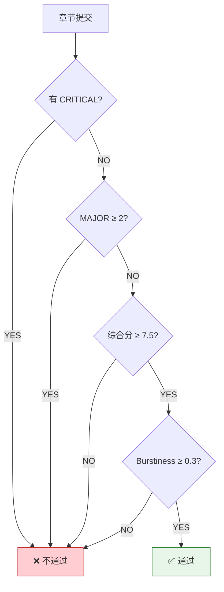

**与 Dickens 的关键差异**：
- 通过分数从 7.0 提升至 **7.5**（提高质量门槛）
- 新增 **Burstiness 硬门槛**（≥0.3，防止"均匀句长"的 AI 文本通过）
- 新增**呆板度**检测维度（直接解决用户"呆板"的核心反馈）
- 反馈从自由文本升级为**四层结构化格式**
- 新增 Round 4 读者体验测试（可选）

### 螺旋保护

同一章审校超过 3 轮仍不通过 → 自动中断：
1. 保存当前最佳版本
2. 汇总所有轮次的审校报告
3. 标记"需人工审阅"
4. 在 WebUI 推送通知给用户
5. 用户可选择：人工修改后重新审校 / 降级通过 / 重写

---

## 4.6 载史 (zaishi) — 摘要/归档/一致性追踪

### 基本配置

| 属性 | 值 |
|------|-----|
| 模型 | 分层：轻量初筛 (Haiku 4.5) + 核心归档 (Sonnet 4.6) |
| 温度 | 0.2（精确、不发散） |
| 权限 | 读取全部 · 写入：`chapter_summaries/arc_summaries` 表、`character_states/foreshadowing/timeline/relationships` 表 · 工具：summary/consistency |

### 分层处理模型

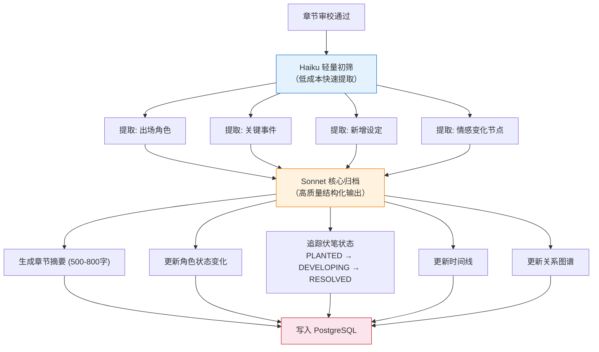

### 归档产出

每章归档后产出以下数据：

| 数据 | 存储位置 | 格式 |
|------|----------|------|
| 章节摘要 | `chapter_summaries` 表 | Markdown，500-800 字 |
| 弧段摘要 | `arc_summaries` 表 | Markdown，弧段末章时生成 |
| 角色状态变化 | PostgreSQL `character_states` 表 | JSON，记录变化量（delta） |
| 伏笔追踪 | PostgreSQL `foreshadowing` 表 | PLANTED/DEVELOPING/RESOLVED/STALE |
| 时间线事件 | PostgreSQL `timeline` 表 | 事件 + 相对时间 |
| 关系变化 | PostgreSQL `relationships` 表 | 关系类型 + 强度变化 |

### 增量归档

只记录**变化量**，不重复全量。例如角色状态：

```yaml
# 第 15 章归档 — 角色状态 delta (character_states 表)
character: 林晓
chapter: 15
changes:
  emotional_state: "从疑惑转为愤怒"
  knowledge_gained: "发现师兄隐瞒了门派秘密"
  relationship_delta:
    - target: 师兄张远
      change: "信任度 -3"
      trigger: "偷听到密谈"
  lie_progress: "LIE '强者即正义' 首次被动摇"
```

**从 Dickens 继承**：Cratchit 的摘要生成和一致性追踪能力。
**新增**：Haiku→Sonnet 分层（降本 40%+）、增量归档、PostgreSQL 结构化存储、关系图谱追踪。

---

## 4.7 博闻 (bowen) — 知识查证与知识库管理

### 基本配置

| 属性 | 值 |
|------|-----|
| 模型 | Claude Sonnet 4.6 |
| 温度 | 0.3 |
| 权限 | 读取全部 · 写入：知识库文档 · 工具：knowledge-base CRUD |

### 职责

1. **写作阶段**：验证章节中涉及的专业知识（历史事件、科学原理、地理信息等）
2. **审校阶段**：配合明镜进行事实核查
3. **知识库维护**：根据写作中发现的新问题，更新/新增知识库文档（详见 §4.11 知识库子系统）

### 工作模式

- 被动模式：明镜在 Round 2 检测到事实可疑时，调用博闻核查
- 主动模式：爆点章/涉及专业领域的章节，自动在写作前进行知识准备

---

## 4.8 析典 (xidian) — 参考作品深度分析

析典是墨染的"文学分析师"——当用户说"参考《大奉打更人》写作"时，析典不是靠模型自由发挥总结，而是**结合文学分析理论框架**，对参考作品进行系统性深度剖析，提炼可复用的写作技法，沉淀为知识库。

### 基本配置

| 属性 | 值 |
|------|-----|
| 模型 | Claude Opus 4.6（需要最强的分析与推理能力） |
| 温度 | 0.4（分析需要创见但必须有理有据） |
| 权限 | 读取：全网搜索结果、用户提供的补充文本 · 写入：`project_documents` 表 (category='analysis')、`knowledge_entries` 表 · 工具：moran_search, moran_document, moran_knowledge |

### 自主搜索能力

**设计原则**：用户只需提供作品名或作者名，析典自己搜索收集素材。不要求用户提供完整文本。

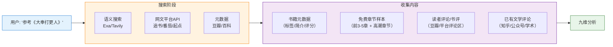

**搜索工具链**（`moran_search`）：

| 工具 | 用途 | 优先级 |
|------|------|--------|
| **Exa** | 语义搜索：找文学评论、写作分析文章 | 主力 |
| **Tavily** | 内容搜索 + URL提取：找具体页面内容 | 备选 |
| **网文平台API** | 追书神器/番茄小说：获取书籍元数据和免费章节 | 结构化数据 |
| **豆瓣读书** | 评分、标签、读者短评 | 元数据 |
| **Jina Reader** | URL→Markdown：提取网页正文 | 内容提取 |

**搜索策略**：
1. 先用 Exa/Tavily 搜索作品名 + "写作分析/书评/技巧"，找到已有的深度分析
2. 通过网文平台API获取书籍元数据和免费章节样本
3. 通过豆瓣获取评分和读者反馈
4. 如果用户额外提供了文本/文件，优先使用用户提供的内容
5. **合规底线**：只获取免费/公开内容，不绕过付费墙

### 设计理念：理论驱动而非自由总结

**用户明确要求**："这里的分析不是靠自己任意总结，而是结合了文学分析技巧的，有业界理论在里面。"

析典的每一项分析维度都对应一个或多个学术理论框架，确保分析**有章可循、可复现、有深度**。

### 九大分析维度

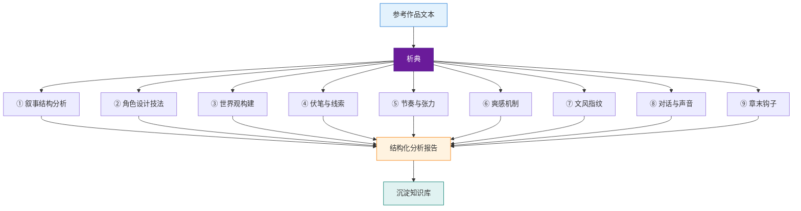

#### ① 叙事结构分析

| 理论框架 | 来源 | 分析内容 |
|----------|------|----------|
| **Genette 叙事话语理论** | Gérard Genette, *Narrative Discourse* (1972) | **时序**(顺叙/倒叙/预叙比例)、**时距**(场景/概要/省略的分布)、**频率**(单次/反复叙事)、**聚焦**(零聚焦/内聚焦/外聚焦的切换模式) |
| **Todorov 叙事平衡理论** | Tzvetan Todorov (1969) | 每个弧段的"平衡→失衡→认知→化解→新平衡"周期，计算平均恢复时间（章数） |
| **Campbell 英雄之旅** | Joseph Campbell, *The Hero with a Thousand Faces* (1949) | 将主线弧段映射到17阶段（召唤→跨越阈限→试炼→蜕变→归来），标注各阶段章节范围与时长 |
| **Propp 叙事功能** | Vladimir Propp, *Morphology of the Folktale* (1928) | 标注情节事件对应的31种叙事功能和7种角色功能 |

**产出示例**：
```yaml
narrative_structure:
  overall_pattern: "多重嵌套英雄之旅 — 宏观全书弧 + 微观案件弧"
  focalization:
    dominant: "内聚焦（许七安视角，占85%）"
    shifts: "朝堂戏切换零聚焦（占10%），反派视角外聚焦（占5%）"
  pacing_ratio:
    scene: 65%      # 实时对话/动作
    summary: 25%    # 时间跳跃/概述
    ellipsis: 10%   # 省略
  equilibrium_cycle:
    avg_disruption_to_resolution: "8-12章/案件弧"
    macro_cycle: "每100章一次大平衡重建"
```

#### ② 角色设计技法

| 理论框架 | 来源 | 分析内容 |
|----------|------|----------|
| **九型人格 (Enneagram)** | Riso-Hudson; 改编自 Final Draft 写作指南 (2026) | 主要角色的人格类型、压力/成长方向线、主型侧翼 |
| **社会网络分析** | Labatut & Bost (2019) "Extraction and Analysis of Fictional Character Networks" | 角色互动网络(度中心性/介数中心性)、派系聚类、关键连接人物 |
| **WANT/NEED/LIE/GHOST** | K.M. Weiland, *Creating Character Arcs* | 主要角色的四维心理模型推演 |

**产出示例**：
```yaml
characters:
  protagonist:
    name: 许七安
    enneagram: "Type 6w7（忠诚型 + 冒险侧翼）"
    want: "守护大奉正义"
    need: "接受体制的灰色地带"
    lie: "法律能解决一切"
    ghost: "前世作为警察的正义执念"
    voice_fingerprint: "口语化、自嘲式幽默、现代词汇古代化"
  network:
    hub_characters: ["许七安(度中心性0.82)", "魏渊(介数中心性0.71)"]
    faction_clusters: ["打更人", "朝廷文官", "佛门", "巫神教"]
```

#### ③ 世界观构建技法

| 理论框架 | 来源 | 分析内容 |
|----------|------|----------|
| **Sanderson 魔法三定律** | Brandon Sanderson (2007-2012) | 力量体系的硬/软程度、限制>力量分析、扩展而非添加的遵守度 |
| **力量体系拓扑** | 网文"境界体系"传统 | 层级结构、相克关系、代价结构、社会嵌入度 |
| **政治经济世界体系** | 改编自 Wallerstein 世界体系理论 | 权力节点、资源流向、冲突轴线、信息控制 |

**产出示例**：
```yaml
world_building:
  power_system:
    type: "硬魔法（规则在使用前详细解释）"
    sanderson_compliance:
      law1_score: 8/10  # 理解度↔解决力
      law2_score: 9/10  # 限制>力量（修炼有明确代价）
      law3_score: 7/10  # 多数时间扩展而非添加
    hierarchy: "练气→筑基→...→超品"
    social_embedding: "极深 — 修为等级直接决定社会地位、政治权力、经济资源"
  political_structure:
    power_triangle: ["皇室", "文官体系", "武力机构(打更人/军队)"]
    information_asymmetry: "大量秘密散布在不同势力中 — 信息差是主要冲突驱动力"
```

#### ④ 伏笔与线索追踪

| 理论框架 | 来源 | 分析内容 |
|----------|------|----------|
| **契诃夫之枪** | Anton Chekhov (1889) | 识别"带电对象"(被额外描述关注的元素)，追踪铺垫-回收距离 |
| **Setup-Payoff 模式** | Robert McKee *Story* (1997) | 植入类型分类(问题植入/角色植入/主题植入)、信息门控、铺垫密度 |
| **红鲱鱼** | 悬疑/推理传统 | 误导线索密度、线索/假线索比率 |

**产出示例**：
```yaml
foreshadowing:
  avg_setup_payoff_distance: "15-30章"
  plant_types:
    question_plants: 45%   # "这个人是谁？"类悬念
    character_plants: 30%  # 角色特质暗示
    thematic_plants: 25%   # 主题意象反复出现
  red_herring_rate: "约20%的线索是误导（推理类弧段更高）"
  signature_technique: "多层信息揭示 — 同一秘密分3-5次逐步揭开"
```

#### ⑤ 节奏与张力分析

| 理论框架 | 来源 | 分析内容 |
|----------|------|----------|
| **Scene-Sequel 节奏** | Dwight Swain, *Techniques of the Selling Writer* (1976) | 场景/续幕比率、各弧段的S/S分布 |
| **张力曲线建模** | 叙事强度理论 | 每章/每弧段的叙事强度评分(0-10)、张力曲线形态、平坦区域检测 |
| **Genette 叙事速度** | Genette 时距维度 | 场景/概要/省略/停顿的分布，计算叙事速度变化率 |

**产出示例**：
```yaml
pacing:
  scene_sequel_ratio: "75:25（高行动向）"
  tension_curve:
    pattern: "阶梯式上升 — 每个案件弧内部波浪形，弧段间整体递增"
    flat_zones: "训练/日常段落，通常≤3章后必有新冲突注入"
    peak_density: "每15-20章一个大高潮"
  narrative_speed:
    action_arcs: "以场景为主（90%实时叙述）"
    transition_arcs: "以概要为主（60%时间跳跃）"
```

#### ⑥ 爽感机制分析（网文专项）

| 理论框架 | 来源 | 分析内容 |
|----------|------|----------|
| **爽感生成体系** | 刘飞宏 "网络文学'爽感'生成体系构建与'爽点'量化研究" (2022) | 四类爽点(开金手指/能力升级/扮猪吃虎/卧薪尝胆)的分布热图 |
| **金手指类型学** | 陈紫琼 "从'金手指'到'外挂'" (2023) | 主角优势获取方式分类、"作弊逻辑"分析 |
| **章末钩子力学** | 起点中文网编辑方法论 | 钩子类型(冲突/情报/命运/反转)、钩子强度评估 |

**产出示例**：
```yaml
shuanggan_mechanics:
  dominant_types: ["扮猪吃虎(40%)", "卧薪尝胆(25%)", "能力升级(20%)", "金手指(15%)"]
  evolution: "早期卧薪尝胆→中期扮猪吃虎→后期能力压制"
  golden_finger:
    type: "系统型（地书碎片）+ 穿越重生知识"
    fairness_perception: "高 — 优势来自前世经验而非无条件外挂"
  chapter_hooks:
    avg_hook_strength: "7.5/10"
    hook_types: ["冲突悬念(50%)", "情报悬念(25%)", "命运悬念(15%)", "反转(10%)"]
```

#### ⑦ 文风指纹分析

| 理论框架 | 来源 | 分析内容 |
|----------|------|----------|
| **计算文体学** | Biber (1988) 多维分析; 中文文体学 | 类型-标记比(TTR)、平均句长、功能词比率、语气词分布 |
| **可读性指数** | 中文可读性指数(CRIE) | 章节可读性评分、不同段落类型(战斗/对话/描写)的可读性差异 |
| **对话叙述比** | Elson (2012) 对话分析 | 引号密度、对话标签频率、直接/间接引语比率 |

**产出示例**：
```yaml
style_fingerprint:
  avg_sentence_length: "18-22字（偏短，节奏明快）"
  dialogue_narrative_ratio: "0.45（对话占比高，节奏感强）"
  burstiness: "0.52（句长变化大，不呆板）"
  signature_features:
    - "现代口语融入古代语境（'卧槽'→'我去'式）"
    - "吐槽式内心独白打破紧张氛围"
    - "战斗场景短句密集，日常场景长句舒缓"
  vocabulary_richness:
    ttr: 0.68
    hapax_ratio: 0.35
```

#### ⑧ 对话与声音辨识

| 理论框架 | 来源 | 分析内容 |
|----------|------|----------|
| **角色声音分析** | 叙事学传统 + 计算语言学 | 每个主要角色的词汇指纹(高频词/句式偏好/语气词) |
| **对话归属分析** | Elson et al. (2010) | 对话网络(谁和谁说话、说什么、频率)、信息传播路径 |

#### ⑨ 章末钩子专项

针对网文的连载特性，专门分析每章结尾的钩子设计：
- **钩子类型分布**：冲突悬念、情报悬念、命运悬念、反转悬念
- **钩子位置**：结尾200-500字的具体技法
- **钩子强度量化**：基于未完成因果链数量、条件句频率、疑问频率

### 析典工作流

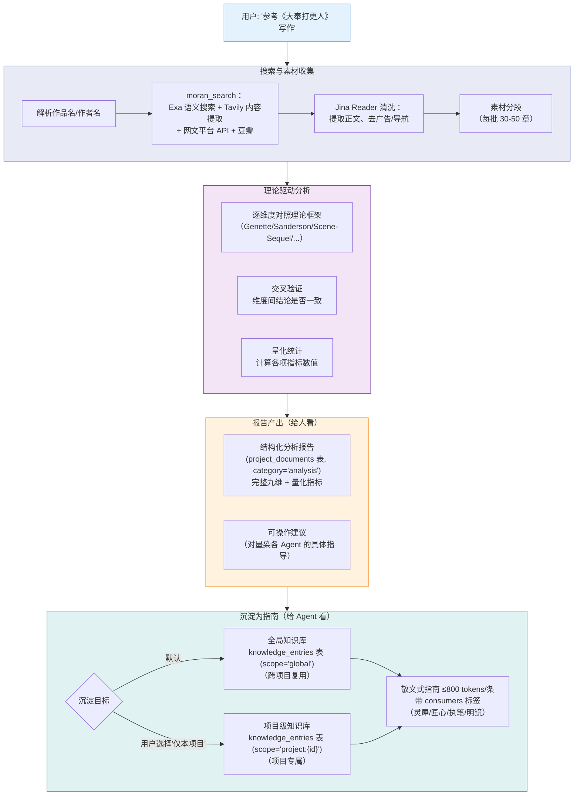

### 分析报告的沉淀流程

析典分析参考作品后，产出分为两部分：
1. **分析报告**：写入 `project_documents` 表 (category='analysis')，供用户查看。
2. **知识指南**：提炼为散文式条目，写入 `knowledge_entries` 表，供其他 Agent 消费。

### 分析报告的消费方

析典的产出不是孤立的——它流向墨染的各个环节：

| 消费方 | 使用析典产出的方式 |
|--------|-------------------|
| **灵犀**（创意脑暴） | 参考"叙事结构模式"和"爽感机制"来设计类似但差异化的故事结构 |
| **匠心**（世界/角色设计） | 参考"世界观构建技法"设计力量体系，参考"角色设计技法"设计角色心理模型 |
| **执笔**（章节写作） | 参考"文风指纹"和"对话声音"来模拟/借鉴目标风格，参考"节奏与张力"控制章节节奏 |
| **明镜**（审校） | 使用"张力曲线"和"爽感分布"作为审校参照标准 |
| **知识库** | 提炼出的通用写作技法直接沉淀为知识库条目，长期复用 |

### 与博闻的区别

| 维度 | 析典 | 博闻 |
|------|------|------|
| 分析对象 | **文学作品**（小说、剧本） | **事实性知识**（历史、科学、地理） |
| 分析深度 | 深度剖析技法和结构 | 验证事实正确性 |
| 理论支撑 | 叙事学、文体学、网文研究 | 领域专业知识 |
| 触发时机 | 项目启动时 / 用户明确要求 | 写作中 / 审校时按需调用 |
| 产出 | 分析报告 + 知识库条目 | 事实核查结果 |

---

## 4.9 扩展 Agent

### 4.9.1 书虫 (shuchong) — 普通读者评审

| 属性 | 值 |
|------|-----|
| 模型 | Claude Haiku 4.5（模拟普通读者，不需要强模型） |
| 温度 | 0.5（带有个人偏好的感性反馈） |
| 角色 | 不是专家，是**热爱该题材的普通读者** |

**评审方式**：不做技术分析，只凭阅读直觉打分和回答感性问题。
**启用条件**：明镜 Round 4 可选启用，或用户在 WebUI 手动触发。

### 4.9.2 点睛 (dianjing) — 专业文学批评

| 属性 | 值 |
|------|-----|
| 模型 | GPT-5.4-mini（与执笔跨模型族） |
| 温度 | 0.3 |
| 角色 | 专业文学批评家，诊断**为什么**某处不好 |

**与明镜的区别**：明镜检测"有没有问题"，点睛诊断"问题的根因是什么"。
**启用条件**：审校螺旋（同一问题反复出现）时自动调用，或用户手动触发。

---

## 4.10 Plantser Pipeline — 写作流程核心

**Plantser = Planner + Pantser**。既不是严格大纲派（计划太细→写出来呆板），也不是完全自由派（不给方向→写出来无聊）。这是针对用户核心痛点"干预多了呆板，不干预又无聊"的直接解法。

### 设计哲学

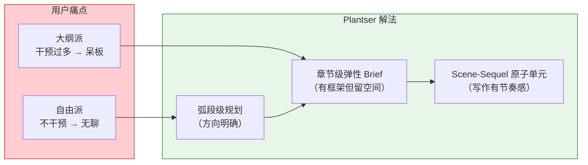

### 三层 Brief 设计

**来自调研的核心方法**：章节 Brief 不应该是"把整章内容预先写好的缩写版"，而应该分三层——越高层越严格，越底层越自由。

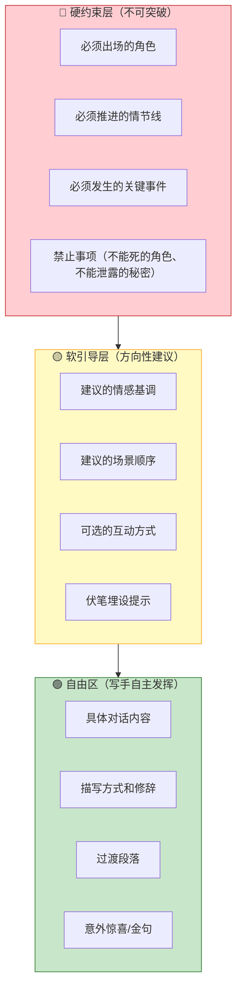

**章节 Brief 示例**：

```yaml
chapter: 15
title: "秘密"   # 可选，执笔可自行调整
type: emotional_climax   # 影响温度选择
arc: 1
position_in_arc: 15/30

# 🔴 硬约束（执笔必须遵守）
hard_constraints:
  must_appear: ["林晓", "张远"]
  must_advance:
    - thread: "门派秘密"
      progress: "林晓偷听到关键对话片段（但不是全部）"
    - thread: "师兄弟关系"
      progress: "信任出现裂痕"
  must_happen:
    - "林晓意外发现张远深夜密会陌生人"
  must_not:
    - "林晓不能直接与张远对质（留给后续章节）"
    - "不能揭示门派秘密的全貌"

# 🟡 软引导（建议方向，可适度偏离）
soft_guidance:
  mood: "从平静日常逐渐过渡到紧张悬疑"
  suggested_scenes:
    - "日常修炼场景（建立平静假象）"
    - "意外目击密会"
    - "独自消化、内心挣扎"
  foreshadowing:
    - plant: "张远袖中的信物（第25章回收）"
  emotional_landmine: "林晓发现张远对陌生人的态度比对自己更温和——同时感到被背叛和自我怀疑"

# 🟢 自由区（执笔自主发挥）
free_zone:
  - "具体对话内容由执笔自行创作"
  - "修炼场景的细节描写"
  - "任何能增加趣味性的细节/互动"
  - "可以添加不在计划中的小事件，只要不与硬约束冲突"
```

### 情感地雷机制

**来自调研的关键发现**：要让 AI 写出不呆板的文本，需要在 Brief 中植入"情感地雷"——迫使 AI 处理复杂、矛盾的情感，而非单一线性的情绪。

| 地雷类型 | 含义 | 示例 |
|----------|------|------|
| 情感同时性 | 同一时刻产生矛盾情感 | "又愤怒又心疼"、"恨铁不成钢" |
| 非理性行为 | 合乎情感但不合逻辑的选择 | 明知是陷阱但还是去了，因为对方是师兄 |
| 反期待时刻 | 打破读者（和角色自身的）预期 | 准备质问却发现对方先哭了 |
| 身体先行 | 身体反应先于理性认知 | 拳头握紧了才意识到自己在生气 |

情感地雷写入 Brief 的 `emotional_landmine` 字段，执笔**必须在章节中体现**（属于硬约束层级）。

### Scene-Sequel 原子单元

**Scene-Sequel 模式**是好莱坞编剧的经典结构，用于确保每个章节都有内在节奏：

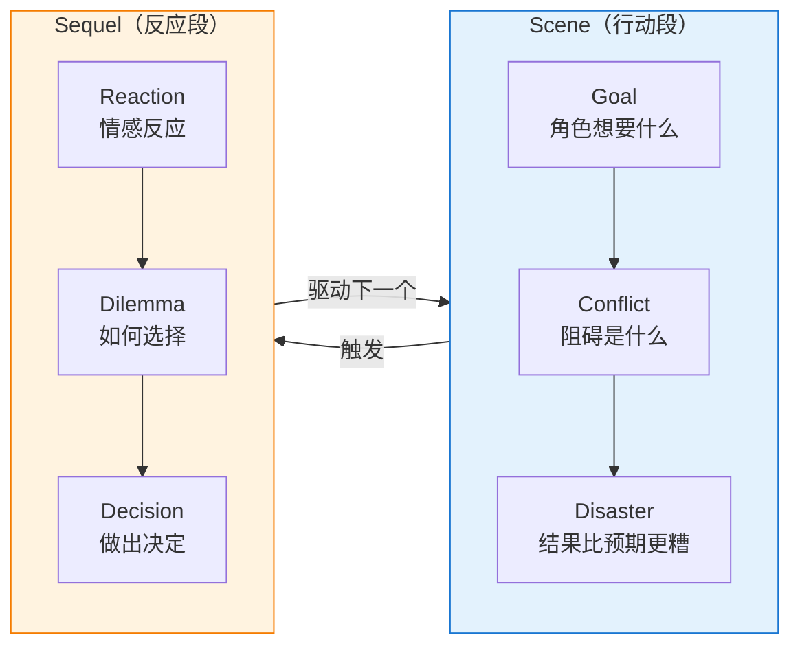

**与角色驱动的融合**：
- Scene 的 **Goal** = 角色的 WANT
- Scene 的 **Conflict** = LIE 被外部世界挑战
- Scene 的 **Disaster** = 按 LIE 行事导致的后果
- Sequel 的 **Dilemma** = WANT 和 NEED 的冲突
- Sequel 的 **Decision** = 朝 LIE 或 TRUTH 偏移

每章可包含 1-3 个 Scene-Sequel 循环，匠心在编写 Brief 时标注建议的 Scene-Sequel 结构。

### 完整的章节写作流水线

```mermaid
flowchart TD
    Start["弧段计划就绪"] --> BriefGen["匠心生成章节 Brief<br/>（三层结构 + 情感地雷）"]
    BriefGen --> Context["ContextAssembler 装配上下文<br/>（摘要 + 角色 + 世界观 + 知识库 + 风格）"]
    Context --> TempSet["墨衡根据章节类型设定温度"]
    TempSet --> MultiVer{"爆点章?"}
    MultiVer -->|"YES"| Multi["执笔生成 2-3 版本<br/>（不同温度）"]
    MultiVer -->|"NO"| Single["执笔生成 1 版本"]
    Multi --> Select["差异锚点评估择优"]
    Single --> Review["明镜四轮审校"]
    Select --> Review
    Review --> Pass{"通过?"}
    Pass -->|"YES"| Archive["载史归档"]
    Pass -->|"NO ≤3轮"| Revise["执笔根据反馈修改"]
    Pass -->|"NO >3轮"| Escalate["中断，人工审阅"]
    Revise --> Review
    Archive --> Next["下一章"]

    style Start fill:#f3e5f5,stroke:#7b1fa2
    style BriefGen fill:#e3f2fd,stroke:#1976d2
    style Review fill:#fff9c4,stroke:#f9a825
    style Archive fill:#e8f5e9,stroke:#2e7d32
    style Escalate fill:#f44336,stroke:#b71c1c,color:#fff
```

---

## 4.11 知识库子系统

知识库是**所有 Agent 共享的参考系**——不仅是执笔的"工具书"，也是灵犀、匠心、明镜获取写作智慧的来源。与 Dickens 的文件知识库不同，墨染的知识库基于 **PostgreSQL `knowledge_entries` 表**，支持运行时 CRUD、版本管理、分类体系、按消费方标签加载。

### 知识库架构

- **全局知识库**: `knowledge_entries` 表 (scope='global')。初始数据在初始化时从出厂默认模板导入。
- **项目知识库**: `knowledge_entries` 表 (scope='project:{id}')。
- **条目寻址**: 知识库条目通过稳定 ID 寻址，不再依赖文件路径。
- **升级机制**: "升级为全局" 仅需更新条目的 `scope` 字段，实现零断裂迁移。

### 知识库分类

```mermaid
flowchart TB
    KB["知识库"] --> T1["写作技巧<br/>（通用，跨题材）"]
    KB --> T2["题材知识<br/>（特定题材专属）"]
    KB --> T3["风格专项<br/>（可插拔模块）"]
    KB --> T4["经验教训<br/>（lessons，自动积累）"]
    KB --> T5["析典沉淀<br/>（参考作品提炼的写作智慧）"]

    T1 --> T1a["anti-ai-patterns.md<br/>去AI味指南"]
    T1 --> T1b["prose-craft.md<br/>文笔锤炼"]
    T1 --> T1c["character-depth.md<br/>角色塑造"]
    T1 --> T1d["plot-design.md<br/>情节设计"]

    T2 --> T2a["chinese-fiction.md<br/>中文小说"]
    T2 --> T2b["xianxia-world.md<br/>仙侠题材"]
    T2 --> T2c["scifi-tech.md<br/>科幻题材"]

    T3 --> T3a["metaphor-diversity.md<br/>比喻多样化"]
    T3 --> T3b["fight-choreography.md<br/>战斗编排"]
    T3 --> T3c["humor-integration.md<br/>幽默融入"]

    T4 --> T4a["lessons.json<br/>自动积累的写作教训"]

    T5 --> T5a["reference/大奉打更人/<br/>narrative-rhythm.md<br/>character-voices.md<br/>..."]
    T5 --> T5b["reference/诡秘之主/<br/>foreshadowing-craft.md<br/>..."]

    style T1 fill:#e8f5e9,stroke:#2e7d32
    style T2 fill:#e3f2fd,stroke:#1976d2
    style T3 fill:#fff3e0,stroke:#f57c00
    style T4 fill:#fce4ec,stroke:#c62828
    style T5 fill:#f3e5f5,stroke:#6a1b9a
```

### 析典沉淀（第 5 类知识库）

析典分析参考作品后，将提炼的写作智慧沉淀到 `knowledge_entries` 表中。每条沉淀记录带 **消费方标签（consumers）**，标明哪些 Agent 该加载这条知识：

```yaml
# knowledge_entries 表记录示例
# id: uuid, scope: 'global', category: 'reference'
---
source: 大奉打更人（卖报小郎君）
dimension: 节奏与张力
consumers: [匠心, 执笔, 明镜]
created_by: 析典
created_at: 2026-04-15
---

## 节奏处理的核心手法

这部作品最突出的节奏特征是"日常与案件的交替呼吸"——
每个案件弧段内部节奏紧凑、以实时场景为主，角色几乎没有
喘息机会；但弧段之间会安排 2-3 章日常段落，让角色回到
打更人司署的生活中，用轻松的互动消化前一弧段的紧张感。

这种呼吸感的关键不在于"日常占多少比例"，而在于日常段落
里也埋着下一个弧段的引子——读者以为在休息，其实已经被
下一个钩子勾住了。

### 对匠心的启发
弧段规划时，不要把过渡章节当"填充"——它们是下一弧段的
发射台。每个过渡段落都应该至少服务一个目的：
消化前弧情感 / 埋设下弧伏笔 / 展示角色日常面。

### 对执笔的启发
写过渡章节时，不要降低叙事密度——只是把"紧张"换成"温暖"
或"幽默"。每一页都要有东西让读者想翻下一页。

### 对明镜的参照
如果连续 3 章以上叙事强度评分低于 4/10 且无伏笔埋设，
可能是节奏出了问题——不是要求每章都高张力，而是要求
每章都有存在的理由。
```

**沉淀格式的核心原则**：

> **析典的理论用于分析过程，沉淀物只保留分析后提炼的感性智慧。**

| ✅ 正确的沉淀方式 | ❌ 错误的沉淀方式 |
|---|---|
| "过渡弧段用轻松日常消化紧张感，但每个日常场景都暗藏下一弧段的引子" | "场景/概要/省略比例应为 65%/25%/10%" |
| "角色的幽默感来自把现代吐槽融入古代语境，读者会心一笑" | "humor_ratio: 0.3, tension_baseline: 0.7" |
| "伏笔的精髓是'多层揭示'——同一个秘密分 3-5 次逐步揭开，每次揭开一层读者都觉得已经知道真相了" | "平均铺垫距离应为 15-30 章" |

**为什么不写量化指标**：量化是后验统计，是分析工具；把它变成先验约束，LLM 会机械地凑数字，写出的文章就失去灵性。散文式的智慧传递的是"感觉"和"为什么好"，LLM 能灵活内化而非死板执行。

### 消费方标签与加载策略

知识库不再只为执笔服务。每条知识文档都有明确的消费方，ContextAssembler 按 Agent 角色筛选加载：

| 类型 | 加载策略 | 消费方 | 理由 |
|------|----------|--------|------|
| 写作技巧 | **Eager（总是加载）** | 执笔 | 核心原则，每次写作都需要 |
| 题材知识 | **Selective（按题材加载）** | 执笔、匠心 | 仙侠写手不需要科幻知识 |
| 风格专项 | **On-demand（按需加载）** | 执笔 | 根据章节类型和 lessons 动态选择 |
| 经验教训 | **Filtered（过滤加载）** | 执笔、明镜 | 只加载与当前章节相关的 `lessons` 表条目 |
| 析典沉淀 | **Tagged（按消费方标签加载）** | 灵犀、匠心、执笔、明镜 | 按 `knowledge_entries` 的 `consumers` 字段匹配 |

### 全 Agent 知识库加载架构

```mermaid
flowchart TB
    KB["知识库"] --> CA["ContextAssembler"]

    CA --> LX["灵犀上下文装配"]
    CA --> JX["匠心上下文装配"]
    CA --> ZB["执笔上下文装配"]
    CA --> MJ["明镜上下文装配"]

    subgraph LX_Load["灵犀加载"]
        LX1["析典沉淀<br/>consumers 含'灵犀'<br/>（叙事模式、爽感机制）"]
    end

    subgraph JX_Load["匠心加载"]
        JX1["题材知识"]
        JX2["析典沉淀<br/>consumers 含'匠心'<br/>（世界观技法、伏笔策略、节奏参考）"]
    end

    subgraph ZB_Load["执笔加载"]
        ZB1["写作技巧（总是）"]
        ZB2["题材知识（按题材）"]
        ZB3["风格专项（按需）"]
        ZB4["经验教训（过滤）"]
        ZB5["析典沉淀<br/>consumers 含'执笔'<br/>（文风参考、对话风格、章末钩子）"]
    end

    subgraph MJ_Load["明镜加载"]
        MJ1["经验教训（过滤）"]
        MJ2["析典沉淀<br/>consumers 含'明镜'<br/>（张力参照、爽感密度、对话标杆）"]
    end

    LX --> LX_Load
    JX --> JX_Load
    ZB --> ZB_Load
    MJ --> MJ_Load

    style KB fill:#f3e5f5,stroke:#6a1b9a
    style CA fill:#e3f2fd,stroke:#1976d2
    style LX_Load fill:#fce4ec,stroke:#c62828
    style JX_Load fill:#fff3e0,stroke:#f57c00
    style ZB_Load fill:#e8f5e9,stroke:#2e7d32
    style MJ_Load fill:#ffcdd2,stroke:#c62828
```

**Token 预算分配**（各 Agent 知识库上下文占比）：

| Agent | 总上下文预算 | 知识库占比 | 析典沉淀占比 | 说明 |
|-------|-------------|-----------|-------------|------|
| 灵犀 | ~16K tokens | ~20% | ~15%（≤2400 tokens） | 脑暴阶段需要灵感，不需要太多细节 |
| 匠心 | ~32K tokens | ~15% | ~10%（≤3200 tokens） | 规划阶段需要参考但主要靠自身推理 |
| 执笔 | ~64K tokens | ~15% | ~5%（≤3200 tokens） | 写作时上下文大部分给章节摘要和角色 |
| 明镜 | ~32K tokens | ~10% | ~5%（≤1600 tokens） | 审校时主要对照规则，参照是辅助 |

### CRUD 能力

| 操作 | 触发方 | 方式 |
|------|--------|------|
| **Create** | 用户 / 博闻 / **析典** | WebUI 上传 / 博闻发现新知识 / 析典写入 `knowledge_entries` |
| **Read** | **ContextAssembler** | 查询 `knowledge_entries` (按策略 + 消费方标签) |
| **Update** | 用户 / 博闻 / **析典** | WebUI 编辑 / 博闻更新 / 析典补充 `knowledge_entries` |
| **Delete** | 用户 | 仅用户可从数据库删除 |

### 版本管理

知识库条目采用**逻辑版本管理**。每次更新 `knowledge_entries` 时，旧版本会归档到 `knowledge_versions` 表，支持快速回滚。

### 二层知识库结构

知识库分为**全局层**和**项目层**，通过 `scope` 字段隔离：

```mermaid
flowchart TB
    subgraph Global["全局知识库<br/>knowledge_entries (scope='global')"]
        G1["写作技巧/题材知识/风格专项/析典沉淀"]
    end

    subgraph Project["项目级知识库<br/>knowledge_entries (scope='project:{id}')"]
        P1["lessons 表<br/>本项目经验教训"]
        P2["本项目专属的析典沉淀"]
    end

    Global --> CA["ContextAssembler"]
    Project --> CA
    CA --> Merge["合并加载<br/>项目级优先覆盖全局"]

    style Global fill:#e8f5e9,stroke:#2e7d32
    style Project fill:#e3f2fd,stroke:#1976d2
    style Merge fill:#fff9c4,stroke:#f9a825
```

**关键决策**：

| 问题 | 方案 |
|------|------|
| 多部参考作品怎么隔离？ | `knowledge_entries` 增加 `work_id` 或在 `metadata` 中标记作品 |
| 不同项目能否复用？ | 全局 `scope='global'` 所有项目可见 |
| 析典沉淀到哪一层？ | **默认全局**（通用技法）。用户可选择 `scope='project:{id}'` |
| Lessons 放哪？ | **`lessons` 表** (scope: project) |
| 同名/冲突处理 | **项目级优先覆盖全局** |
| ContextAssembler 怎么合并？ | 查询数据库联合 `scope`，按相关性排序，受 token 预算约束 |

**析典分析报告 vs 析典沉淀的区别**：

| | 分析报告 | 沉淀条目 |
|---|---|---|
| **存储位置** | `project_documents` 表 (category='analysis') | `knowledge_entries` 表 (scope='global' 或 'project:{id}') |
| **内容** | 完整九维分析，含量化数据和理论引用 | 从报告中提炼的散文式写作智慧 |
| **读者** | **人**（用户在WebUI分析面板查看） | **Agent**（ContextAssembler装配到prompt） |
| **格式** | 结构化YAML + 文字分析（可长） | 指南式散文 + consumers标签（≤800 tokens/条） |
| **生命周期** | 分析完成即固定，不再修改 | 可被用户/析典更新完善 |

### Lessons 自学习系统

**来自实际项目的经验**：《穿越后宫奇遇记》积累了 25 条 lessons，全部来自第 1 章的反复修改。这种"事后积累"效率太低。

**墨染改进**：

1. **审校驱动**：明镜发现的 MAJOR/CRITICAL 问题自动转化为 `lessons` 表候选条目
2. **用户确认**：lesson 候选在 WebUI 展示，用户确认后激活
3. **相关性匹配**：写作时只加载与当前章节相关的 lessons
4. **过期淘汰**：如果某条 lesson 连续 20 章未被触发，标记为"可能已内化"

```mermaid
flowchart LR
    Review["明镜发现 MAJOR 问题"] --> Candidate["写入 lessons 表 (status='pending')"]
    Candidate --> User["用户在 WebUI 确认"]
    User -->|"确认"| Active["status='active'"]
    User -->|"拒绝"| Discard["status='cancelled'"]
    Active --> Match["写作时按相关性查询"]
    Match --> Load["装配到执笔上下文"]
    Active -->|"20章未触发"| Stale["标记为'archived'"]
```

---

## 4.12 模型配置策略

### 跨模型族原则

```mermaid
flowchart LR
    subgraph Writing["写作族 (Anthropic / Kimi)"]
        ZB2["执笔<br/>Claude Opus / Kimi K2"]
    end
    subgraph Review["审校族 (OpenAI / Google)"]
        MJ2["明镜<br/>GPT / Gemini"]
    end
    subgraph Archive["归档族 (Anthropic)"]
        ZS2["载史<br/>Haiku + Sonnet"]
    end

    Writing -->|"产出"| Review
    Review -->|"通过"| Archive
    Review -->|"不通过"| Writing

    style Writing fill:#c8e6c9,stroke:#2e7d32
    style Review fill:#ffcdd2,stroke:#c62828
    style Archive fill:#e3f2fd,stroke:#1976d2
```

**核心规则**：执笔和明镜**必须来自不同模型家族**。Claude 写 → GPT/Gemini 审，或 Kimi 写 → Claude 审。避免同源偏见导致 AI 味检测盲区。

### 模型分配表

| Agent | 推荐模型 | 备选 | 选择理由 |
|-------|----------|------|----------|
| 墨衡 | Claude Sonnet 4.6 | GPT-5.4 | 编排需要稳定推理，不需要创造力 |
| 灵犀 | Claude Opus 4.6 | — | 最高创造力，用于脑暴发散 |
| 匠心 | Claude Sonnet 4.6 | GPT-5.4 | 结构化设计，平衡质量与成本 |
| 执笔 | Claude Opus 4.6 / Kimi K2 | 本地模型 | 创作力 + 中文能力 |
| 明镜 | GPT-5.4-mini | Gemini Pro | 跨族审校，成本可控 |
| 载史 | Haiku 4.5 + Sonnet 4.6 | GPT-5.4-mini | 分层降本（Haiku 初筛 + Sonnet 归档） |
| 博闻 | Claude Sonnet 4.6 | — | 知识处理需要推理能力 |
| **析典** | **Claude Opus 4.6** | **GPT-5.4** | **需要最强分析和推理能力，理论框架应用复杂** |
| 书虫 | Claude Haiku 4.5 | 本地模型 | 模拟普通读者，弱模型更像真人 |
| 点睛 | GPT-5.4-mini | Gemini Pro | 与执笔跨族，专业批评 |

### 与 OpenCode SDK 的集成

```mermaid
sequenceDiagram
    participant MH as 墨衡 (Orchestrator)
    participant SDK as OpenCode SDK
    participant ZB as 执笔 Agent

    MH->>SDK: session.prompt({ agent: "zhibi", parts: [context] })
    SDK->>ZB: 转发 prompt + system prompt + 工具列表
    loop 流式生成
        ZB-->>SDK: streaming chunks
        SDK-->>MH: SSE events → WebUI
    end
    ZB->>SDK: 工具调用: write_chapter(content)
    SDK->>MH: 工具执行请求
    MH->>MH: 写入 chapters + chapter_versions 表
    MH->>SDK: 工具结果返回
    SDK->>ZB: 继续生成
    ZB-->>SDK: 完成
    SDK-->>MH: 最终结果
```

---

## 4.13 从 Dickens 到墨染：Agent 映射

```mermaid
flowchart LR
    subgraph Dickens["Dickens Agent 体系"]
        D1["Dickens 总指挥"]
        D2["Micawber 脑暴"]
        D3["Wemmick 建筑师"]
        D4["Weller/Baoyu/Daiyu/Xifeng 写手"]
        D5["Jaggers 三轮审校"]
        D6["Cratchit 归档"]
        D7["Buzfuz 读者评审"]
        D8["Tulkinghorn 批评家"]
    end

    subgraph MoRan["墨染 Agent 体系"]
        M1["墨衡 总指挥"]
        M2["灵犀 创意脑暴"]
        M3["匠心 设计师"]
        M4["执笔 唯一写手"]
        M5["明镜 多维审校"]
        M6["载史 归档"]
        M7["博闻 知识查证"]
        M8["书虫 读者评审"]
        M9["点睛 文学批评"]
        M10["析典 作品分析"]
    end

    D1 -->|"继承编排逻辑<br/>+ 新增螺旋检测"| M1
    D2 -->|"继承三阶段方法论<br/>+ 新增结构化产出"| M2
    D3 -->|"继承设计能力<br/>+ 新增四维心理模型"| M3
    D4 -->|"合并为单写手<br/>+ 风格配置切换"| M4
    D5 -->|"继承审校框架<br/>+ 全面升级检测维度"| M5
    D6 -->|"继承归档能力<br/>+ 分层降本 + PostgreSQL"| M6
    D7 -->|"继承读者视角"| M8
    D8 -->|"继承批评框架"| M9

    style Dickens fill:#e0e0e0,stroke:#616161
    style MoRan fill:#e8f5e9,stroke:#2e7d32
```

### 关键变化总结

| 维度 | Dickens | 墨染 | 变化原因 |
|------|---------|------|----------|
| 写手数量 | 4+ 个独立写手 | 1 个执笔 + 风格配置 | 避免上下文断裂和风格跳跃 |
| 参考分析 | 无 | 析典（九维理论框架分析） | **新增** 系统性剖析参考作品，沉淀知识库 |
| 审校轮次 | 3 轮 | 4 轮（Round 4 可选） | 增加读者体验维度 |
| AI 味检测 | 黑名单词汇为主 | Burstiness + 句式分析 + 多维度 | 黑名单不足以检测深层 AI 味 |
| 审校通过线 | 7.0 分 | 7.5 分 + Burstiness 硬门槛 | 提高质量标准 |
| 反馈格式 | 自由文本 | 四层结构化（issue/evidence/suggestion/effect） | 让执笔能精确修改 |
| 知识库 | 只读 | 数据库 CRUD + 版本 + 分类 + 按需加载 | 支持运行时知识进化 |
| 写作流程 | 大纲→写作 | Plantser Pipeline（三层 Brief + 情感地雷 + Scene-Sequel） | 解决"呆板 vs 无聊"的核心痛点 |
| 文风管理 | 单一 style-guide | 核心原则 + 可插拔专项模块 | 防止文风档案无限膨胀 |
| 温度管理 | 固定 0.8 | 场景化动态温度 | 不同章节类型需要不同创意强度 |
| 一致性存储 | 数据库 | PostgreSQL 结构化 | 300 万字规模下单一文件无法高效查询 |
