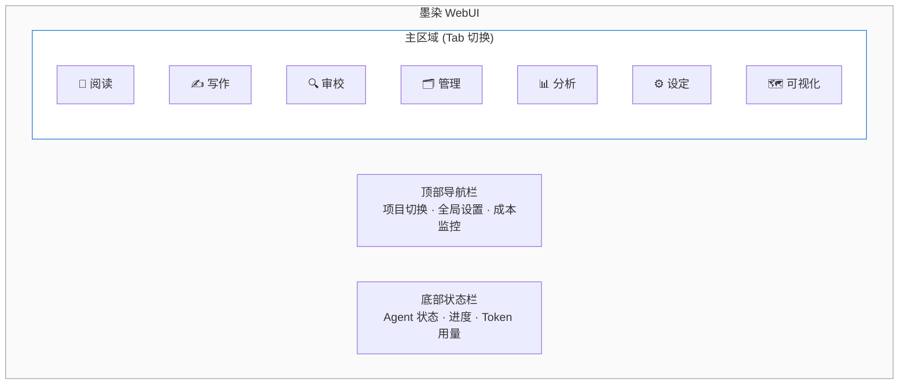
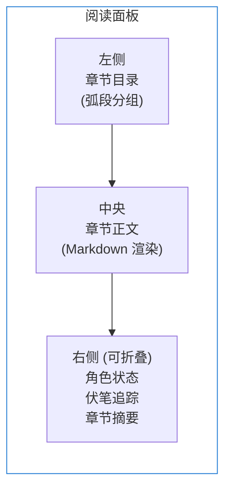
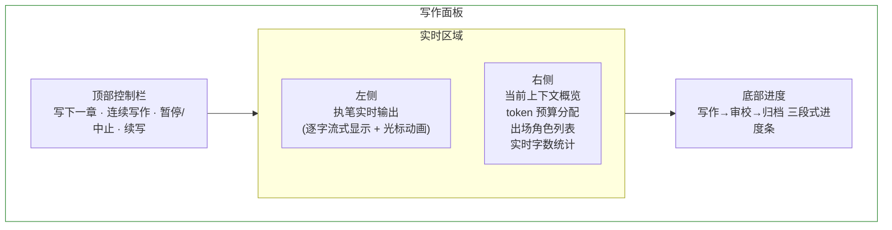
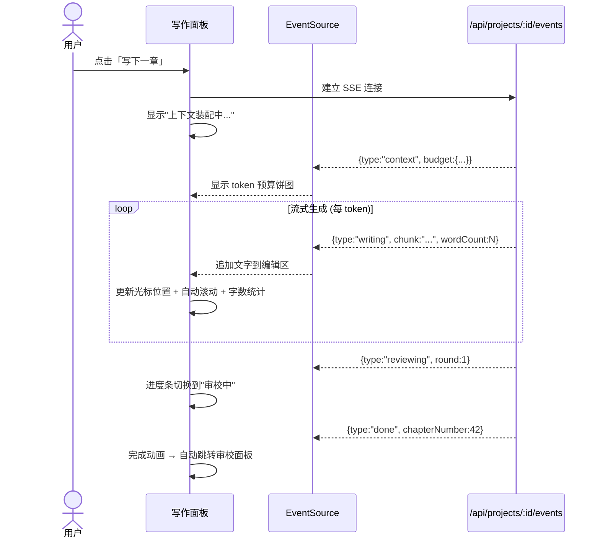
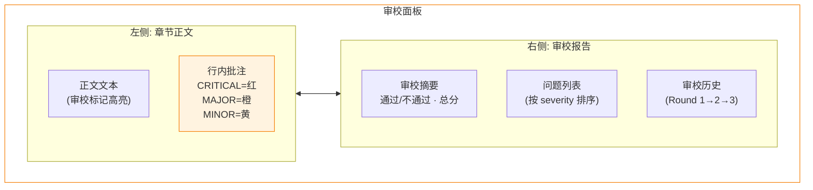
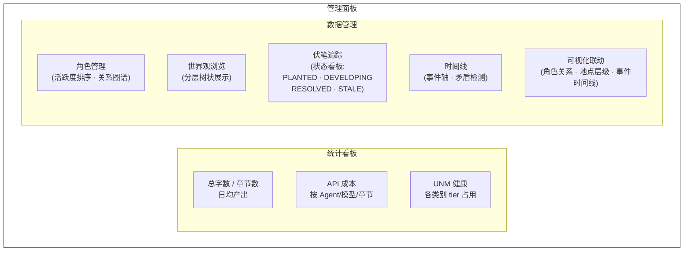
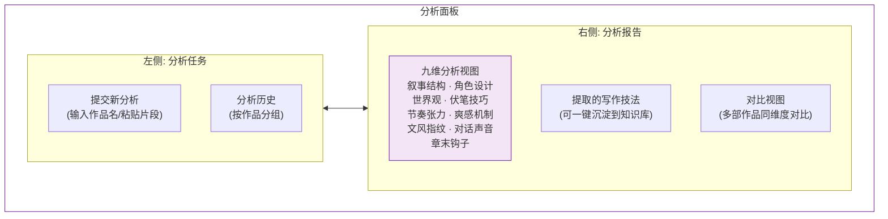
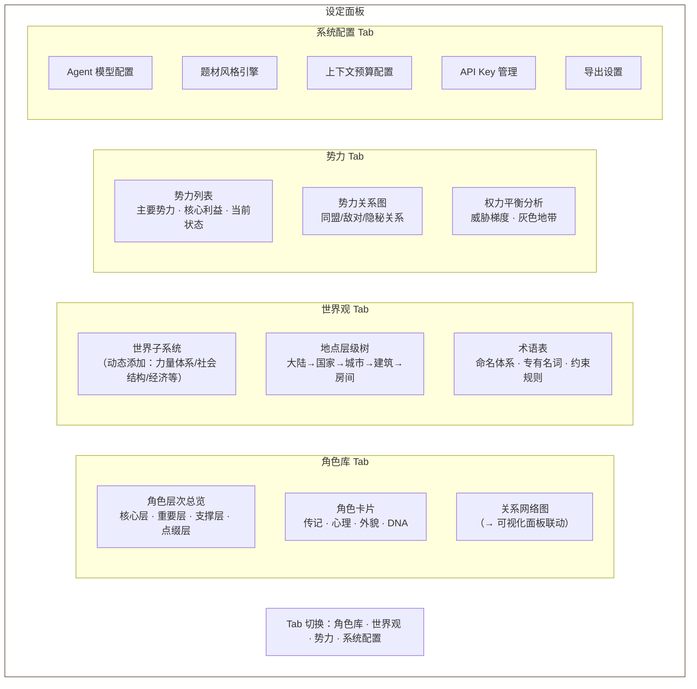
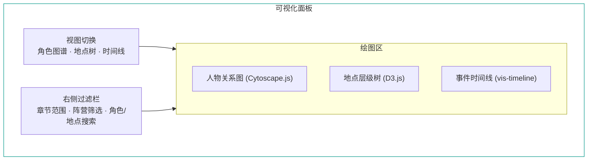
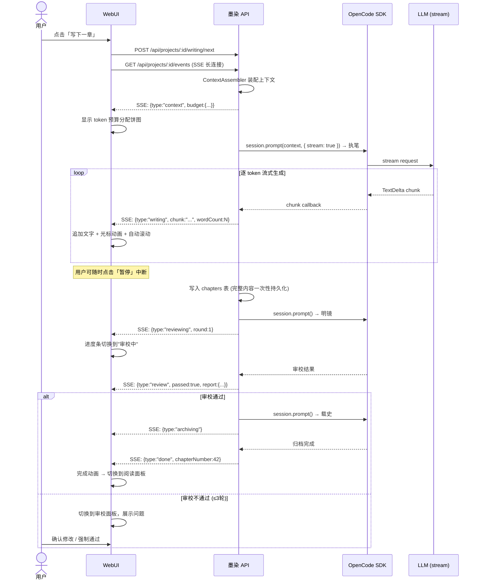

# 新项目设计文档 · §5 WebUI 设计

> 用户痛点："现在的dickens写作阅读纠正都不太方便。"
> WebUI 是墨染的一等公民，不是附属品。

---

## 5.1 设计原则

1. **写作沉浸感** — 写作/阅读模式要安静，不干扰创作流
2. **操作可及性** — 常用操作 ≤2 次点击到达
3. **实时反馈** — Agent 工作进度全程可见（SSE 推流）
4. **信息密度可调** — 简洁模式（写作）↔ 详细模式（管理/审校）

---

## 5.2 页面结构



---

## 5.3 七大功能面板

### 5.3.1 阅读面板

**场景**：审阅已完成的章节，像读小说一样浏览。



**功能点**：
- 弧段分组的章节目录，支持搜索/筛选
- 正文渲染支持字体/字号/行距/背景色自定义
- 右侧栏显示当前章节涉及的角色状态、活跃伏笔
- 选中文本可直接添加批注（转入审校面板）
- 历史版本对比（diff view）

### 5.3.2 写作面板

**场景**：触发写作、监控写作过程、人工干预。流式输出是本面板的核心体验。



**功能点**：
- 一键「写下一章」/ 批量「连续写 N 章」
- 执笔输出实时流式显示（SSE）
- 上下文装配可视化（BudgetAllocator 各类别 token 分配饼图）
- 写作中可暂停/中止
- 写作完成自动切换到审校面板

#### 流式写作渲染设计

流式输出是写作面板的核心交互。通过 SSE 接收执笔 Agent 的逐 token 输出，实时渲染到编辑区。



**渲染细节**：

| 特性 | 实现方式 | 效果 |
|------|----------|------|
| **逐字打字效果** | `useEffect` + `EventSource.onmessage` 逐 chunk append | 文字像打字机一样逐字出现 |
| **光标动画** | CSS `animation: blink 1s step-end infinite` 在文字末尾 | 闪烁光标指示当前生成位置 |
| **自动滚动** | `scrollIntoView({ behavior: 'smooth' })` 跟随最新内容 | 视口自动跟随新生成的文字 |
| **段落高亮** | 当前正在生成的段落添加 `bg-green-50` 背景 | 呼吸灯效果标识活跃段落 |
| **字数实时统计** | 从 SSE event 的 `wordCount` 字段读取 | 右侧面板实时显示"已生成 2,341 字" |
| **暂停/续写** | 暂停→保存 partial 草稿；续写→从编辑点继续 | 用户可随时中断并修改已生成内容 |
| **断线重连** | `EventSource` 原生重连 + `Last-Event-ID` 恢复 | 网络抖动不丢失已接收内容 |

**前端核心 Hook**：

```typescript
// packages/web/src/hooks/useStreamingWrite.ts
function useStreamingWrite(projectId: string) {
  const [content, setContent] = useState('');
  const [wordCount, setWordCount] = useState(0);
  const [stage, setStage] = useState<'idle' | 'context' | 'writing' | 'reviewing' | 'archiving' | 'done' | 'error'>('idle');
  const [reviewResult, setReviewResult] = useState<{ round: number; passed: boolean; report: ReviewReport } | null>(null);

  useEffect(() => {
    const es = new EventSource(`/api/projects/${projectId}/events`);

    // 8 类命名事件通道（与 §2.3 协议一致）
    es.addEventListener('context', (e) => {
      setStage('context');
      // data: { budget: { total, used, remaining } }
    });

    es.addEventListener('writing', (e) => {
      const { chunk, wordCount: wc } = JSON.parse(e.data);
      setContent(prev => prev + chunk);
      setWordCount(wc);
      setStage('writing');
    });

    es.addEventListener('reviewing', (e) => {
      const { round } = JSON.parse(e.data);
      setStage('reviewing');
      // data: { round } — 审校开始通知
    });

    es.addEventListener('review', (e) => {
      const data = JSON.parse(e.data);
      setReviewResult(data); // { round, passed, report: ReviewReport }
    });

    es.addEventListener('archiving', () => setStage('archiving'));

    es.addEventListener('done', () => setStage('done'));

    es.addEventListener('error', (e) => {
      console.error('Writing error:', e.data);
      setStage('error');
    });

    es.addEventListener('heartbeat', () => {
      // 保持连接活跃，无需 UI 更新
    });

    return () => es.close();
  }, [projectId]);

  return { content, wordCount, stage, reviewResult };
}
```

### 5.3.3 审校面板

**场景**：查看审校结果、人工批注、确认/驳回修改。



**功能点**：
- 审校问题按 severity 分级着色（CRITICAL 红 · MAJOR 橙 · MINOR 黄 · SUGGESTION 灰）
- 点击问题跳转到正文对应位置
- 用户可对每个问题做出裁决：接受 / 忽略 / 手动修改
- 人工添加批注，转化为教训写入 guidance
- 强制通过按钮（跳过审校，标记"用户确认"）
- 审校螺旋触发时显示警告，提供"人工接管"入口

### 5.3.4 管理面板

**场景**：项目全局管理、数据健康监控、成本追踪。



**功能点**：
- 写作进度仪表盘（字数曲线、章节里程碑）
- API 成本明细（按 Agent · 按模型 · 按章节 · 趋势图）
- UNM 健康面板（每个类别的 HOT/WARM/COLD 占用率）
- 角色关系图谱（→ 可视化面板联动）
- 地点层级树（→ 可视化面板联动）
- 事件时间线（→ 可视化面板联动）
- 伏笔看板（类似 Kanban：PLANTED → DEVELOPING → RESOLVED）
- 螺旋检测告警历史

### 5.3.5 分析面板

**场景**：提交参考作品给析典 Agent 进行深度分析，查看分析报告，将分析结论沉淀到知识库。



**功能点**：
- 提交参考作品分析任务（支持输入作品名、粘贴文本片段、上传 TXT 文件）
- 分析进度实时展示（SSE 推送九个维度的分析进度）
- 九维分析报告的可视化展示（每个维度可展开/折叠）
- 提取的写作技法卡片式展示，一键"沉淀到知识库"
- 多部作品的同维度对比视图（如：对比《大奉打更人》和《诡秘之主》的伏笔技巧）
- 分析报告导出（Markdown 格式）

### 5.3.6 设定面板

**场景**：项目前期创作准备的核心工作台。覆盖两大类设定：**创作设定**（角色、世界观、势力）和**系统配置**（Agent 模型、API Key、导出等）。通过分 Tab 组织，引导用户在写作前系统性完成世界设计。



---

#### 5.3.6.1 角色库 Tab

**核心设计理念**：角色设计不只是主角，而是覆盖完整的四层角色体系，并通过向导引导用户系统性完成角色创作。

**四层角色体系**：

| 层级 | 代表 | 设计深度 | 存档方式 |
|------|------|----------|----------|
| 核心层 | 主角、主要对手 | 完整7步 + DNA结晶（500+字）| 独立角色卡 |
| 重要层 | 重要配角、关键反派 | 简化5步（500字）| 独立角色卡 |
| 支撑层 | 功能性配角 | 传记+特征（200字）| 独立角色卡 |
| 点缀层 | 背景人物 | 一两行描述 | 仅索引列表 |

**功能点**：
- **角色层次总览**：四层分组展示全部角色，显示各层角色数量和阵营标记
- **阵容丰富度引导**：新建项目时提示"是否已设计核心层/重要层对立角色？"，未满足时给出红色警示
- **角色创建向导**：8步引导（传记 → 心理 → 外貌 → 非功能特征 → 矛盾提取 → 对话个性 → 关系设计 → DNA结晶），不同层级自动跳过不必要步骤
- **角色 DNA 展示**：Ghost/Wound/Lie/Want/Need 五维可视化，行为特征标签，张力参数滑块
- **关系网络**：可视化关系图，点击关系边查看/编辑关系强度和类型（→ 联动可视化面板）
- **命名体系管理**：文化基底、音色规范、各类命名规则（人名/地名/势力名/功法名）
- **命名自检**：新建角色时自动检查是否与功能绑定、职业绑定、品质绑定（违反则警告）

**对抗梯度表**（新建项目引导必填）：

| 弧段 | 主要对手 | 层级 | 威胁级别 | 对抗性质 |
|------|----------|------|----------|----------|
| 第一弧 | — | — | — | — |

---

#### 5.3.6.2 世界观 Tab

**核心设计理念**：世界子系统动态可扩展，用户按题材需要自由添加，而不是预设固定字段。

**功能点**：
- **世界子系统管理**：卡片式展示已有子系统，「+ 添加子系统」按钮，内置推荐子系统列表（按题材类型过滤）
  - 推荐子系统（玄幻修仙）：力量体系、社会结构、门派格局、天地法则、灵气分布
  - 推荐子系统（现代都市）：超能力系统、组织结构、世界认知层级
  - 推荐子系统（宫斗）：朝堂体制、品阶制度、势力格局、后宫规则
  - 用户可完全自定义子系统名和内容
- **地点层级树编辑器**：树状结构，支持拖拽排序，每个节点可添加关联事件数、关联角色数
- **术语表**：专有名词管理（名称 · 定义 · 约束规则 · 别名），写作时自动注入上下文，防止 AI 造词
- **世界状态**：当前故事内时间（朝代/年月）、季节/天气偏好（影响叙事氛围）

---

#### 5.3.6.3 势力 Tab

**核心设计理念**：势力是角色行动的结构性背景，是冲突的根源。势力设计独立于角色，两者通过「阵营标记」关联。

**功能点**：
- **势力列表**：卡片形式，每张卡显示势力名、当前状态（活跃/衰退/覆灭/合并）、成员数量、核心利益
- **势力详情编辑**：
  - 基本信息（名称、象征、总部地点）
  - 核心利益（为何而战）
  - 内部派系（势力内部的子派系）
  - 成员管理（关联角色库中的角色，标注职位/地位）
  - 领地/影响范围（关联地点树）
- **势力关系图**：节点图，关系边分类（同盟/敌对/隐秘合作/表面中立），可编辑
- **权力平衡面板**：
  - 灰色地带（游离于势力之外的人/地区/组织）
  - 威胁梯度（各弧段主要威胁来源）
- **阵营前置检查**（写作前自动触发）：
  - ✅ 核心层/重要层至少各有1个明确对立阵营角色
  - ✅ 各弧段有对应威胁梯度规划
  - ✅ 有至少1个灰色角色（立场模糊）
  - ⚠️ 未通过时显示警告，但不阻断写作

---

#### 5.3.6.4 系统配置 Tab

**功能点**：
- Agent 模型配置（每个 Agent 可独立选择模型/温度）
- 题材风格引擎配置（选择内置预设风格、fork 到 DB 后自定义编辑，或从零创建自定义风格）
- API Key 管理（多 provider 支持）
- 上下文预算配置（调整 BudgetAllocator 各类别权重）
- 知识库管理（查看/编辑/新增写作知识库文件）
- 导出设置（TXT/Markdown/ePub 导出）

---

### 5.3.7 可视化面板

**场景**：直观展示人物关系网络、地理位置层级、事件时间线，帮助用户和 Agent 理解故事全貌。



**三大可视化视图**：

#### 人物关系图（Cytoscape.js）

- **展示内容**：角色节点（按阵营/势力着色分组）+ 关系边（按类型区分：家族/恋人/敌对/同盟）
- **交互**：点击节点查看角色详情，拖拽调整布局，滚轮缩放，框选过滤
- **数据源**：`GET /api/projects/:id/characters/graph` 返回 `{ nodes: CharacterNode[], edges: RelationshipEdge[] }`
- **布局算法**：Force-directed（默认）/ Hierarchical（家族树模式）/ Circular（势力分组）
- **筛选**：按章节范围（"第1-20章的关系状态"）、按关系类型、按阵营

#### 地点层级树

- **展示内容**：树状层级结构（大陆→国家→城市→建筑→房间），节点可展开/折叠
- **交互**：点击节点查看地点详情 and 关联事件，搜索地点名
- **数据源**：`GET /api/projects/:id/locations/tree` 返回递归树结构
- **附加信息**：每个地点节点显示关联角色数量、发生事件数量

#### 事件时间线（vis-timeline）

- **展示内容**：按故事内时间排列的事件轴，支持按角色分组（多行时间线）
- **交互**：缩放时间范围、点击事件查看详情、按角色/地点/重要性筛选
- **数据源**：`GET /api/projects/:id/timeline` 返回 `{ items: TimelineItem[], groups: TimelineGroup[] }`
- **时间轴模式**：
  - 全书视图（按弧段着色的事件点）
  - 弧段视图（单弧段内的详细事件）
  - 角色视图（特定角色参与的所有事件）

**可视化技术栈**：

| 视图 | 库 | 理由 |
|------|---|------|
| 人物关系图 | Cytoscape.js | 丰富的布局算法、复合节点支持、生产验证（Novalist 使用） |
| 地点层级树 | React Tree + D3 | 可折叠树 + 搜索，轻量 |
| 事件时间线 | vis-timeline | 原生日期处理、分组、范围事件、交互编辑 |

---

## 5.4 交互流程：写一章（含流式）



---

## 5.5 响应式设计

| 视口 | 布局 |
|------|------|
| 桌面 (≥1280px) | 三栏（目录 + 正文 + 侧边栏） |
| 平板 (768-1279px) | 双栏（正文 + 可折叠侧边栏） |
| 移动 (< 768px) | 单栏（纯阅读模式，写作/管理功能隐藏） |

**主要使用场景是桌面端**——写作和审校需要大屏幕。移动端只提供阅读能力。

---

## 5.6 技术实现

| 组件 | 技术 | 说明 |
|------|------|------|
| 路由 | Next.js App Router | `/read` `/write` `/review` `/manage` `/analysis` `/visualize` `/settings` |
| 布局 | CSS Grid + Tailwind | 三栏自适应 |
| 编辑器 | Tiptap + ProseMirror | 批注、高亮标记、协同编辑基础 |
| 流式渲染 | `EventSource` + `useStreamingWrite` Hook | 逐字输出、光标动画、自动滚动、暂停/续写 |
| 图表 | Recharts | 成本趋势图、字数曲线 |
| 关系图 | Cytoscape.js | 角色关系图谱（多布局算法） |
| 时间线 | vis-timeline | 事件时间线（分组、范围、交互） |
| 层级树 | D3.js + React | 地点层级树（可折叠） |
| 看板 | @dnd-kit | 伏笔 Kanban 拖拽 |
| SSE | EventSource API | 实时流式更新（含心跳保活与断线重连） |
| 主题 | Tailwind + CSS Variables | 亮色/暗色/纸张色 |
| Markdown | react-markdown + remark-gfm | 大纲/世界观/角色文档渲染 |
