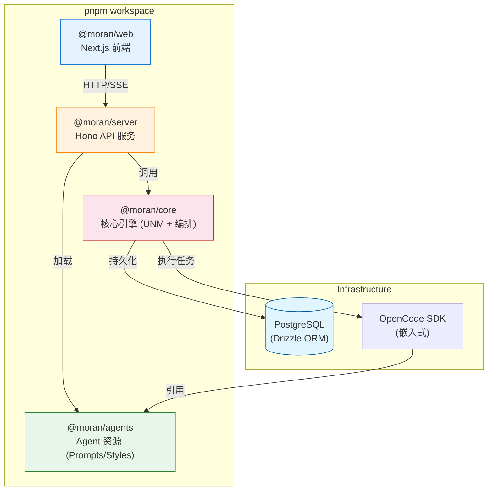
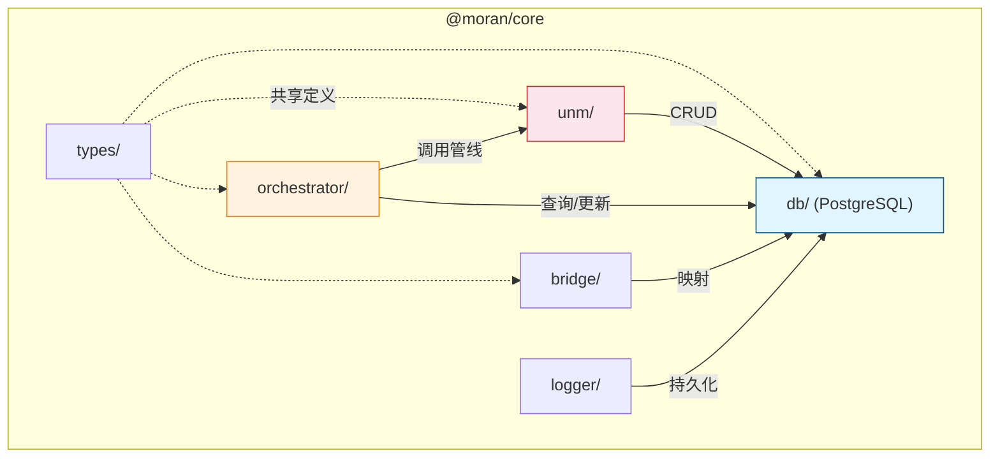
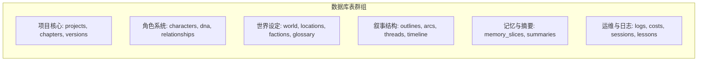
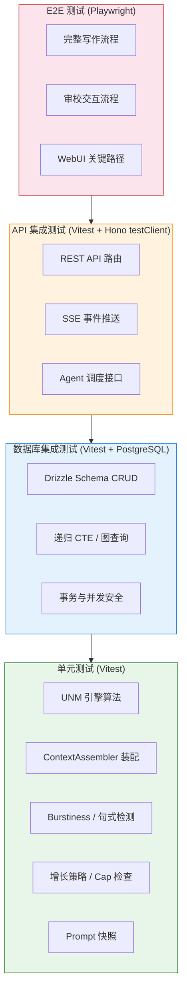

# 新项目设计文档 · §6 项目结构与模块划分

> 墨染采用 monorepo 结构，全栈 TypeScript 开发。本节定义目录结构、PostgreSQL 数据库 Schema 以及模块依赖关系。

---

## 6.1 仓库结构总览

```
moran/
├── README.md
├── LICENSE                          # MIT
├── package.json                     # workspace root
├── pnpm-workspace.yaml
├── vitest.workspace.ts              # Vitest monorepo 根配置
├── .env.example                     # 环境变量模板 (含 DATABASE_URL)
├── .gitignore
├── docker-compose.yml               # 本地开发与测试
├── docker-compose.prod.yml          # 生产部署
├── docker-compose.test.yml          # 集成测试用（PG 临时实例）
├── drizzle.config.ts                # Drizzle ORM 配置
│
├── .github/
│   └── workflows/
│       ├── ci-unit.yml              # 单元测试 (无 DB，每次 push/PR)
│       ├── ci-integration.yml       # 集成测试 (PG service container)
│       ├── ci-e2e.yml               # E2E 测试 (Docker Compose 全栈)
│       ├── docker-publish.yml       # 镜像构建与推送
│       └── db-migrate.yml           # 数据库迁移 (packages/core/src/db/migrations/** 变更触发)
│
├── packages/
│   ├── core/                        # 📦 @moran/core — 核心引擎
│   │   ├── package.json
│   │   ├── tsconfig.json
│   │   ├── vitest.config.ts         # core 包测试配置
│   │   ├── test/                    # 测试基础设施
│   │   │   ├── setup.ts                 # 全局 setup (env, mocks)
│   │   │   ├── fixtures/                # 测试数据工厂
│   │   │   │   ├── projects.ts
│   │   │   │   ├── chapters.ts
│   │   │   │   └── characters.ts
│   │   │   └── helpers.ts               # withTestTransaction 等辅助函数
│   │   └── src/
│   │       ├── index.ts             # 公共导出
│   │       ├── unm/                 # UNM 统一叙事记忆 (见 §3)
│   │       │   ├── memory-slice.ts
│   │       │   ├── managed-write.ts
│   │       │   ├── context-assembler.ts
│   │       │   ├── budget-allocator.ts
│   │       │   ├── scene-analyzer.ts
│   │       │   ├── slice-renderer.ts
│   │       │   ├── spiral-detector.ts
│   │       │   ├── growth/
│   │       │   ├── tier-manager.ts
│   │       │   └── __tests__/           # UNM 单元测试
│   │       │       ├── managed-write.test.ts
│   │       │       ├── context-assembler.test.ts
│   │       │       ├── budget-allocator.test.ts
│   │       │       ├── spiral-detector.test.ts
│   │       │       └── context-assembler.test.ts.snap  # prompt 快照
│   │       │
│   │       ├── db/                  # PostgreSQL 数据库层 (Drizzle ORM)
│   │       │   ├── index.ts             # 客户端初始化
│   │       │   ├── migrate.ts           # 迁移运行器
│   │       │   ├── seed.ts              # 初始数据填充
│   │       │   ├── schema/              # 表定义 (按域拆分)
│   │       │   │   ├── projects.ts          # 项目核心
│   │       │   │   ├── chapters.ts          # 章节与版本
│   │       │   │   ├── characters.ts        # 角色档案与 DNA
│   │       │   │   ├── relationships.ts     # 角色关系
│   │       │   │   ├── locations.ts         # 地点与连接
│   │       │   │   ├── world.ts             # 世界设定与状态
│   │       │   │   ├── outline.ts           # 大纲、弧段与线索
│   │       │   │   ├── factions.ts          # 势力与同盟
│   │       │   │   ├── secrets.ts           # 秘密与认知
│   │       │   │   ├── glossary.ts          # 术语表
│   │       │   │   ├── summaries.ts         # 章节与弧段摘要
│   │       │   │   ├── documents.ts         # 项目文档
│   │       │   │   ├── knowledge.ts         # 全局知识库
│   │       │   │   ├── lessons.ts           # 写作教训
│   │       │   │   ├── tension.ts           # 张力与谎言追踪
│   │       │   │   ├── abstract-acts.ts     # 叙事结构锚点
│   │       │   │   ├── logs.ts              # 系统与 Agent 日志
│   │       │   │   ├── sessions.ts          # Session 映射
│   │       │   │   ├── costs.ts             # 成本记录
│   │       │   │   ├── memory.ts            # MemorySlices (UNM)
│   │       │   │   ├── relations.ts         # ORM 关系定义
│   │       │   │   └── index.ts             # Barrel export
│   │       │   ├── __tests__/           # DB 集成测试
│   │       │   │   ├── chapters.test.ts
│   │       │   │   ├── characters.test.ts
│   │       │   │   ├── locations.test.ts
│   │       │   │   ├── plot-threads.test.ts
│   │       │   │   └── knowledge.test.ts
│   │       │   └── migrations/          # 生成的 SQL 迁移文件
│   │       │
│   │       ├── orchestrator/        # 编排控制器
│   │       │   ├── index.ts
│   │       │   ├── workflow.ts           # 六阶段工作流状态机
│   │       │   ├── phase-runner.ts       # 阶段执行器
│   │       │   └── cost-tracker.ts       # 成本追踪
│   │       │
│   │       ├── logger/              # 日志中转 (存储至 db/logs)
│   │       │   ├── index.ts
│   │       │   ├── formatters.ts
│   │       │   └── transports.ts
│   │       │
│   │       ├── bridge/              # 项目管理桥接
│   │       │   ├── index.ts
│   │       │   ├── session-mapping.ts    # OpenCode Session 关联
│   │       │   └── style-manager.ts      # 风格配置加载
│   │       │
│   │       └── types/               # 共享类型定义
│   │
│   ├── agents/                      # 📦 @moran/agents — Agent 资源（静态代码资源，非运行时存储）
│   │   ├── package.json
│   │   ├── prompts/                 # Agent System Prompts (Markdown，只读模板)
│   │   ├── templates/               # 输出格式模板（只读）
│   │   ├── styles/                  # 题材风格配置 (YAML + Markdown，内置预设，只读；用户自定义风格存 DB)
│   │   └── opencode.agents.json     # Agent 运行时配置
│   │
│   ├── server/                      # 📦 @moran/server — API 服务
│   │   ├── package.json
│   │   ├── Dockerfile               # Server 容器镜像 (Bun 多阶段构建)
│   │   ├── vitest.config.ts         # server 包测试配置
│   │   └── src/
│   │       ├── index.ts             # 启动入口
│   │       ├── app.ts               # Hono 应用
│   │       ├── routes/              # API 路由
│   │       │   └── __tests__/       # API 集成测试 (Hono testClient)
│   │       │       ├── chapters.test.ts
│   │       │       ├── characters.test.ts
│   │       │       ├── projects.test.ts
│   │       │       └── sse.test.ts
│   │       └── middleware/          # 中间件
│   │
│   └── web/                         # 📦 @moran/web — WebUI (Next.js)
│       ├── package.json
│       ├── Dockerfile               # Web 容器镜像 (Node.js 多阶段构建)
│       ├── vitest.config.ts         # web 包单元测试配置
│       ├── playwright.config.ts     # E2E 测试配置
│       ├── e2e/                     # Playwright E2E 测试（覆盖七大面板）
│       │   ├── writing-flow.spec.ts     # 写作流程（含流式 SSE）
│       │   ├── review-panel.spec.ts     # 审校交互
│       │   ├── reading.spec.ts          # 阅读浏览
│       │   ├── management.spec.ts       # 项目管理
│       │   ├── analysis.spec.ts         # 析典分析
│       │   ├── settings.spec.ts         # 设定编辑
│       │   └── visualization.spec.ts    # 可视化面板
│       └── src/
│           ├── app/                 # 页面路由
│           ├── components/          # UI 组件
│           │   └── __tests__/       # 组件单元测试
│           ├── hooks/               # React Hooks
│           │   └── __tests__/       # Hooks 单元测试
│           └── stores/              # Zustand 状态
│
└── scripts/                         # 运维脚本
```

---

## 6.2 四包架构



### 各包职责

| 包 | 运行时 | 职责 | 存储方式 |
|---|---|---|---|
| `@moran/core` | Bun | UNM 引擎、编排逻辑、**PostgreSQL (Drizzle ORM)** | 数据库记录 |
| `@moran/agents` | 无 (资源) | Agent Prompts、题材风格配置、写作模板 | 代码库文件 (只读) |
| `@moran/server` | Bun | REST API、SSE 推送、OpenCode 桥接 | 无状态 |
| `@moran/web` | Node.js | Web 界面、实时交互、可视化图表 | 浏览器状态 |

---

## 6.3 核心模块依赖关系



---

## 6.4 模块详细说明

### 6.4.1 `db/` — 数据库层 (Drizzle ORM)

墨染摒弃了传统的本地文件存储，全面转向 PostgreSQL 以支持高并发查询、全文搜索和复杂的关系追踪。



### 6.4.2 `unm/` — 统一叙事记忆

负责上下文的智能装配与增长控制。详细算法见 §3。

### 6.4.3 `orchestrator/` — 编排控制器

驱动六阶段工作流（灵感→设计→结构→写作→审校→归档）。

---

## 6.5 API 路由设计

### 核心 REST API

| 方法 | 路径 | 说明 | 对应 Core 操作 (Drizzle) |
|------|------|------|-------------------------|
| `GET` | `/api/projects` | 项目列表 | `db.query.projects.findMany()` |
| `GET` | `/api/projects/:id/chapters` | 章节列表 | `db.query.chapters.findMany()` |
| `GET` | `/api/projects/:id/chapters/:num` | 获取正文 | `db.query.chapters.findFirst()` |
| `GET` | `/api/projects/:id/chapters/:num/versions` | 版本历史 | `db.query.chapterVersions.findMany()` |
| `GET` | `/api/projects/:id/characters` | 角色列表 | `db.query.characters.findMany()` |
| `GET` | `/api/projects/:id/world` | 世界设定 | `db.query.worldSettings.findMany()` |
| `GET` | `/api/projects/:id/outline` | 大纲信息 | `db.query.outlines.findFirst()` |
| `GET` | `/api/projects/:id/consistency/threads` | 伏笔列表 | `db.query.plotThreads.findMany()` |
| `GET` | `/api/projects/:id/analysis` | 析典报告 | `db.query.projectDocuments.findMany()` |

### 可视化与搜索 API

- `GET /api/projects/:id/characters/graph` — 人物关系图 (Nodes + Edges)
- `GET /api/projects/:id/locations/tree` — 地点层级树
- `GET /api/projects/:id/timeline` — 事件时间线可视化数据
- `GET /api/projects/:id/search?q=...` — 全文搜索 (基于 PostgreSQL `tsvector`)

### 写作流程 API

| 方法 | 路径 | 说明 |
|------|------|------|
| `GET` | `/api/projects/:id/events` | SSE 实时事件流（8类命名事件通道） |
| `POST` | `/api/projects/:id/writing/next` | 写下一章（触发完整写作管线） |
| `POST` | `/api/projects/:id/writing/pause` | 暂停写作（中止 LLM 调用，保存草稿） |
| `POST` | `/api/projects/:id/writing/continue` | 续写（从用户编辑点继续生成） |

### 审校 API

| 方法 | 路径 | 说明 |
|------|------|------|
| `GET` | `/api/projects/:id/reviews` | 审校报告列表 |
| `GET` | `/api/projects/:id/reviews/:reviewId` | 审校报告详情 |
| `POST` | `/api/projects/:id/reviews/:reviewId/accept` | 接受审校意见 |

### 知识库 API

| 方法 | 路径 | 说明 |
|------|------|------|
| `GET` | `/api/projects/:id/knowledge` | 知识库条目列表（含全局 + 项目级） |
| `POST` | `/api/projects/:id/knowledge` | 新增知识条目 |
| `PUT` | `/api/projects/:id/knowledge/:entryId` | 更新知识条目 |
| `DELETE` | `/api/projects/:id/knowledge/:entryId` | 删除知识条目 |

### 风格配置 API

| 方法 | 路径 | 说明 |
|------|------|------|
| `GET` | `/api/projects/:id/styles` | 风格配置列表 |
| `PUT` | `/api/projects/:id/styles/:styleId` | 编辑风格配置 |

### 析典分析 API

| 方法 | 路径 | 说明 |
|------|------|------|
| `POST` | `/api/projects/:id/analysis/submit` | 提交析典分析任务（析典自动搜索资料） |
| `POST` | `/api/projects/:id/analysis/:reportId/settle` | 沉淀分析结论到知识库 |

---

## 6.6 PostgreSQL Schema 定义 (Drizzle ORM)

### 1. 项目核心 (Project Core)

```typescript
// projects: 项目主表
projects: {
  id: uuid PK,
  title: varchar(500) NOT NULL,
  genre: varchar(100),
  subGenre: varchar(100),
  language: varchar(10) DEFAULT 'zh-CN',
  targetWordCount: integer DEFAULT 500000,
  chapterCount: integer DEFAULT 200,
  wordsPerChapter: integer,
  pov: varchar(50), // first, third-limited, multiple...
  tense: varchar(20), // past, present
  toneDescription: text,
  writingStrategy: varchar(50), // plot-driven, character-driven
  styleId: varchar(100), // 对应 @moran/agents/styles 中的 ID
  status: enum(planning, outlining, writing, editing, completed),
  currentChapter: integer DEFAULT 0,
  currentArc: integer DEFAULT 0,
  totalWordCount: integer DEFAULT 0,
  userId: text DEFAULT 'local', // 单用户阶段用文本，多用户后可迁移为 uuid FK
  createdAt: timestamptz DEFAULT now(),
  updatedAt: timestamptz DEFAULT now(),
}

// chapters: 章节正文
chapters: {
  id: uuid PK,
  projectId: uuid FK -> projects.id,
  chapterNumber: integer NOT NULL,
  title: varchar(500),
  content: text, // 章节全文
  wordCount: integer,
  writerStyle: varchar(100),
  status: enum(draft, reviewing, archived, dirty),
  currentVersion: integer DEFAULT 1,
  archivedVersion: integer,
  searchVector: tsvector (generated), // 全文搜索索引
  createdAt: timestamptz,
  updatedAt: timestamptz,
  UNIQUE(projectId, chapterNumber)
}

// chapter_versions: 历史版本快照
chapter_versions: {
  id: uuid PK,
  chapterId: uuid FK -> chapters.id,
  version: integer NOT NULL,
  content: text,
  wordCount: integer,
  writerName: varchar(100),
  reason: varchar(50), // rewrite, edit, restore...
  createdAt: timestamptz,
  UNIQUE(chapterId, version)
}

// chapter_briefs: Plantser Pipeline 三层 Brief（§4.10）
chapter_briefs: {
  id: uuid PK,
  projectId: uuid FK -> projects.id,
  chapterNumber: integer NOT NULL,
  arcIndex: integer,
  type: enum(hard, soft, free), // 三层约束级别
  hardConstraints: jsonb, // 必须达成的情节目标 [{goal, reason}]
  softGuidance: jsonb, // 建议性指导 [{suggestion, priority}]
  freeZone: text[], // 可自由发挥的区域描述
  emotionalLandmine: text, // 情感地雷：必须触发的情感反应
  scenesSequelStructure: jsonb, // 场景-续场结构 [{type, description}]
  status: enum(draft, approved, used, outdated),
  createdAt: timestamptz,
  updatedAt: timestamptz,
  UNIQUE(projectId, chapterNumber)
}
```

### 2. 角色系统 (Character System)

```typescript
// characters: 角色基础档案
characters: {
  id: uuid PK,
  projectId: uuid FK -> projects.id,
  name: varchar(255) NOT NULL,
  aliases: text[], // 别名数组
  role: enum(protagonist, antagonist, supporting, minor),
  description: text,
  personality: text,
  background: text,
  goals: text[],
  firstAppearance: integer,
  arc: text,
  profileContent: text, // 深度档案正文
  createdAt: timestamptz,
  updatedAt: timestamptz,
}

// character_states: 角色状态快照 (按章节追踪)
character_states: {
  id: uuid PK,
  characterId: uuid FK -> characters.id,
  chapterNumber: integer NOT NULL,
  location: varchar(255),
  emotionalState: varchar(255),
  knownInformation: text[],
  changes: text[],
  isAlive: boolean DEFAULT true,
  deathChapter: integer,
  powerLevel: varchar(100),
  abilities: text[],
  inventory: text[],
  physicalCondition: text,
  createdAt: timestamptz,
  UNIQUE(characterId, chapterNumber)
}

// character_dna: 核心叙事驱动 (Psychological Profile)
character_dna: {
  id: uuid PK,
  characterId: uuid FK -> characters.id UNIQUE,
  ghost: text, // 往事阴影
  wound: text, // 核心创伤
  lie: text,   // 角色坚信的谎言
  want: text,  // 表面诉求
  need: text,  // 核心需求
  arcType: enum(positive, negative, flat, corruption),
  defaultMode: text,
  stressResponse: text,
  lieDefense: text,
  tell: text, // 习惯性小动作
  bStoryCharacterId: uuid FK -> characters.id,
  bStoryFunction: text,
  abnormalFactor: real DEFAULT 0.5,
  liePressureSensitivity: real DEFAULT 0.5,
  arcProgress: real DEFAULT 0,
  lieConfrontationCount: integer DEFAULT 0,
  lastLiePressureChapter: integer,
}

// character_relationships: 关系网络
character_relationships: {
  id: uuid PK,
  projectId: uuid FK -> projects.id,
  sourceId: uuid FK -> characters.id,
  targetId: uuid FK -> characters.id,
  type: varchar(100) NOT NULL,
  description: text,
  UNIQUE(sourceId, targetId, type)
}

// relationship_states: 关系动态演变
relationship_states: {
  id: uuid PK,
  sourceId: uuid FK -> characters.id,
  targetId: uuid FK -> characters.id,
  chapterNumber: integer NOT NULL,
  type: varchar(100),
  intensity: real, // 0-1
  description: text,
  change: text,
  createdAt: timestamptz,
}
```

### 3. 世界设定 (Worldbuilding)

```typescript
// world_settings: 核心设定集 (子系统)
world_settings: {
  id: uuid PK,
  projectId: uuid FK -> projects.id,
  section: varchar(100) NOT NULL, // rules, subsystem:power, subsystem:social...
  name: varchar(255),
  content: text NOT NULL,
  sortOrder: integer DEFAULT 0,
  createdAt: timestamptz,
  updatedAt: timestamptz,
  UNIQUE(projectId, section, name)
}

// world_states: 环境追踪
world_states: {
  id: uuid PK,
  projectId: uuid FK -> projects.id,
  chapterNumber: integer NOT NULL,
  inStoryDate: varchar(100),
  season: varchar(50),
  weather: varchar(100),
  timeOfDay: varchar(50),
  majorWorldEvents: text,
  environmentNotes: text,
  createdAt: timestamptz,
  UNIQUE(projectId, chapterNumber)
}

// locations: 地点档案
locations: {
  id: uuid PK,
  projectId: uuid FK -> projects.id,
  name: varchar(255) NOT NULL,
  aliases: text[],
  type: varchar(100), // city, room, dungeon...
  description: text,
  sensoryDetails: text,
  layout: text,
  significance: enum(major, moderate, minor),
  firstAppearance: integer,
  parentId: uuid FK -> locations.id, // 自引用支持层级
  status: enum(active, destroyed, abandoned, occupied...),
  relatedCharacterIds: uuid[],
  tags: text[],
  createdAt: timestamptz,
  updatedAt: timestamptz,
}

// location_connections: 空间拓扑图
location_connections: {
  id: uuid PK,
  sourceLocationId: uuid FK -> locations.id,
  targetLocationId: uuid FK -> locations.id,
  type: varchar(50), // route, portal, passage...
  description: text,
  bidirectional: boolean DEFAULT true,
  UNIQUE(sourceLocationId, targetLocationId, type)
}

// factions: 势力与组织
factions: {
  id: uuid PK,
  projectId: uuid FK -> projects.id,
  name: varchar(255) NOT NULL,
  status: enum(active, weakened, destroyed, merged...),
  leaderId: uuid FK -> characters.id,
  keyMemberIds: uuid[],
  territory: text,
  changes: text,
  createdAt: timestamptz,
  updatedAt: timestamptz,
}

// glossary_entries: 术语表 (确保命名一致性)
glossary_entries: {
  id: uuid PK,
  projectId: uuid FK -> projects.id,
  term: varchar(255) NOT NULL,
  aliases: text[],
  category: enum(location, organization, power_system, title, object, concept, custom),
  definition: text,
  firstAppearance: integer,
  constraints: text, // 必须遵守的描述禁忌/规则
  createdAt: timestamptz,
  updatedAt: timestamptz,
}
```

### 4. 叙事结构 (Narrative Structure)

```typescript
// outlines: 项目大纲核心
outlines: {
  id: uuid PK,
  projectId: uuid FK -> projects.id UNIQUE,
  synopsis: text,
  structureType: varchar(50), // three-act, four-act, episodic...
  themes: text[],
  createdAt: timestamptz,
}

// arcs: 弧段/分卷计划
arcs: {
  id: uuid PK,
  projectId: uuid FK -> projects.id,
  arcIndex: integer NOT NULL,
  title: varchar(500),
  description: text,
  startChapter: integer,
  endChapter: integer,
  detailedPlan: text, // 详细弧段设计文档
  createdAt: timestamptz,
  UNIQUE(projectId, arcIndex)
}

// plot_threads: 情节线与伏笔追踪
plot_threads: {
  id: uuid PK,
  projectId: uuid FK -> projects.id,
  name: varchar(255) NOT NULL,
  description: text,
  status: enum(planted, developing, resolved, stale),
  introducedChapter: integer,
  resolvedChapter: integer,
  relatedCharacterIds: uuid[],
  keyMoments: jsonb, // [{chapter, description}]
  createdAt: timestamptz,
}

// timeline_events: 核心事件时间轴
timeline_events: {
  id: uuid PK,
  projectId: uuid FK -> projects.id,
  chapterNumber: integer,
  storyTimestamp: varchar(255), // 故事内时间
  description: text NOT NULL,
  characterIds: uuid[],
  locationId: uuid FK -> locations.id,
  significance: enum(minor, moderate, major, critical),
  createdAt: timestamptz,
}
```

### 5. 记忆与张力 (UNM & Tension)

```typescript
// memory_slices: UNM 记忆片段 (Hot/Warm/Cold) — 对应 §3 MemorySlice 接口
memory_slices: {
  id: uuid PK,
  projectId: uuid FK -> projects.id,
  category: enum(guidance, world, characters, consistency, summaries, outline), // 六大类别
  tier: enum(hot, warm, cold),
  scope: varchar(50), // chapter, arc, global
  stability: enum(immutable, canon, evolving, ephemeral), // 四种稳定性级别
  chapter_number: integer,
  content: text, // 对应 MemorySlice.text
  char_count: integer, // 字符数（预计算），对应 MemorySlice.charCount
  token_count: integer, // token 数（用于预算控制）
  importance: real,
  priority_floor: integer DEFAULT 0, // 0-100，最低优先级保障
  freshness: real DEFAULT 1.0, // 1.0=最新，随时间衰减
  relevance_tags: text[], // 关联标签（角色名、地点等）
  source_agent: varchar(100), // 产生此片段的 Agent
  source_chapter: integer, // 来源章节
  created_at: timestamptz,
  updated_at: timestamptz,
}

// tension_accumulators: 全局张力控制器
tension_accumulators: {
  id: uuid PK,
  projectId: uuid FK -> projects.id UNIQUE,
  currentScore: real DEFAULT 0,
  peakThisArc: real DEFAULT 0,
  currentPhase: enum(rising, peak, falling, valley),
  pendingEvents: jsonb, // 待触发的危机/转折事件
  updatedAt: timestamptz,
}

// lie_confrontation_trackers: 谎言破碎进度追踪
lie_confrontation_trackers: {
  id: uuid PK,
  projectId: uuid FK -> projects.id,
  characterId: uuid FK -> characters.id,
  lieSummary: text,
  pressureThreshold: integer,
  status: enum(established, challenged, cracking, shattered),
  UNIQUE(projectId, characterId)
}
```

### 6. 文档与日志 (Ops & Logs)

```typescript
// project_documents: 通用文档 (脑暴、报告、指南)
project_documents: {
  id: uuid PK,
  projectId: uuid FK -> projects.id,
  category: enum(brainstorm, review, health_report, guide, analysis...),
  title: varchar(500),
  content: text NOT NULL,
  version: integer DEFAULT 1,
  isPinned: boolean DEFAULT false, // 锁定某个版本为当前有效参考
  metadata: jsonb,
  createdAt: timestamptz,
}

// knowledge_entries: 全局知识库 (跨项目共享)
knowledge_entries: {
  id: uuid PK,
  scope: varchar(255) NOT NULL, // 'global' or 'project:{id}'
  category: enum(writing_craft, genre, style, reference...),
  title: varchar(500),
  content: text NOT NULL,
  tags: text[],
  consumers: text[], // Agent 角色列表，标明哪些 Agent 该加载此条目 ['匠心', '执笔', '明镜']
  version: integer DEFAULT 1,
  createdAt: timestamptz,
  updatedAt: timestamptz,
}

// knowledge_versions: 知识条目版本历史
knowledge_versions: {
  id: uuid PK,
  knowledgeEntryId: uuid FK -> knowledge_entries.id,
  version: integer NOT NULL,
  content: text NOT NULL,
  updatedBy: varchar(100), // Agent 名或 'user'
  createdAt: timestamptz,
}

// decision_logs: Agent 决策链路轨迹
decision_logs: {
  id: uuid PK,
  projectId: uuid FK -> projects.id,
  level: enum(L1_decision, L2_agent, L3_system),
  agentId: varchar(100),
  action: varchar(255),
  details: text,
  metadata: jsonb,
  createdAt: timestamptz,
}
```

### 索引与迁移策略

- **GIN 索引**: 应用于 `chapters.searchVector` 以实现毫秒级全文搜索。
- **B-tree 索引**: 应用于所有外键 (`projectId`, `characterId` 等) 以及 (projectId, chapterNumber) 复合键。
- **迁移管理**: 使用 `drizzle-kit` 自动生成 SQL 迁移文件，并通过 CI/CD 在部署时执行 `pnpm db:migrate`。

---

## 6.7 构建与运行

### 1. 开发环境启动

墨染推荐使用 Docker 环境进行开发，以保证数据库与运行时环境的一致性。

```bash
# 启动数据库
docker compose up -d postgres

# 安装依赖并生成 Drizzle Client
pnpm install
pnpm db:generate

# 启动全栈服务 (Bun + Next.js)
pnpm dev
```

### 2. 数据库运维命令

- `pnpm db:generate` — 生成迁移 SQL 文件
- `pnpm db:migrate` — 应用挂起的迁移到数据库
- `pnpm db:seed` — 填充测试数据
- `pnpm db:studio` — 打开 Drizzle 可视化数据浏览器

### 3. 生产部署

```bash
# 构建并启动所有服务 (server, web, postgres)
docker compose -f docker-compose.prod.yml up -d
```

---

## 6.8 包依赖矩阵

| 包 | 主要依赖 | 运行时 | 备注 |
|---|---|---|---|
| `@moran/core` | `drizzle-orm`, `postgres`, `zod` | Bun | 核心算法与 DB 操作 |
| `@moran/agents` | (无代码) | — | 纯文本与 YAML 配置 |
| `@moran/server` | `hono`, `@moran/core`, `@opencode-ai/sdk` | Bun | 轻量级 API 壳 |
| `@moran/web` | `next`, `react`, `zustand`, `lucide-react` | Node.js | 前端 UI |

**关键改进**: 移除了对 `better-sqlite3` 和本地文件系统的强依赖，所有持久化数据均在 PostgreSQL 中统一管理，极大提升了系统的健壮性与可扩展性。

---

## 6.9 测试策略

> 墨染作为长期迭代的平台级项目，需要系统化的自动化测试保障。测试分四层，覆盖从纯函数到全链路的完整质量防线。

### 测试分层架构



### 测试框架选型

| 层级 | 框架 | 理由 |
|------|------|------|
| 单元测试 | **Vitest** | Workspace 原生支持 monorepo、Bun 兼容、IDE 集成优秀、v8 覆盖率。Storybook(35k⭐)、Mastra AI 等大型 TS monorepo 验证 |
| 数据库测试 | **Vitest + 事务回滚** | 每个测试用例在事务中执行并回滚，隔离性好、速度快。lobehub(5k⭐) 验证 |
| API 测试 | **Hono `testClient`** | Hono 官方提供的类型安全测试客户端，无需启动服务器，直接调用路由 |
| E2E 测试 | **Playwright** | 原生支持 Next.js App Router（Cypress 对 RSC 支持弱）、并行执行、UI 调试模式。Nx(MS) 验证 |
| Prompt 快照 | **Vitest snapshot + 自定义序列化器** | 对 ContextAssembler 输出做 golden test，确保上下文装配稳定性 |

### 测试目录结构

```
moran/
├── vitest.workspace.ts              # Vitest workspace 配置（根）
│
├── packages/
│   ├── core/
│   │   ├── vitest.config.ts         # @moran/core 单元 + DB 集成测试
│   │   ├── test/
│   │   │   ├── setup.ts             # 测试初始化（DB 连接、事务钩子）
│   │   │   ├── fixtures/            # 测试夹具（mock 章节、角色、世界观）
│   │   │   └── helpers.ts           # 事务回滚辅助函数
│   │   └── src/
│   │       ├── unm/__tests__/
│   │       │   ├── managed-write.test.ts
│   │       │   ├── context-assembler.test.ts
│   │       │   ├── budget-allocator.test.ts
│   │       │   ├── spiral-detector.test.ts
│   │       │   └── __snapshots__/   # Prompt 快照（golden files）
│   │       ├── db/__tests__/
│   │       │   ├── chapters.test.ts
│   │       │   ├── characters.test.ts
│   │       │   ├── locations-tree.test.ts   # 递归 CTE 测试
│   │       │   └── consistency.test.ts
│   │       └── orchestrator/__tests__/
│   │           ├── workflow.test.ts
│   │           └── cost-tracker.test.ts
│   │
│   ├── server/
│   │   ├── vitest.config.ts         # @moran/server API 集成测试
│   │   └── src/routes/__tests__/
│   │       ├── chapters.test.ts     # Hono testClient 测试
│   │       ├── characters.test.ts
│   │       ├── projects.test.ts
│   │       └── sse.test.ts
│   │
│   └── web/
│       ├── vitest.config.ts         # @moran/web 组件单元测试
│       ├── playwright.config.ts     # E2E 测试配置
│       ├── src/components/__tests__/ # React 组件测试
│       └── e2e/
│           ├── writing-flow.spec.ts # 写作完整流程（含流式 SSE）
│           ├── review-panel.spec.ts # 审校交互
│           ├── reading.spec.ts      # 阅读浏览
│           ├── management.spec.ts   # 项目管理（创建/配置/进度）
│           ├── analysis.spec.ts     # 析典分析面板
│           ├── settings.spec.ts     # 设定编辑面板
│           └── visualization.spec.ts # 可视化面板（关系图/时间线）
│
└── .github/workflows/
    ├── ci-unit.yml                  # 单元测试（无 DB，并行快速）
    ├── ci-integration.yml           # 集成测试（PG service container）
    └── ci-e2e.yml                   # E2E 测试（全栈 Docker）
```

### 各层测试详细设计

#### L1：单元测试（纯内存，无外部依赖）

**覆盖重点**：UNM 核心算法是系统的心脏，必须有严密的单元测试。

```typescript
// vitest.workspace.ts (根配置)
export default ['packages/*/vitest.config.ts'];

// packages/core/vitest.config.ts
import { defineConfig } from 'vitest/config';
export default defineConfig({
  test: {
    environment: 'node',
    globals: true,
    include: ['src/**/__tests__/**/*.test.ts'],
    exclude: ['src/db/__tests__/**'],  // DB 测试单独配置
    setupFiles: ['./test/setup.ts'],
    coverage: {
      provider: 'v8',
      include: ['src/unm/**', 'src/orchestrator/**'],
      thresholds: { statements: 80, branches: 75 },
    },
  },
});
```

**重点测试用例**：

| 模块 | 测试场景 | 验证标准 |
|------|----------|----------|
| ManagedWrite | Cap 超限时触发淘汰策略 | HOT 层 token 数不超过配额 |
| ManagedWrite | Canon 保护——canon 设定不可删除 | 写入被拒绝，返回错误 |
| ContextAssembler | 64K tokens 预算约束 | 输出总 token ≤ 64K |
| BudgetAllocator | 风格权重加成（仙侠 world×1.5） | world 分配增加 50% |
| SpiralDetector | 同一章审校 >3 轮触发中断 | 返回 spiral_detected 事件 |
| Burstiness | 计算已知文本的 burstiness 值 | 误差 ≤ 0.05 |
| 增长策略 | guidance 衰减（每 N 章 ×0.8） | 热度值按预期衰减 |

#### Prompt 快照测试（Golden Test）

ContextAssembler 的输出是给 LLM 的 prompt，其结构稳定性至关重要。用 Vitest 快照确保重构不会意外改变 prompt 结构：

```typescript
// packages/core/src/unm/__tests__/context-assembler.test.ts
import { describe, it, expect } from 'vitest';
import { ContextAssembler } from '../context-assembler';

// 自定义序列化器：标准化动态字段
expect.addSnapshotSerializer({
  test: (val) => val?.type === 'AssembledContext',
  serialize: (val) => JSON.stringify({
    ...val,
    assembledAt: '<TIMESTAMP>',
    sections: val.sections.map((s: any) => ({
      ...s,
      tokenCount: `~${Math.round(s.tokenCount / 100) * 100}`,
    })),
  }, null, 2),
});

describe('ContextAssembler', () => {
  it('仙侠风格上下文结构快照', () => {
    const ctx = assembler.assemble({
      chapterNumber: 15,
      styleId: '剑心',
      characters: mockCharacters,
      worldSettings: mockXianxiaWorld,
    });
    expect(ctx).toMatchSnapshot();
  });

  it('相同输入产出确定性一致', () => {
    const a = assembler.assemble(mockInput);
    const b = assembler.assemble(mockInput);
    expect(a.prompt).toBe(b.prompt);
  });
});
```

#### L2：数据库集成测试（事务回滚隔离）

```typescript
// packages/core/test/helpers.ts
import { db } from '../src/db';

/** 在事务中执行测试，自动回滚 */
export async function withTestTransaction<T>(
  fn: (tx: typeof db) => Promise<T>
): Promise<T> {
  return db.transaction(async (tx) => {
    const result = await fn(tx as typeof db);
    // 强制回滚——测试数据不会污染数据库
    tx.rollback();
    return result;
  });
}
```

**重点测试用例**：

| 模块 | 测试场景 | 验证标准 |
|------|----------|----------|
| chapters | 创建 + 版本自动递增 | version 字段自动 +1 |
| locations | 递归 CTE 查询子树 | 返回完整层级路径 |
| character_states | 按章节号查询最新状态 | 返回指定章节的 delta |
| plot_threads | 状态机转换（PLANTED→DEVELOPING） | 状态合法转换成功，非法转换被拒绝 |
| knowledge_entries | scope 隔离（global vs project） | project 查询不返回其他项目数据 |
| 全文搜索 | tsvector 中文搜索 | 搜索"修仙"返回包含该词的章节 |

#### L3：API 集成测试（Hono testClient）

```typescript
// packages/server/src/routes/__tests__/chapters.test.ts
import { describe, it, expect } from 'vitest';
import { testClient } from 'hono/testing';
import { app } from '../../app';

const client = testClient(app);

describe('Chapters API', () => {
  it('GET /api/projects/:id/chapters 返回章节列表', async () => {
    const res = await client.api.projects[':id'].chapters.$get({
      param: { id: 'test-project-id' },
    });
    expect(res.status).toBe(200);
    const data = await res.json();
    expect(Array.isArray(data)).toBe(true);
  });

  it('GET /api/projects/:id/characters/graph 返回关系图数据', async () => {
    const res = await client.api.projects[':id'].characters.graph.$get({
      param: { id: 'test-project-id' },
    });
    const data = await res.json();
    expect(data).toHaveProperty('nodes');
    expect(data).toHaveProperty('edges');
  });
});
```

#### L4：E2E 测试（Playwright）

```typescript
// packages/web/playwright.config.ts
import { defineConfig, devices } from '@playwright/test';

export default defineConfig({
  testDir: './e2e',
  fullyParallel: true,
  forbidOnly: !!process.env.CI,
  retries: process.env.CI ? 2 : 0,
  reporter: process.env.CI ? 'github' : 'html',
  use: {
    baseURL: 'http://localhost:3000',
    trace: 'on-first-retry',
  },
  projects: [
    { name: 'chromium', use: { ...devices['Desktop Chrome'] } },
  ],
  webServer: {
    // 本地开发：直接启动 Next.js dev server
    // CI 环境：由 ci-e2e.yml 通过 docker-compose.test.yml 全栈启动
    // （包含 PG、Server、Web，可测试真实 SSE 流和数据库写入）
    command: process.env.CI
      ? 'docker compose -f docker-compose.test.yml up --wait'
      : 'pnpm --filter @moran/web dev',
    url: 'http://localhost:3000',
    reuseExistingServer: !process.env.CI,
    timeout: process.env.CI ? 120_000 : 30_000,
  },
});
```

**关键 E2E 场景**：

| 场景 | 验证内容 |
|------|----------|
| 写作流程 | 点击"写下一章" → SSE 连接建立 → 流式逐字输出可见 → 暂停/续写功能 → 审校结果展示 → 归档成功 |
| 审校交互 | 查看审校报告 → 按 severity 着色 → 点击问题跳转 → 人工批注 |
| 阅读浏览 | 章节目录渲染 → 点击章节 → 正文加载 → 版本对比 |
| 可视化 | 人物关系图渲染 → 节点可点击 → 时间线缩放 → 地点层级树展开 |
| 项目管理 | 创建项目 → 配置风格 → 查看进度仪表盘 |
| 析典分析 | 提交分析任务 → 进度实时更新 → 报告展示 → 沉淀到知识库 |
| 设定编辑 | 世界观编辑 → 角色档案编辑 → 大纲树编辑 → 风格配置修改 |

### 覆盖率与质量门槛

| 包 | 测试层 | 覆盖率目标 | 门槛类型 |
|---|---|---|---|
| `@moran/core` (unm/) | 单元 | ≥ 80% 语句, ≥ 75% 分支 | CI 硬门槛 |
| `@moran/core` (db/) | 集成 | ≥ 70% 语句 | CI 硬门槛 |
| `@moran/server` (routes/) | 集成 | ≥ 70% 语句 | CI 硬门槛 |
| `@moran/web` (components/) | 单元 | ≥ 60% 语句 | CI 软门槛 |
| `@moran/web` (e2e/) | E2E | 关键路径 100% | 手动验收 |

### 运行命令

```bash
# 全量测试
pnpm test                   # 所有包的单元测试
pnpm test:integration       # 需要 PostgreSQL 的集成测试
pnpm test:e2e               # Playwright E2E 测试

# 单包测试
pnpm --filter @moran/core test
pnpm --filter @moran/server test
pnpm --filter @moran/web test

# 覆盖率报告
pnpm test:coverage          # 生成 v8 覆盖率报告

# 快照更新
pnpm --filter @moran/core test -- -u   # 更新 prompt 快照
```