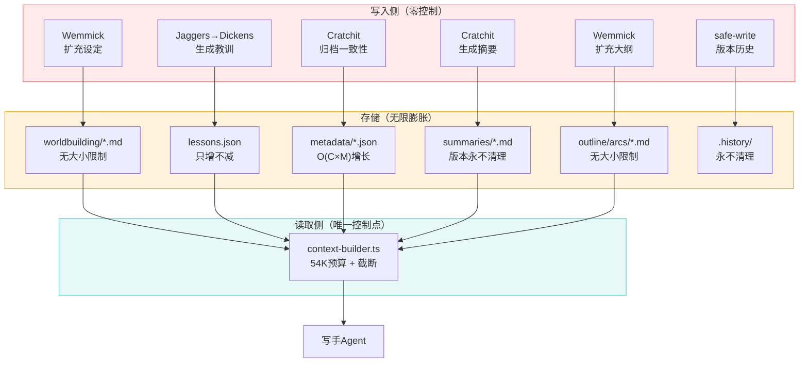
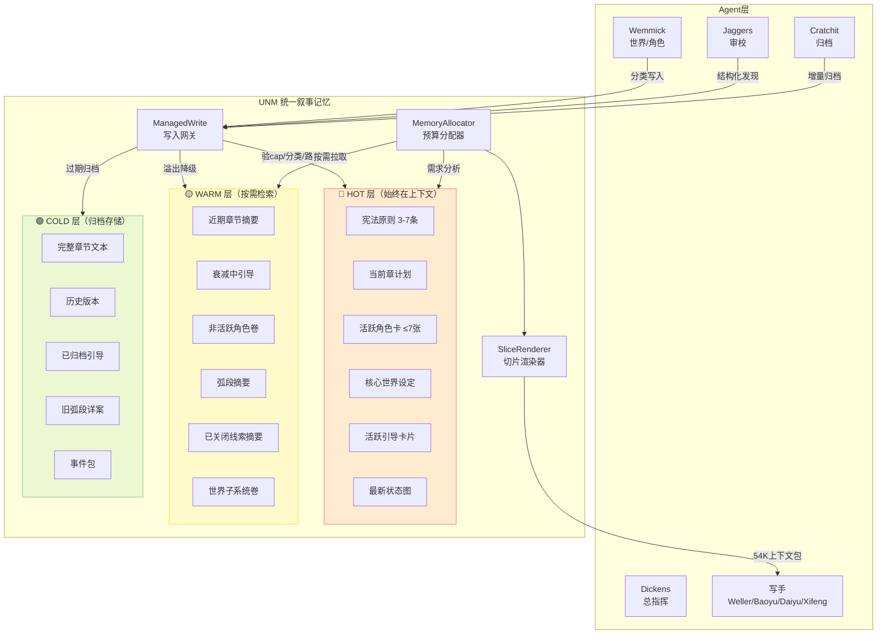
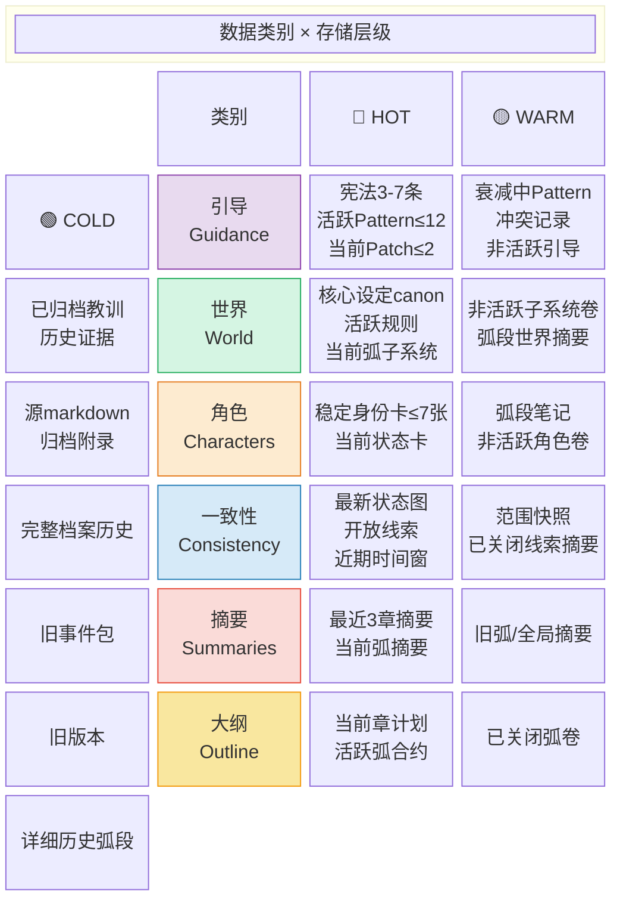
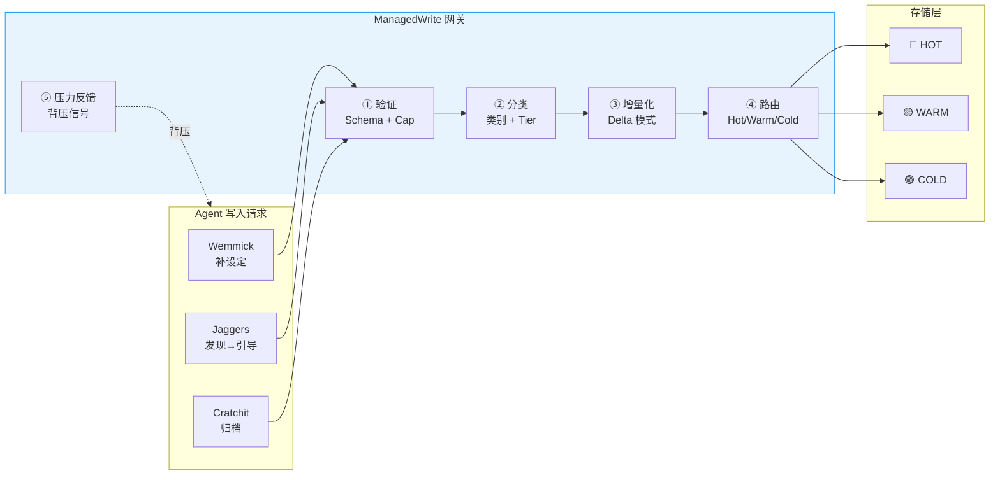
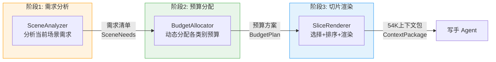
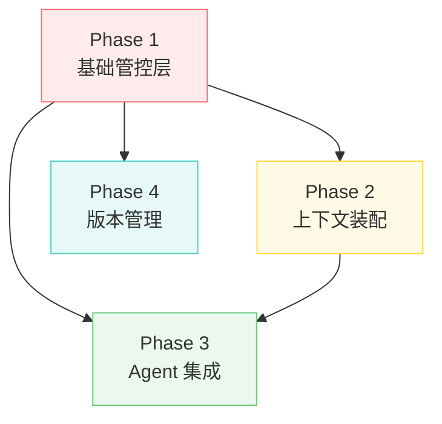

# Dickens 统一叙事记忆（UNM）—— 完全重设计方案

> **文档版本**: v2.0
> **日期**: 2026-04-12
> **前身**: BGM（有限引导记忆）v1.1 — 已被本方案吸收
> **状态**: 设计评审

---

## 目录

1. [问题全景](#1-问题全景)
2. [设计哲学与学术基础](#2-设计哲学与学术基础)
3. [系统架构总览](#3-系统架构总览)
4. [数据类别分类学](#4-数据类别分类学)
5. [存储层：写时控制](#5-存储层写时控制)
6. [上下文装配重设计：需求→分配→渲染](#6-上下文装配重设计需求分配渲染)
7. [各类别增长控制策略](#7-各类别增长控制策略)
8. [Agent集成改造](#8-agent集成改造)
9. [螺旋检测与恢复](#9-螺旋检测与恢复)
10. [实现计划](#10-实现计划)
11. [迁移策略](#11-迁移策略)
12. [学术引用与参考实现](#12-学术引用与参考实现)

---

## 1. 问题全景

### 1.1 单一控制点的脆弱性

当前系统有且仅有一个控制点：`context-builder.ts` 的 54K 字符预算 + 读时截断。
**所有6个数据子系统的写入侧完全没有增长控制。**



### 1.2 六条数据增长链路诊断

| # | 链路 | 写入增长模式 | 读取控制 | 风险等级 |
|---|------|------------|---------|---------|
| 1 | 审校→教训→写手 | 无限增长，只增不减 | P0/P1 2000c | 🔴 已确认 |
| 2 | 质检→Wemmick补设定→写手 | 无限增长，无文件大小限制 | P0 3000c + P1 4200c | 🔴 高 |
| 3 | 归档→一致性追踪→写手 | O(C×M)二次增长，永不删除 | P1 各种截断(latest-only) | 🟠 中高 |
| 4 | 归档→摘要→写手 | 线性增长 + 版本历史永不清理 | P0 最近3章 + P2 弧段/全局 | 🟡 中 |
| 5 | 质检→Wemmick扩大纲→写手 | 弧段计划无限膨胀 | P0 当前章计划 | 🟡 中 |
| 6 | 所有写入→版本历史 | 完整副本永不清理 | 不注入 | 🟡 磁盘膨胀 |

### 1.3 第1章实证数据

**字数变化时间线**：

| 时间 | 事件 | 内容字数 | 驱动因素 |
|------|------|---------|---------|
| v1 (4/11 15:21) | 宝玉首稿 | 8,045 | 目标 8000-10000字 |
| v2 (4/11 15:53) | 大幅删减 | 3,677 | 审校退回重写 |
| v3 (4/11 18:53) | 重写恢复 | 5,924 | 重写 |
| 4/12 03:17 | **用户主动降目标** | — | "字数太长了，只写5000字" |
| v4 (4/12 05:03) | daiyu重写 | 5,869 | 目标调至 5000-6000字 |
| v5 (4/12 06:38) | baoyu重写 | 5,860 | 审校退回换写手 |
| v6 (4/12 12:20) | baoyu修订 | 4,998 | 审校循环持续编辑 |
| 当前 (edit v7-v41) | 局部编辑 | 2,766 | Jaggers多轮退回→清理 |

**关键区分**：8,045→5,869 = 用户主动决策；5,869→2,766 = **系统退化**（目标5000字下缩水53%）

**其他退化指标**：教训25条/19active/14must-fix；矛盾对2组；v6后35次编辑未触发版本记录

---

## 2. 设计哲学与学术基础

### 2.1 核心理念

> **从"读时截断"到"写时管控+智能装配"：每个数据源都有预算、衰减、和竞争机制。上下文不是装满就好，而是装对。**

### 2.2 五条铁律

| # | 铁律 | 来源 |
|---|------|------|
| 1 | **写时有门，读时有选** | 存储层强制cap + 上下文层智能选择 |
| 2 | **记忆必须竞争** | 0-1背包模型：value/cost排序，贪心装填 |
| 3 | **遗忘是功能** | EvoClaw衰减：score = exp(-age/30) × (1+0.1×access) |
| 4 | **位置即权重** | Lost-in-Middle：关键信息放首尾，避免中间死区 |
| 5 | **正向胜过禁令** | Semantic Gravity Wells：87.5%否定约束反向激活 |

### 2.3 学术验证矩阵

| 论文/系统 | 核心发现 | 在UNM中的应用 |
|----------|---------|-------------|
| **PageIndex** (VectifyAI, 23.9K⭐) | LLM推理式树导航，无向量DB，JSON | 类别索引树导航 |
| **TierMem** (arXiv 2602.17913) | 双层溯源记忆，sufficiency check | hot/warm分层 + 按需升级 |
| **contextweaver** (GitHub dgenio) | 8阶段预算感知装配 | 需求→分配→渲染管线 |
| **A-MEM** (NeurIPS 2025) | Zettelkasten笔记+自动链接 | 结构化记忆演化 |
| **EvoClaw** | 衰减×强化评分，阈值分层 | 引导卡片衰减公式 |
| **AdaGReS** (arXiv 2512.25052) | 冗余感知选择，自适应β | 去重打分 |
| **Lost-in-Middle** (arXiv 2603.10123) | U型注意力是架构固有 | bracket定位策略 |
| **BACM** (arXiv 2604.01664) | RL预算感知压缩 | 动态预算分配 |
| **Self-Refine** (NeurIPS 2023) | 迭代修正2-3轮后收益递减 | 重写次数硬上限 |
| **IFScale** (2025) | 500条指令准确率仅68% | 引导数量硬上限 |
| **Constitutional AI** (Anthropic) | 规则列表→培养判断力 | 宪法层设计 |
| **Novel-OS/StoryDaemon/Postwriter** | 文件+JSON是主流方向 | 架构验证 |
| **CrewAI** (2026.02重构) | 从分散→统一Memory类 | UNM统一方向验证 |

---

## 3. 系统架构总览

### 3.1 UNM三层架构



### 3.2 与现有目录的关系

UNM是现有文件之上的**管控层**，不替换底层存储：

```
项目目录/
├── worldbuilding/          ← 仍是Wemmick写入的源文件
├── characters/             ← 仍是角色档案源文件
├── outline/                ← 仍是大纲源文件
├── summaries/              ← 仍是摘要源文件
├── metadata/               ← 仍是一致性数据源文件
├── chapters/               ← 仍是章节文本
│
└── memory/                 ← 【新增】UNM管控层
    ├── manifest.json       ← 全局清单：类别→文件→tier映射
    ├── budgets.json        ← 预算配置：floor/target/ceiling
    ├── policies.json       ← 各类别增长策略
    ├── hot/                ← 规范化热数据索引
    │   ├── guidance.json
    │   ├── world.json
    │   ├── characters.json
    │   ├── consistency/
    │   │   ├── current-states.json
    │   │   ├── current-relationships.json
    │   │   ├── open-threads.json
    │   │   └── timeline-window.json
    │   ├── summaries.json
    │   └── outline.json
    ├── warm/               ← 压缩/非活跃数据
    │   ├── guidance-inactive.json
    │   ├── world-rollups.json
    │   ├── character-rollups.json
    │   ├── arc-digests.json
    │   └── consistency-snapshots/
    ├── cold/               ← 归档索引
    │   ├── archive-index.json
    │   └── event-packs/
    └── reports/            ← 可观测性
        ├── pressure.json
        └── last-context.json
```

### 3.3 核心原则

| 原则 | 说明 |
|------|------|
| **规范与历史分离** | 写手读小型规范索引；完整历史留在文件系统但不在热路径上 |
| **一个分配器，多个策略** | 预算全局统一，但每类别有自己的留存/压缩/衰减规则 |
| **写时强制** | 增长在写入时控制，不仅在上下文装配时 |
| **晋升优于累积** | 新数据默认warm；只有经证明或当前相关的才晋升到hot |
| **增量状态，定期压实** | 不再每章全量重建；增量更新+定期快照 |

---

## 4. 数据类别分类学

### 4.1 记忆切片：统一数据单元

所有类别对外暴露统一的 **MemorySlice** 接口：

```typescript
interface MemorySlice {
  id: string
  category: 'guidance' | 'world' | 'characters' | 'consistency'
              | 'summaries' | 'outline'
  entityId?: string              // 实体ID（角色ID、线索ID等）
  scope: 'global' | 'arc' | 'chapter' | 'character' | 'location'
  stability: 'stable' | 'volatile'
  tier: 'hot' | 'warm' | 'cold'
  priorityFloor: number          // 最低保证优先级
  freshness: number              // 0..1，衰减后的新鲜度
  relevanceTags: string[]        // 场景/角色/地点标签
  charCount: number              // 实际字符数
  text: string                   // 渲染后的文本
  sourceRefs: string[]           // 溯源：来自哪些文件/章节
}
```

### 4.2 类别×层级矩阵



### 4.3 BGM在UNM中的位置

原BGM方案完整保留，作为**引导类别策略(GuidanceCategoryPolicy)**：

| BGM概念 | UNM映射 |
|---------|---------|
| Constitution（宪法） | hot引导，pinned |
| Pattern（模式） | hot/warm引导，衰减+冷却 |
| Patch（补丁） | hot引导，通过即消失 |
| 冲突检测 | 引导类别特有行为 |
| 螺旋检测 | 全局恢复系统（扩展到所有类别） |
| 否定转正向 | 引导类别写入网关规则 |

---

## 5. 存储层：写时控制

> **核心创新**：调研的所有长篇写作系统（InkOS、Novel-OS、StoryDaemon、Postwriter、SCORE、DOME）均无"写入时主动控制增长"机制。全部依赖读时截断或被动审计。ManagedWrite 网关是 UNM 的核心创新。

### 5.1 ManagedWrite 网关

所有 Agent 写入必须经过 ManagedWrite 网关。网关在数据**落盘前**执行验证、分类、路由。



#### 5.1.1 五阶段管线

| 阶段 | 职责 | 失败策略 |
|------|------|---------|
| **① 验证** | Zod Schema 校验 + 字符数上限检查 | 拒绝写入，返回错误原因 |
| **② 分类** | 根据内容确定 category + 初始 tier | 无法分类→降级为 WARM |
| **③ 增量化** | JSON Delta 输出（参考 InkOS v0.6） | Delta 失败→回退全量写入 |
| **④ 路由** | 根据类别策略决定目标 tier | Hot 已满→降级 Warm |
| **⑤ 压力反馈** | 当类别接近 ceiling 时发出背压信号 | 告警但不阻塞 |

#### 5.1.2 WriteRequest 接口

```typescript
interface WriteRequest {
  source: AgentId                    // 发起写入的 Agent
  category: SliceCategory            // 目标类别
  operation: 'create' | 'update' | 'merge' | 'promote' | 'demote'
  entityId?: string                  // 实体ID（角色、线索等）
  payload: {
    delta?: JsonPatch[]              // RFC 6902 增量（优先）
    full?: string                    // 全量内容（回退方案）
  }
  metadata: {
    chapterRef?: number              // 关联章节
    reason: string                   // 写入原因（审计用）
    urgency: 'immediate' | 'normal' | 'deferred'
  }
}

interface WriteResult {
  accepted: boolean
  sliceId?: string                   // 写入成功时返回
  tier: 'hot' | 'warm' | 'cold'     // 实际落地层级
  pressure: PressureReport           // 当前类别压力
  rejectionReason?: string           // 拒绝原因
}
```

#### 5.1.3 Cap 验证规则

每个类别有三级预算线：

```typescript
interface CategoryBudget {
  floor: number      // 最低保障（字符数），低于此值不触发任何限制
  target: number     // 目标值，正常运行区间
  ceiling: number    // 硬上限，超过即拒绝写入
}
```

| 类别 | Floor | Target | Ceiling | 依据 |
|------|-------|--------|---------|------|
| guidance | 1,000 | 3,000 | 5,000 | IFScale: ≤12条活跃引导 |
| world | 2,000 | 6,000 | 10,000 | 核心设定需完整保留 |
| characters | 3,000 | 8,000 | 12,000 | ≤7张活跃角色卡×~1500c |
| consistency | 2,000 | 5,000 | 8,000 | 状态图+开放线索 |
| summaries | 2,000 | 6,000 | 10,000 | 近3章+弧段摘要 |
| outline | 1,000 | 3,000 | 5,000 | 当前章+活跃弧合约 |

**注意**：Cap 仅针对 Hot 层。Warm/Cold 层使用磁盘空间管理，不参与字符预算。

#### 5.1.4 Delta 模式（参考 InkOS v0.6）

InkOS 在 v0.6 解决上下文膨胀的核心转变：从全量 markdown 到 JSON delta。ManagedWrite 采用同一思路：

```typescript
// Agent 提交增量变更
const writeReq: WriteRequest = {
  source: 'cratchit',
  category: 'consistency',
  operation: 'update',
  entityId: 'char-lin-yi',
  payload: {
    delta: [
      { op: 'replace', path: '/location', value: '星港码头' },
      { op: 'add', path: '/relationships/zhao-ming', value: '盟友（第12章后）' },
      { op: 'remove', path: '/temporaryStates/injured' }
    ]
  },
  metadata: {
    chapterRef: 12,
    reason: '第12章归档：林逸转移阵地，与赵明结盟，伤势痊愈',
    urgency: 'normal'
  }
}
```

**全量回退**：当 delta 无法描述变更（如角色卡首次创建、大段文本重写）时使用 `payload.full`。

#### 5.1.5 背压机制

当某类别的 Hot 层使用率超过阈值时，ManagedWrite 发出背压信号：

| 使用率 | 状态 | 行为 |
|--------|------|------|
| < 70% target | 🟢 正常 | 无限制 |
| 70-100% target | 🟡 注意 | 日志告警 |
| 100% target - ceiling | 🟠 压力 | 触发 Warm 降级，提示 Agent 精简 |
| ≥ ceiling | 🔴 满载 | 拒绝写入，强制降级最低优先级 slice |

**降级决策**：当需要从 Hot 降级 slice 到 Warm 时，选择 `freshness` 最低且 `priorityFloor` 最低的 slice。pinned 的 slice（如宪法层）不参与降级。

### 5.2 版本管理层

#### 5.2.1 架构选型

基于调研报告 Part C 的对比（Event Sourcing / Snapshot+WAL / CRDT / Git-like / 应用快照），选择 **Git-like + 应用层快照** 方案：

| 需求 | Git-like 满足情况 |
|------|-------------------|
| 跨文件原子提交 | ✅ commit 天然保证章节+metadata 同步 |
| 分支模型 | ✅ 重写分支、实验分支 |
| 完整历史 | ✅ 可回溯任意 commit |
| 增量存储 | ✅ Git pack 机制 |
| 与 Dickens 文件架构兼容 | ✅ 直接操作现有文件目录 |

**不选 CRDT 的原因**：Dickens 是单 Agent 主导的顺序写入系统，CRDT 的并发合并能力是不必要的复杂度。

#### 5.2.2 提交策略

```typescript
interface CommitPolicy {
  // 自动提交触发点
  triggers: {
    chapterComplete: true       // 章节写完+审校通过
    arcComplete: true           // 弧段结束
    preRewrite: true            // 重写前自动备份
    preDangerousOp: true        // 危险操作前（批量删除、合并等）
  }
  // 提交格式
  messageFormat: '[{agent}] {action}: {description}'
  // 标签策略
  tagging: {
    chapterDone: 'chapter-{N}-done'       // 每章完成
    arcDone: 'arc-{N}-done'               // 每弧完成
    snapshot: 'snapshot-{timestamp}'       // 手动快照
  }
}
```

#### 5.2.3 回退操作

**章节级回退**（最常见场景：重写某章）：

```
1. 创建备份分支：rewrite-ch{N}-{timestamp}
2. git checkout chapter-{N-1}-done -- chapters/ metadata/ memory/
3. 重建 memory/hot/ 索引（从 metadata 重新计算）
4. 标记 chapter N 及之后的摘要、状态为 stale
```

**弧段级回退**（少见场景：整弧推翻重来）：

```
1. 创建备份分支：rewrite-arc{N}-{timestamp}
2. git checkout arc-{N-1}-done -- .
3. 完整重建 memory/ 层（从源文件重新装配）
```

**关键约束**：回退时 metadata（一致性追踪、角色状态、线索）必须同步回退。这正是当前系统的致命缺陷——`safe-write` 只管文件字节数，不管跨文件一致性。Git-like 方案通过原子 commit 天然解决此问题。

### 5.3 版本历史清理

当前系统的 `.history/` 目录永不清理（链路6），磁盘膨胀。UNM 用 Git pack + 清理策略替代：

| 策略 | 触发条件 | 行为 |
|------|----------|------|
| **Git GC** | 每 10 章或手动 | `git gc --aggressive`，压缩 loose objects |
| **旧分支清理** | 弧段完成时 | 删除已合并的重写分支 |
| **快照保留** | 始终保留 | 弧段快照永久保留，章节快照保留最近 2 弧 |

---

## 6. 上下文装配重设计：需求→分配→渲染

> 参考 contextweaver 的 8 阶段管线（调研报告 A3），简化为 3 阶段。核心目标：从"装满 54K"到"装对 54K"。

### 6.1 三阶段管线总览



### 6.2 阶段1：需求分析（SceneAnalyzer）

分析当前章节计划，输出场景需求清单：

```typescript
interface SceneNeeds {
  chapterNumber: number
  sceneType: 'action' | 'dialogue' | 'introspection' | 'worldbuilding' | 'flashback'

  // 需要哪些实体
  requiredCharacters: string[]      // 本章出场角色ID
  requiredLocations: string[]       // 本章场景地点
  requiredThreads: string[]         // 本章推进的线索ID

  // 需要哪些记忆类别的深度
  categoryWeights: {
    guidance: number      // 0-1，引导需求强度
    world: number         // 0-1，世界设定需求
    characters: number    // 0-1，角色信息需求
    consistency: number   // 0-1，一致性检查需求
    summaries: number     // 0-1，前文回顾需求
    outline: number       // 0-1，大纲参照需求
  }

  // 特殊标记
  isArcBoundary: boolean            // 弧段边界章节
  isMidNarrative: boolean           // 叙事中部（ConStory-Bench：错误集中区）
  recentConflicts: string[]         // 近期发现的一致性问题
}
```

**场景类型对预算的影响**：

| 场景类型 | 角色权重↑ | 世界权重↑ | 一致性权重↑ | 摘要权重↑ |
|---------|----------|----------|-----------|----------|
| action | 高 | 中 | 高 | 低 |
| dialogue | 高 | 低 | 中 | 中 |
| introspection | 中 | 低 | 低 | 高 |
| worldbuilding | 低 | 高 | 中 | 低 |
| flashback | 中 | 中 | 高 | 高 |

**中部增强**：当 `isMidNarrative=true` 时（基于 ConStory-Bench 发现：错误集中在叙事中部），自动提升 consistency 权重 20%。

### 6.3 阶段2：预算分配（BudgetAllocator）

将 54K 总预算分配给各类别：

```typescript
interface BudgetPlan {
  totalBudget: number               // 54,000 字符
  systemReserve: number             // 系统保留（prompt模板等）~4,000c
  availableBudget: number           // 可分配预算 ~50,000c

  allocations: Record<SliceCategory, {
    budget: number                  // 分配字符数
    priority: 'required' | 'preferred' | 'optional'
    maxSlices: number               // 最多选取几个 slice
  }>
}
```

#### 6.3.1 分配算法

分两轮分配：

**第一轮：保障分配**（确保每个类别的最低需求）

| 类别 | 最低保障 | 说明 |
|------|----------|------|
| guidance | 2,000c | 宪法层 + 最高优先级引导 |
| outline | 1,500c | 当前章计划（不可缺少） |
| characters | 2,000c | 至少主角卡 |
| summaries | 1,500c | 至少最近1章摘要 |
| consistency | 1,000c | 最新状态图（精简版） |
| world | 1,000c | 核心设定摘要 |

第一轮合计：~9,000c，剩余 ~41,000c 进入第二轮。

**第二轮：竞争分配**（基于 SceneNeeds 的权重）

```
剩余预算 × categoryWeights[cat] / sum(categoryWeights) → 各类别追加预算
```

类似 0-1 背包的贪心策略：每个 slice 有 value（relevance × freshness）和 cost（charCount），按 value/cost 降序装填。

#### 6.3.2 动态调整（参考 BACM）

预算分配不是一次性的。在渲染阶段如果发现某类别的高价值 slice 被截断，可以向 BudgetAllocator 申请二次分配：

```typescript
interface ReallocationRequest {
  fromCategory: SliceCategory       // 从哪个类别借
  toCategory: SliceCategory         // 借给哪个类别
  amount: number                    // 字符数
  justification: string             // 原因
}
```

约束：任何类别不得低于最低保障线。

### 6.4 阶段3：切片渲染（SliceRenderer）

从 Hot/Warm 层选择 slice，排序，渲染为最终上下文文本。

#### 6.4.1 选择策略

**Hot 层**：直接选取，按 `priorityFloor` 排序。

**Warm 层按需拉取**（参考 TierMem 的 Sufficiency Check）：

```typescript
// 当 Hot 层某类别不足以满足 SceneNeeds 时
function pullFromWarm(category: SliceCategory, needs: SceneNeeds): MemorySlice[] {
  const warmSlices = getWarmSlices(category)

  // 双路检索（参考 SCORE 的 Hybrid Retrieval）
  const byKeyword = keywordMatch(warmSlices, needs)       // TF-IDF
  const bySemantic = semanticMatch(warmSlices, needs)      // 语义相似度
  const merged = mergeAndDedup(byKeyword, bySemantic)      // 合并去重

  return merged.slice(0, needs.maxPullCount)
}
```

#### 6.4.2 位置优化（Lost-in-Middle 对策）

基于调研报告 A7 的发现：U 型注意力是 Transformer 架构的固有特性。

**Bracket 定位策略**：

```
┌─────────────────────────────────────────┐
│ 🔴 首部高注意力区（前 ~10%）              │
│   • 宪法层引导（pinned, 最高优先级）      │
│   • 当前章计划                            │
│   • 核心一致性约束（如已知矛盾警告）       │
├─────────────────────────────────────────┤
│ 🟡 中部低注意力区（中间 ~80%）            │
│   • 角色卡片                              │
│   • 世界设定                              │
│   • 前文摘要                              │
│   • Warm 层补充数据                       │
├─────────────────────────────────────────┤
│ 🔴 尾部高注意力区（后 ~10%）              │
│   • 活跃引导卡片（Pattern + Patch）        │
│   • 未解线索提醒                          │
│   • 场景情绪/节奏指示                     │
└─────────────────────────────────────────┘
```

#### 6.4.3 去重（参考 AdaGReS）

渲染前对候选 slice 集执行冗余检测：

```typescript
function dedup(slices: MemorySlice[]): MemorySlice[] {
  const result: MemorySlice[] = []
  for (const slice of slices) {
    const maxSimilarity = result.reduce(
      (max, existing) => Math.max(max, cosineSimilarity(slice, existing)),
      0
    )
    if (maxSimilarity < DEDUP_THRESHOLD) {  // 0.85
      result.push(slice)
    } else {
      // 保留 priorityFloor 更高的那个
      // 另一个降权或丢弃
    }
  }
  return result
}
```

#### 6.4.4 渲染输出

最终输出 `ContextPackage`，包含渲染后的文本和元数据：

```typescript
interface ContextPackage {
  renderedText: string              // 最终上下文文本，≤54K
  totalChars: number
  sliceManifest: {                  // 溯源清单
    category: SliceCategory
    sliceId: string
    tier: 'hot' | 'warm'
    charCount: number
    position: 'head' | 'body' | 'tail'
  }[]
  pressure: {                       // 各类别压力快照
    [cat in SliceCategory]: {
      used: number
      budget: number
      droppedSlices: number         // 因预算不足被丢弃的 slice 数
    }
  }
}
```

`sliceManifest` 存入 `memory/reports/last-context.json`，用于：
- 事后分析（哪些记忆影响了写手输出）
- 调优预算分配参数
- 审计追踪

---

## 7. 各类别增长控制策略

> 每个类别有独立的留存、压缩、衰减、淘汰规则。共用 ManagedWrite 网关和三层存储基础设施。

### 7.1 引导类别（Guidance）

**来源**：BGM 有限引导记忆方案（完整保留为 GuidanceCategoryPolicy）。

#### 7.1.1 三级引导结构

| 级别 | 类型 | 生命周期 | Hot 上限 | 衰减 |
|------|------|---------|---------|------|
| **L0 宪法** | Constitution | 永驻 | 3-7 条 | 无（pinned） |
| **L1 模式** | Pattern | 衰减制 | ≤12 条 | EvoClaw: exp(-age/30)×(1+0.1×access) |
| **L2 补丁** | Patch | 即用即弃 | ≤2 条 | 通过即删除 |

**总量硬限制**：Hot 层活跃引导 ≤ 12+2 条（IFScale 研究：500条指令准确率仅 68%，12 条是安全阈值）。

#### 7.1.2 写入规则

```typescript
interface GuidanceWritePolicy {
  // 否定转正向（Semantic Gravity Wells: 87.5% 反向激活率）
  requirePositiveFraming: true

  // 冲突检测：新引导不能与已有引导语义矛盾
  conflictCheck: {
    enabled: true
    threshold: 0.75           // 语义相似度阈值
    onConflict: 'reject-newer-and-report'
  }

  // Pattern 合并：相似引导自动合并而非累积
  mergePolicy: {
    similarityThreshold: 0.8  // 超过此值视为重复
    action: 'merge-keep-stronger'
  }

  // 衰减参数
  decay: {
    formula: 'evoclaw'        // exp(-age/λ) × (1 + μ × accessCount)
    lambda: 30                // 衰减常数（章节数）
    mu: 0.1                   // 强化权重
    coldThreshold: 0.2        // 低于此值从 Hot→Warm
    archiveThreshold: 0.05    // 低于此值从 Warm→Cold
  }
}
```

#### 7.1.3 生命周期流转

```
新发现 → ManagedWrite → 冲突检测 → 否定转正向
  ↓                              ↓
  通过 → Hot(Pattern)          冲突 → 报告给 Dickens
  ↓
  使用中 → accessCount++, freshness刷新
  ↓
  衰减中 → freshness < 0.2 → 降级 Warm
  ↓
  休眠中 → freshness < 0.05 → 归档 Cold
```

### 7.2 世界类别（World）

#### 7.2.1 分层存储

| 层级 | 内容 | 特点 |
|------|------|------|
| **Hot** | 核心设定 canon + 当前弧活跃子系统 | stability=stable, 极少变更 |
| **Warm** | 非活跃子系统卷 + 弧段世界摘要 | 按需拉取 |
| **Cold** | 完整源 markdown + 归档附录 | 仅回溯用 |

#### 7.2.2 增长控制

**核心问题**：链路2（质检→Wemmick补设定→写手）是 🔴 高风险。Wemmick 倾向于每次质检反馈都扩充设定。

```typescript
interface WorldWritePolicy {
  // Canon 保护：标记为 canon 的设定不可修改，只能追加注释
  canonProtection: true

  // 子系统字符上限
  subsystemCeiling: 3000        // 每个子系统（力量体系、社会结构等）≤3000c

  // 新增规则验证
  loreConflictCheck: {
    enabled: true               // 参考 StoryDaemon 的 Lore 矛盾检测
    compareWith: 'canon-only'   // 只和 canon 对比，不和附录对比
  }

  // 压缩策略
  compression: {
    trigger: 'subsystem > 80% ceiling'
    method: 'llm-summarize'     // LLM 压缩非核心细节
    preserveCanon: true         // 永远保留 canon 原文
  }
}
```

**Wemmick 写入限制**：单次质检反馈最多新增 500c 设定。超出需 Dickens 审批。

### 7.3 角色类别（Characters）

#### 7.3.1 角色卡结构

每个角色卡包含两部分：

```typescript
interface CharacterCard {
  // 稳定身份（很少变更）
  identity: {
    name: string
    coreTraits: string[]        // 核心人格特质 ≤5条
    background: string          // 背景摘要 ≤500c
    voiceSignature: string      // 语言风格标识 ≤200c
  }

  // 动态状态（每章可能变更）
  currentState: {
    location: string
    emotionalState: string
    activeGoals: string[]
    recentActions: string[]     // 最近3章的关键行动
    relationships: Record<string, string>  // 与其他角色的关系
    arcStage: string            // 参考 Novel-OS: arc_stage
  }
}
```

#### 7.3.2 增长控制

| 控制点 | 策略 | 依据 |
|--------|------|------|
| **活跃角色上限** | Hot 层 ≤7 张 | 认知负荷研究：7±2 |
| **角色卡字符上限** | identity ≤1000c, currentState ≤500c | 总计 ~1500c/角色 |
| **非活跃角色处理** | 降级 Warm，压缩为 200c 摘要卡 | 按需拉取完整卡 |
| **关系图精简** | 只保留与当前章角色有直接关系的 | 间接关系降级 Warm |

**角色活跃度判定**：

```typescript
function isActive(charId: string, chapter: number): boolean {
  return (
    appearsInCurrentChapter(charId) ||
    appearsInNextChapterPlan(charId) ||
    hasOpenThreadWith(charId, activeThreads) ||
    lastAppearance(charId) <= chapter - 3  // 3章内出场过
  )
}
```

### 7.4 一致性类别（Consistency）

#### 7.4.1 数据组成

| 数据类型 | Hot 策略 | 增长模式 |
|---------|----------|---------|
| **角色状态图** | 仅活跃角色的当前状态 | 替换式更新（非累积） |
| **开放线索** | 仅 open/progressing 状态 | 参考 InkOS hookAgenda |
| **关系图谱** | 仅活跃角色间的关系 | 增量更新 |
| **时间线窗口** | 最近 5 章的时间线事件 | 滑动窗口 |

#### 7.4.2 伏笔治理（参考 InkOS hookAgenda）

```typescript
interface PlotThread {
  id: string
  name: string
  status: 'open' | 'progressing' | 'deferred' | 'resolved' | 'abandoned'
  priority: number                   // 1-5
  createdChapter: number
  lastAdvancedChapter: number        // InkOS 创新：追踪最后推进章节
  mentionCount: number
  plannedResolutionArc?: number

  // Dormant debt 检测
  dormantChapters: number            // = currentChapter - lastAdvancedChapter
  isDormant: boolean                 // dormantChapters > 10
}
```

**Dormant Debt 处理**：

| 休眠章节数 | 状态 | 行为 |
|-----------|------|------|
| 1-5 | 正常 | 无动作 |
| 6-10 | 注意 | 在 SliceRenderer 输出中提示写手 |
| 11-15 | 告警 | 标记 isDormant，提升到 Hot 层提醒 |
| > 15 | 危险 | 报告给 Dickens，建议 resolve 或 abandon |

#### 7.4.3 O(C×M) 增长控制

当前系统的链路3（归档→一致性追踪→写手）呈 O(C×M) 二次增长（C=章节数，M=追踪实体数）。

**控制策略**：

1. **替换式更新**：角色状态是"当前快照"，不是"历史日志"。每次归档替换而非追加。
2. **滑动窗口**：时间线事件只保留最近 N 章（Hot N=5，Warm N=当前弧）。
3. **已关闭线索压缩**：resolved/abandoned 的线索从 Hot 中移除，压缩为一行摘要存入 Warm。
4. **事件包归档**：每弧结束时将该弧所有事件打包存入 Cold（event-packs/）。

### 7.5 摘要类别（Summaries）

#### 7.5.1 分层摘要结构

| 层级 | 粒度 | Hot 保留 | Warm 保留 |
|------|------|---------|----------|
| **L1 章节摘要** | 每章 500-800c | 最近 3 章 | 当前弧其余章节 |
| **L2 弧段摘要** | 每弧 1000-1500c | 当前弧 | 前 2 弧 |
| **L3 全书概要** | 全书 800-1200c | 始终 | — |

#### 7.5.2 增长控制

```typescript
interface SummaryWritePolicy {
  // 章节摘要字符上限
  chapterSummaryCeiling: 800        // RecurrentGPT 启发：硬限制防膨胀

  // 弧段摘要必须包含
  arcSummaryRequired: [
    'key-plot-events',
    'character-arc-changes',
    'unresolved-threads',
    'world-state-changes'
  ]

  // 压缩策略
  rollingCompression: {
    trigger: 'arc-complete'
    method: 'hierarchical'          // L1 摘要压缩进 L2
    retainOriginal: 'warm'          // 原始 L1 降级 Warm
  }

  // 版本清理
  versionRetention: {
    latestVersions: 2               // 每个摘要只保留最新 2 个版本
    olderVersions: 'cold'           // 更旧版本归档 Cold
  }
}
```

**关键改进**：当前系统的摘要版本永不清理（链路4）。UNM 限制为保留最新 2 个版本，旧版本归档 Cold。

### 7.6 大纲类别（Outline）

#### 7.6.1 Hot 层内容

| 内容 | 字符限制 | 更新频率 |
|------|----------|---------|
| **当前章计划** | ≤1500c | 每章 |
| **活跃弧合约** | ≤1000c | 每弧开始时 |
| **下一章预告** | ≤500c | 每章（可选） |

#### 7.6.2 增长控制

**链路5（质检→Wemmick扩大纲→写手）的控制**：

```typescript
interface OutlineWritePolicy {
  // 弧段计划字符上限
  arcPlanCeiling: 3000              // 每弧段详细计划 ≤3000c

  // Wemmick 单次扩展上限
  singleExpansionLimit: 500         // 单次质检反馈最多扩展 500c

  // 已完成章节的计划清理
  completedChapterPlanRetention: 'warm'  // 完成后从 Hot 移入 Warm

  // 已完成弧段的计划清理
  completedArcPlanRetention: 'cold'      // 弧段结束后归档 Cold
}
```

### 7.7 类别控制总览

```
┌──────────────────────────────────────────────────────────┐
│                    ManagedWrite 网关                       │
│  ┌─────────┬─────────┬─────────┬─────────┬──────┬──────┐ │
│  │Guidance │ World   │Character│Consist. │Summary│Outline│ │
│  │≤12+2条  │≤3000c/  │≤7张     │替换式   │≤800c/│≤1500c│ │
│  │衰减制   │子系统   │1500c/张 │滑动窗口 │章     │/章    │ │
│  │正向表述  │canon    │活跃度   │伏笔     │2版本  │弧段   │ │
│  │冲突检测  │保护     │判定     │状态机   │保留   │上限   │ │
│  └─────────┴─────────┴─────────┴─────────┴──────┴──────┘ │
│                                                           │
│  共性：Cap验证 → Delta模式 → Tier路由 → 背压反馈          │
└──────────────────────────────────────────────────────────┘
```

---

## 8. Agent 集成改造

> 每个 Agent 的写入行为都需要适配 ManagedWrite 网关。本节定义各 Agent 的改造要点。

### 8.1 Agent-类别写入矩阵

| Agent | 可写类别 | 写入频率 | 风险等级 |
|-------|---------|---------|---------|
| **Wemmick** | world, characters, outline | 质检后 + 设计阶段 | 🔴 高（链路2,5） |
| **Jaggers** | guidance (发现→引导) | 每次审校 | 🔴 高（链路1） |
| **Cratchit** | consistency, summaries | 每章归档 | 🟠 中高（链路3,4） |
| **Dickens** | outline (总指挥决策) | 弧段规划 | 🟢 低 |
| **写手** | — (只读消费上下文) | — | — |

### 8.2 Wemmick 改造

**当前问题**：质检反馈触发无限制设定扩充（链路2）和大纲膨胀（链路5）。

**改造要点**：

```typescript
// Wemmick 写入请求示例
const wemmickWrite: WriteRequest = {
  source: 'wemmick',
  category: 'world',
  operation: 'update',
  entityId: 'power-system',
  payload: {
    delta: [
      { op: 'add', path: '/rules/-', value: '灵力消耗与情绪波动成正比' }
    ]
  },
  metadata: {
    chapterRef: 15,
    reason: 'Jaggers审校发现第15章力量体系描述模糊，补充具体规则',
    urgency: 'normal'
  }
}
```

**限制清单**：

| 限制 | 值 | 触发条件 |
|------|-----|---------|
| 单次设定扩充 | ≤500c | 每次质检反馈 |
| 单次大纲扩展 | ≤500c | 每次质检反馈 |
| 新角色创建 | 需 Dickens 审批 | 任何时候 |
| Canon 修改 | 禁止 | 任何时候 |
| 子系统扩充 | 检查 ceiling | 每次写入 |

### 8.3 Jaggers 改造

**当前问题**：审校发现转化为教训（链路1），25 条教训 / 19 active / 14 must-fix 已超出模型承载能力。

**改造要点**：

```typescript
// Jaggers 审校发现的结构化输出
interface JaggersFinding {
  type: 'pattern' | 'patch' | 'conflict'
  severity: 'critical' | 'major' | 'minor'
  description: string             // 正向表述（ManagedWrite 强制）
  evidence: string                // 来自章节文本的具体证据
  suggestedGuidance: string       // 建议添加的引导（≤200c）
}
```

**转化流程**：

```
Jaggers 审校 → 结构化发现 → ManagedWrite 网关
  ↓
  severity=critical → 尝试写入 Hot(Patch)，通过即删
  severity=major → 尝试写入 Hot(Pattern)，衰减制
  severity=minor → 仅记录日志，不写入引导
  ↓
  冲突检测 → 与已有引导重复？→ 合并或拒绝
  Cap 检测 → Hot 已满？→ 降级最低优先级引导
```

**关键改变**：minor 级别发现不再转化为引导。这直接解决了当前 25 条教训膨胀到 14 条 must-fix 的问题。

### 8.4 Cratchit 改造

**当前问题**：
1. 模型能力不足（Haiku 4.5）——调研证明 Haiku 在结构化 JSON 输出和复杂摘要任务上显著落后 Sonnet。
2. 每章全量重建一致性数据——应改为增量更新。

#### 8.4.1 模型升级方案

基于调研报告 Part D 的实证数据：

| 指标 | Haiku | Sonnet | 差距 |
|------|-------|--------|------|
| 文档处理总分 | 69.6% | 80.8% | -11.2% |
| JSON 格式遵循率 | ~60% prompt-based | 100% constrained | 致命差距 |
| 关系图谱提取 F1 | 估计 <75% | ~90% | 显著 |
| 每项目额外成本 | — | +$1.80 | 可接受 |

**推荐配置（分层）**：

```
Cratchit（编年史官）
├── Level 1 (Haiku)：触发判断——"本章是否需要归档？哪些实体发生了变化？"
├── Level 2 (Sonnet)：核心工作——摘要生成、状态提取、关系更新、伏笔追踪（90%+ 任务）
└── Level 3 (Opus, 按需)：一致性深度检测——当 Sonnet 输出置信度低时触发
```

**路由逻辑**：

```typescript
function selectCratchitModel(task: CratchitTask): ModelId {
  switch (task.type) {
    case 'triage':           return 'haiku'      // 快速初筛
    case 'summarize':        return 'sonnet'      // 核心摘要
    case 'extract-state':    return 'sonnet'      // 状态提取
    case 'track-threads':    return 'sonnet'      // 伏笔追踪
    case 'deep-consistency': return 'opus'        // 深度一致性检测
    default:                 return 'sonnet'
  }
}
```

#### 8.4.2 归档流程改造

**当前流程**（全量重建）：
```
章节完成 → Cratchit 读取全部 metadata → 全量重新生成所有状态 → 全量写入
```

**改造后流程**（增量更新）：
```
章节完成 → Cratchit(Haiku) 初筛变更实体列表
  → Cratchit(Sonnet) 对每个变更实体生成 delta
  → ManagedWrite 网关验证 + 路由
  → 增量写入 Hot/Warm
  → 触发伏笔 dormant debt 检查
  → 生成章节摘要（Sonnet）
```

#### 8.4.3 输出格式

```typescript
// Cratchit 章节归档输出
interface ChapterArchiveOutput {
  chapterNumber: number

  // 角色状态变更（增量）
  characterDeltas: {
    charId: string
    changes: JsonPatch[]           // RFC 6902
  }[]

  // 线索推进（增量）
  threadUpdates: {
    threadId: string
    newStatus?: PlotThread['status']
    advancedInChapter: boolean
    notes?: string
  }[]

  // 新增事件
  events: {
    type: string
    participants: string[]
    description: string
    chapterRef: number
  }[]

  // 章节摘要
  summary: {
    text: string                   // ≤800c
    keyEvents: string[]
    emotionalArc: string
  }

  // 置信度（用于 Level 3 路由）
  confidence: number               // 0-1
}
```

### 8.5 Dickens（总指挥）改造

**新增职责**：

1. **预算监控**：每章写作前检查 `memory/reports/pressure.json`，发现 🟠/🔴 压力时决策处理。
2. **Wemmick 审批**：审批新角色创建、大规模设定变更。
3. **螺旋干预**：当检测到螺旋模式时（见 §9）决策是否中断。
4. **版本管理**：在危险操作前触发 commit，弧段结束时触发 tag。

### 8.6 写手（只读消费者）

写手不直接与 ManagedWrite 交互。写手只接收 SliceRenderer 输出的 `ContextPackage`。

**改造要点**：

1. **上下文格式变更**：从当前的拼接式文本→结构化的分区文本（首部/中部/尾部）。
2. **场景需求声明**：写手在收到章节任务时，可以向 SceneAnalyzer 声明额外需求（如"本章需要回顾第3章的伏笔"）。
3. **输出约束**：章节字数目标由 outline 指定，写手不自行决定。

---

## 9. 螺旋检测与恢复

> **螺旋**：Agent 之间的反馈循环导致数据退化。第1章实证：写手→审校→修改→审校→修改 循环导致字数从 5,869 退化到 2,766（-53%）。

### 9.1 螺旋的三种模式

| 模式 | 表现 | 检测信号 | 来源 |
|------|------|---------|------|
| **审校螺旋** | 同一章反复审校修改，越改越差 | 重写次数 > 3 且质量评分下降 | Self-Refine (NeurIPS 2023) |
| **膨胀螺旋** | 质检→补设定→质检→补更多设定 | 某类别连续 3 次触发背压 | 链路2+5 |
| **矛盾螺旋** | 修复矛盾A引入矛盾B，修复B引入C | 一致性错误数连续 3 章上升 | ConStory-Bench |

### 9.2 检测机制

```typescript
interface SpiralDetector {
  // 审校螺旋
  rewriteSpiral: {
    maxRewritesPerChapter: 3           // Self-Refine: 2-3轮后收益递减
    qualityTrend: 'declining'          // 连续2次质量评分下降
    triggerAction: 'halt-and-escalate'
  }

  // 膨胀螺旋
  inflationSpiral: {
    consecutivePressureEvents: 3       // 同类别连续3次背压
    categoryGrowthRate: 0.15           // 单章增长 >15% 目标值
    triggerAction: 'freeze-category'
  }

  // 矛盾螺旋
  contradictionSpiral: {
    risingErrorCount: 3                // 连续3章一致性错误数上升
    newErrorRate: 0.5                  // 修复1个引入0.5+个新错误
    triggerAction: 'snapshot-and-review'
  }
}
```

### 9.3 恢复策略

#### 9.3.1 审校螺旋恢复

```
检测到 → 立即停止当前审校循环
  → 创建 Git commit（保存当前状态）
  → Dickens 介入决策：
    a) 接受当前版本（"够好了"）
    b) 回退到最高质量评分的版本
    c) 换写手重写（不基于当前版本，从上一个通过版本重新开始）
    d) 请求用户决策
```

**关键原则**：回退到最佳版本而非在退化版本上继续修补。Self-Refine 研究证明：超过 3 轮的修正往往产生负面效果。

#### 9.3.2 膨胀螺旋恢复

```
检测到 → 冻结该类别写入（临时 ceiling=当前值）
  → 生成压力报告
  → Dickens 介入决策：
    a) 触发该类别压缩（LLM 精简非核心内容）
    b) 调整写入策略（如限制 Wemmick 扩充频率）
    c) 接受当前状态，提升 ceiling
```

#### 9.3.3 矛盾螺旋恢复

```
检测到 → 创建 snapshot
  → Cratchit(Opus) 执行深度一致性审计
  → 输出矛盾清单 + 根因分析
  → Dickens 介入决策：
    a) 逐一修复（优先级排序）
    b) 回退到矛盾出现前的 snapshot
    c) 将矛盾标记为"已知，后续章节不再提及"
```

### 9.4 压力报告

每章完成后自动生成 `memory/reports/pressure.json`：

```typescript
interface PressureReport {
  chapter: number
  timestamp: number

  // 各类别压力
  categories: Record<SliceCategory, {
    hotUsed: number
    hotBudget: number
    usagePercent: number
    trend: 'stable' | 'rising' | 'falling'
    writesThisChapter: number
    rejectsThisChapter: number
  }>

  // 螺旋检测
  spirals: {
    rewrite: { count: number; qualityTrend: number[]; alert: boolean }
    inflation: { consecutivePressure: Record<SliceCategory, number>; alert: boolean }
    contradiction: { errorCounts: number[]; trend: 'rising' | 'stable' | 'falling'; alert: boolean }
  }

  // 版本管理
  versioning: {
    uncommittedChanges: number
    lastCommit: string
    branchCount: number
  }

  // 整体健康度
  health: 'green' | 'yellow' | 'orange' | 'red'
}
```

**Dickens 的使用方式**：每章写作前读取 pressure.json。如果 `health` 不是 green，在开始写作前先处理告警。

---

## 10. 实现计划

### 10.1 分阶段实施

将 UNM 实现分为 4 个阶段，每阶段可独立交付价值：

#### Phase 1: 基础管控层（核心价值，优先实现）

| 模块 | 工作内容 | 预估工作量 |
|------|---------|-----------|
| ManagedWrite 网关 | WriteRequest/WriteResult 接口 + 5 阶段管线 | 大 |
| CategoryBudget | 6 个类别的 floor/target/ceiling 配置 | 小 |
| 背压机制 | 使用率监控 + 告警 + 自动降级 | 中 |
| memory/ 目录结构 | manifest.json, budgets.json, policies.json | 小 |
| 压力报告 | pressure.json 自动生成 | 中 |

**Phase 1 交付物**：所有 Agent 写入经过网关，有 cap 限制，有压力可视化。解决链路 1-5 的无限增长问题。

#### Phase 2: 上下文装配重设计

| 模块 | 工作内容 | 预估工作量 |
|------|---------|-----------|
| SceneAnalyzer | 场景需求分析 + 类别权重计算 | 中 |
| BudgetAllocator | 两轮分配算法 + 动态调整 | 大 |
| SliceRenderer | 选择+排序+去重+位置优化 | 大 |
| ContextPackage | 替换当前 context-builder.ts | 大 |

**Phase 2 交付物**：替换当前唯一控制点 `context-builder.ts`，实现"装对"而非"装满"。

#### Phase 3: Agent 集成 + 螺旋检测

| 模块 | 工作内容 | 预估工作量 |
|------|---------|-----------|
| Wemmick 适配 | 写入限制 + Canon 保护 | 中 |
| Jaggers 适配 | 结构化发现 + severity 分级 | 中 |
| Cratchit 升级 | 分层模型配置 + 增量归档 | 大 |
| SpiralDetector | 3 种螺旋模式检测 + 恢复策略 | 中 |
| Dickens 监控 | 压力报告读取 + 干预决策 | 中 |

**Phase 3 交付物**：所有 Agent 完成 UNM 适配，螺旋问题可自动检测和恢复。

#### Phase 4: 版本管理 + 高级功能

| 模块 | 工作内容 | 预估工作量 |
|------|---------|-----------|
| Git-like 版本管理 | isomorphic-git 集成 | 大 |
| 提交策略 | 自动 commit/tag/branch | 中 |
| 回退操作 | 章节级/弧段级回退 + metadata 同步 | 大 |
| Delta 模式 | JSON Patch (RFC 6902) 增量写入 | 中 |
| Warm 层检索 | TF-IDF + 语义混合检索 | 大（V2+） |

**Phase 4 交付物**：完整的版本管理能力，跨文件原子回退，增量存储。

### 10.2 依赖关系



- Phase 2 依赖 Phase 1（需要 MemorySlice 和 Hot/Warm 层结构）
- Phase 3 依赖 Phase 1+2（需要 ManagedWrite 网关 + 新的 ContextPackage）
- Phase 4 与 Phase 2/3 可部分并行（Git 基础设施不依赖上下文装配）

### 10.3 风险项

| 风险 | 影响 | 缓解措施 |
|------|------|---------|
| ManagedWrite 引入延迟 | 写入变慢 | 轻量验证，重操作异步 |
| BudgetAllocator 分配不优 | 上下文质量下降 | 保守默认值 + 逐步调优 |
| Cratchit 模型升级成本 | 运营成本上升 | 分层配置，90% Sonnet + 10% Opus |
| isomorphic-git 兼容性 | 与现有 safe-write 冲突 | Phase 4 完整替换 safe-write |
| 衰减参数需要标定 | 引导过早/过晚消失 | 保守初始值（λ=30），基于实测调整 |

---

## 11. 迁移策略

> 从当前系统（单控制点 `context-builder.ts` + 无写入控制）平滑迁移到 UNM，不中断正在进行的小说项目。

### 11.1 迁移原则

1. **向后兼容**：迁移期间旧项目仍可正常运行。
2. **渐进引入**：新模块逐步替换旧模块，不做 big bang 切换。
3. **可回退**：每个迁移步骤都可独立回退。
4. **数据不丢失**：现有文件全部保留，UNM 是附加的管控层。

### 11.2 迁移步骤

#### Step 1: 初始化 memory/ 目录

从现有项目文件生成 UNM 管控层：

```
现有项目/
├── worldbuilding/*.md     →  memory/hot/world.json (索引)
├── characters/*.md        →  memory/hot/characters.json (索引)
├── outline/arcs/*.md      →  memory/hot/outline.json (索引)
├── summaries/*.md         →  memory/hot/summaries.json (索引)
├── metadata/*.json        →  memory/hot/consistency/ (索引)
└── lessons.json           →  memory/hot/guidance.json (迁移+清洗)
```

**lessons.json 迁移**：
- 将 25 条教训按 severity 分类
- active + must-fix → 筛选 Top 12 为 Hot Pattern
- 其余降级 Warm
- 识别否定表述，转化为正向

#### Step 2: 启用 ManagedWrite（只监控，不阻塞）

```typescript
// 灰度模式：网关只记录，不拒绝
const MANAGED_WRITE_MODE = 'observe'  // 'observe' | 'enforce'
```

在 observe 模式下：
- 所有写入仍走旧路径
- ManagedWrite 并行执行验证，记录会被拒绝的写入
- 输出统计报告：多少写入超 cap、多少会触发背压
- 用于验证 cap 配置是否合理

#### Step 3: 切换为 enforce 模式

确认 cap 配置合理后，将 ManagedWrite 切换为 enforce 模式：
- 所有 Agent 写入必须经过网关
- 超 cap 写入被拒绝
- 背压机制生效

#### Step 4: 替换 context-builder.ts

用 Phase 2 的 SceneAnalyzer + BudgetAllocator + SliceRenderer 替换：

```typescript
// 旧代码
const context = await buildContext(project, chapterNumber)  // context-builder.ts

// 新代码
const needs = await sceneAnalyzer.analyze(project, chapterNumber)
const budget = await budgetAllocator.allocate(needs)
const context = await sliceRenderer.render(budget)
```

#### Step 5: Agent 适配

逐个 Agent 切换到 UNM 写入协议：
1. Cratchit（影响最大，优先）→ 升级模型 + 增量归档
2. Jaggers → 结构化发现 + severity 分级
3. Wemmick → 写入限制 + Canon 保护
4. Dickens → 压力监控 + 审批流程

#### Step 6: 启用版本管理

最后引入 isomorphic-git：
1. `git init` 在项目目录
2. 初始 commit（当前完整状态）
3. 设置自动 commit 触发点
4. 逐步停用旧的 `.history/` 机制

### 11.3 迁移期间的兼容处理

| 场景 | 处理方式 |
|------|---------|
| 旧项目无 memory/ 目录 | dickens_doctor 自动诊断 + 生成 |
| lessons.json 格式不兼容 | 迁移脚本转化为 MemorySlice |
| context-builder.ts 仍在使用 | Phase 2 完成前保留，双模式运行 |
| Agent prompt 未更新 | 旧 prompt 仍可工作，新 prompt 增量发布 |

### 11.4 回退方案

如果 UNM 某个 Phase 出现问题：

| Phase | 回退方式 |
|-------|---------|
| Phase 1 | 将 ManagedWrite 切回 observe 模式 |
| Phase 2 | 回退到 context-builder.ts（保留为备份） |
| Phase 3 | 回退 Agent prompt 到旧版本 |
| Phase 4 | 停用 Git 提交，恢复 safe-write |

---

## 12. 学术引用与参考实现

### 12.1 UNM 设计的学术基础

#### 12.1.1 记忆分层与管理

| 来源 | 核心贡献 | 在 UNM 中的应用 | 章节 |
|------|---------|----------------|------|
| MemGPT/Letta (arXiv:2310.08560) | 三层虚拟记忆 + 主动遗忘 | Hot/Warm/Cold 三层架构 | §3, §5 |
| TierMem (arXiv 2602.17913) | 双层溯源 + Sufficiency Check | 按需从 Warm 拉取 | §6.4 |
| A-MEM (NeurIPS 2025) | Zettelkasten 卡片网络 | 记忆间关联维护 | §4 |
| EvoClaw | 衰减×强化评分 | 引导卡片衰减公式 | §7.1 |
| CrewAI (2026.02) | 分散→统一 Memory 类 | 统一 MemorySlice 接口 | §4.1 |

#### 12.1.2 上下文装配

| 来源 | 核心贡献 | 在 UNM 中的应用 | 章节 |
|------|---------|----------------|------|
| contextweaver (dgenio) | 8 阶段预算感知装配 | 需求→分配→渲染管线 | §6 |
| Lost-in-Middle (arXiv 2603.10123) | U 型注意力是架构固有 | Bracket 定位策略 | §6.4.2 |
| BACM (arXiv 2604.01664) | RL 预算感知压缩 | 动态预算分配（V2+） | §6.3 |
| AdaGReS (arXiv 2512.25052) | 冗余感知选择 | 去重打分 | §6.4.3 |
| PageIndex (VectifyAI, 23.9K⭐) | LLM 推理式树导航 | 类别索引导航 | §6.4 |

#### 12.1.3 写作质量控制

| 来源 | 核心贡献 | 在 UNM 中的应用 | 章节 |
|------|---------|----------------|------|
| Self-Refine (NeurIPS 2023) | 2-3 轮后收益递减 | 重写次数硬上限 | §9 |
| IFScale (2025) | 500 条指令准确率 68% | 引导数量上限 ≤12 | §7.1 |
| Semantic Gravity Wells (2026) | 87.5% 否定约束反向激活 | 正向表述设计 | §7.1 |
| Constitutional AI (Anthropic) | 规则→培养判断力 | 宪法层 3-7 条 | §7.1 |

#### 12.1.4 长篇叙事系统

| 来源 | 核心贡献 | 在 UNM 中的应用 | 章节 |
|------|---------|----------------|------|
| InkOS (Narcooo, 4000+⭐) | JSON Delta + SQLite + hookAgenda + 33 维度审计 | 伏笔状态机 + Delta 模式 | §5.1.4, §7.4.2 |
| SCORE (arXiv 2503.23512) | 动态状态追踪 +17.6% 一致性 | 归档系统价值证明 | §7.4, §8.4 |
| ConStory-Bench (arXiv 2603.05890) | 5 类错误分类 + 中部集中 | 一致性审计维度 + 中部增强 | §6.2, §9 |
| RecurrentGPT (arXiv:2305.13304) | 500 词记忆硬限制 | 摘要字符上限 | §7.5 |
| DOME (arXiv:2412.13575) | 时序知识图谱 | 实体关系时序追踪 | §7.4 |
| Novel-OS (mrigankad) | StoryState + arc_stage | 角色状态卡设计 | §7.3 |
| StoryDaemon (EdwardAThomson) | Open Loops + Tension Tracking | 伏笔追踪 + 节奏控制 | §7.4 |
| Postwriter (avigold) | 四层分离 + Forward-only | 文本/状态/指标/修订分离 | §5 |
| LongWriter (arXiv:2408.07055) | 分而治之生成策略 | 章节内分段生成 | — |

#### 12.1.5 版本管理

| 来源 | 核心贡献 | 在 UNM 中的应用 | 章节 |
|------|---------|----------------|------|
| isomorphic-git | 纯 JS Git 实现 | 跨文件原子提交 + 分支 | §5.2 |
| Novel Engine (john-paul-ruf) | SHA-256 去重 + source 追踪 | 内容寻址存储参考 | §5.2 |

#### 12.1.6 模型能力评估

| 来源 | 核心贡献 | 在 UNM 中的应用 | 章节 |
|------|---------|----------------|------|
| IDP Leaderboard (2026-03) | Sonnet 80.8% vs Haiku 69.6% | Cratchit 升级依据 | §8.4 |
| CONTRADOC (arXiv 2311.09182) | GPT-4o 77.2% 矛盾检测 | 一致性检测基线 | §8.4 |
| RouteLLM | 级联模式节省 45-85% | 分层模型配置 | §8.4 |
| Microsoft Research (arXiv 2603.22651) | 层级架构 98.5% F1 / 60.7% 成本 | Cratchit 分层方案 | §8.4 |

### 12.2 UNM 的原创贡献

基于以上调研，UNM 的原创设计包括：

| 原创点 | 说明 | 对比现有系统的差异 |
|--------|------|-------------------|
| **ManagedWrite 写入网关** | 数据落盘前的 5 阶段验证管线 | 所有调研系统均无写时控制 |
| **类别化预算管控** | 6 个类别独立 floor/target/ceiling | 现有系统最多全局 MAX_TOKENS |
| **背压机制** | 写入侧感知存储压力，主动降级 | 现有系统仅读时截断 |
| **螺旋检测** | 3 种退化模式的自动检测+恢复 | 现有系统无退化感知 |
| **三阶段上下文装配** | 需求→分配→渲染（简化 contextweaver） | 现有系统拼接式或全量注入 |
| **分层模型配置** | Cratchit Haiku/Sonnet/Opus 动态路由 | 现有系统固定单一模型 |

### 12.3 完整参考文献列表

详见调研报告 `docs/memory-research-report.md` 的参考文献章节，覆盖：
- 14 个通用 LLM 记忆系统
- 12 个长篇叙事生成系统
- 11 个版本管理方案
- 10 个模型评估来源

---

> **文档结束**
>
> **UNM v2.0 完整设计** — 12 个章节，覆盖问题诊断、设计哲学、系统架构、数据分类、存储控制、上下文装配、增长策略、Agent 集成、螺旋恢复、实现计划、迁移策略、学术引用。
>
> **下一步**：基于本文档的 Phase 1-4 实现计划开始工程实施。
