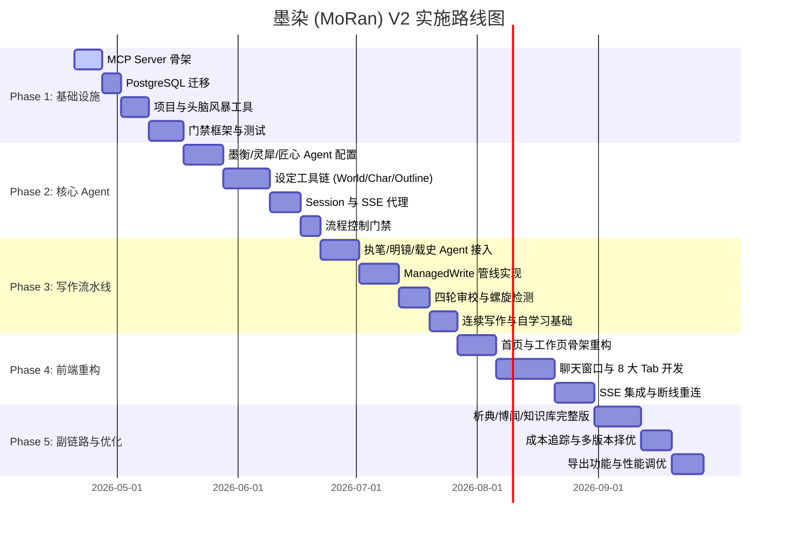

# S10 — 实施路线图

> 本文档定义了墨染 (MoRan) V2 架构的实施路径，从 MCP 基础设施到 50 章连续写作的自动化管线。

---

## 总体甘特图

---

## Phase 1: MCP Server 骨架 + DB 迁移 + 基础工具 (~4 weeks)

**背景**: V2 架构舍弃了 V1 的 Engine/Bridge 层，全面转向以 MCP 工具为核心的无状态后端。Phase 1 建立 MCP 服务基础与数据库 Schema。

### 关键组件

1. **MCP Server 骨架**: 采用 Node.js + FastMCP 框架，提供强类型的工具注册接口。
2. **PostgreSQL 迁移**: 使用 Drizzle ORM 管理 Schema，重点在于将 V1 的物理文件存储逻辑迁移为数据库关系。
3. **门禁框架 (Gate)**: 核心决策逻辑，确保所有操作符合项目生命周期。

### 任务列表

| 任务 | 描述 | 负责人 | 状态 |
|:---|:---|:---:|:---:|
| **MCP Server 初始化** | 构建 Node.js MCP server 骨架，实现工具注册与发现机制。集成 Zod 进行参数校验。 | 后端 | 待办 |
| **PostgreSQL 迁移** | 更新 Drizzle Schema，迁移 V1 数据并增加 V2 专属表（如 `mcp_tools`, `agent_sessions`, `project_config`）。 | 后端 | 待办 |
| **project_* 工具** | 实现 `project_create`, `project_status`, `project_list`, `project_diagnose` 工具，负责项目元数据管理。 | 后端 | 待办 |
| **brainstorm_* 工具** | 实现 `brainstorm_create`, `brainstorm_update`, `brainstorm_select` 工具，支持多方案并行脑暴。 | Agent 逻辑 | 待办 |
| **门禁框架 (Gate)** | 建立 HARD/SOFT/INFO 三级门禁检查基础设施，用于工具调用前置校验。HARD 拦截、SOFT 弹窗、INFO 记录。 | Agent 逻辑 | 待办 |
| **基础测试** | MCP 工具单元测试、数据库迁移脚本校验、门禁逻辑在不同状态下的表现验证。使用 Vitest 进行 Mock。 | 质量保障 | 待办 |

### 交付物与验收标准

- [ ] MCP Server 正常启动并成功向 OpenCode 注册工具列表，通过 `mcp-inspector` 验证。
- [ ] 通过 MCP 工具集可完成项目与头脑风暴的基础增删改查。
- [ ] 门禁框架能正确拦截未授权或前置条件不足的工具调用（如：未创建项目即调用脑暴工具）。
- [ ] 数据库支持多用户隔离架构，`userId` 校验逻辑生效。
- [ ] `pnpm test` 通过，覆盖率 ≥80%。

---

## Phase 2: 核心 Agent 接入 (墨衡 + 灵犀 + 匠心) + Session 管理 (~5 weeks)

**背景**: 将 OpenCode 中的 Agent 与 MCP 工具打通。墨衡作为总控，通过 `SubtaskPart` 进行任务调度。V2 抛弃了复杂的 Bridge 注入，改为 Agent 自主发现并调用工具。

### 核心角色职能

- **墨衡 (Orchestrator)**: 负责全局规划与任务分发。
- **灵犀 (Brainstormer)**: 负责创意发散与意图对齐。
- **匠心 (Architect)**: 负责结构化的设定构建。

### 任务列表

| 任务 | 描述 | 负责人 | 状态 |
|:---|:---|:---:|:---:|
| **墨衡 Agent 配置** | 编写墨衡 System Prompt，配置工具访问权限及 `SubtaskPart` 调度逻辑，实现“任务拆解-执行-汇总”闭环。 | Agent 逻辑 | 待办 |
| **灵犀 Agent 接入** | 实现头脑风暴工作流，确保输出符合 Creative Brief 标准格式，支持多轮追问。 | Agent 逻辑 | 待办 |
| **匠心 Agent 接入** | 接入世界观、角色、大纲工具链，实现设定间的联动校验。例如：角色必须关联已存在的地点。 | Agent 逻辑 | 待办 |
| **character_* 工具** | 实现角色增删改查、归档、人际关系图谱维护工具。支持角色标签化管理（如：正派/反派/龙套）。 | 后端 | 待办 |
| **world_* 工具** | 实现设定增删改、子系统（地理、势力、力量体系、特殊规则）维护工具。 | 后端 | 待办 |
| **outline_* 工具** | 实现大纲树状结构维护、弧段计划（Arc Plans）管理、章节核心冲突点标注工具。 | 后端 | 待办 |
| **Session 管理** | 实现项目级 Session 持久化，支持聊天历史的可靠存储与回放，解决 Token 长度限制下的 Context 截断。 | 后端 | 待办 |
| **SSE 代理** | Hono 后端透传 OpenCode SSE 流至浏览器，支持打字机效果。实现多 Agent 状态实时推送。 | 后端 | 待办 |
| **筹备期门禁** | 实现“灵犀未定、匠心不动”的流程强控制逻辑。确保设定文档完整性达到 80% 以前无法开启写作。 | Agent 逻辑 | 待办 |

### 交付物与验收标准

- [ ] 用户与墨衡对话，墨衡能准确识别意图并指派给灵犀或匠心执行。
- [ ] 头脑风暴 → 世界观 → 角色 → 大纲 的全流程设定链路跑通。
- [ ] 页面刷新后聊天记录与 Agent 状态可恢复，历史 Context 正确注入。
- [ ] 门禁系统成功阻止在没有大纲或大纲逻辑闭环（如：结尾缺失）的情况下启动写作工具。
- [ ] 支持通过对话修改已有设定，且能触发关联设定的自动更新（如：修改地点名称）。

---

## Phase 3: 写作流水线 (执笔 + 明镜 + 载史) + 审校循环 (~5 weeks)

**背景**: V2 的核心价值体现——全自动、高品质的写作→审校→归档闭环。写作不再是单次生成，而是由执笔起草、明镜审校、载史记录的多人协作过程。通过 MCP 封装的 ManagedWrite 管线，系统能处理从大纲切片到成品章节的所有中间状态。

### 流水线五阶段架构

1. **筹备 (Assemble)**: 根据章节索引自动加载关联的世界观、角色性格倾向、前文摘要。
2. **起草 (Draft)**: 执笔根据细化情节生成初稿，关注动作、对话、环境描写。
3. **审校 (Review)**: 明镜执行四轮循环检测，生成多维评分。
4. **修正 (Revise)**: 如果评分未达标，由执笔根据反馈进行局部或全局重写。
5. **存档 (Commit)**: 载史将新发生的关键事件、角色状态变更更新至知识库。

### 任务列表

| 任务 | 描述 | 负责人 | 状态 |
|:---|:---|:---:|:---:|
| **执笔 Agent 接入** | 实现 `chapter_write`, `draft_save`, `continue`, `rewrite_scene` 等写作工具。支持长文本生成的上下文保持。 | Agent 逻辑 | 待办 |
| **ContextAssembler** | 实现 SceneAnalyzer (场景需求分析), BudgetAllocator (动态 Token 分配), SliceRenderer (多模型切片渲染)。 | 后端 | 待办 |
| **风格引擎 (StyleEngine)** | 实现 `style_preset_apply`, `style_custom_save` 工具。支持从 5-10 篇样章中提取词频、句式等文学特征。 | Agent 逻辑 | 待办 |
| **温度场景化策略** | 根据章节 Metadata（如：打斗、抒情、悬疑）自动切换模型 Temperature 和 Top-P，提升输出张力。 | Agent 逻辑 | 待办 |
| **明镜 Agent 接入** | 实现 `review_submit`, `review_decision` 工具。编写明镜的审校逻辑提示词，确保评语具备建设性。 | Agent 逻辑 | 待办 |
| **四轮审校流程逻辑** | 1. AI味（规避常用 AI 词汇）；2. 逻辑（前后矛盾检测）；3. 文学（修辞与描写）；4. 体验（爽感与悬念）。 | Agent 逻辑 | 待办 |
| **Burstiness 分析工具** | 实现句长变化率实时分析器（均值、方差计算）。作为 `review_gate` 的强制准入标准 (Gate Value ≥0.3)。 | 后端 | 待办 |
| **载史 Agent 接入** | 实现 `archive_chapter` 工具。采用 Haiku (快速摘要) + Sonnet (深度实体提取) 组合，降低归档延迟。 | Agent 逻辑 | 待办 |
| **螺旋检测与熔断** | 实现审校死循环检测。当同一章节审校超过 4 轮且质量未提升时，自动暂停并向墨衡请求人工干预。 | Agent 逻辑 | 待办 |
| **ManagedWrite 管线** | 在 MCP 工具内部封装 5 阶段写作管线状态机。支持任务持久化，允许服务器重启后从断点恢复。 | 后端 | 待办 |
| **自动化连写模式** | 实现 `write-next` 与 `write-loop` 工具。墨衡负责按顺序驱动大纲中的所有章节，实现全自动写作。 | Agent 逻辑 | 待办 |
| **弧段边界自动检测** | 检测大纲中的 Arc Endpoint。在弧段转换处强制生成一份“阶段性总结报告”供用户审阅。 | Agent 逻辑 | 待办 |
| **Lessons 基础学习系统** | 实现从“修改记录”到“局部指令”的映射。如果用户手动改了一次对话，系统能学会后续的语言风格。 | Agent 逻辑 | 待办 |

### 交付物与验收标准

- [ ] 单章流水线（设定加载 → 创作 → 四轮审校 → 归档）完整跑通，全流程耗时控制在 3-5 分钟。
- [ ] 写作过程中，通过 SSE 实时向前端推送当前子任务进度（如：“执笔正在扩写第 2 场戏...”）。
- [ ] 螺旋检测能在异常循环发生时准确触发熔断，并保留所有版本的草稿供人工对比。
- [ ] 通过 20 章连续写作压力测试，无需人工干预，且未出现由于记忆截断导致的设定崩坏。
- [ ] 支持通过 `style_apply` 一键切换不同的文体风格（如：甄嬛体、古龙体），效果显著。
- [ ] 明镜生成的审校报告具备高可用性，能准确指出逻辑硬伤（如：死掉的角色又复活了）。

---

## Phase 4: 前端重构 (聊天窗口 + 信息面板) + SSE 集成 (~5 weeks)

**背景**: V2 前端从多页面形态演变为“Chat + Dashboard”的双翼结构。左侧为流动的交互，右侧为稳态的数据。所有的操作都通过与墨衡的聊天触发，而信息面板则负责将 Agent 执行的中间结果、生成的设定、采集到的知识进行可视化展示。

### UI/UX 设计重点

- **低摩擦交互**: 所有的设定修改都能在 Chat 中直接通过自然语言完成，无需跳转页面。
- **高密度可视化**: 复杂的设定数据（如角色关系、地理足迹）通过图形化面板实时呈现。
- **状态透明化**: 基于 SSE 驱动的进度条与状态指示，消除用户对“AI 后台在干什么”的焦虑。
- **响应式架构**: 适配桌面端三栏布局、平板端双栏布局及移动端层级堆叠。

### 任务列表

| 任务 | 描述 | 负责人 | 状态 |
|:---|:---|:---:|:---:|
| **首页重构** | 实现现代化的项目列表展示、快速创建入口。集成 Auth 逻辑与用户偏好设置。支持卡片与列表切换。 | 前端 | 待办 |
| **工作页骨架** | 实现 Left: Chat Panel (交互区)，Right: Info Panel (数据区) 的布局。支持双栏自由比例缩放与隐藏。 | 前端 | 待办 |
| **聊天窗口升级** | 实现富媒体消息渲染。支持打字机效果、Agent 切换动效、工具调用结果内嵌展示。集成快速指令快捷键。 | 前端 | 待办 |
| **信息面板 - 概览 Tab** | 项目进度全景看板。展示：当前章节进度条、总预计字数、各 Agent 活跃状态统计、核心角色活跃度。 | 前端 | 待办 |
| **信息面板 - 设定 Tab** | 实现可交互的树状大纲编辑器、角色卡瀑布流、世界观 Wiki 式文档展示。支持实时搜索与过滤。 | 前端 | 待办 |
| **信息面板 - 章节 Tab** | 章节列表垂直导航。支持快速草稿预览、多版本对比、审校报告详情查看。集成章节重写入口。 | 前端 | 待办 |
| **信息面板 - 审校 Tab** | 四维雷达图动画展示单章质量。详细列出每轮审校的分数变化、具体的修改意见标注与采纳情况。 | 前端 | 待办 |
| **信息面板 - 知识库 Tab** | 展示从文本中提取的设定实体、术语表、Learnings。支持按作用域（全局/弧段）进行可视化管理。 | 前端 | 待办 |
| **信息面板 - 分析 Tab** | 渲染析典 Agent 生成的长篇采样报告。支持对比不同作品的“文学指纹”图谱，显示节奏变化曲线。 | 前端 | 待办 |
| **信息面板 - 可视化 Tab** | 集成 D3.js/G6 库。展示动态的角色关系图谱、时空足迹地图、势力范围覆盖图。支持节点拖拽交互。 | 前端 | 待办 |
| **信息面板 - 成本 Tab** | 实时 Token 消耗监控。以柱状图和饼图显示按 Agent、按章节、按子任务的成本分布。支持余额预警。 | 前端 | 待办 |
| **SSE 实时更新集成** | 全量对接后端透传的消息流。实现 UI 的自动增量更新（如：大纲被 Agent 修改后，面板自动同步）。 | 前端 | 待办 |
| **断线重连与恢复** | 实现基于 Last-Event-ID 的重播机制。结合本地 IndexedDB 实现切屏或网络中断后的数据无缝恢复。 | 前端 | 待办 |
| **辅助 UI 交互** | 实现快捷反馈、一键导出预览、Agent 思考占位符动画、Markdown 数学公式与图表支持。 | 前端 | 待办 |

### 交付物与验收标准

- [ ] 与墨衡的全流程对话体验丝滑，支持 Markdown 解析、代码块预览、Mermaid 流程图实时渲染。
- [ ] 信息面板 8 个 Tab 全部可用，数据更新与 Agent 工具调用结果的延迟 <300ms。
- [ ] 写作过程中的实时状态指示器准确反馈后端 ManagedWrite 管线的当前阶段。
- [ ] 完成全量的 Playwright E2E 测试，覆盖核心交互链路：脑暴 -> 设定生成 -> 自动写作 -> 审校修正。
- [ ] 界面在 1366x768 至 4K 分辨率下均能保持良好的布局比例与可读性。
- [ ] 移动端通过底部 Tab 或抽屉式导航提供完整的 Chat 交互能力，确保户外灵感捕捉体验。

---

## Phase 5: 副链路 (析典 + 知识库 + Lessons) + 优化打磨 (~4 weeks)

**背景**: 提升长期写作的连贯性与深度，解决网文长篇创作中的“逻辑性下降”与“AI 疲劳”问题。副链路通过长效记忆与审美对齐，使系统具备“越写越好”的自我进化能力。

### 核心子系统

1. **析典 (Analyst)**: 深度解构参考作品，提取结构、节奏、风格参数，为执笔提供审美基准。
2. **知识库 (Knowledge Base)**: 结构化的事实存储，支持两层作用域（全局/弧段），自动剪枝过期信息。
3. **Lessons (Memory)**: 捕获用户在审校阶段的反馈，将其沉淀为“永不复犯”的写作指令。

### 任务列表

| 任务 | 描述 | 负责人 | 状态 |
|:---|:---|:---:|:---:|
| **析典 Agent 接入** | 实现 `analysis_submit` 工具。支持对样章进行九维文学性（节奏、伏笔、爽点、叙事视角等）采样。支持 PDF/EPUB 导入。 | Agent 逻辑 | 待办 |
| **知识库增强** | 实现双层 Scope 管理。引入时空衰减算法，解决“前 10 章的背景设定在 100 章后是否还需要加载”的问题。支持向量检索兜底。 | 后端 | 待办 |
| **Lessons 完整版** | 审校驱动的 Lesson 提取。实现“错误发现-规则生成-用户确认-应用”的完整闭环。支持 20 章有效期滚动淘汰。 | Agent 逻辑 | 待办 |
| **博闻 Agent 接入** | 与明镜集成。专门负责数值校验（如：主角等级、金币数量、战斗时长逻辑）。调用外部计算工具验证战斗数值。 | Agent 逻辑 | 待办 |
| **书虫/点睛 接入** | 词汇量增强 Agent。书虫负责生僻词替换，点睛负责金句提取与优化。作为流式输出的后处理层接入。 | Agent 逻辑 | 待办 |
| **全量成本追踪** | 实现多维度的 Token 审计。提供成本预警与自动化节能策略（如：摘要过长自动缩减、多轮对话压缩）。 | 后端 | 待办 |
| **多版本择优** | 对重要章节实现并行生成。通过明镜自动评分，并在 UI 上展示差异对比，由用户一键择优。 | Agent 逻辑 | 待办 |
| **导出功能** | 实现标准出版级格式导出。支持分卷、分章、封面、前言、后记、角色索引等元数据处理。提供预览功能。 | 后端 | 待办 |
| **性能优化** | ContextAssembler 增加分布式缓存。优化长会话下的 Agent 思考速度。对数据库热点数据进行物化视图优化。 | 后端 | 待办 |
| **最终集成测试** | 启动 50 章极限压力写作测试。验证长效记忆、逻辑一致性与 Token 成本控制。产出性能基准报告。 | 质量保障 | 待办 |

### 交付物与验收标准

- [ ] 析典能从样章中提取知识并成功应用到新章节的风格对齐中，风格重合度（通过语义评估）≥85%。
- [ ] 审校中的修改建议被自动转化为有效的 Lessons 记忆，并在后续 5 章内通过明镜的同类项回归测试。
- [ ] 50 章连续写作测试通过，且第 50 章对第 1 章的设定引用准确无误（如：第 1 章提到的龙套姓名正确）。
- [ ] 导出文件格式准确，符合主流电子书阅读器（Kindle/微信读书）的解析规范。
- [ ] 完成开源版本的 README、部署文档与 Agent 配置指南。支持 Docker 一键部署。

---

## 技术风险与缓解

| 风险描述 | 可能性 | 影响程度 | 缓解措施 |
|:---|:---:|:---:|:---|
| **OpenCode SDK 重大变更** | 中 | 高 | 封装抽象 MCP 通信层，不直接依赖 SDK 原生接口。建立 SDK 版本锁定机制。 |
| **模型 Token 消耗超支** | 高 | 中 | 实现 ContextAssembler 的 Budget 控制，支持 Haiku 替代方案。引入本地端小模型进行预处理。 |
| **Burstiness 误报重写** | 中 | 中 | 提供 SOFT gate 选项，允许用户手动 override 审校决策。优化句长分析算法，排除特殊排版干扰。 |
| **MCP 工具调用延迟** | 低 | 中 | 实现异步工具队列与状态轮询机制。优化后端并发处理能力，引入 Redis 消息队列。 |
| **长会话内存溢出** | 中 | 高 | 实现 Session 定期检查点与摘要回滚机制。定期自动清理不活跃的 Agent 实例。 |
| **数据逻辑自洽失效** | 中 | 高 | 引入“博闻” Agent 进行全量冲突检测。实现基于时空范围的局部一致性校验。 |

---

## 开发原则

1. **增量可验证**: 每个子阶段必须有可运行的测试或 Demo，拒绝黑盒开发。
2. **MCP-First**: 所有业务逻辑必须优先封装为 MCP 工具，前端仅作为工具的展示层。这确保了系统具备无头（Headless）运行能力。
3. **先后端后前端**: 优先保证 Phase 1-3 的 Agent 逻辑健壮，Phase 4 再进行 UI 适配。通过 CLI 工具进行早期逻辑验收。
4. **数据优先**: 在编写逻辑前，必须先确定数据库 Schema 与数据流向。遵循 Drizzle 的 Migrations First 原则。
5. **写作驱动**: 任何功能的优先级由其对最终正文质量的贡献度决定。如果一个功能不提升文采或逻辑，则延后。
6. **成本感知**: 在设计 Context 组装时，Token 预算是第一约束条件。实现每章节生成成本的自动熔断机制。
7. **容器化优先**: 全体开发环境必须基于 Docker 镜像，确保开发、测试、生产环境绝对一致。

---

## 自用验收标准

- **自动化能力**: 支持 50 章连续写作且无需任何人工干预，系统能自动处理审校失败与回滚逻辑。
- **正文质量**: 明镜初审通过率 ≥70%，无明显的 AI 词藻（如“揭开序幕”、“命运的齿轮”等）堆砌。
- **文学表现**: 句长变化率（Burstiness）均值 ≥0.35，对话与描写比例符合主流网文规范。
- **逻辑一致性**: 50 章内不出现重大的世界观、角色卡逻辑冲突（0 CRITICAL 级别错误）。
- **系统健壮性**: 在网络中断或模型超时后，可一键恢复至断点继续执行，状态不丢失。
- **交互体验**: Chat UI 流式响应无卡顿，信息面板数据更新延迟 <500ms。支持快捷键操作。
- **成本控制**: 单章生成成本控制在预设预算（如 5 元人民币）以内。支持不同模型档位的成本方案。
- **可维护性**: `pnpm test` 覆盖率 ≥80%，所有核心工具均有完善的文档说明。

---
Version: 2.0.0 | Date: 2026-04-19 | Author: Sisyphus-Junior