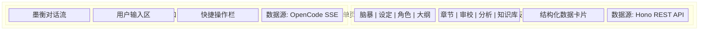
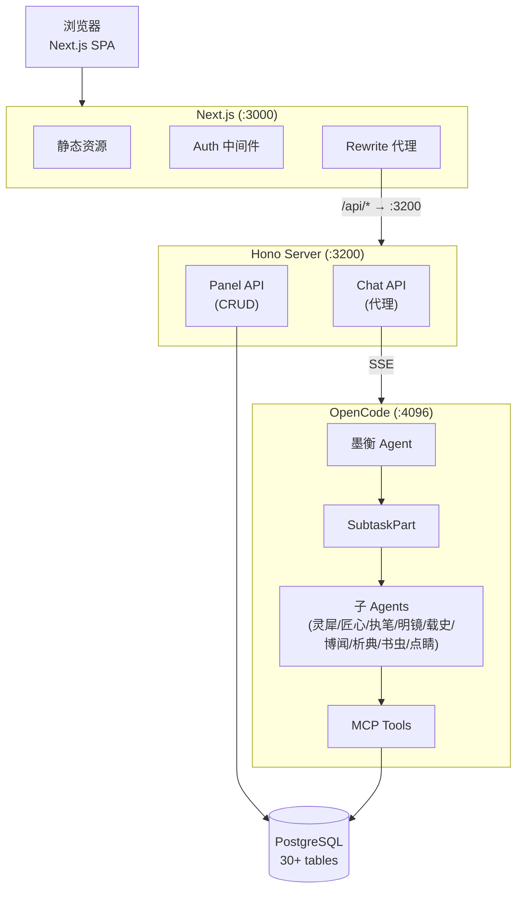
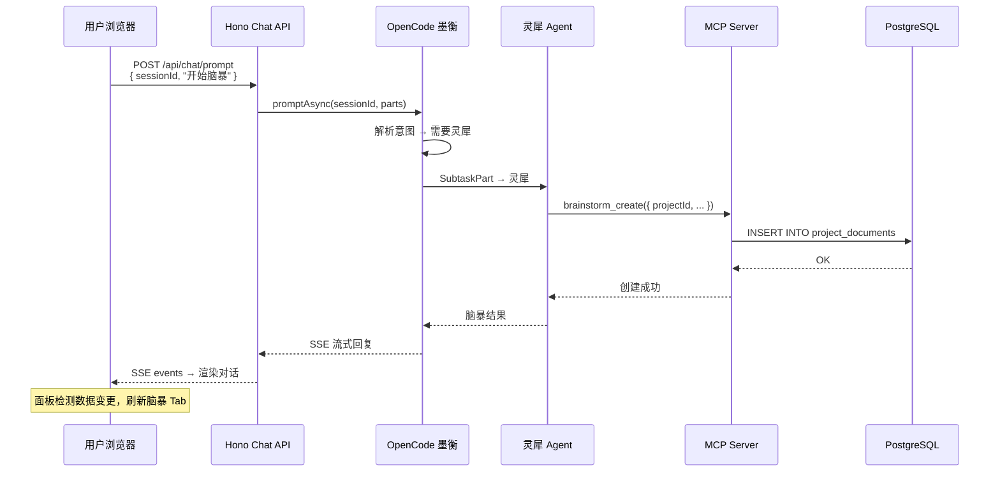
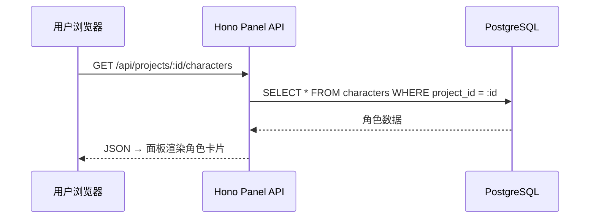
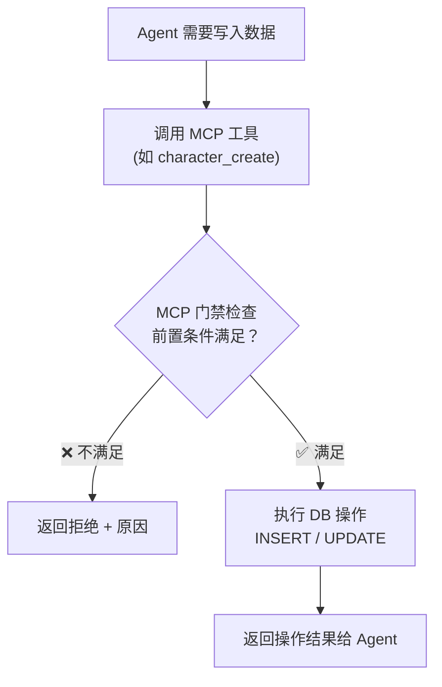
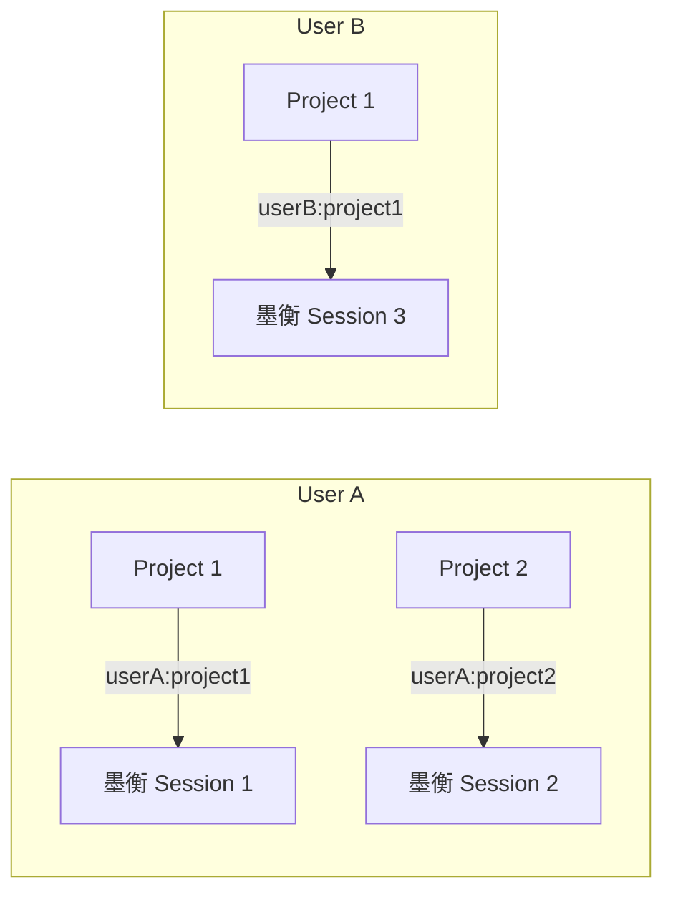
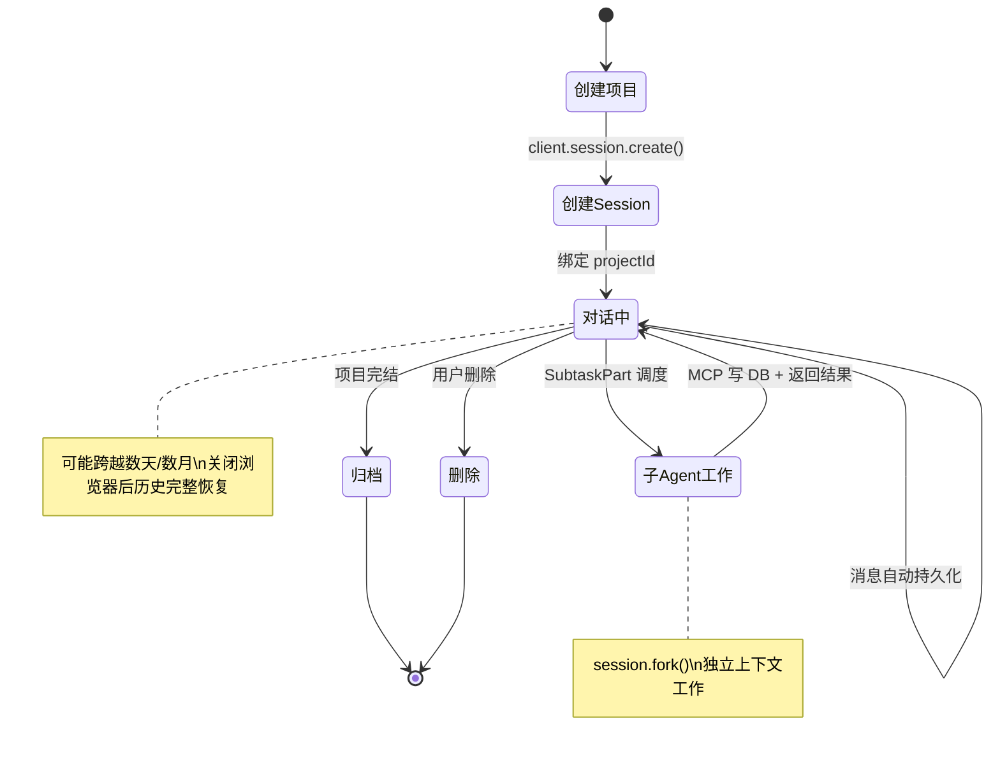
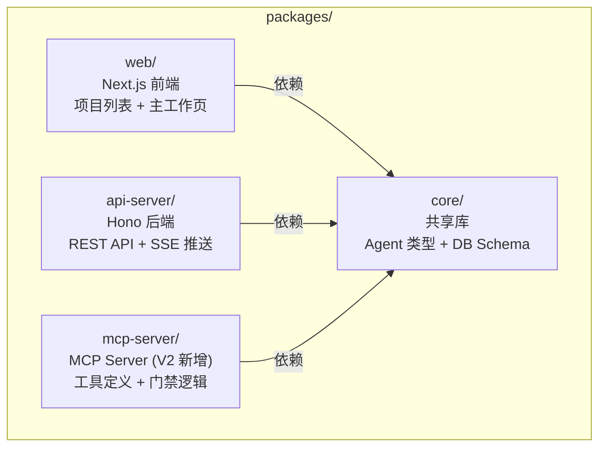
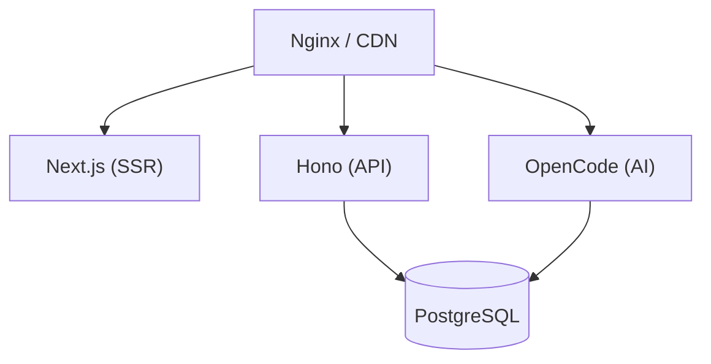

# S2 — 架构总览

> 本章描述 V2 的系统架构、数据流、Session 模型和技术栈。

---

## 1. 单页面模型总览



**两条独立数据通道**：

1. **聊天通道**：浏览器 ↔ Hono 代理 ↔ OpenCode SSE（实时对话流）
2. **面板通道**：浏览器 ↔ Hono REST API ↔ PostgreSQL（结构化数据读取）

---

## 2. 系统架构图



---

## 3. 数据流详解

### 3.1 聊天数据流（实时对话）



### 3.2 面板数据流（结构化读取）



### 3.3 数据写入路径（唯一）

**所有业务数据写入只通过 MCP 工具**，确保门禁检查不可绕过：



**前端面板只读**——面板通过 Hono REST API 查询 DB，不直接写入。用户的修改意图通过聊天传达给墨衡，由 Agent 执行写入。

---

## 4. Session 架构

### 4.1 Session 模型



> 一个用户 + 一个项目 = 一个墨衡 Session

### 4.2 Session 生命周期



### 4.3 Session Manager（Hono 层）

Hono 服务端维护 `userId:projectId → OpenCode sessionId` 的映射：

```typescript
interface SessionManager {
  // 获取或创建项目的墨衡 Session
  getOrCreate(userId: string, projectId: string): Promise<string>;
  
  // 获取已有 Session（不存在则返回 null）
  get(userId: string, projectId: string): Promise<string | null>;
  
  // 健康检查
  checkHealth(): Promise<boolean>;
  
  // 清理不活跃 Session（30 分钟超时）
  cleanup(): Promise<void>;
}
```

---

## 5. 技术栈

### 5.1 前端

| 技术 | 用途 |
|------|------|
| Next.js 15 | SSR / 静态资源 / Auth 中间件 / Rewrite 代理 |
| React 19 | UI 组件 |
| Zustand | 客户端状态（仅 UI 状态，不含业务数据） |
| EventSource | 接收 OpenCode SSE 对话流 |
| TailwindCSS | 样式 |
| shadcn/ui | 组件库 |

### 5.2 后端

| 技术 | 用途 |
|------|------|
| Hono | HTTP 服务（Chat 代理 + Panel CRUD API） |
| OpenCode SDK | 与 OpenCode serve 通信 |
| Drizzle ORM | PostgreSQL 访问（Panel API 查询） |
| PostgreSQL | 全部结构化数据存储 |

### 5.3 AI 层

| 技术 | 用途 |
|------|------|
| OpenCode serve | AI 对话引擎（Agent 管理、Session 持久化、MCP 连接） |
| MCP Server | 暴露 DB 操作给 LLM，内置门禁逻辑 |
| OpenCode Agent Config | 定义墨衡 + 9 个子 Agent 的 system prompt、模型、温度 |

### 5.4 基础设施

| 技术 | 用途 |
|------|------|
| Docker Compose | 本地开发环境（PostgreSQL + OpenCode serve） |
| pnpm workspace | Monorepo 管理 |
| Vitest | 单元测试 / 集成测试 |
| Playwright | E2E 测试 |

---

## 6. Monorepo 包结构（V2 更新）



---

## 7. 与 V1 架构的关键差异

### 7.1 消除的层

| V1 组件 | V2 状态 | 原因 |
|---------|---------|------|
| Orchestrator 状态机 | **废弃** | 流程由墨衡对话 + MCP 门禁控制 |
| Engine 层 | **废弃** | 不再需要解析 LLM 文本输出，MCP 工具直连 DB |
| Bridge 层 | **废弃** | OpenCode 不再是被调用方，而是编排核心 |
| 前端 15+ 页面 | **缩减为 2 页** | 项目列表 + 主工作页 |

### 7.2 新增的层

| V2 组件 | 用途 |
|---------|------|
| MCP Server | 暴露 DB 操作给 LLM，门禁内置 |
| Chat API（代理层） | 透传 OpenCode SSE 到前端 |
| Panel API（查询层） | 面板数据 CRUD |

### 7.3 保留的层

| 组件 | V2 变化 |
|------|---------|
| PostgreSQL | Schema 基本不变（30+ 表保留） |
| OpenCode serve | 从"被调用执行"升级为"编排核心" |
| Agent 定义 | 角色不变，交互方式从直接面向用户变为墨衡内部团队 |
| UNM 记忆引擎 | 逻辑保留，实现从 Engine 层迁移到 MCP 工具内部 |

---

## 8. 部署架构

### 8.1 本地开发

```yaml
# docker-compose.dev.yml
services:
  postgres:
    image: postgres:16
    ports: ["5432:5432"]
    
  opencode:
    image: ghcr.io/anomalyco/opencode:latest
    ports: ["4096:4096"]
    volumes:
      - ~/.local/share/opencode/auth.json:/root/.local/share/opencode/auth.json:ro
      - ./mcp-server:/app/mcp-server  # MCP Server 代码
    environment:
      - DATABASE_URL=postgresql://...

# 本地进程
# pnpm dev:server  → Hono :3200
# pnpm dev:web     → Next.js :3000
```

### 8.2 生产部署（未来）


