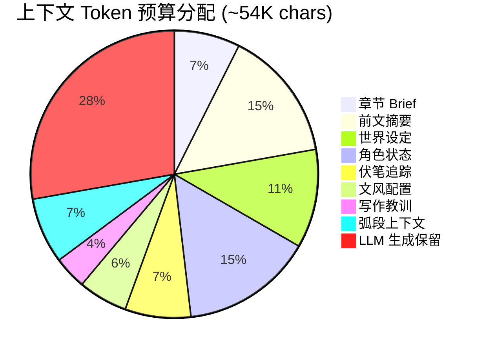
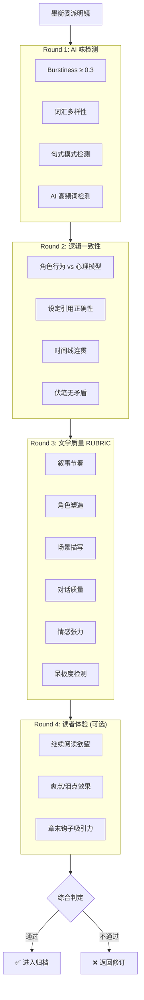
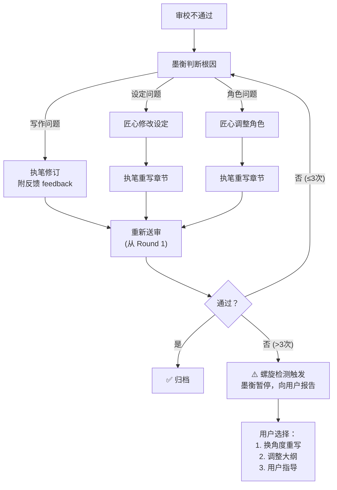
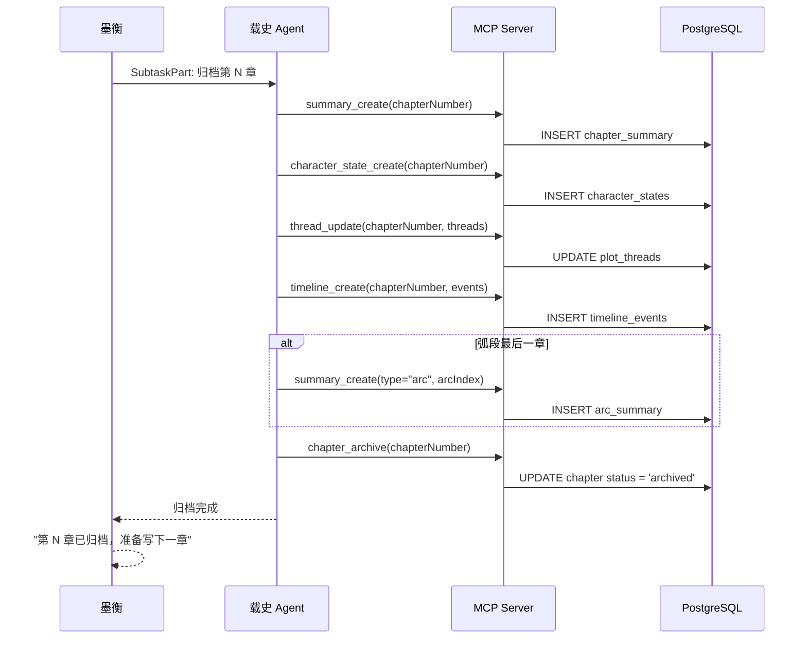
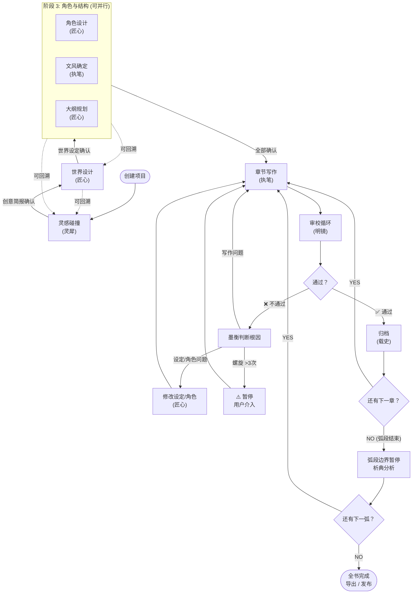

# S3 — 完整写作流程

> 本章描述从灵感到完稿的全流程。所有阶段通过与墨衡对话推进，子 Agent 在幕后工作。

---

## 1. 流程总览


每个阶段的推进由 **墨衡判断 + MCP 门禁双重保障**：

- **墨衡判断**：根据对话上下文和项目状态，引导用户进入下一阶段
- **MCP 门禁**：工具调用时检查前置条件，不满足则拒绝并返回原因

---

## 2. 阶段 1：灵感碰撞

### 2.1 触发方式

用户在墨衡对话中描述想法，如：
- "我想写一个赛博朋克世界的修仙故事"
- "帮我脑暴一下：如果传统武侠遇到末日废土会怎样"
- "我有个想法，主角是个失忆的AI，在虚拟世界里寻找自己的创造者"

### 2.2 墨衡行为

```
用户: "我想写一个赛博朋克修仙的故事"

墨衡（内部）:
  1. 识别意图 → 灵感碰撞阶段
  2. 检查项目状态 → 新项目，无已有脑暴
  3. 委派灵犀（SubtaskPart）

灵犀（幕后工作）:
  1. 发散阶段：基于用户想法生成 5-8 个创意方向
     → 调用 MCP: brainstorm_create({ projectId, type: "diverge", content: ... })
  2. 聚焦阶段：提炼核心冲突与独特卖点
  3. 结晶阶段：形成结构化创意简报（Creative Brief）
     → 调用 MCP: brainstorm_update({ projectId, type: "brief", content: ... })

墨衡: "我为你准备了几个创意方向，请看右侧面板。
       方向 A: 数据修仙——在赛博空间中以代码为灵根...
       方向 B: 肉身飞升——在义体改造盛行的时代坚持古法修炼...
       你倾向哪个方向？或者我们可以混合调整。"
```

### 2.3 用户交互模式

灵犀支持三种发散模式（继承自 V1）：

| 模式 | 说明 | 对话触发 |
|------|------|----------|
| AI 主导 | 灵犀自由发散，用户选择 | "帮我脑暴"、"给我几个方向" |
| AI 辅助 | 用户提供框架，灵犀填充细节 | "我想写 X 题材，帮我扩展" |
| 用户教导 | 用户描述完整想法，灵犀提问完善 | "我已经有完整的故事构思了" |

### 2.4 产出物

| 数据 | 存储位置 | MCP 工具 |
|------|----------|----------|
| 创意方向（多个） | `project_documents` 表 | `brainstorm_create` |
| 创意简报（最终版） | `project_documents` 表 | `brainstorm_update` |
| 题材标签 | `projects` 表 | `project_update` |

### 2.5 完成条件

- 用户确认一个创意方向
- 创意简报已生成并保存
- 墨衡提议进入下一阶段："创意方向确定了，接下来让匠心来构建世界观？"

---

## 3. 阶段 2：世界设计

### 3.1 前置条件（MCP 门禁）

```
gate_check("world_design"):
  ✅ 创意简报已存在
  ✅ 题材标签已设置
  ❌ 任一不满足 → 拒绝 + "请先完成灵感碰撞阶段"
```

### 3.2 墨衡行为

```
墨衡: "现在让匠心来设计世界观。基于你的创意简报，
       匠心会设计以下几个层面：
       1. 基础世界设定（时代、科技水平、修仙体系）
       2. 力量体系子系统
       3. 社会结构
       4. 关键地点
       5. 术语表
       请稍等..."

匠心（幕后工作）:
  1. 读取创意简报 → MCP: brainstorm_read({ projectId })
  2. 设计基础世界观
     → MCP: world_create({ projectId, type: "setting", section: "base", content: ... })
  3. 设计力量体系
     → MCP: world_create({ projectId, type: "subsystem", name: "power_system", content: ... })
  4. 设计社会结构
     → MCP: world_create({ projectId, type: "subsystem", name: "social_structure", content: ... })
  5. 设计关键地点
     → MCP: world_create({ projectId, type: "location", name: "...", content: ... })
  6. 生成术语表
     → MCP: knowledge_create({ projectId, category: "glossary", entries: [...] })

墨衡: "世界观初稿已完成，请看右侧面板的 [设定] Tab。
       几个关键点需要你确认：
       1. 修仙体系分为 9 阶，每阶对应不同的数据权限等级，你觉得如何？
       2. 三大势力的平衡关系...
       有什么需要调整的吗？"
```

### 3.3 自洽检查

匠心完成初稿后，墨衡自动触发自洽检查：

```
匠心（自洽检查）:
  → MCP: world_check({ projectId })
  → 检查项：
    - 力量等级与社会地位是否对应
    - 地点间距离与交通方式是否合理
    - 术语定义是否有循环引用或矛盾
  → 返回检查报告
```

### 3.4 迭代修改

用户可以在对话中随时要求修改：

```
用户: "修仙体系 9 阶太多了，改成 5 阶吧"

墨衡:
  1. 理解修改意图
  2. 委派匠心修改力量体系
  3. 匠心同时检查关联影响（社会结构、角色设定是否需要连锁修改）
  4. 汇报修改结果和影响范围
```

### 3.5 产出物

| 数据 | 存储位置 | MCP 工具 |
|------|----------|----------|
| 基础世界设定 | `world_settings` 表 | `world_create/update`（type="setting"） |
| 子系统（力量/社会/阵营…） | `world_settings` 表（按 section） | `world_create/update`（type="subsystem"） |
| 地点体系 | `locations` + `location_connections` 表 | `world_create/update`（type="location"） |
| 术语表 | `glossary_entries` 表 | `knowledge_create/update`（category="glossary"） |
| 自洽检查报告 | `project_documents` 表 | `world_check` |

---

## 4. 阶段 3：角色与结构

此阶段包含三个并行/交叉的子任务：**角色设计**、**文风确定**、**大纲规划**。

### 4.1 角色设计

#### 前置条件（MCP 门禁）

```
gate_check("character_design"):
  ✅ 世界设定已存在
  ✅ 至少一个力量体系子系统已定义
```

#### 匠心行为

```
匠心（角色设计）:
  1. 读取世界设定和创意简报
  2. 设计主要角色（五维心理模型）:
     - GHOST: 创伤根源（过去事件）
     - WOUND: 心理伤痕（持续性创伤痕迹）
     - LIE:  核心谎言（自欺信念）
     - WANT: 表层欲望（读者可见）
     - NEED: 真实需求（角色不自知）
  3. 设计角色关系网络
  4. 设计角色成长弧线（GHOST/WOUND/LIE 对峙时间线）
  
  → MCP: character_create({ projectId, name, role, profile: {
      want, need, lie, ghost, wound, personality, background, goals
    }})
  → MCP: relationship_create({ projectId, char1Id, char2Id, type, description })
```

#### 三层卡片结构

每个角色的信息分三层展示：

| 层级 | 内容 | 面板展示 |
|------|------|----------|
| 公开层 | 姓名、外貌、身份、表层目标 | 默认展示 |
| 隐藏层 | GHOST、WOUND、LIE、NEED、成长弧线 | 点击展开 |
| 行为层 | 语言风格、行为模式、应激反应 | 详情页 |

### 4.2 文风确定

#### 前置条件（MCP 门禁）

```
gate_check("style_design"):
  ✅ 创意简报已存在
  ✅ 至少定义了 1 个主要角色
```

#### 执笔行为

墨衡委派执笔进行文风设计：

```
执笔（文风设计）:
  1. 基于题材和世界观，推荐 2-3 种预设风格
  2. 用户选择或自定义后，生成风格配置：
     - YAML 约束（句长范围、段落密度、对话比例…）
     - 散文描述（风格氛围的文字说明）
     - 示例段落（该风格下的典型文本）
  3. 试写一段（500 字），用户确认风格
  
  → MCP: style_create({ projectId, config: { yaml, prose, examples } })
```

#### 9 种预设风格（继承自 V1）

| 风格 | 子名 | 适用题材 |
|------|------|----------|
| 冷峻简约 | 剑心 | 武侠、悬疑 |
| 华丽繁复 | 锦绣铺陈 | 仙侠、奇幻 |
| 幽默讽刺 | 谐星 | 都市、喜剧 |
| 温暖治愈 | 素手 | 日常、言情 |
| 黑暗压抑 | 夜阑 | 恐怖、末世 |
| 史诗恢弘 | 青史 | 战争、历史 |
| 轻快明朗 | 清风朗月 | 校园、冒险 |
| 悬疑紧张 | 暗棋 | 推理、惊悚 |
| 诗意抒情 | 水墨流觞 | 文艺、古风 |

### 4.3 大纲规划

#### 前置条件（MCP 门禁）

```
gate_check("outline_design"):
  ✅ 世界设定已存在
  ✅ 至少 2 个主要角色已定义
  ✅ 角色关系网络已建立
```

#### 匠心行为

```
匠心（大纲规划）:
  1. 读取创意简报 + 世界设定 + 角色表
  2. 设计故事弧段结构：
     - 弧段划分（每弧 30-50 章）
     - 每弧的核心冲突与高潮点
     - 弧段间的伏笔链和升级关系
  3. 设计章节级大纲（每章详案）：
     - Scene-Sequel 原子单元
     - 情感地雷（预埋爽点/泪点/笑点）
     - Plantser Brief（硬约束 / 软引导 / 自由区）
  
   → MCP: outline_create({ projectId, type: "synopsis", synopsis, arcs: [...] })
   → MCP: outline_create({ projectId, type: "arc_detail", arcIndex, chapters: [...] })
```

#### Plantser Pipeline（三层 Brief）

每章的写作指导分三层：

| 层级 | 内容 | 约束力 |
|------|------|--------|
| **硬约束** | 必须出现的情节点、角色、设定引用 | 不可违反 |
| **软引导** | 建议的情绪走向、节奏、场景转换 | 可灵活调整 |
| **自由区** | 执笔可自由发挥的空间 | 完全开放 |

### 4.4 粒度选择

用户可以选择大纲的详细程度：

```
墨衡: "大纲可以做到不同粒度：
       1. 粗粒度——只规划弧段和关键转折点，每章留大量自由空间
       2. 中粒度——规划到每章的核心场景和情感走向
       3. 细粒度——详细到每个 Scene-Sequel 单元和对话方向
       你偏好哪种？"
```

---

## 5. 阶段 4：章节写作

### 5.1 前置条件（MCP 门禁）

```
gate_check("chapter_write"):
  ✅ 大纲已存在
  ✅ 当前弧段的章节详案已定义
  ✅ 相关角色状态已就绪
  ✅ 世界设定已通过自洽检查
  ✅ 文风配置已确定
  ❌ 当前章节已有"通过审校"的版本 → 拒绝（防止覆盖已审校通过的章节）
```

### 5.2 写作流程

```
用户: "开始写第一章"

墨衡（内部）:
  1. 调用 MCP: gate_check("chapter_write", { chapterNumber: 1 })
  2. 通过 → 组装写作上下文
  3. 委派执笔（SubtaskPart）

执笔（幕后工作）:
  1. 读取写作上下文:
     → MCP: context_assemble({ projectId, chapterNumber: 1 })
     返回: {
       brief: "第一章 Plantser Brief",
       worldContext: "相关世界设定摘要",
       characterStates: "涉及角色的当前状态",
       previousSummary: null,  // 第一章无前文
       styleConfig: "文风配置",
       lessons: "相关写作教训"
     }
  
  2. 生成章节内容（流式输出）
     → 温度根据章节类型动态调整：
       - 日常章节: 0.7-0.8
       - 战斗章节: 0.6-0.7
       - 情感章节: 0.75-0.85
       - 悬疑章节: 0.5-0.6
       - 高潮章节: 0.65-0.75
  
  3. 保存章节
     → MCP: chapter_create({ projectId, chapterNumber: 1, title: "...", content: "..." })
  
  4. 更新角色状态
     → MCP: character_state_create({ projectId, characterId, chapterNumber: 1, state: {...} })

墨衡: "第一章初稿已完成，共 3200 字。请看右侧面板的 [章节] Tab。
       要我直接送审校，还是你先看看？"
```

### 5.3 多版本择优

执笔可以生成多个版本供选择（用户可配置）：

```
用户: "这章生成 3 个版本让我选"

执笔:
  → 生成版本 A（标准温度）
  → 生成版本 B（偏高温度，更有创意）
  → 生成版本 C（偏低温度，更贴近大纲）
   → MCP: chapter_create({ projectId, chapterNumber, variant: "A/B/C", content: ... })

墨衡: "三个版本已生成。版本 A 更稳健，版本 B 有个意外的情节转折很有趣，
       版本 C 严格跟随大纲。你选哪个？"
```

### 5.4 ContextAssembler（上下文装配）

写作上下文通过 MCP 工具 `context_assemble` 动态组装，遵循 token 预算：



分配策略由 SceneAnalyzer 根据章节类型动态调整。

---

## 6. 阶段 5：审校循环

### 6.1 触发方式

```
# 方式 1: 写完自动送审
墨衡: "第一章写完了，自动进入审校。"

# 方式 2: 用户手动触发
用户: "审一下第三章"

# 方式 3: 批量审校
用户: "审一下第 1-5 章"
```

### 6.2 四轮审校流程



**通过标准**：
- 无 CRITICAL 级别问题
- MAJOR 级别问题 < 2
- 综合评分 ≥ 7.5
- Burstiness ≥ 0.3

### 6.3 审校结果处理

```
结果处理:
  全部通过 → 墨衡: "第一章审校通过！进入归档。"
  
  部分不通过 → 墨衡分析问题根因:
    - 写作问题 → 委派执笔修订（附具体反馈）
    - 设定问题 → 委派匠心修改设定 → 重新写作
    - 角色问题 → 委派匠心调整角色 → 重新写作
    - 大纲问题 → 委派匠心修改大纲 → 重新写作
```

### 6.4 审校反馈格式（四层结构化）

```yaml
issues:
  - issue: "主角在第三段突然展现了不符合其性格的暴躁"
    severity: MAJOR
    evidence: "第三段第 2-4 行：'他猛地拍桌而起，厉声呵斥...'"
    suggestion: "根据角色设定，主角应以冷静自持为主。建议改为内心翻涌但外表克制的描写。"
    expected_effect: "保持角色一致性，同时通过内外反差增强张力"
```

### 6.5 修订循环



---

## 7. 阶段 6：归档与推进

### 7.1 归档流程



### 7.2 弧段边界暂停

当一个弧段结束时，墨衡主动暂停：

```
墨衡: "第一弧 '觉醒篇'（共 35 章）已全部完成。
       在进入第二弧之前，建议做以下检查：
       1. 回顾角色成长是否符合预期弧线
       2. 检查未回收的伏笔
       3. 确认第二弧的大纲是否需要根据实际写作调整
       
       要我让析典做一次弧段分析吗？"
```

---

## 8. 流程图（完整）



---

## 9. 阶段转换矩阵

| 从 \ 到 | 灵感碰撞 | 世界设计 | 角色结构 | 章节写作 | 审校 | 归档 |
|---------|----------|----------|----------|----------|------|------|
| **灵感碰撞** | — | ✅ 简报确认后 | ❌ | ❌ | ❌ | ❌ |
| **世界设计** | ✅ 可回溯 | — | ✅ 设定确认后 | ❌ | ❌ | ❌ |
| **角色结构** | ✅ 可回溯 | ✅ 可回溯 | — | ✅ 全部确认后 | ❌ | ❌ |
| **章节写作** | ❌ | ✅ 修改设定 | ✅ 修改角色 | — | ✅ 自动 | ❌ |
| **审校** | ❌ | ✅ 设定问题 | ✅ 角色问题 | ✅ 修订 | — | ✅ 通过后 |
| **归档** | ❌ | ❌ | ❌ | ✅ 下一章 | ❌ | — |

**关键规则**：
- 前进需要门禁检查
- 回溯随时可以（通过对话触发，不需要门禁）
- 审校发现非写作问题时，墨衡决定回溯到哪个阶段
