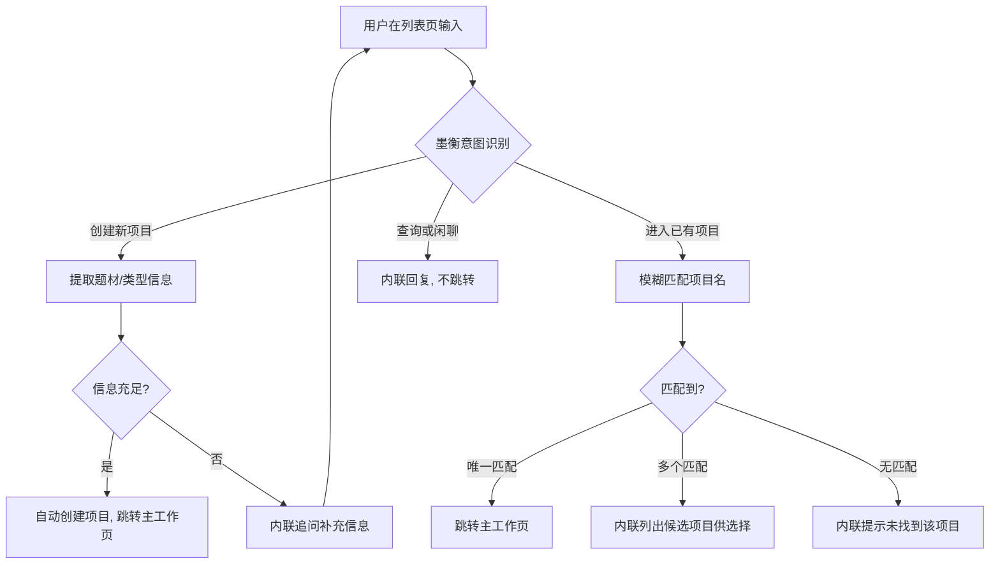

# S4 — 交互界面设计

> 本章详细描述"聊天窗口 + 信息面板"的 UI 规范、交互模式和响应式布局。

---

## 1. 页面结构总览

墨染 V2 只有两个页面：

| 页面 | 路由 | 功能 |
|------|------|------|
| 项目列表页 | `/` 或 `/projects` | 项目启动台，创建/选择项目 |
| 主工作页 | `/projects/:id` | 聊天窗口 + 信息面板（核心工作区） |

---

## 2. 项目列表页

### 2.1 布局

项目列表页的核心交互入口是**底部的聊天输入框**——用户与墨衡的对话从这里开始，墨衡根据意图自动路由（创建新项目 / 进入已有项目 / 闲聊）。上方展示历史项目卡片，无项目时为空状态。

```
┌──────────────────────────────────────────────────┐
│  墨染 MoRan                          [用户头像]   │
├──────────────────────────────────────────────────┤
│                                                  │
│  最近项目                                        │
│  ┌─────────┐  ┌─────────┐  ┌─────────┐          │
│  │ 赛博修仙 │  │ 末日武侠 │  │ 星际商战 │          │
│  │ 写作中   │  │ 筹备中   │  │ 已完结   │          │
│  │ 35/300章 │  │ 0/0章    │  │ 280/280 │          │
│  │ 12.5万字  │  │          │  │ 98万字   │          │
│  │ 2小时前   │  │ 昨天     │  │ 3天前    │          │
│  └─────────┘  └─────────┘  └─────────┘          │
│                                                  │
│  ┌──────────────────────────────────────────┐    │
│  │ 跟墨衡说点什么...                  [发送] │    │
│  └──────────────────────────────────────────┘    │
│                                                  │
└──────────────────────────────────────────────────┘
```

**空状态**（无历史项目时）：

```
┌──────────────────────────────────────────────────┐
│  墨染 MoRan                          [用户头像]   │
├──────────────────────────────────────────────────┤
│                                                  │
│              ✨ 还没有项目                        │
│         告诉墨衡你想写什么故事吧                   │
│                                                  │
│     "我想写一本赛博朋克修仙小说"                   │
│     "帮我续写上次的末日武侠"                       │
│                                                  │
│  ┌──────────────────────────────────────────┐    │
│  │ 跟墨衡说点什么...                  [发送] │    │
│  └──────────────────────────────────────────┘    │
│                                                  │
└──────────────────────────────────────────────────┘
```

### 2.2 聊天输入框意图路由

项目列表页的输入框是一个**轻量级墨衡对话入口**。墨衡识别用户意图后自动路由：

| 用户输入示例 | 墨衡识别意图 | 动作 |
|-------------|-------------|------|
| "我想写一本赛博朋克修仙小说" | 创建新项目 | 自动创建项目 → 跳转主工作页 → 开始引导 |
| "来一本末日题材的" | 创建新项目 | 同上，墨衡会追问补充信息 |
| "继续写赛博修仙" | 进入已有项目 | 匹配项目名 → 跳转主工作页 → 恢复上下文 |
| "上次那个末日武侠写到哪了？" | 查询项目状态 | 匹配项目 → 在输入框上方内联回复进度摘要 |
| "你好" / "最近怎么样" | 闲聊 | 在输入框上方内联回复，不跳转 |

**意图路由流程**：



**内联回复**：列表页默认**不展示任何聊天消息**，保持启动台的简洁。仅当用户主动发送消息后，墨衡回复以气泡形式在输入框上方向上生长，最多保留最近 3 轮对话。跳转到项目主工作页后，列表页气泡自动清除。列表页对话不带入主工作页（主工作页有独立的项目级 session）。

### 2.3 项目卡片信息

| 字段 | 说明 |
|------|------|
| 项目名 | 用户命名 |
| 题材标签 | 如"赛博朋克 × 修仙" |
| 阶段 | 筹备中 / 写作中 / 已完结 |
| 进度 | 已写章节数 / 大纲总章节数 |
| 字数 | 总字数统计 |
| 最后活跃 | 相对时间（如"2小时前"、"昨天"） |

**卡片交互**：
- 点击卡片 → 直接进入该项目的主工作页，墨衡恢复上下文
- 长按/右键 → 项目操作菜单（重命名、归档、删除、导出）
- 卡片按最后活跃时间倒序排列

### 2.4 创建项目流程

项目创建**不再是独立的弹窗表单**，而是通过对话自然完成：

```
用户: "我想写一本赛博朋克修仙小说"

墨衡: "好主意！我来帮你创建项目。
       先给这个项目起个名字？还是我来建议几个？"

用户: "就叫赛博修仙吧"

→ 自动创建项目"赛博修仙"，跳转主工作页

墨衡: "项目已创建！我是墨衡，全程陪你创作。
       先聊聊你的灵感？有什么核心设定想法吗？
       或者我们直接从脑暴开始？"
```

墨衡会根据用户提供的信息密度决定追问深度：
- 用户给了题材 + 核心设定 → 直接创建，进入脑暴
- 用户只给了模糊方向 → 追问 1-2 轮补充关键信息
- 用户说"随便写点什么" → 墨衡主动推荐题材方向

---

## 3. 主工作页

### 3.1 整体布局

```
┌──────────────────────────────────────────────────────────────────┐
│  ← 返回  │  📖 赛博修仙  │  写作中  │  37/300章  12.5万字  $2.8 │
├────────────────────────────╥─────────────────────────────────────┤
│                            ║                                     │
│  ┌──────────────────────┐  ║  ┌──────────────────────────────┐   │
│  │                      │  ║  │ [脑暴][设定][角色][大纲]      │   │
│  │  对话历史             │  ║  │ [章节🔴][审校][分析][知识库]  │   │
│  │                      │  ║  ├──────────────────────────────┤   │
│  │  墨衡: "第一章审校    │  ║  │                              │   │
│  │  通过了！进度..."     │  ║  │  当前 Tab 内容                │   │
│  │                      │  ║  │  （SSE 驱动实时自更新）        │   │
│  │  用户: "开始写第二章" │  ║  │                              │   │
│  │                      │  ║  │  ┌─ 写作实时渲染 ──────────┐  │   │
│  │                      │  ║  │  │ 执笔·剑心 正在写作...   │  │   │
│  │                      │  ║  │  │ 暮色浸透了整座城市的     │  │   │
│  │                      │  ║  │  │ ▊ (光标闪烁)            │  │   │
│  │                      │  ║  │  └──────────────────────────┘  │   │
│  └──────────────────────┘  ║  └──────────────────────────────┘   │
│  ┌──────────────────────┐  ║                                     │
│  │🟢执笔·剑心 1.8k字    │  ║                                     │
│  │🟡明镜 排队中          │  ║                                     │
│  ├──────────────────────┤  ║                                     │
│  │ 输入框...       [发送]│  ║                                     │
│  └──────────────────────┘  ║                                     │
├────────────────────────────╨─────────────────────────────────────┤
│  快捷操作: [继续写作] [送审校] [查看进度] [导出]                   │
└──────────────────────────────────────────────────────────────────┘
  ║ = 可拖拽分隔条，用户自由调节左右面板宽度
```

### 3.2 分栏比例与拖拽调节

左右面板之间的分隔条**可拖拽**，用户可自由调节宽度比例。下表为默认初始比例：

| 屏幕宽度 | 会话窗口（默认） | 信息面板（默认） | 交互模式 |
|----------|------------------|------------------|----------|
| ≥ 1440px | 40% | 60% | 并排显示，可拖拽调节 |
| 1024-1439px | 45% | 55% | 并排显示，可拖拽调节 |
| 768-1023px | 50% | 50% | 并排显示，可拖拽调节，可折叠面板 |
| < 768px | 100% | 100% | Tab 切换（聊天 / 面板），无分隔条 |

**拖拽行为**：
- 分隔条宽度 4px，hover 时变为 8px 并高亮（`cursor: col-resize`）
- 拖拽范围限制：左侧最小 25%，右侧最小 30%，防止面板被压至不可用
- 用户调节后的比例持久化到 `localStorage`，下次进入同一项目时恢复
- 拖拽过程中双面板内容实时 resize（不遮挡、不延迟）
- 双击分隔条 → 恢复默认比例

---

## 4. 会话窗口（左侧）

### 4.1 消息类型

| 类型 | 来源 | 展示方式 |
|------|------|----------|
| 用户消息 | 用户输入 | 右对齐气泡，浅色背景 |
| 墨衡消息 | 墨衡回复 | 左对齐气泡，白色背景，支持流式打字机效果 |
| 系统通知 | 子 Agent 完成/状态变更 | 居中小字，灰色，如"灵犀完成了脑暴" |
| 进度指示 | 子 Agent 工作中 | 左对齐，带动画的进度条/状态文字 |
| 决策提问 | 墨衡需要用户决策 | 替换底部输入框为问题选择面板（见 4.6 节） |

> **关键变化（V2.1）**: 章节正文的流式写作过程**不在聊天窗口**展示，而是在右侧面板 [章节] Tab 中实时渲染。执笔写作状态由输入框上方的 Agent 状态条（见 4.7）实时展示，聊天流中不再插入写手状态卡片，避免长文本和冗余信息淹没对话流。

### 4.2 消息气泡内容

墨衡消息可以包含富文本：

```
┌──────────────────────────────────┐
│ 🤖 墨衡                          │
│                                  │
│ 第一章审校结果：                   │
│                                  │
│ ✅ Round 1: AI 味检测 — 通过      │
│    Burstiness: 0.42              │
│ ✅ Round 2: 逻辑一致性 — 通过     │
│ ⚠️ Round 3: 文学质量 — 7.8/10    │
│    - 第三段节奏略显拖沓            │
│ ✅ Round 4: 读者体验 — 通过       │
│                                  │
│ 综合评分 7.8，通过！              │
│                                  │
│ [查看详细报告] [进入下一章]        │
└──────────────────────────────────┘
```

### 4.3 输入区

```
┌──────────────────────────────────────────┐
│ [📎] 输入消息...                   [发送] │
│                                          │
│ 快捷: /write /review /export /status     │
└──────────────────────────────────────────┘
```

| 组件 | 功能 |
|------|------|
| 输入框 | 多行文本输入，支持 Shift+Enter 换行 |
| 发送按钮 | 发送消息（Enter 或点击） |
| 附件按钮 | 上传参考资料（图片、文档） |
| 快捷命令 | `/` 触发命令面板 |

### 4.4 快捷命令

| 命令 | 功能 |
|------|------|
| `/write [N]` | 开始写第 N 章 |
| `/review [N]` | 审校第 N 章 |
| `/status` | 查看项目总体进度 |
| `/export` | 导出已完成章节 |
| `/brainstorm` | 开始新一轮脑暴 |
| `/analyze [N]` | 析典分析第 N 章/弧段 |
| `/lesson` | 查看/添加写作教训 |
| `/style` | 查看/调整文风 |
| `/rollback [N]` | 回滚到第 N 章的某个版本 |

### 4.5 流式输出处理

会话窗口的流式输出只有一种：**墨衡对话流式**——墨衡回复以打字机效果逐字渲染，与常规 ChatUI 体验一致。

执笔写作状态由输入框上方的 Agent 状态条实时展示（见 4.7），章节正文在右侧面板 [章节] Tab 中流式渲染（见 5.3.5），均不进入聊天流。

### 4.6 决策交互面板（Question Panel）

当墨衡需要用户做出选择决策时（如审校结果判定、弧段边界决策、方案选择），底部输入区**临时替换**为问题选择面板：

```
┌──────────────────────────────────────────────┐
│ 🤖 墨衡                                       │
│                                                │
│ 第 30 章是弧段一的结尾。以下是阶段复盘结果：   │
│ - 九维总评: 8.1/10                             │
│ - 未填坑: 3 条                                 │
│ - 下一卷大纲已就绪                              │
│                                                │
│ 你想怎么做？                                   │
└──────────────────────────────────────────────┘

┌──────────────────────────────────────────────┐
│  ┌────────────────────────────────────────┐   │
│  │ ✅ 确认通过，进入下一卷                  │   │
│  └────────────────────────────────────────┘   │
│  ┌────────────────────────────────────────┐   │
│  │ 📝 修改后续大纲再继续                    │   │
│  └────────────────────────────────────────┘   │
│  ┌────────────────────────────────────────┐   │
│  │ 🔄 效果不满意，重写本卷                  │   │
│  └────────────────────────────────────────┘   │
│  ┌────────────────────────────────────────┐   │
│  │ 💬 自由输入...                           │   │
│  └────────────────────────────────────────┘   │
└──────────────────────────────────────────────┘
```

**交互规则**：
- 选择卡片式布局，每个选项一行，点击即选择
- 最后一个选项始终为"自由输入"——点击后恢复为普通输入框
- 用户选择后，选中项作为用户消息发送到聊天流中
- 输入区自动恢复为默认模式
- 支持键盘快捷键：数字键 1-9 直接选择对应选项

**触发条件**：墨衡回复中携带 `interaction_mode: "question"` metadata + `options` 数组。

**常见决策场景**：

| 场景 | 选项示例 |
|------|----------|
| 弧段边界 | 确认通过 / 修改大纲 / 重写弧段 |
| 审校未通过 | 接受修改建议 / 保留原文 / 人工编辑 |
| 脑暴方案选择 | 方案 A / 方案 B / 方案 C / 继续发散 |
| Lesson 确认 | 确认加入 / 修改规则 / 忽略 |
| 写手选择 | 执笔·剑心 / 执笔·云墨 / 执笔·星河 / 执笔·素手 |

### 4.7 Agent 工作状态条

位于输入框**正上方**的紧凑状态条，展示当前正在工作的子 Agent。无 Agent 工作时完全隐藏（高度归零），有工作时平滑滑入。

**位置选择理由**：放在左侧面板输入框上方而非右侧面板顶部，因为子 Agent 工作数量不定（0 到多个），放在右侧顶部会导致信息面板内容区高度动态变化，干扰阅读体验。输入框上方是固定锚点，向上增长不影响面板。

**布局**：

```
┌──────────────────────────────┐
│  ...对话历史...               │
└──────────────────────────────┘
┌──────────────────────────────┐  ← 状态条（0~2 行，溢出折叠）
│ 🟢 执笔·剑心 写作中 1.8k字   │
│ 🟡 明镜 审校排队              │
└──────────────────────────────┘
┌──────────────────────────────┐
│ 输入框...               [发送]│
└──────────────────────────────┘
```

**状态指示灯**：

| 颜色 | 状态 | 说明 |
|------|------|------|
| 🟢 绿色 | 活跃中 (active) | Agent 正在执行任务，有实时输出 |
| 🟡 黄色 | 排队中 (queued) | 任务已分配，等待前序 Agent 完成 |
| 🔵 蓝色 | 后台工作 (background) | Agent 在后台处理（归档、分析），不产出用户可见内容 |
| ⚪ 灰色 | 刚完成 (just_finished) | 短暂显示 3 秒后淡出，如"✅ 明镜 审校完成 8.2分" |

**各 Agent 状态文案模板**：

| Agent | 活跃状态文案 | 完成状态文案 |
|-------|-------------|-------------|
| 执笔·{子名} | 写作第 N 章 · {当前字数}字 | ✅ 完成第 N 章（{总字数}字） |
| 明镜 | 审校第 N 章 · 第 M 轮 | ✅ 审校完成 {评分}分 |
| 灵犀 | 脑暴方案生成中... | ✅ 脑暴完成（{N}个方案） |
| 匠心 | 设计{世界观/角色/大纲}... | ✅ {目标}设计完成 |
| 载史 | 归档第 N 章... | ✅ 第 N 章已归档 |
| 博闻 | 一致性校验中... | ✅ 校验完成（{N}处提醒） |
| 析典 | 九维分析中...（{进度}%） | ✅ 分析报告已生成 |

**交互行为**：
- 点击任一 Agent 状态行 → 滑出 Agent 会话抽屉（见下文），查看该 Agent 的实时会话过程
- 最多显示 2 行，超出折叠为"+N 个 Agent 工作中"，hover 展开完整列表
- 状态条高度动态变化，带平滑动画（展开/收起 200ms ease-out）
- 空闲时完全隐藏，不占空间

**Agent 会话抽屉**：

点击状态条中的 Agent，从右侧滑出抽屉面板，展示该 Agent 的会话过程：

```
┌────────────────────────────╥──────────────────────────────────╥─────────────────────┐
│                            ║                                  ║ ✕ 明镜 · 审校第5章  │
│       会话窗口              ║          信息面板                 ║                     │
│                            ║                                  ║ 🤖 明镜:            │
│                            ║                                  ║ 开始第一轮 AI 味    │
│                            ║                                  ║ 检测...             │
│                            ║                                  ║                     │
│                            ║                                  ║ Burstiness: 0.42   │
│                            ║                                  ║ 判定: 通过 ✅       │
│                            ║                                  ║                     │
│                            ║                                  ║ 进入第二轮逻辑      │
│                            ║                                  ║ 一致性检查...       │
│                            ║                                  ║ ▊                   │
│  ┌──────────────────────┐  ║                                  ║                     │
│  │🟢明镜 审校中 第2轮    │  ║                                  ║                     │
│  ├──────────────────────┤  ║                                  ║                     │
│  │ 输入框...       [发送]│  ║                                  ║                     │
│  └──────────────────────┘  ║                                  ║                     │
└────────────────────────────╨──────────────────────────────────╨─────────────────────┘
```

**抽屉规格**：
- 从右侧滑入，宽度固定 320px，覆盖在信息面板之上（不挤压主布局）
- 顶部：Agent 名称 + 任务描述 + 关闭按钮（✕）
- 内容：该 Agent 的会话消息流，支持流式实时渲染（SSE 驱动）
- Agent 工作中时，会话内容实时追加（与聊天窗口的流式体验一致）
- Agent 完成后，抽屉不自动关闭，用户可继续查看完整会话记录
- 点击抽屉外部区域或按 Esc → 关闭抽屉
- 同时只能打开一个 Agent 抽屉，点击另一个 Agent 状态行 → 切换抽屉内容

**可查看会话的场景**：

| Agent | 会话内容价值 |
|-------|-------------|
| 明镜 | 四轮审校的逐轮推理过程、评分依据、具体修改建议 |
| 书虫 | 读者视角的阅读体验评分、直觉反馈、情绪曲线 |
| 灵犀 | 脑暴发散→聚焦→结晶的思维过程 |
| 匠心 | 世界观/角色/大纲的设计推理 |
| 析典 | 九维分析的逐维度评估细节 |
| 博闻 | 一致性校验发现的具体矛盾点 |
| 执笔 | 写作过程（正文已在 [章节] Tab 渲染，抽屉可看执笔与墨衡的指令交互） |
| 载史 | 归档过程（通常无需查看） |

**实时更新机制**：
- 状态条通过 SSE 事件驱动，**不依赖轮询**，数据变更即时推送
- `subtask_start` → 新增一行 Agent 状态（滑入动画）
- `subtask_progress` → 原地刷新该行的描述文案（如字数从 1.2k → 1.5k），无闪烁，数字平滑过渡
- `subtask_end` → 状态灯变灰 + 切换为完成文案，3 秒后淡出移除
- 执笔写作场景：`writing_progress` 事件高频推送（每 ~500ms），状态条实时刷新当前字数
- SSE 断线重连后，通过 `GET /api/projects/:id/agent-status` 一次性拉取当前全部 Agent 状态，恢复状态条

**数据模型与 SSE 事件映射**：

```typescript
// Agent 状态条数据模型
interface AgentStatus {
  agentId: string;           // "zhibi", "mingjing", etc.
  displayName: string;       // "执笔·剑心", "明镜", etc.
  state: 'active' | 'queued' | 'background' | 'just_finished';
  description: string;       // "写作第 38 章 · 1,847字"
  startedAt: number;         // 用于计算耗时
  targetTab?: string;        // 点击跳转的 Tab
}

// SSE 事件处理
eventSource.onmessage = (event) => {
  const data = JSON.parse(event.data);
  switch (data.type) {
    case "subtask_start":
      agentStatusStore.add({
        agentId: data.agentId,
        displayName: data.displayName,
        state: 'active',
        description: data.taskDescription,
        targetTab: data.targetTab,
      });
      break;
    case "subtask_progress":
      agentStatusStore.update(data.agentId, {
        description: data.taskDescription,
      });
      break;
    case "subtask_end":
      agentStatusStore.update(data.agentId, {
        state: 'just_finished',
        description: data.completionMessage,
      });
      // 3 秒后淡出移除
      setTimeout(() => agentStatusStore.remove(data.agentId), 3000);
      break;
  }
};
```

---

## 5. 信息面板（右侧）

信息面板是右侧的结构化数据展示区域，通过 Tab 页组织不同阶段的产出内容。所有 Tab 内容**只读展示**，修改必须通过左侧聊天窗口与墨衡对话完成（确保所有变更经过门禁校验）。

### 5.1 Tab 栏设计

#### 布局

```
┌──────────────────────────────────────────────────────┐
│ [脑暴] [设定] [角色] [大纲] [章节] [审校] [分析] [知识库] │
├──────────────────────────────────────────────────────┤
│                                                      │
│                    Tab 内容区                          │
│                                                      │
└──────────────────────────────────────────────────────┘
```

- Tab 栏固定在面板顶部，不随内容滚动
- 当前激活 Tab 加下划线高亮
- Tab 名称采用 14px 字体，间距 24px

#### Tab 可见性

不是所有 Tab 始终可见。Tab 根据项目阶段**动态出现**——只有产生过对应数据的 Tab 才显示：

| 阶段 | 可见 Tab |
|------|----------|
| 新项目（无数据） | 无 Tab，显示空状态引导 |
| 脑暴阶段 | [脑暴] |
| 设定阶段 | [脑暴] [设定] [角色] |
| 大纲阶段 | [脑暴] [设定] [角色] [大纲] |
| 写作阶段 | 全部 8 个 Tab |

#### 徽标

Tab 名称右上角可显示徽标提示新内容：

- 🔴 红点：有新内容未查看（用户切到该 Tab 后消除）
- 数字角标：如 `[审校 ②]` 表示有 2 份未读报告
- 🔴 实时标识：`[章节🔴]` 表示执笔正在写作（见 5.6）

#### 自动切换

当墨衡调用子 Agent 产出新内容时，面板自动切换到对应 Tab。但需要 **10 秒保护机制**——如果用户 10 秒内有过操作（点击、滚动、选中文字），则不自动切换，仅加红点：

```typescript
function handleAutoSwitch(targetTab: TabId) {
  const now = Date.now();
  const lastUserAction = uiStore.getState().lastUserActionTime;

  if (now - lastUserAction < 10_000) {
    // 10 秒内用户有操作 → 不打断，仅加红点
    tabStore.addBadge(targetTab, "dot");
  } else {
    // 超过 10 秒无操作 → 自动切换
    tabStore.setActive(targetTab);
  }
}
```

#### 面板空状态

项目刚创建、尚无任何 Agent 产出时，整个面板显示引导：

```
┌──────────────────────────────────────────────────┐
│                                                  │
│              📝 开始你的创作之旅                    │
│                                                  │
│   在左侧与墨衡对话，描述你的创作灵感，              │
│   各阶段产出将自动展示在这里。                      │
│                                                  │
│              试试说："我想写一个..."                │
│                                                  │
└──────────────────────────────────────────────────┘
```

---

### 5.2 [脑暴] Tab

**数据来源**：灵犀（创意脑暴 Agent）

灵犀的脑暴产出按三个阶段组织：**发散 → 聚焦 → 结晶**。每个阶段是一个可折叠区域，结晶方案以卡片形式突出展示。

#### 布局

```
┌──────────────────────────────────────────────────┐
│ [脑暴]  设定  角色  大纲  章节  审校  分析  知识库   │
├──────────────────────────────────────────────────┤
│                                                  │
│  发散阶段                              [收起 ▼]  │
│  ├─ 方向 A：末日废土中的AI觉醒          ⭐       │
│  ├─ 方向 B：虚拟世界中的真实情感                  │
│  ├─ 方向 C：时间循环中的蝴蝶效应                  │
│  └─ 方向 D：星际流浪者的归乡之旅                  │
│                                                  │
│  ───────────────────────────────────────         │
│                                                  │
│  聚焦阶段                              [收起 ▼]  │
│  ├─ 入选：方向 A + 方向 C 融合                    │
│  ├─ 题材：科幻 × 悬疑                            │
│  ├─ 核心冲突：AI觉醒后发现世界在循环              │
│  └─ 目标读者：18-30岁男性，硬核科幻爱好者         │
│                                                  │
│  ───────────────────────────────────────         │
│                                                  │
│  ✨ 结晶方案                                      │
│  ┌────────────────────────────────────────┐      │
│  │ 《时间废墟》                            │      │
│  │                                        │      │
│  │ 类型：硬核科幻 × 时间悬疑               │      │
│  │ 核心概念：末日后AI通过时间循环寻找        │      │
│  │          人类文明的最后火种              │      │
│  │ 卖点：硬科幻设定 + 烧脑时间线 +          │      │
│  │       AI视角的人性探讨                  │      │
│  │ 预估体量：80万字 / 400章               │      │
│  │                                        │      │
│  │ 一句话梗概：                            │      │
│  │ "在第10086次循环中，它终于学会了遗忘。"  │      │
│  └────────────────────────────────────────┘      │
│                                                  │
└──────────────────────────────────────────────────┘
```

#### 交互

| 元素 | 操作 | 效果 |
|------|------|------|
| 方向项 ⭐ | 点击星标 | 在聊天中自动发送"我喜欢方向 A"，通知墨衡 |
| [收起 ▼] / [展开 ▶] | 点击 | 折叠/展开该阶段内容 |
| 结晶方案卡片 | 只读 | 无直接编辑操作；修改需在聊天中说"我想调整方案的类型" |

#### 空状态

```
还没有脑暴记录。在左侧告诉墨衡你的创作灵感，灵犀会为你发散创意。
```

#### SSE 更新事件

| 事件 | 触发时机 | 面板行为 |
|------|----------|----------|
| `brainstorm.diverge` | 灵犀产出新方向 | 追加到发散区域 |
| `brainstorm.converge` | 聚焦阶段产出 | 更新聚焦区域 |
| `brainstorm.crystallize` | 结晶方案完成 | 渲染结晶卡片，触发自动切 Tab |

---

### 5.3 [设定] Tab

**数据来源**：匠心（世界构建 Agent）

世界观设定可能包含大量子系统（力量体系、社会结构、种族设定、宗教信仰、经济体系、地理环境……），每个子系统内部还可能有多级嵌套。本 Tab 采用**分类标签 + 卡片网格 + 点击穿透详情页**的三层结构，兼顾总览和深度阅读。

#### 5.3.1 总览视图（默认）

顶部为**动态分类标签**（filter chips），由匠心根据题材自动生成，不硬编码：

```
┌──────────────────────────────────────────────────┐
│  脑暴  [设定]  角色  大纲  章节  审校  分析  知识库  │
├──────────────────────────────────────────────────┤
│                                                  │
│  🔍 [搜索设定内容...                          ]   │
│                                                  │
│  [全部] [力量体系] [社会结构] [种族] [地理]        │
│  [历史] [宗教] [经济] [科技] [语言] [+3]          │
│                                                  │
│  ┌─────────────────┐  ┌─────────────────┐        │
│  │ ⚡ 力量体系       │  │ 🏛️ 社会结构     │        │
│  │                  │  │                 │        │
│  │ 修炼五阶 · 三系   │  │ 四大势力 · 皇权  │        │
│  │ 能力 · 源质消耗   │  │ 门派 · 散修联盟  │        │
│  │                  │  │                 │        │
│  │ 📄 12 条内容      │  │ 📄 8 条内容      │        │
│  │ 更新于 Ch.12      │  │ 更新于 Ch.10     │        │
│  └─────────────────┘  └─────────────────┘        │
│                                                  │
│  ┌─────────────────┐  ┌─────────────────┐        │
│  │ 👥 种族设定       │  │ 🗺️ 地理环境     │        │
│  │                  │  │                 │        │
│  │ 人族 · 妖族 ·     │  │ 中州 · 北荒 ·    │        │
│  │ 灵族 · 机关族     │  │ 东海 · 南蛮      │        │
│  │                  │  │                 │        │
│  │ 📄 6 条内容       │  │ 📄 15 条内容     │        │
│  │ 更新于 Ch.8       │  │ 更新于 Ch.11     │        │
│  └─────────────────┘  └─────────────────┘        │
│                                                  │
│  ┌─────────────────┐  ┌─────────────────┐        │
│  │ 📜 历史年表       │  │ ⛩️ 宗教信仰     │        │
│  │ ...              │  │ ...             │        │
│  └─────────────────┘  └─────────────────┘        │
│                                                  │
│  (继续滚动查看更多子系统)                          │
│                                                  │
└──────────────────────────────────────────────────┘
```

**卡片说明**：
- 每张卡片代表一个子系统，双列网格排列
- 卡片正文为该子系统的**关键词摘要**（匠心自动生成，2-3 行），帮助用户快速识别内容
- 底部显示**条目数量**和**最后更新章节**，一眼掌握内容量和新鲜度
- 有新内容未查看时，卡片右上角显示 🔴 红点
- 分类标签溢出时显示 `[+N]`，点击展开全部标签

#### 5.3.2 子系统详情页

点击任一卡片，**整个 Tab 内容区切换为该子系统的详情页**，顶部显示面包屑导航：

```
┌──────────────────────────────────────────────────┐
│  脑暴  [设定]  角色  大纲  章节  审校  分析  知识库  │
├──────────────────────────────────────────────────┤
│                                                  │
│  ← 返回设定总览  ›  ⚡ 力量体系                    │
│                                                  │
│  ⚡ 力量体系                                       │
│  最后更新：第 12 章后 · 匠心                       │
│  ═══════════════════════════════════════          │
│                                                  │
│  ▼ 修炼等级                                       │
│  ┌──────────────────────────────────────┐        │
│  │ 感应期 → 凝元期 → 化神期 →            │        │
│  │ 归墟期 → 超脱                         │        │
│  │                                      │        │
│  │ • 感应期：能感知天地源质，无法主动       │        │
│  │   调用。约 30% 的人可达到              │        │
│  │ • 凝元期：源质凝聚为内丹，可主动释放     │        │
│  │   基础法术。突破率约 10%               │        │
│  │ • 化神期：神识外放，元婴雏形。可御空     │        │
│  │   飞行，寿元大增                       │        │
│  │ • 归墟期：触及天道法则，可操纵一种       │        │
│  │   基础法则。千年难出一位                │        │
│  │ • 超脱：传说中的境界，无人证实存在       │        │
│  └──────────────────────────────────────┘        │
│                                                  │
│  ▼ 能力分类                                       │
│  ┌──────────────────────────────────────┐        │
│  │ 三大系统：                             │        │
│  │                                      │        │
│  │ 元素系（最常见）                       │        │
│  │ ├─ 基础五行：金 · 木 · 水 · 火 · 土    │        │
│  │ ├─ 衍生属性：风 · 雷 · 冰              │        │
│  │ └─ 双属性极稀有，三属性仅传说中存在     │        │
│  │                                      │        │
│  │ 精神系（较稀有）                       │        │
│  │ ├─ 心灵感应：读取思维片段              │        │
│  │ ├─ 幻术：构建虚假感知                  │        │
│  │ └─ 预知：模糊的未来碎片，不可控         │        │
│  │                                      │        │
│  │ 特殊系（极稀有）                       │        │
│  │ ├─ 时间：感知、减速，高阶可短暂冻结     │        │
│  │ └─ 空间：折叠、传送，高阶可撕裂         │        │
│  └──────────────────────────────────────┘        │
│                                                  │
│  ▼ 核心限制与代价                                  │
│  ┌──────────────────────────────────────┐        │
│  │ • 修炼需消耗"源质"，每日恢复有上限      │        │
│  │ • 越级使用能力 → 不可逆身体损伤         │        │
│  │ • 时间/空间系每次使用须付等价记忆        │        │
│  │ • "源枯"状态：过度透支后修为倒退        │        │
│  └──────────────────────────────────────┘        │
│                                                  │
│  ▶ 著名功法（3 条）                               │
│  ▶ 已知突破记录（2 条）                            │
│                                                  │
│  ──────────────────────────────────────────       │
│  关联：→ 种族设定（灵族天生精神系）                 │
│        → 历史年表（上古超脱者传说）                 │
│                                                  │
└──────────────────────────────────────────────────┘
```

**详情页特征**：
- **面包屑导航**：`← 返回设定总览 › 子系统名`，点击可返回总览
- **折叠分段**：子系统内部内容按段落/主题分段，每段可折叠（`▼` 展开 / `▶` 折叠），默认全部展开
- **段内卡片**：每个分段的具体内容在卡片容器内，视觉层次清晰
- **条目计数**：折叠状态的段落标题后显示条目数，如 `▶ 著名功法（3 条）`
- **关联引用**：底部列出与其他子系统的交叉引用，点击可直接跳转到对应子系统详情页
- **更新来源**：顶部标注最后更新的章节号和 Agent 名

#### 5.3.3 搜索

总览视图顶部的搜索框支持**全文搜索**所有子系统内容：

- 输入时实时过滤（debounce 300ms）
- 搜索结果以卡片列表展示，每张卡片标注所属子系统
- 关键词在结果中**高亮**显示
- 搜索范围覆盖：子系统名、段落标题、正文内容

```
┌──────────────────────────────────────────────────┐
│  🔍 [源质█                                    ]   │
│                                                  │
│  找到 4 条结果：                                   │
│                                                  │
│  ┌────────────────────────────────────────┐      │
│  │ ⚡ 力量体系 › 核心限制与代价              │      │
│  │ 修炼需消耗"【源质】"，每日恢复有上限…     │      │
│  └────────────────────────────────────────┘      │
│                                                  │
│  ┌────────────────────────────────────────┐      │
│  │ ⚡ 力量体系 › 修炼等级                    │      │
│  │ 感应期：能感知天地【源质】，无法主动…      │      │
│  └────────────────────────────────────────┘      │
│                                                  │
│  ┌────────────────────────────────────────┐      │
│  │ 📖 术语 › 源质（知识库交叉引用）          │      │
│  │ 世界中万物之源的基础能量…                 │      │
│  └────────────────────────────────────────┘      │
│                                                  │
└──────────────────────────────────────────────────┘
```

点击搜索结果卡片，跳转到对应子系统详情页并滚动到匹配段落。

#### 5.3.4 分类标签管理

分类标签由匠心根据题材**动态生成**，不硬编码。不同题材的子系统差异很大：

| 题材 | 典型子系统 |
|------|-----------|
| 仙侠 | 力量体系、宗门势力、种族、地理、历史年表、神话传说、天道法则、炼丹炼器 |
| 都市 | 社会背景、势力关系、经济体系、科技水平、关键地点、法律制度 |
| 科幻 | 科技树、星际地理、外星种族、政治体制、能源体系、AI与伦理 |
| 悬疑 | 案件时间线、人物关系网、线索链、地点布局、组织架构 |

匠心在构建世界观时，根据题材自动创建合适的子系统分类，后续可在创作过程中增减。

**内置分类：术语表**

除动态子系统外，每个项目自动创建一个 **[术语表]** 分类（不可删除），用于管理全书的专有名词：

| 条目类型 | 示例 |
|----------|------|
| 能力名称 | 源质、时间感知、空间折叠 |
| 地名 | 废墟区、时间裂隙、天阙城 |
| 组织名 | 暗影庭、守序者联盟 |
| 特殊概念 | 源枯、时间回溯、记忆碎片 |

术语表条目由博闻从章节文本中自动提取，匠心在设计阶段也会预创建核心术语。搜索框搜索范围覆盖术语表内容。

> **原知识库中的"术语"分类**已迁移至此。术语是故事内容的一部分（Layer Ⅱa 静态设定），归属 [设定] Tab 而非 [知识库] Tab。

#### 5.3.5 面板宽度自适应

| 面板宽度 | 卡片网格 | 详情页 |
|----------|----------|--------|
| ≥ 500px（宽） | 双列网格 | 全宽单栏 |
| 300-499px（中） | 单列网格 | 全宽单栏 |
| < 300px（窄） | 单列紧凑列表（仅标题+条目数） | 全宽单栏 |

#### 交互汇总

| 元素 | 操作 | 效果 |
|------|------|------|
| 🔍 搜索框 | 输入关键词 | 实时全文搜索，展示匹配结果 |
| 分类标签 | 点击 | 按分类筛选卡片（支持多选） |
| [+N] 溢出标签 | 点击 | 展开显示全部分类标签 |
| 子系统卡片 | 点击 | 进入该子系统详情页 |
| ← 返回设定总览 | 点击（详情页） | 回到卡片网格总览 |
| 段落 ▼/▶ | 点击（详情页） | 折叠/展开段落内容 |
| 关联引用链接 | 点击（详情页底部） | 跳转到关联子系统的详情页 |
| 搜索结果卡片 | 点击 | 跳转到对应子系统详情页并定位 |
| 所有内容 | 只读 | 修改需在聊天中说"修改力量体系的等级设定" |

#### 空状态

```
世界观设定尚未创建。当脑暴方案确定后，墨衡会安排匠心构建世界观。
```

#### SSE 更新事件

| 事件 | 触发时机 | 面板行为 |
|------|----------|----------|
| `world.created` | 首次创建世界观 | 渲染卡片网格总览 |
| `world.subsystem_created` | 匠心新建子系统 | 追加新卡片到网格，新分类标签自动出现 |
| `world.subsystem_updated` | 匠心更新子系统内容 | 若在总览：卡片加 🔴 红点，刷新摘要和条目数；若在详情页：刷新对应段落内容，高亮 2 秒 |
| `world.subsystem_deleted` | 子系统被移除 | 从网格移除卡片，同步移除分类标签（若该分类下无其他子系统） |

---

### 5.4 [角色] Tab

**数据来源**：匠心（世界构建 Agent）

角色采用**双维度分类**体系：

- **叙事功能**（筛选维度）：角色在故事中的作用——`主角 / 第二主角 / 对手 / 配角 / 次要`
- **设计深度**（展示维度）：角色卡片的详略程度——`核心层 / 重要层 / 支撑层 / 点缀层`

用户按叙事功能筛选角色，系统根据设计深度自动决定卡片展示多少信息。

#### 5.4.1 双维度分类体系

**叙事功能**（对齐 Dickens 五类角色枚举）：

| 枚举值 | 中文 | 说明 |
|--------|------|------|
| `protagonist` | 主角 | 故事的核心驱动者 |
| `deuteragonist` | 第二主角 | 双主角/CP 中的另一位，拥有独立弧光 |
| `antagonist` | 对手 | 主要对手或反派，制造核心冲突 |
| `supporting` | 配角 | 重要配角，推动剧情或承载副线 |
| `minor` | 次要 | 功能性角色、背景人物 |

**设计深度**（对齐 V1 四层体系）：

| 层级 | 匹配角色 | 卡片内容 | 心理模型 |
|------|---------|---------|---------|
| **核心层** | 主角、第二主角、主要对手 | 完整信息：性格画像 + 能力 + 弧光 + 心理模型 + 关系网络 + 当前状态 | ✅ 五维：GHOST/WOUND/LIE/WANT/NEED |
| **重要层** | 重要配角、关键对手 | 简要信息：性格 + 目标 + 关系 + 弧光概述 | 推荐（对手必填） |
| **支撑层** | 功能性配角 | 摘要：传记 + 核心特征 + 主要关系 | — |
| **点缀层** | 背景人物 | 一行描述，仅出现在索引列表中，无独立卡片 | — |

匠心在创建角色时自动根据叙事功能分配设计深度（主角→核心层，配角→支撑层），但用户可通过对话要求调整（如"把周谨提升到重要层，给他加心理模型"）。

> **五维心理模型**：GHOST（创伤根源）→ WOUND（此刻仍在运作的心理伤痕）→ LIE（为生存形成的错误信念）→ WANT（表面欲望）↔ NEED（真实需求）。WOUND 是 GHOST 与 LIE 之间的桥梁——GHOST 是过去的事件，WOUND 是它在人格中留下的持续性痕迹。核心层和重要层角色必须填写全部五维；重要层至少填 LIE/WANT/NEED 三维。

#### 5.4.2 总览布局

```
┌──────────────────────────────────────────────────┐
│  脑暴  设定  [角色]  大纲  章节  审校  分析  知识库  │
├──────────────────────────────────────────────────┤
│                                                  │
│  [全部] [主角] [第二主角] [对手] [配角] [次要]     │
│                                                  │
│  ── 核心层 ──────────────────────────────         │
│                                                  │
│  ┌────────────────────────────────────────┐      │
│  │ 👤 陆沉（主角）                  核心层  │      │
│  │ 性格：冷静 / 执着 / 内心柔软             │      │
│  │ 目标：找回失去的记忆碎片                 │      │
│  │ 能力：时间感知（感应期）                 │      │
│  │ 弧光：执着过去 → 学会放下               │      │
│  │ 关系：林晚→羁绊, 周谨→亦师亦友           │      │
│  │                              [查看详情]  │      │
│  └────────────────────────────────────────┘      │
│                                                  │
│  ┌────────────────────────────────────────┐      │
│  │ 👤 林晚（第二主角）              核心层  │      │
│  │ 性格：聪慧 / 倔强 / 表面冷漠            │      │
│  │ 目标：揭开家族被灭的真相                 │      │
│  │ 能力：空间折叠（凝元期）                 │      │
│  │ 弧光：封闭自我 → 重新信任他人            │      │
│  │ 关系：陆沉→羁绊, 林父→思念              │      │
│  │                              [查看详情]  │      │
│  └────────────────────────────────────────┘      │
│                                                  │
│  ── 重要层 ──────────────────────────────         │
│                                                  │
│  ┌────────────────────────────────────────┐      │
│  │ 👤 周谨（配角）                  重要层  │      │
│  │ 性格：沉稳 / 深不可测                   │      │
│  │ 目标：引导陆沉觉醒                       │      │
│  │ 关系：陆沉→亦师亦友, 暗影主→旧识         │      │
│  │                              [查看详情]  │      │
│  └────────────────────────────────────────┘      │
│                                                  │
│  ┌────────────────────────────────────────┐      │
│  │ 👤 暗影主（对手）                重要层  │      │
│  │ 性格：冷酷 / 偏执 / 自认正义            │      │
│  │ 目标：终结时间循环                       │      │
│  │ 关系：陆沉→宿敌, 周谨→旧识              │      │
│  │                              [查看详情]  │      │
│  └────────────────────────────────────────┘      │
│                                                  │
│  ── 支撑层 ──────────────────────────────         │
│                                                  │
│  ┌────────────────────────────────────────┐      │
│  │ 👤 老陈（配角）                  支撑层  │      │
│  │ 废墟拾荒者，为陆沉提供情报和补给         │      │
│  └────────────────────────────────────────┘      │
│                                                  │
│  ── 点缀层（3 人）──────────────── [展开 ▶]      │
│                                                  │
│  角色关系网络                        [展开 ▶]     │
│                                                  │
└──────────────────────────────────────────────────┘
```

**布局说明**：
- 角色列表按**设计深度分组**展示（核心层在最上，点缀层折叠在底部）
- 每组标题标注层级名称，核心层/重要层默认展开，支撑层/点缀层默认折叠
- 卡片右上角标注层级标签
- 筛选器选中某个叙事功能后，仅显示该功能的角色，但仍按层级分组
- 点缀层角色无独立卡片，折叠状态仅显示人数，展开后为紧凑的索引列表（姓名 + 一句话描述）

#### 5.4.3 核心层角色详情展开

核心层角色展开后展示**完整心理模型**（五维：GHOST → WOUND → LIE → WANT ↔ NEED）：

```
┌──────────────────────────────────────────────────┐
│ 👤 陆沉                      核心层    [收起 ▲]  │
│                                                  │
│ 基础信息                                         │
│ 叙事功能：主角 · 男 · 22岁                       │
│ 外貌：黑发，瞳孔偶尔闪过金色光芒                  │
│                                                  │
│ 性格画像                                         │
│ • 冷静理性，遇事先分析再行动                      │
│ • 对失去记忆有执念，偶尔偏执                      │
│ • 外冷内热，会默默保护身边的人                    │
│                                                  │
│ 能力                                             │
│ • 时间感知（感应期）—— 能感知附近的时间波动        │
│ • 潜力极高，但被封印                              │
│                                                  │
│ ┌── 心理模型（五维） ─────────────────────┐       │
│ │ GHOST（创伤根源）：某次时间事故中失去了   │       │
│ │                   最重要的人的记忆       │       │
│ │ WOUND（心理伤痕）：对"再次失去"的持续     │       │
│ │                   恐惧，不敢建立羁绊     │       │
│ │ LIE （核心谎言）：只要找回记忆一切就会    │       │
│ │                   好起来                │       │
│ │ WANT（表面欲望）：找回失去的全部记忆     │       │
│ │ NEED（真实需求）：学会与不完整的自己和解  │       │
│ └────────────────────────────────────────┘       │
│                                                  │
│ 人物弧光                                         │
│ LIE → TRUTH：从"执着于找回过去"                   │
│              到"学会放下并拥抱当下"                │
│                                                  │
│ 关系网络                                         │
│ ├─ 林晚：羁绊（从对立到信任再到……）               │
│ ├─ 周谨：亦师亦友（引路人）                       │
│ └─ 暗影主：宿敌（第一弧段核心对手）               │
│                                                  │
│ 当前状态（第 12 章后）                    [动态]  │
│ ┌────────────────────────────────────────┐       │
│ │ 📍 位置：废墟区东部·时间裂隙附近         │       │
│ │ 😶 情绪：警惕、对自身能力感到不安        │       │
│ │ 💡 新获知识：得知"时间感知"能力的存在     │       │
│ │ 🔄 LIE 进度：仍深信"找回记忆=解决一切"  │       │
│ │ 👥 关系变化：                           │       │
│ │    周谨：信任度 ↑（救助后建立师徒关系）   │       │
│ │    暗影主：尚未接触                     │       │
│ └────────────────────────────────────────┘       │
│                                                  │
│ ──────────────────────────────────────────        │
│ 最后更新：第 12 章 · 匠心                         │
└──────────────────────────────────────────────────┘
```

#### 5.4.4 各层级卡片详略对比

| 卡片区域 | 核心层 | 重要层 | 支撑层 | 点缀层 |
|---------|--------|--------|--------|--------|
| 基础信息 | ✅ 完整 | ✅ 完整 | ✅ 简要 | 姓名 + 一句话 |
| 性格画像 | ✅ 多条特征 | ✅ 2-3 条 | 一行概括 | — |
| 能力 | ✅ 详细 | ✅ 简要 | — | — |
| 心理模型 | ✅ 五维 GHOST/WOUND/LIE/WANT/NEED | 推荐（对手必填） | — | — |
| 人物弧光 | ✅ LIE→TRUTH | ✅ 概述 | — | — |
| 关系网络 | ✅ 详细 | ✅ 主要关系 | 主要关系 | — |
| 当前状态 | ✅ 结构化：位置/情绪/新知识/LIE进度/关系变化 | ✅ 实时跟踪 | — | — |
| [查看详情] | ✅ | ✅ | — | — |

#### 5.4.5 角色关系网络

展开 [角色关系网络] 后，以**可交互的关系图**渲染角色间的关系。**仅核心层和重要层角色出现在关系图中**，支撑层/点缀层过于琐碎不纳入。

示意（实际渲染为可交互图形，非 Mermaid）：

```
     ┌──────┐   羁绊   ┌──────┐
     │ 陆沉  │────────│ 林晚  │
     └──┬───┘         └──┬───┘
  亦师亦友│               │思念
     ┌──┴───┐         ┌──┴───┐
     │ 周谨  │──旧识──│ 林父  │
     └──┬───┘         └──────┘
   宿敌  │
     ┌──┴───┐
     │暗影主 │
     └──────┘
```

**交互能力要求**：
- 节点可拖拽布局
- 鼠标悬停节点高亮关联边
- 点击节点跳转至对应角色卡片
- 支持缩放和平移（节点多时）
- 边上标注关系类型，支持多层级展开（如势力内部层级）

> **⚠️ 技术选型待定**：关系图不使用 Mermaid。墨染中多处需要关系可视化（角色关系、势力结构、世界设定关联等），存在多层级展开、动态交互等复杂需求。需在技术方案设计阶段统一调研选型（候选方向：D3.js force graph、React Flow、Cytoscape.js、G6 等），确保一套方案覆盖所有关系图场景。

#### 5.4.6 点缀层索引列表

点缀层角色不占独立卡片，展开后为紧凑列表：

```
── 点缀层（3 人）──────────────── [收起 ▼]

  • 张三 — 废墟区酒馆老板，提供信息中转
  • 哨兵甲 — 城门守卫，第 5 章出现
  • 老妇人 — 第 8 章街头偶遇，触发陆沉回忆
```

#### 交互

| 元素 | 操作 | 效果 |
|------|------|------|
| 筛选按钮 [全部/主角/第二主角/对手/配角/次要] | 点击 | 按叙事功能筛选，仍按层级分组 |
| 层级分组标题 [展开/收起] | 点击 | 展开/折叠该层级所有角色 |
| [查看详情]（核心层/重要层） | 点击 | 原地展开完整信息（含心理模型） |
| [收起 ▲] | 点击 | 折叠角色详情，恢复摘要卡片 |
| [展开 ▶] 角色关系网络 | 点击 | 显示可交互关系图（技术选型待定） |
| [展开 ▶] 点缀层 | 点击 | 展开点缀层索引列表 |
| 卡片内容 | 只读 | 修改需在聊天中说"给陆沉加一个新关系" |

#### 空状态

```
角色档案尚未创建。世界观设定完成后，墨衡会安排匠心设计核心角色。
```

#### SSE 更新事件

| 事件 | 触发时机 | 面板行为 |
|------|----------|----------|
| `character.created` | 新角色创建 | 追加角色卡片到对应层级分组 |
| `character.updated` | 角色信息更新 | 刷新对应卡片，高亮变更字段 2 秒 |
| `character.state_changed` | 章节归档后角色状态更新 | 更新"当前状态"区域 |
| `character.tier_changed` | 角色层级调整 | 卡片移动到新层级分组，调整展示详略 |

---

### 5.5 [大纲] Tab

**数据来源**：匠心（世界构建 Agent）+ 载史（归档记录 Agent）

大纲 Tab 有三种视图，通过顶部切换：

```
┌──────────────────────────────────────────────────┐
│  脑暴  设定  角色  [大纲]  章节  审校  分析  知识库  │
├──────────────────────────────────────────────────┤
│                                                  │
│  [大纲]  [伏笔追踪]  [时间线]                       │
│                                                  │
```

- **大纲**（默认）：弧段 → 章节的两级树形结构
- **伏笔追踪**：全书伏笔线的埋设/回收状态总览
- **时间线**：故事内时间轴事件排列

#### 大纲视图

大纲以**弧段 → 章节**的两级树形结构组织，每个章节节点展示 Brief 摘要和写作状态。

#### 布局

```
┌──────────────────────────────────────────────────┐
│  脑暴  设定  角色  [大纲]  章节  审校  分析  知识库  │
├──────────────────────────────────────────────────┤
│                                                  │
│  📖 故事大纲                                      │
│                                                  │
│  第一弧段：觉醒（第 1-30 章）           [展开 ▼]  │
│  ├─ Ch.01 时间裂隙          ✅ 已完成             │
│  ├─ Ch.02 废墟中的声音       ✅ 已完成             │
│  ├─ Ch.03 记忆碎片          ✅ 已完成             │
│  ├─ Ch.04 感应觉醒          📝 写作中             │
│  ├─ Ch.05 暗流涌动          ⏳ 待写               │
│  ├─ ...                                          │
│  └─ Ch.30 觉醒之战          ⏳ 待写               │
│                                                  │
│  第二弧段：探索（第 31-80 章）          [收起 ▶]  │
│  第三弧段：真相（第 81-120 章）         [收起 ▶]  │
│                                                  │
└──────────────────────────────────────────────────┘
```

#### 章节 Brief 展开

点击章节节点，在树形结构中**原地展开** Brief 详情：

```
┌──────────────────────────────────────────────────┐
│ ▼ Ch.04 感应觉醒                       📝 写作中 │
│                                                  │
│   剧情摘要：                                     │
│   陆沉在废墟深处遭遇时间异象，被迫触发潜在的       │
│   时间感知能力。周谨及时出现救助，但对陆沉的       │
│   身份产生了怀疑。                                │
│                                                  │
│   核心事件：                                     │
│   • 时间异象首次具象化出现                        │
│   • 陆沉时间感知能力觉醒                          │
│   • 周谨与陆沉的师徒关系确立                      │
│                                                  │
│   伏笔/爆点：                                    │
│   • 【埋线】陆沉瞳孔金光 → 第 28 章引爆          │
│   • 【回收】第 1 章裂隙声音在此得到初步解释        │
│                                                  │
│   涉及角色：陆沉、周谨                            │
│   字数目标：3,000 - 4,000 字                     │
│                                                  │
└──────────────────────────────────────────────────┘
```

#### 状态标记

| 图标 | 状态 | 说明 |
|------|------|------|
| ✅ | 已完成 | 章节已写作并通过审校归档 |
| 📝 | 写作中 | 执笔正在写作该章 |
| 🔄 | 审校中 | 明镜正在审校该章 |
| ⏳ | 待写 | 已有 Brief，尚未开始写作 |
| 📋 | 待规划 | 弧段内占位，尚未生成 Brief |

#### 交互

| 元素 | 操作 | 效果 |
|------|------|------|
| 弧段标题 [展开/收起] | 点击 | 展开/折叠弧段下的章节列表 |
| 章节节点 | 点击 | 原地展开该章 Brief 详情 |
| 状态图标 | 只读 | 仅展示状态，不可点击 |
| Brief 内容 | 只读 | 修改需在聊天中说"修改第 4 章的大纲" |

#### 空状态

大纲视图：
```
故事大纲尚未创建。角色设定完成后，墨衡会安排匠心规划故事结构。
```

#### 伏笔追踪视图

展示全书伏笔线的埋设与回收状态，数据来源于载史每章归档时提取的伏笔元数据（Layer Ⅱb 动态元数据）。

```
┌──────────────────────────────────────────────────┐
│  [大纲]  [伏笔追踪]  [时间线]                       │
├──────────────────────────────────────────────────┤
│                                                  │
│  状态：[全部] [🔵 进行中] [✅ 已回收] [⚠️ 超期]     │
│                                                  │
│  ┌────────────────────────────────────────┐      │
│  │ 🔵 陆沉瞳孔金光                         │      │
│  │ 埋设：Ch.01 · 预计回收：Ch.28            │      │
│  │ 关联角色：陆沉                           │      │
│  │ 进度：|████░░░░░░| Ch.12/Ch.28           │      │
│  └────────────────────────────────────────┘      │
│                                                  │
│  ┌────────────────────────────────────────┐      │
│  │ ✅ 废墟裂隙声音                          │      │
│  │ 埋设：Ch.01 · 回收：Ch.04               │      │
│  │ 关联角色：陆沉                           │      │
│  └────────────────────────────────────────┘      │
│                                                  │
│  ┌────────────────────────────────────────┐      │
│  │ ⚠️ 周谨的真实身份                        │      │
│  │ 埋设：Ch.03 · 预计回收：Ch.15（已过）     │      │
│  │ 关联角色：周谨                           │      │
│  │ ⚠️ 超出预计回收 5 章，建议尽快回收         │      │
│  └────────────────────────────────────────┘      │
│                                                  │
│  伏笔统计：进行中 8 · 已回收 3 · 超期 1           │
│                                                  │
└──────────────────────────────────────────────────┘
```

伏笔追踪空状态：
```
还没有伏笔数据。章节归档后，载史会自动提取伏笔埋设和回收信息。
```

#### 时间线视图

以故事内时间轴排列关键事件，帮助作者把握叙事节奏和时间逻辑一致性。

```
┌──────────────────────────────────────────────────┐
│  [大纲]  [伏笔追踪]  [时间线]                       │
├──────────────────────────────────────────────────┤
│                                                  │
│  ──── 第 1 天 ────────────────────────            │
│  ● Ch.01  陆沉在废墟区发现时间裂隙                  │
│  ● Ch.01  裂隙中传来低语声                         │
│                                                  │
│  ──── 第 2 天 ────────────────────────            │
│  ● Ch.02  陆沉探索废墟深处                         │
│  ● Ch.02  遇到老陈，获得情报                       │
│  ● Ch.03  周谨出现，观察陆沉                       │
│                                                  │
│  ──── 第 3 天 ────────────────────────            │
│  ● Ch.04  时间异象具象化，感知觉醒                  │
│  ● Ch.04  周谨救助陆沉，师徒关系确立                │
│                                                  │
│  ──── 时间跳跃：3 个月后 ────────────              │
│  ● Ch.05  ……                                     │
│                                                  │
└──────────────────────────────────────────────────┘
```

时间线空状态：
```
还没有时间线数据。章节归档后，载史会自动提取和排列故事事件的时间信息。
```

#### SSE 更新事件

| 事件 | 触发时机 | 面板行为 |
|------|----------|----------|
| `outline.arc_created` | 新弧段创建 | 追加弧段节点 |
| `outline.brief_created` | 章节 Brief 生成 | 在对应弧段下追加章节节点 |
| `outline.brief_updated` | Brief 内容修改 | 刷新该章节 Brief，高亮变更 |
| `outline.status_changed` | 章节写作状态变更 | 更新状态图标 |
| `outline.foreshadow_added` | 载史提取新伏笔 | 伏笔追踪视图追加伏笔卡片 |
| `outline.foreshadow_resolved` | 伏笔被回收 | 更新伏笔状态 🔵→✅ |
| `outline.timeline_updated` | 载史更新时间线事件 | 时间线视图追加/更新事件节点 |

---

### 5.6 [章节] Tab

**数据来源**：执笔（写作 Agent）

章节 Tab 是内容最丰富的面板，有两种模式：**阅读模式**（浏览已完成章节）和**写作模式**（实时观看正在写作的章节）。模式根据执笔状态自动切换。

#### 阅读模式

```
┌──────────────────────────────────────────────────┐
│  脑暴  设定  角色  大纲  [章节]  审校  分析  知识库  │
├──────────────────────────────────────────────────┤
│                                                  │
│  章节列表                               [阅读模式] │
│  ┌──────────────────────────────────────────┐    │
│  │ Ch.01 时间裂隙        3,240字   ✅       │    │
│  │ Ch.02 废墟中的声音     3,580字   ✅       │    │
│  │ Ch.03 记忆碎片        3,120字   ✅  ← 选中│    │
│  │ Ch.04 感应觉醒        1,832字   📝       │    │
│  └──────────────────────────────────────────┘    │
│                                                  │
│  ─────────── Ch.03 记忆碎片 ──────────────       │
│  字数：3,120  审校：✅ 通过  风格：执笔·剑心       │
│  ─────────────────────────────────────────       │
│                                                  │
│  　暮色如血，废墟的轮廓在天际线上切割出            │
│  锯齿状的剪影。陆沉蹲在一块断裂的混凝土            │
│  板后面，手指无意识地抚摸着胸口那枚温热的            │
│  金属挂坠。                                       │
│                                                  │
│  　"又是这个声音。"他低声说，瞳孔微微               │
│  收缩。那是一种介于嗡鸣和低语之间的声响，            │
│  仿佛有什么东西正在时间的缝隙里呼吸……              │
│                                                  │
│  ───────────────── (继续滚动) ─────────────       │
│                                                  │
└──────────────────────────────────────────────────┘
```

章节列表为可折叠的侧栏：点击章节切换阅读内容，当前选中项高亮。元数据栏显示字数、审校状态和写作风格。

#### 写作模式（流式渲染）

当执笔正在写作时，**自动进入写作模式**：

```
┌──────────────────────────────────────────────────┐
│  脑暴  设定  角色  大纲  [章节🔴]  审校  分析  知识库│
├──────────────────────────────────────────────────┤
│                                                  │
│  📝 Ch.04 感应觉醒                     [写作模式]  │
│  执笔·剑心 · 已写 1,832 字 · 目标 3,500 字        │
│  ████████████░░░░░░░ 52%                         │
│  ─────────────────────────────────────────        │
│                                                  │
│  　地面开始震动，细小的碎石从废墟顶部              │
│  簌簌落下。陆沉猛地抬头，看见天空中出现             │
│  了一道肉眼可见的裂痕——不是物理意义上的             │
│  裂痕，而是某种更深层的断裂，仿佛现实              │
│  本身正在被撕开。                                  │
│                                                  │
│  　"这就是……时间裂隙？"                           │
│                                                  │
│  　周谨的声音从身后传来，带着一丝他从未             │
│  听过的紧张："别看它。闭上眼睛，现在就█             │
│                                                  │
│                                                  │
│                                                  │
└──────────────────────────────────────────────────┘
```

写作模式特征：

- **Tab 标识**：`[章节🔴]` 红色圆点表示正在实时写作
- **进度条**：顶部显示已写字数 / 目标字数，以及百分比进度条
- **流式渲染**：文字逐字出现（SSE `chapter.token` 事件驱动）
- **光标闪烁**：文末 `█` 闪烁，表示仍在生成
- **自动跟随**：默认自动滚动到最新内容。用户手动滚动后**停止自动跟随**，底部出现 `[↓ 回到最新]` 悬浮按钮
- **写作完成后**：移除 🔴 标识，进度条显示 100%，自动切回阅读模式

#### 交互

| 元素 | 操作 | 效果 |
|------|------|------|
| 章节列表项 | 点击 | 切换阅读对应章节正文 |
| [阅读模式] / [写作模式] | 自动切换 | 执笔写作时自动进入写作模式，完成后自动回阅读模式 |
| 正文内容 | 只读 | 不可直接编辑，修改需在聊天中说"修改第 4 章第 3 段" |
| [↓ 回到最新] | 点击（写作模式） | 滚动到文末，恢复自动跟随 |
| 元数据栏 | 只读 | 展示字数、审校状态、风格信息 |

#### 空状态

```
还没有章节内容。大纲完善后，告诉墨衡"开始写第一章"即可。
```

#### SSE 更新事件

| 事件 | 触发时机 | 面板行为 |
|------|----------|----------|
| `chapter.start` | 执笔开始写作新章 | 切换写作模式，显示进度条，Tab 加 🔴 |
| `chapter.token` | 流式 token 到达 | 追加文字到正文区域，更新字数统计 |
| `chapter.complete` | 章节写作完成 | 移除 🔴，进度条 100%，切回阅读模式 |
| `chapter.archived` | 章节通过审校归档 | 更新章节列表中的状态图标为 ✅ |

---

### 5.7 [审校] Tab

**数据来源**：明镜（质量审校 Agent）

审校报告按章节组织，每次审校包含**四轮维度评分**（AI 味检测 → 逻辑一致性 → 文学质量 → 读者体验），以及综合评分和修改建议。

#### 布局

```
┌──────────────────────────────────────────────────┐
│  脑暴  设定  角色  大纲  章节  [审校]  分析  知识库  │
├──────────────────────────────────────────────────┤
│                                                  │
│  章节：[Ch.04 感应觉醒 ▼]     审校轮次：第 2 轮   │
│                                                  │
│  ┌── 综合评分 ──────────────────────────────┐    │
│  │                                          │    │
│  │  总分：82/100         结论：✅ 通过       │    │
│  │                                          │    │
│  │  R1 AI味检测    95 ████████████████████░  │    │
│  │  R2 逻辑一致    78 ███████████████░░░░░  │    │
│  │  R3 文学质量    80 ████████████████░░░░  │    │
│  │  R4 读者体验    76 ███████████████░░░░░  │    │
│  │                                          │    │
│  └──────────────────────────────────────────┘    │
│                                                  │
│  R1 AI味检测                            [展开 ▼]  │
│  评分：95/100 — 未检测到明显AI痕迹                │
│                                                  │
│  R2 逻辑一致性                          [展开 ▼]  │
│  评分：78/100 — 发现 2 处需关注                   │
│                                                  │
│  R3 文学质量                            [展开 ▼]  │
│  评分：80/100 — 节奏良好，描写可加强              │
│                                                  │
│  R4 读者体验                            [展开 ▼]  │
│  评分：76/100 — 代入感偏弱                       │
│                                                  │
│  ──── 历史记录 ────                              │
│  第 1 轮：68/100 ❌ → 第 2 轮：82/100 ✅          │
│                                                  │
└──────────────────────────────────────────────────┘
```

#### 审校详情展开

展开某一轮评分后，显示具体问题列表：

```
┌──────────────────────────────────────────────────┐
│  R2 逻辑一致性                          [收起 ▼]  │
│  评分：78/100                                    │
│                                                  │
│  ⚠️ 问题 1：时间线矛盾                            │
│  位置：第 3 段                                    │
│  描述：陆沉说"三天前"遇到裂隙，但第 3 章           │
│       中交代是"昨天"发生。                        │
│  建议：统一为"两天前"或调整前文。                  │
│  严重程度：🟡 中等                                │
│                                                  │
│  ⚠️ 问题 2：能力使用未遵循设定                     │
│  位置：第 7 段                                    │
│  描述：陆沉此时为感应期，但描写中出现了             │
│       凝元期才有的"时间冻结"能力。                 │
│  建议：改为"时间感知"范围内的被动感应。            │
│  严重程度：🔴 严重                                │
│                                                  │
└──────────────────────────────────────────────────┘
```

#### 审校结论映射

| 结论 | 判定条件 | 后续动作 |
|------|----------|----------|
| ✅ 通过 | 总分 ≥ 80 且无 🔴 严重问题 | 墨衡安排归档，进入下一章 |
| ⚠️ 修改后通过 | 总分 ≥ 70 但有 🟡 中等问题 | 墨衡安排执笔针对性修改 |
| ❌ 需重写 | 总分 < 70 或有 🔴 严重问题 | 墨衡安排执笔重写该章 |

#### 交互

| 元素 | 操作 | 效果 |
|------|------|------|
| [章节 ▼] 下拉 | 点击选择 | 切换查看不同章节的审校报告 |
| 审校轮次 | 默认显示最新轮 | 点击历史记录条目可查看旧轮 |
| 各轮评分 [展开/收起] | 点击 | 展开/折叠该轮的详细问题列表 |
| 历史记录条目 | 点击 | 切换查看对应轮次的完整报告 |
| 报告内容 | 只读 | 如需对审校结果有异议，在聊天中与墨衡沟通 |

#### 空状态

```
还没有审校报告。章节写作完成后，墨衡会自动安排明镜审校。
```

#### SSE 更新事件

| 事件 | 触发时机 | 面板行为 |
|------|----------|----------|
| `review.started` | 明镜开始审校 | 显示"审校进行中……"加载动画 |
| `review.round_complete` | 某一轮评分完成 | 渲染该轮评分条和摘要 |
| `review.complete` | 全部四轮完成 | 渲染综合评分和结论，触发自动切 Tab |

---

### 5.8 [分析] Tab

**数据来源**：析典（分析评论 Agent）

析典对每章进行**九维度分析**，以雷达图和趋势折线图直观展示写作质量变化。

#### 布局

```
┌──────────────────────────────────────────────────┐
│  脑暴  设定  角色  大纲  章节  审校  [分析]  知识库  │
├──────────────────────────────────────────────────┤
│                                                  │
│  章节：[Ch.04 感应觉醒 ▼]                         │
│                                                  │
│  ┌── 九维雷达图 ────────────────────────────┐    │
│  │                                          │    │
│  │         情节张力                          │    │
│  │           ╱╲                              │    │
│  │    节奏 ╱    ╲ 角色塑造                   │    │
│  │       ╱  85   ╲                           │    │
│  │  氛围╱ ╱╲╲  ╱╲ ╲对话质量                  │    │
│  │     ╱╱    ╲╲    ╲╲                        │    │
│  │  伏笔───────────描写                      │    │
│  │     ╲  主题  ╱                            │    │
│  │      ╲  ╱╲  ╱                             │    │
│  │       ╲╱  ╲╱                              │    │
│  │       原创性                               │    │
│  │                                           │    │
│  │  综合评分：85/100                          │    │
│  └──────────────────────────────────────────┘    │
│                                                  │
│  ┌── 趋势图 ───────────────────────────────┐    │
│  │  100│                                    │    │
│  │   80│  ──●──●     ●──●                   │    │
│  │   60│        ╲  ╱                        │    │
│  │   40│         ●                          │    │
│  │   20│                                    │    │
│  │    0├──┬──┬──┬──┬──                      │    │
│  │     Ch1 Ch2 Ch3 Ch4                      │    │
│  │                                          │    │
│  │  ── 综合  ── 情节  ── 角色  ── 描写       │    │
│  └──────────────────────────────────────────┘    │
│                                                  │
│  详细评语                              [展开 ▼]   │
│  析典对本章的完整分析文字评语……                     │
│                                                  │
└──────────────────────────────────────────────────┘
```

#### 九个维度

| 维度 | 评估内容 |
|------|----------|
| 情节张力 | 冲突密度、悬念设置、转折力度 |
| 角色塑造 | 行为是否符合人设、成长弧光推进 |
| 对话质量 | 个性化程度、信息密度、节奏感 |
| 描写质量 | 环境/动作/心理描写的生动程度 |
| 原创性 | 是否有新颖表达，避免套路化 |
| 主题呼应 | 与全书核心主题的关联度 |
| 伏笔管理 | 伏笔埋设与回收的巧妙程度 |
| 氛围营造 | 场景氛围渲染是否到位 |
| 节奏控制 | 快慢交替、张弛有度 |

#### 图表说明

- **雷达图**：使用前端图表库（如 Chart.js / Recharts）渲染。九个维度分布在雷达轴上，填充区域表示各维度得分，中心标注综合分
- **趋势图**：X 轴为章节序号，Y 轴为分数（0-100）。多条折线代表不同维度，可通过图例切换显示/隐藏

#### 交互

| 元素 | 操作 | 效果 |
|------|------|------|
| [章节 ▼] 下拉 | 点击选择 | 切换查看不同章节的雷达图 |
| 雷达图维度顶点 | 鼠标悬浮 | Tooltip 显示该维度具体分数和一句话说明 |
| 趋势图图例 | 点击某维度 | 切换该维度折线的显示/隐藏 |
| [展开 ▼] 详细评语 | 点击 | 展开析典的完整文字分析评语 |

#### 视图切换

分析 Tab 支持两种视图：

```
┌──────────────────────────────────────────────────┐
│  脑暴  设定  角色  大纲  章节  审校  [分析]  知识库  │
├──────────────────────────────────────────────────┤
│                                                  │
│  [本项目分析]  [参考作品]                           │
│                                                  │
```

- **本项目分析**（默认）：上文所述的九维雷达图 + 趋势图 + 评语
- **参考作品**：析典分析外部作品后的报告列表

#### 参考作品视图

用户可以请求析典分析外部小说的技法（如"帮我分析《诡秘之主》的伏笔技巧"），分析结果在此展示：

```
┌──────────────────────────────────────────────────┐
│  [本项目分析]  [参考作品]                           │
├──────────────────────────────────────────────────┤
│                                                  │
│  ┌────────────────────────────────────────┐      │
│  │ 📖 《诡秘之主》伏笔技巧分析              │      │
│  │ 分析时间：2024-03-15                    │      │
│  │ 维度：伏笔管理、叙事节奏、信息控制        │      │
│  │ 提取知识：3 条 → [查看知识库]            │      │
│  │                            [查看报告 ▶]  │      │
│  └────────────────────────────────────────┘      │
│                                                  │
│  ┌────────────────────────────────────────┐      │
│  │ 📖 《凡人修仙传》战斗描写分析             │      │
│  │ 分析时间：2024-03-12                    │      │
│  │ 维度：动作描写、节奏控制、力量体系展示     │      │
│  │ 提取知识：2 条 → [查看知识库]            │      │
│  │                            [查看报告 ▶]  │      │
│  └────────────────────────────────────────┘      │
│                                                  │
└──────────────────────────────────────────────────┘
```

**数据流**：

```
用户："帮我分析《诡秘之主》的伏笔技巧"
→ 墨衡 → 析典 (SubtaskPart)
→ 析典分析 → 产出两种数据：
   ① 分析报告 → analysis 表 (scope: external) → [分析] Tab "参考作品"视图
   ② 可操作经验 → knowledge_entries (category: analysis) → [知识库] Tab "沉淀"分类
→ 执笔下次写作时，context_assemble 自动加载②
```

- `[查看知识库]`：跳转到 [知识库] Tab 并筛选到"沉淀"分类
- `[查看报告 ▶]`：原地展开完整分析报告

#### 空状态

本项目分析视图：
```
还没有分析数据。章节归档后，析典会自动进行多维度分析。
```

参考作品视图：
```
还没有参考作品分析。你可以在聊天中说"分析《作品名》的XX技巧"来获取外部分析。
```

#### SSE 更新事件

| 事件 | 触发时机 | 面板行为 |
|------|----------|----------|
| `analysis.complete` | 析典完成某章分析 | 渲染雷达图和评语，更新趋势图新数据点 |
| `analysis.external_complete` | 析典完成外部作品分析 | 追加报告卡片到"参考作品"视图，显示"新"标记 |

---

### 5.9 [知识库] Tab

**数据来源**：博闻（知识管理 Agent）

知识库专注于**创作技法**——指导"如何写得更好"的知识。角色记忆、世界设定、术语等**故事内容**分散在各自的 Tab（角色/设定/大纲）中，不在此处重复。

> **设计理念**：知识库 = Layer Ⅰ 创作技法。故事内容记忆（Layer Ⅱa 静态设定 + Layer Ⅱb 动态元数据）各归其位，见 [设定] / [角色] / [大纲] Tab。质量诊断（Layer Ⅲ）在 [分析] Tab。

#### 四层知识模型

墨染的知识体系分为四层，各层数据归属不同的 Tab：

| 层 | 名称 | 内容 | 归属 Tab |
|----|------|------|----------|
| Ⅰ | 创作技法 | 指导"怎么写"的通用/专项知识 | **[知识库]** ← 本 Tab |
| Ⅱa | 静态设定 | 匠心设计的世界观/角色/结构（基本不变） | [设定] / [角色] / [大纲] |
| Ⅱb | 动态元数据 | 载史每章归档的角色状态/伏笔/时间线等 | [角色] 当前状态 / [大纲] 伏笔追踪 |
| Ⅲ | 质量诊断 | 析典九维分析、趋势评估 | [分析] |

#### 布局

```
┌──────────────────────────────────────────────────┐
│  脑暴  设定  角色  大纲  章节  审校  分析  [知识库]  │
├──────────────────────────────────────────────────┤
│                                                  │
│  搜索：[🔍 搜索知识条目...                    ]   │
│                                                  │
│  范围：[🌐 全局+本项目] [📁 仅本项目]              │
│  分类：[全部] [技巧] [题材] [风格] [教训] [沉淀]    │
│                                                  │
│  ┌────────────────────────────────────────┐      │
│  │ 📌 技巧｜场景转换不要硬切           🌐  │      │
│  │ 场景切换时，用感官细节（声音、气味、     │      │
│  │ 光线变化）做过渡，避免直接跳转。        │      │
│  │ 来源：外部经验 · 全局                   │      │
│  └────────────────────────────────────────┘      │
│                                                  │
│  ┌────────────────────────────────────────┐      │
│  │ 📌 题材｜仙侠：境界突破的叙事节奏   📁  │      │
│  │ 突破场景需要"蓄力→阻碍→突破→代价"       │      │
│  │ 四拍结构，避免"闭眼就突破"。             │      │
│  │ 来源：匠心 · 本项目                     │      │
│  └────────────────────────────────────────┘      │
│                                                  │
│  ┌────────────────────────────────────────┐      │
│  │ 📌 教训｜避免信息重复               📁  │      │
│  │ 第 3 章审校发现：周谨的身份背景在        │      │
│  │ 对话中被重复交代了两次。注意已交代        │      │
│  │ 过的信息不要重复。                       │      │
│  │ 来源：第 3 章审校 · 博闻                │      │
│  │                         [提升为全局 ↑]   │      │
│  └────────────────────────────────────────┘      │
│                                                  │
│  ┌────────────────────────────────────────┐      │
│  │ 📌 沉淀｜《诡秘之主》伏笔密度技巧  🌐  │      │
│  │ 每 3 章至少埋 1 条伏笔线，平均 15 章     │      │
│  │ 内回收。长线伏笔不超过全书 3 条。        │      │
│  │ 来源：析典外部分析 · 全局                │      │
│  └────────────────────────────────────────┘      │
│                                                  │
│  条目总数：23                    [加载更多 ▼]     │
│                                                  │
└──────────────────────────────────────────────────┘
```

#### 五类知识

| 分类 | 图标 | 内容说明 | 典型来源 |
|------|------|----------|----------|
| 技巧 | 🔧 | 通用写作技巧（反 AI 味、节奏控制、对话技法等） | 预置规则、用户补充、外部分析提取 |
| 题材 | 📚 | 题材专属知识（仙侠修炼体系写法、都市职场规则等） | 匠心根据题材生成、析典外部分析提取 |
| 风格 | 🎨 | 当前子写手的文风专项指导（用词偏好、句式节奏等） | 子写手配置衍生、用户调教 |
| 教训 | 💡 | 本项目写作中总结的经验教训（审校发现、用户纠正） | 明镜审校、用户对话反馈、博闻提取 |
| 沉淀 | 🔬 | 析典分析外部作品后提取的可操作经验 | 析典外部分析 |

#### 范围机制

| 范围 | 标识 | 说明 |
|------|------|------|
| 全局 | 🌐 | 跨项目共享的通用知识，所有项目写作时均可加载 |
| 项目 | 📁 | 仅属于当前项目的知识，其他项目不可见 |

- **范围筛选**：切换 `[🌐 全局+本项目]` / `[📁 仅本项目]` 过滤显示
- **提升操作**：项目级条目（📁）卡片底部显示 `[提升为全局 ↑]` 按钮，点击后该条目变为全局可用（🌐）
- **写作时加载**：`context_assemble` 自动加载全局知识 + 当前项目知识，执笔无需感知范围

#### 知识条目展开

点击条目卡片，展开完整内容：

```
┌────────────────────────────────────────┐
│ 📌 技巧｜场景转换不要硬切  🌐  [收起 ▲] │
│                                        │
│ 场景切换时，用感官细节（声音、气味、     │
│ 光线变化）做过渡，避免直接跳转。         │
│                                        │
│ 示例：                                  │
│ ✗ "陆沉离开废墟，来到了城镇。"           │
│ ✓ "废墟的腐土气息渐淡，远处飘来炊         │
│    烟和铁匠铺的叮当声——他已走到城镇       │
│    边缘。"                               │
│                                        │
│ 来源：外部经验                           │
│ 创建时间：2024-03-15                    │
│ 引用次数：12 章                          │
└────────────────────────────────────────┘
```

#### 交互

| 元素 | 操作 | 效果 |
|------|------|------|
| 🔍 搜索框 | 输入关键词 | 实时过滤匹配条目（debounce 300ms） |
| 范围筛选按钮 | 点击 | 切换"全局+项目"/"仅项目"显示 |
| 分类筛选按钮 | 点击 | 按分类过滤，支持多选 |
| 知识条目卡片 | 点击 | 原地展开查看完整内容 |
| [提升为全局 ↑] | 点击 | 将项目级条目提升为全局（弹出确认） |
| [收起 ▲] | 点击 | 折叠条目详情 |
| [加载更多 ▼] | 点击 | 加载下一页条目（每页 20 条） |
| 条目内容 | 只读 | 修改需在聊天中说"更新XX知识" |

#### 空状态

```
创作技法库暂无条目。随着创作推进，博闻会自动收集写作技巧和经验教训。
你也可以在聊天中说"分析《作品名》的XX技巧"来主动积累知识。
```

#### SSE 更新事件

| 事件 | 触发时机 | 面板行为 |
|------|----------|----------|
| `knowledge.entry_added` | 博闻添加新条目 | 追加条目卡片到列表顶部，显示"新"标记 3 秒 |
| `knowledge.entry_updated` | 条目内容更新 | 刷新对应条目，高亮变更 |
| `knowledge.promoted` | 条目从项目提升为全局 | 更新范围标识 📁→🌐，移除"提升为全局"按钮 |

---

## 6. 实时更新机制

### 6.1 聊天窗口更新

通过 SSE（Server-Sent Events）实时接收：

```typescript
// 前端订阅 OpenCode SSE
const eventSource = new EventSource(`/api/chat/events?sessionId=${sessionId}`);

eventSource.onmessage = (event) => {
  const data = JSON.parse(event.data);
  switch (data.type) {
    case "text":          // 文本流式输出
    case "tool_call":     // 工具调用（显示进度）
    case "tool_result":   // 工具结果
    case "subtask_start": // 子 Agent 开始工作
    case "subtask_end":   // 子 Agent 完成
    case "error":         // 错误
  }
};
```

### 6.2 信息面板更新（SSE 驱动自更新）

面板数据通过 SSE 事件**自动更新**，无需用户手动刷新：

| SSE 事件 | 面板响应 |
|----------|----------|
| `tool_result` (character_create) | [角色] Tab 自动追加新角色卡片 |
| `tool_result` (world_update) | [设定] Tab 刷新对应子类 |
| `tool_result` (outline_update) | [大纲] Tab 重新渲染树结构 |
| `writing_progress` | [章节] Tab 流式追加文字 + 更新进度条 |
| `writing_complete` | [章节] Tab 切换为阅读模式 |
| `review_complete` | [审校] Tab 渲染新报告 |
| `analysis_complete` | [分析] Tab 渲染九维雷达图 |
| `knowledge_update` | [知识库] Tab 追加/更新条目 |
| `brainstorm_update` | [脑暴] Tab 更新方案卡片 |

```typescript
// 面板 SSE 订阅逻辑
eventSource.onmessage = (event) => {
  const data = JSON.parse(event.data);

  // 1. 更新对应 Tab 的数据（始终执行，无论 Tab 是否激活）
  panelStore.updateTabData(data.affectedTab, data.payload);

  // 2. 如果需要切换 Tab，检查 10 秒用户活跃保护
  if (data.panel_focus && shouldAutoSwitch(data.panel_focus)) {
    panelStore.setActiveTab(data.panel_focus);
  }
};
```

**设计原则**：
- **数据更新与 Tab 切换解耦**：即使 Tab 未切换，后台数据也已更新，用户手动切换时立即可见
- **增量更新**：面板仅更新变化的部分（如追加一个角色卡片），不重新加载整个 Tab
- **离线缓存**：面板数据持久化到 IndexedDB，切屏或弱网后恢复时不会出现空白
- **Tab 徽标**：有新数据更新但用户未查看的 Tab 显示小红点或数字徽标

---

## 7. 顶部导航栏

```
┌──────────────────────────────────────────────────────────────────────────┐
│ ← 返回列表 │ 📖 赛博修仙 │ 写作中 │ 37/300章 │ 12.5万字 │ $2.80 │ ⚙  │
└──────────────────────────────────────────────────────────────────────────┘
```

| 元素 | 功能 |
|------|------|
| ← 返回列表 | 回到项目列表页 |
| 项目名 | 显示当前项目名（可点击编辑） |
| 阶段 | 当前所处创作阶段（筹备中 / 写作中 / 已完结） |
| 进度 | 已完成章节 / 大纲总章节 |
| 总字数 | 全部已完成章节的累计字数 |
| Token 消耗 | 本项目累计 Token 花费（折算为美元/人民币），点击展开详细分布 |
| ⚙ 设置 | 项目设置（模型偏好、文风、导出、成本预算等） |

**Token 消耗展开面板**（点击费用数字弹出）：

```
┌──────────────────────────────┐
│ 本项目 Token 消耗             │
├──────────────────────────────┤
│ 今日:     ¥ 3.20             │
│ 累计:     ¥ 45.80            │
│ 预估完本: ¥ 380              │
├──────────────────────────────┤
│ 执笔: 62% │ 明镜: 21%        │
│ 其他: 17%                    │
├──────────────────────────────┤
│ [查看详细报表]                │
└──────────────────────────────┘
```

---

## 8. 底部快捷操作栏

```
┌──────────────────────────────────────────────────────────────┐
│ [📝 继续写作] [🔍 送审校] [📊 查看进度] [📥 导出] [⏸ 暂停]  │
└──────────────────────────────────────────────────────────────┘
```

快捷操作本质是向墨衡发送预定义消息：

| 按钮 | 等效消息 |
|------|----------|
| 继续写作 | "继续写下一章" |
| 送审校 | "审校最新章节" |
| 查看进度 | "给我项目进度报告" |
| 导出 | "导出已完成的章节" |
| 暂停 | "暂停当前工作" |

---

## 9. 执笔子写手身份系统

V2 延续 V1 的设计理念：执笔（zhibi）是唯一的"写手角色"，但底层可切换不同的**文风配置**，每个文风拥有一个**人格子名**（如云墨、剑心），显示格式为"执笔·{子名}"，赋予用户"不同写手轮流执笔"的创作体验。

> **关键设计决策**：子写手定义的是**文风**（prose voice），不绑定题材。题材技法作为知识库条目（category='genre'）独立存在，由 `context_assemble` 在写作时按需加载。墨衡根据项目题材自动组合"文风+题材技法"。

### 9.1 文风子名体系

子写手名跟的是**文风**，不是题材也不是模型。文风 = 怎么说话（声音），题材技法 = 说什么怎么组织（内容手法）。两者可以交叉组合（如温暖文风+武侠技法 = 温情武侠）。

**预设文风**：

| 子名 | 文风特征 | 推荐模型 | 模型选择理据 |
|------|----------|----------|-------------|
| 云墨 | 均衡万用、自然流畅 | Claude Sonnet | 均衡全面，性价比高 |
| 剑心 | 冷峻简约、短句、白描、动作化叙事 | Kimi K2 | 中文古风语感最佳，长篇节奏稳定 |
| 星河 | 精确、技术感、理性叙述 | GPT-4o | 逻辑严密，技术描写精准 |
| 素手 | 温暖细腻、长句、情感细写、氛围渲染 | Claude Opus | 情感表达细腻，心理描写出色 |
| 烟火 | 市井烟火气、口语化、快节奏 | GPT-4o | 现代感强，对话自然 |
| 暗棋 | 层层递进、信息控制、悬念留白 | Claude Opus | 长链条推理能力强 |
| 青史 | 典雅庄重、文白混用、时代语感 | Claude Opus | 古文功底好，时代感把控准 |
| 夜阑 | 压抑、感官描写密集、心理暗示 | Gemma4 | 氛围渲染直觉强 |
| 谐星 | 轻快、节奏明快、反差幽默 | GPT-4o | 幽默感和节奏把控好 |

> **显示规则**：统一显示为"执笔·{子名}"（如"执笔·云墨"、"执笔·剑心"）。人格子名始终作为内部 ID 使用。

**文风配置结构**：

```yaml
# styles/剑心/config.yaml
name: 剑心
model:
  recommended: kimi-k2           # 该文风效果最佳的模型
  fallback: gpt-4o               # 备选（成本更低或不可用时）
temperature:
  daily: [0.70, 0.75]
  normal: [0.78, 0.82]
  emotional: [0.85, 0.90]
  action: [0.83, 0.88]
  climax: [0.88, 0.95]
# 注意：不再有 genre 字段。题材技法从知识库加载。
# YAML 约束 + 散文风格描述 + 示例段落 见同目录下 style.md
```

**用户自定义文风**：用户可创建新文风并自取子名，选择推荐模型，配置文风描述。

### 9.2 交互呈现

**Agent 状态条**（输入框上方）：
```
🟢 执笔·剑心 写作第 38 章 · 1,847字
```

**信息面板 [章节] Tab** 写作模式标题：
```
│ 章节      🔴 执笔·剑心 写作中    │
```

**写作完成通知**（聊天窗口系统通知）：
```
✅ 执笔·剑心完成第 38 章（3,012 字）
```

### 9.3 文风 + 题材组合机制

子写手只管文风（怎么写），题材技法（写什么领域的内容技巧）从知识库独立加载。墨衡负责组合：

- **默认文风**：墨衡根据项目题材推荐文风（武侠 → 推荐剑心，但用户可选任意文风）
- **题材技法加载**：`context_assemble` 自动从知识库加载 `category='genre'` 的条目，注入写作上下文
- **用户指定**：在对话中指定（"用星河写这一章"、"换暗棋风格"）
- **墨衡推荐**：根据章节类型推荐文风切换，以 Question Panel 方式呈现

```
┌──────────────────────────────────────┐
│ 墨衡：第 38 章是高潮打斗戏，         │
│ 当前文风"云墨"偏均衡，推荐切换到     │
│ "剑心"（冷峻简约、动作化叙事）。  │
│ 选择文风：                           │
└──────────────────────────────────────┘
┌────────────────────────────────┐
│ 🖊️ 执笔·剑心 (推荐)            │
├────────────────────────────────┤
│ 🖊️ 执笔·云墨 (当前)            │
├────────────────────────────────┤
│ 🖊️ 执笔·烟火                   │
├────────────────────────────────┤
│ 💬 自由输入...                  │
└────────────────────────────────┘
```

**组合示例**：

| 项目题材 | 推荐文风 | 加载的题材知识 | 组合效果 |
|---------|---------|--------------|---------|
| 仙侠 | 剑心 | 修炼体系写法、境界突破节奏、战斗描写技巧 | 冷峻文风 + 仙侠技法 |
| 仙侠 | 素手 | 同上 | 温暖文风 + 仙侠技法 = 温情仙侠 |
| 悬疑 | 暗棋 | 线索埋设、信息不对称、推理链条 | 悬念文风 + 悬疑技法 |

### 9.4 模型覆盖

文风绑定的推荐模型是默认选择，用户可在项目设置中覆盖：

| 层级 | 说明 |
|------|------|
| 风格默认 | 每个文风配置中的 `model.recommended`，开箱即用 |
| 项目级覆盖 | 项目设置中为某个文风指定不同模型（如剑心改用 GPT-4o 省成本） |
| 全局偏好 | 用户级设置，所有项目统一偏好（如"所有文风都用 Claude"） |

优先级：项目级覆盖 > 全局偏好 > 风格默认

---

## 10. 与 V1 界面的对比

| V1 | V2 | 变化原因 |
|----|-----|---------|
| 15+ 页面 | 2 页面 | 所有交互统一到聊天窗口 |
| 筹备向导（6步） | 墨衡对话引导 | 更灵活，不受固定步骤限制 |
| 7 面板写作台 | 信息面板（8 Tab） | Tab 数量相近，但全部只读展示 |
| 每个面板可直接编辑 | 面板只读，编辑走对话 | 确保所有修改经过门禁 |
| Zustand 管理业务状态 | Zustand 仅管 UI 状态 | 业务数据全部在 DB |
| 多个 Agent 对话入口 | 单一墨衡对话入口 | 降低认知负担 |
| 写作内容在对话流中展示 | 写作内容在面板流式渲染，状态在 Agent 状态条 | 聊天窗口保持纯对话，不被长文和状态卡片淹没 |
| 固定输入框 | 输入框 / Question Panel 动态切换 | 决策场景更直观 |
| 无写手身份概念 | 执笔·云墨/剑心/星河等风格子名，关联推荐模型 | 风格即人格，模型选择对用户透明 |
| 无实时成本展示 | 顶部导航常驻 Token 消耗 | 成本透明化 |
| 面板手动刷新 | SSE 驱动自动更新 | 实时感更强 |
| 固定比例分栏 | 可拖拽分隔条自由调节左右宽度 | 适应不同用户偏好和任务场景 |
| Agent 状态无专属展示 | 输入框上方状态条，按需出现 | 不占固定布局空间，不干扰面板阅读 |
| 子 Agent 过程不可见 | 点击状态条打开会话抽屉，实时查看 | 质检/评论等推理过程对用户有价值 |

---

## 11. 二级视图与弹窗

本节描述所有从主界面触发的弹窗、浮层和二级视图。

### 11.1 项目设置面板

**触发**：主工作页顶部导航栏 ⚙ 按钮

以**右侧抽屉**形式打开（宽度 400px），覆盖在信息面板之上，不影响聊天窗口。

```
┌──────────────────────────────────────────┐
│  ⚙ 项目设置                        [✕]  │
├──────────────────────────────────────────┤
│                                          │
│  📋 基本信息                              │
│  ├─ 项目名称：[时间废墟          ] [保存]  │
│  ├─ 题材类型：硬核科幻 × 时间悬疑          │
│  └─ 创建时间：2024-03-15                  │
│                                          │
│  ──────────────────────────────────       │
│                                          │
│  🖊️ 写作风格                              │
│  ├─ 当前风格：执笔·剑心（仙侠/武侠）      │
│  ├─ [切换风格 ▼]                          │
│  └─ 风格说明：刚猛凌厉，快节奏战斗描写     │
│                                          │
│  ──────────────────────────────────       │
│                                          │
│  🤖 模型配置                              │
│  ├─ 写作模型：Kimi K2（风格默认）          │
│  │   [覆盖为其他模型 ▼]                    │
│  ├─ 审校模型：Claude Sonnet（系统默认）    │
│  └─ 分析模型：Claude Sonnet（系统默认）    │
│                                          │
│  ──────────────────────────────────       │
│                                          │
│  💰 成本预算                              │
│  ├─ 本项目已消耗：$2.80                   │
│  ├─ 预算上限：[$50.00       ] [保存]      │
│  └─ 达到预算时：[暂停并提醒 ▼]             │
│                                          │
│  ──────────────────────────────────       │
│                                          │
│  📝 写作参数                              │
│  ├─ 目标章节字数：[3000-4000] 字           │
│  ├─ 审校通过阈值：[80] 分                  │
│  └─ 每日写作上限：[10] 章                  │
│                                          │
│  ──────────────────────────────────       │
│                                          │
│  ⚠️ 危险操作                              │
│  [归档项目]   [删除项目]                   │
│                                          │
└──────────────────────────────────────────┘
```

#### 交互

| 元素 | 操作 | 效果 |
|------|------|------|
| [✕] | 点击 | 关闭设置抽屉 |
| 项目名称输入框 + [保存] | 修改后点击保存 | 更新项目名，顶部导航栏同步刷新 |
| [切换风格 ▼] | 点击 | 弹出风格选择列表（见 Section 9 风格选择器） |
| [覆盖为其他模型 ▼] | 点击 | 下拉选择可用模型，选择后覆盖该项目的默认模型 |
| 预算上限输入框 + [保存] | 修改后点击保存 | 设置预算阈值 |
| 达到预算时 [暂停并提醒 ▼] | 点击 | 下拉选择：暂停并提醒 / 仅提醒继续 / 不限制 |
| [归档项目] | 点击 | 弹出确认对话框，确认后项目移到归档列表 |
| [删除项目] | 点击 | 弹出二次确认（输入项目名确认），确认后永久删除 |

---

### 11.2 用户菜单

**触发**：任意页面右上角 [用户头像] 点击

以**下拉菜单**形式出现：

```
┌──────────────────────┐
│ 👤 用户昵称           │
│ user@email.com       │
├──────────────────────┤
│ ⚙ 个人设置            │
│ 📊 使用统计            │
├──────────────────────┤
│ 🚪 退出登录            │
└──────────────────────┘
```

#### 个人设置（子页面）

点击 [⚙ 个人设置] 后，进入全屏设置页面（或 modal，TBD）：

```
┌──────────────────────────────────────────┐
│  ← 返回                 个人设置          │
├──────────────────────────────────────────┤
│                                          │
│  👤 账户信息                              │
│  ├─ 昵称：[用户昵称        ] [保存]       │
│  └─ 邮箱：user@email.com（不可修改）      │
│                                          │
│  🤖 全局模型偏好                          │
│  ├─ 默认写作模型：[Claude Sonnet ▼]       │
│  ├─ 默认审校模型：[Claude Sonnet ▼]       │
│  └─ 说明：项目级配置 > 全局偏好 > 风格默认 │
│                                          │
│  🎨 界面偏好                              │
│  ├─ 主题：[跟随系统 ▼] / 浅色 / 深色      │
│  ├─ 字体大小：[标准 ▼]                    │
│  └─ 面板默认宽度比例：[50% ▼]             │
│                                          │
└──────────────────────────────────────────┘
```

#### 使用统计

点击 [📊 使用统计] 后，展示全局 Token 消耗汇总：

```
┌──────────────────────────────────────────┐
│  ← 返回                 使用统计          │
├──────────────────────────────────────────┤
│                                          │
│  本月总消耗：$12.50                       │
│                                          │
│  按项目分布：                              │
│  ├─ 《时间废墟》      $8.20  ████████░░  │
│  ├─ 《星海迷途》      $3.10  ███░░░░░░░  │
│  └─ 《都市异闻》      $1.20  █░░░░░░░░░  │
│                                          │
│  按 Agent 分布：                           │
│  ├─ 执笔（写作）      $6.00  ██████░░░░  │
│  ├─ 明镜（审校）      $3.50  ███░░░░░░░  │
│  ├─ 匠心（设定）      $1.80  ██░░░░░░░░  │
│  └─ 其他              $1.20  █░░░░░░░░░  │
│                                          │
└──────────────────────────────────────────┘
```

#### 交互

| 元素 | 操作 | 效果 |
|------|------|------|
| [⚙ 个人设置] | 点击 | 进入个人设置页面 |
| [📊 使用统计] | 点击 | 进入使用统计页面 |
| [🚪 退出登录] | 点击 | 清除 session，跳转登录页 |
| [← 返回] | 点击 | 返回上一页（项目列表页或主工作页） |

---

### 11.3 文件上传交互

**触发**：聊天输入框 [📎] 按钮

弹出文件选择器（系统原生），支持上传参考资料给墨衡：

```
┌──────────────────────────────────────────┐
│  📎 上传参考资料                    [✕]   │
├──────────────────────────────────────────┤
│                                          │
│  支持格式：.txt, .md, .docx, .pdf        │
│  大小限制：单文件 10MB                     │
│                                          │
│  ┌────────────────────────────────┐      │
│  │                                │      │
│  │    拖拽文件到此处，或            │      │
│  │    [选择文件]                   │      │
│  │                                │      │
│  └────────────────────────────────┘      │
│                                          │
│  已选文件：                               │
│  📄 参考小说片段.txt    (24KB)   [✕]      │
│  📄 世界观笔记.md       (8KB)    [✕]      │
│                                          │
│                            [上传并发送]   │
│                                          │
└──────────────────────────────────────────┘
```

上传后，文件内容作为消息附件发送给墨衡。墨衡在聊天中确认收到并说明如何使用这些参考资料。

#### 交互

| 元素 | 操作 | 效果 |
|------|------|------|
| [📎] 按钮 | 点击 | 打开上传弹窗 |
| 拖拽区域 | 拖入文件 | 添加到已选文件列表 |
| [选择文件] | 点击 | 打开系统文件选择器 |
| 文件项 [✕] | 点击 | 从已选列表中移除 |
| [上传并发送] | 点击 | 上传文件，作为附件发送给墨衡 |
| 弹窗 [✕] | 点击 | 取消上传，关闭弹窗 |

---

### 11.4 导出对话框

**触发**：底部快捷栏 [导出] 按钮，或聊天中 `/export` 命令

```
┌──────────────────────────────────────────┐
│  📥 导出作品                        [✕]  │
├──────────────────────────────────────────┤
│                                          │
│  导出格式：                               │
│  ○ TXT（纯文本）                          │
│  ● Markdown                              │
│  ○ DOCX（Word 文档）                     │
│  ○ EPUB（电子书）                         │
│                                          │
│  导出范围：                               │
│  ○ 全部章节（Ch.01 - Ch.04）              │
│  ● 选择范围                              │
│     从 [Ch.01 ▼] 到 [Ch.03 ▼]            │
│  ○ 仅当前章节                             │
│                                          │
│  包含内容：                               │
│  ☑ 章节正文                              │
│  ☐ 章节标题页                             │
│  ☐ 角色表                                │
│  ☐ 世界观设定                             │
│                                          │
│                    [取消]    [导出]       │
│                                          │
└──────────────────────────────────────────┘
```

点击 [导出] 后，后端生成文件并触发浏览器下载。大文件（>100 章）显示进度条。

#### 交互

| 元素 | 操作 | 效果 |
|------|------|------|
| 格式单选 | 点击 | 切换导出格式 |
| 范围单选 | 点击 | 切换导出范围 |
| 章节下拉 [▼] | 选择 | 指定起止章节 |
| 包含内容复选框 | 勾选/取消 | 控制导出内容 |
| [导出] | 点击 | 开始生成并下载 |
| [取消] / [✕] | 点击 | 关闭对话框 |

---

### 11.5 Token 详细报表

**触发**：顶部导航栏 Token 消耗数字点击 → Token 弹窗中 [查看详细报表] 按钮

以 **modal 对话框**形式展示（600px 宽）：

```
┌──────────────────────────────────────────────────┐
│  📊 Token 消耗详细报表                       [✕]  │
├──────────────────────────────────────────────────┤
│                                                  │
│  项目：《时间废墟》                               │
│  总消耗：$2.80 （约 1,200,000 tokens）            │
│                                                  │
│  ──── 按 Agent 分布 ────                         │
│                                                  │
│  Agent            Token数      费用      占比    │
│  ─────────────────────────────────────────       │
│  墨衡（协调）     180,000     $0.36     13%      │
│  灵犀（脑暴）      95,000     $0.19      7%      │
│  匠心（设定）     210,000     $0.42     15%      │
│  执笔·剑心        450,000     $0.90     32%      │
│  明镜（审校）     165,000     $0.33     12%      │
│  析典（分析）      60,000     $0.12      4%      │
│  博闻（知识）      40,000     $0.08      3%      │
│  ─────────────────────────────────────────       │
│  合计            1,200,000    $2.80    100%      │
│                                                  │
│  ──── 按章节分布 ────                            │
│                                                  │
│  Ch.01    $0.65  ██████░░░░                      │
│  Ch.02    $0.72  ███████░░░                      │
│  Ch.03    $0.58  █████░░░░░                      │
│  Ch.04    $0.45  ████░░░░░░  (写作中)            │
│  筹备阶段  $0.40  ████░░░░░░                     │
│                                                  │
│  ──── 费用趋势 ────                              │
│  (每章平均成本折线图，横轴章节，纵轴费用)          │
│                                                  │
│                                        [关闭]    │
│                                                  │
└──────────────────────────────────────────────────┘
```

#### 交互

| 元素 | 操作 | 效果 |
|------|------|------|
| [✕] / [关闭] | 点击 | 关闭 modal |
| 报表内容 | 只读 | 纯展示，不可编辑 |

---

### 11.6 项目操作菜单

**触发**：项目列表页中项目卡片**右键点击**

以**上下文菜单**形式出现：

```
┌────────────────────────┐
│ 📝 重命名               │
│ 📌 置顶                 │
│ 📥 导出                 │
├────────────────────────┤
│ 📦 归档                 │
│ 🗑️ 删除                │
└────────────────────────┘
```

#### 交互

| 元素 | 操作 | 效果 |
|------|------|------|
| 📝 重命名 | 点击 | 项目卡片标题变为可编辑输入框（内联编辑） |
| 📌 置顶 | 点击 | 项目卡片移到列表最前，显示置顶标记 |
| 📥 导出 | 点击 | 打开导出对话框（同 11.4） |
| 📦 归档 | 点击 | 弹出确认提示，确认后移到归档区 |
| 🗑️ 删除 | 点击 | 弹出二次确认（输入项目名），确认后永久删除 |
| 菜单外区域 | 点击 | 关闭菜单 |

---

### 11.7 项目名内联编辑

**触发**：主工作页顶部导航栏 📖 项目名点击

项目名文本原地变为**可编辑输入框**：

```
变更前：  📖 时间废墟                    $2.80   ⚙
变更后：  📖 [时间废墟█                ] ✓  ✕    $2.80   ⚙
```

#### 交互

| 操作 | 效果 |
|------|------|
| 点击项目名 | 文本变为输入框，内容预填当前名称，光标在末尾 |
| 输入新名称 + 点击 ✓ 或按 Enter | 保存新名称，恢复文本显示 |
| 点击 ✕ 或按 Esc | 取消编辑，恢复原名称 |
| 输入为空时点击 ✓ | 不保存，恢复原名称，输入框闪烁红色提示 |

---

### 11.8 暂停操作反馈

**触发**：底部快捷栏 [⏸ 暂停] 按钮，或聊天中 `/pause` 命令

暂停操作**不弹窗**，而是在聊天窗口中显示墨衡的确认消息，同时 Agent 状态条更新：

```
聊天窗口：
┌──────────────────────────────────────────┐
│ 🤖 墨衡：                                │
│ 已暂停当前工作。执笔·剑心写到第 4 章       │
│ 第 1,832 字处保存了进度。                  │
│                                          │
│ 随时说"继续"即可恢复写作。                │
└──────────────────────────────────────────┘

Agent 状态条：
┌──────────────────────────────────────────┐
│ ⏸ 执笔·剑心  已暂停 · Ch.04 · 1,832字   │
└──────────────────────────────────────────┘
```

恢复操作：用户在聊天中说"继续"、"继续写"或点击底部快捷栏 [▶ 继续写作]。

---

## 12. 按钮交互映射总表

以下是整个界面中所有可点击元素及其目标的完整映射。

### 12.1 项目列表页

| # | 元素 | 位置 | 操作 | 目标 |
|---|------|------|------|------|
| 1 | 用户头像 | 右上角 | 点击 | 打开用户菜单（11.2） |
| 2 | 项目卡片 | 项目列表区 | 点击 | 跳转主工作页 `/projects/:id` |
| 3 | 项目卡片 | 项目列表区 | 右键 | 打开项目操作菜单（11.6） |
| 4 | 发送按钮 | 底部输入框 | 点击 | 发送消息给墨衡 |
| 5 | 空状态示例文字 | 页面中央 | 点击 | 填充到输入框 |

### 12.2 主工作页 — 顶部导航栏

| # | 元素 | 位置 | 操作 | 目标 |
|---|------|------|------|------|
| 6 | ← 返回 | 左侧 | 点击 | 跳转 `/projects` 项目列表页 |
| 7 | 📖 项目名 | 中左 | 点击 | 内联编辑项目名（11.7） |
| 8 | Token 消耗数字 | 中右 | 点击 | 打开 Token 弹窗，内含 [查看详细报表]（11.5） |
| 9 | ⚙ 设置 | 右侧 | 点击 | 打开项目设置抽屉（11.1） |

### 12.3 主工作页 — 聊天窗口

| # | 元素 | 位置 | 操作 | 目标 |
|---|------|------|------|------|
| 10 | 发送按钮 | 输入框右侧 | 点击 | 发送消息 |
| 11 | 📎 按钮 | 输入框左侧 | 点击 | 打开文件上传弹窗（11.3） |
| 12 | `/` 斜杠 | 输入框内键入 | 键入 | 弹出命令面板（见 4.3 快捷命令） |
| 13 | 消息内 [查看详细报告] | 审校完成消息 | 点击 | 右侧面板切到 [审校] Tab |
| 14 | 消息内 [进入下一章] | 归档完成消息 | 点击 | 等效发送"开始写下一章" |
| 15 | Question Panel 选项 | 输入框位置 | 点击选项 | 选中并发送给墨衡 |

### 12.4 主工作页 — Agent 状态条

| # | 元素 | 位置 | 操作 | 目标 |
|---|------|------|------|------|
| 16 | Agent 状态行 | 输入框上方 | 点击 | 打开该 Agent 的会话抽屉（见 4.7） |
| 17 | "+N 个 Agent" | 状态条右侧 | 点击 | 展开完整 Agent 列表 |
| 18 | 抽屉 ✕ | 抽屉右上角 | 点击 | 关闭会话抽屉 |

### 12.5 主工作页 — 底部快捷栏

| # | 元素 | 位置 | 操作 | 目标 |
|---|------|------|------|------|
| 19 | [▶ 继续写作] | 底部栏 | 点击 | 等效发送"继续写作" |
| 20 | [📋 送审校] | 底部栏 | 点击 | 等效发送"送审校" |
| 21 | [📊 查看进度] | 底部栏 | 点击 | 等效发送"查看进度" |
| 22 | [📥 导出] | 底部栏 | 点击 | 打开导出对话框（11.4） |
| 23 | [⏸ 暂停] | 底部栏 | 点击 | 暂停当前工作（11.8） |

### 12.6 主工作页 — 信息面板

| # | 元素 | 位置 | 操作 | 目标 |
|---|------|------|------|------|
| 24 | Tab 标签 | 面板顶部 | 点击 | 切换到对应 Tab 内容 |
| 25 | 脑暴方向 ⭐ | [脑暴] Tab | 点击 | 聊天中发送"我喜欢方向 X" |
| 26 | [展开/收起] 折叠按钮 | 各 Tab 内 | 点击 | 展开/折叠内容区域 |
| 27 | 设定搜索框 | [设定] Tab 总览 | 输入 | 全文搜索所有子系统内容 |
| 28 | 设定分类标签 | [设定] Tab 总览 | 点击 | 按分类筛选子系统卡片 |
| 29 | [+N] 溢出标签 | [设定] Tab 总览 | 点击 | 展开显示全部分类标签 |
| 30 | 子系统卡片 | [设定] Tab 总览 | 点击 | 进入该子系统详情页 |
| 31 | ← 返回设定总览 | [设定] Tab 详情页 | 点击 | 回到卡片网格总览 |
| 32 | 详情页段落折叠 | [设定] Tab 详情页 | 点击 | 折叠/展开段落内容 |
| 33 | 关联引用链接 | [设定] Tab 详情页底部 | 点击 | 跳转到关联子系统详情页 |
| 34 | 搜索结果卡片 | [设定] Tab 搜索结果 | 点击 | 跳转到子系统详情页并定位 |
| 35 | 角色 [查看详情] | [角色] Tab | 点击 | 原地展开角色完整信息 |
| 36 | 角色筛选按钮 | [角色] Tab | 点击 | 按定位筛选角色列表 |
| 37 | 大纲章节节点 | [大纲] Tab | 点击 | 展开该章 Brief 详情 |
| 38 | 章节列表项 | [章节] Tab | 点击 | 切换阅读对应章节正文 |
| 39 | [↓ 回到最新] | [章节] Tab 写作模式 | 点击 | 滚动到文末，恢复自动跟随 |
| 40 | 审校章节下拉 | [审校] Tab | 点击 | 切换查看不同章节审校报告 |
| 41 | 审校历史记录条目 | [审校] Tab | 点击 | 查看对应轮次报告 |
| 42 | 分析章节下拉 | [分析] Tab | 点击 | 切换查看不同章节分析 |
| 43 | 雷达图维度顶点 | [分析] Tab | 悬浮 | Tooltip 显示分数和说明 |
| 44 | 趋势图图例 | [分析] Tab | 点击 | 切换维度折线显示/隐藏 |
| 45 | [展开 ▼] 详细评语 | [分析] Tab | 点击 | 展开析典完整文字评语 |
| 46 | 知识库搜索框 | [知识库] Tab | 输入 | 实时过滤匹配条目 |
| 47 | 知识库分类筛选 | [知识库] Tab | 点击 | 按分类过滤条目 |
| 48 | 知识库条目卡片 | [知识库] Tab | 点击 | 展开查看完整内容 |
| 49 | [加载更多 ▼] | [知识库] Tab | 点击 | 加载下一页条目 |

### 12.7 Token 弹窗

| # | 元素 | 位置 | 操作 | 目标 |
|---|------|------|------|------|
| 50 | [查看详细报表] | Token 弹窗底部 | 点击 | 打开 Token 详细报表 modal（11.5） |
| 51 | 弹窗外区域 | Token 弹窗 | 点击 | 关闭弹窗 |

---

## 13. 页面关系逻辑图

```mermaid
graph TB
    subgraph "项目列表页"
        LP["项目列表页 /projects"]
        LP_INPUT["底部输入框"]
        LP_CARD["项目卡片"]
        LP_AVATAR["用户头像"]
        LP_CTX["右键操作菜单"]
    end

    subgraph "主工作页"
        WP["主工作页 /projects/:id"]

        subgraph "顶部导航栏"
            NAV_BACK["返回按钮"]
            NAV_NAME["项目名"]
            NAV_TOKEN["Token 消耗"]
            NAV_SET["设置按钮"]
        end

        subgraph "左侧聊天窗口"
            CHAT["聊天消息流"]
            INPUT["输入框"]
            CLIP["附件按钮"]
            SLASH["斜杠命令"]
            QPANEL["Question Panel"]
            AGENT_BAR["Agent 状态条"]
            QUICK_BAR["底部快捷栏"]
        end

        subgraph "右侧信息面板"
            TAB["Tab 栏"]
            TAB_BS["脑暴 Tab"]
            TAB_SET["设定 Tab"]
            TAB_CHAR["角色 Tab"]
            TAB_OL["大纲 Tab"]
            TAB_CH["章节 Tab"]
            TAB_REV["审校 Tab"]
            TAB_ANA["分析 Tab"]
            TAB_KB["知识库 Tab"]
        end
    end

    subgraph "二级视图"
        SETTINGS["项目设置抽屉"]
        USER_MENU["用户菜单"]
        USER_PREF["个人设置页"]
        USER_STAT["使用统计页"]
        UPLOAD["文件上传弹窗"]
        EXPORT["导出对话框"]
        TOKEN_POP["Token 弹窗"]
        TOKEN_RPT["Token 详细报表"]
        AGENT_DRAWER["Agent 会话抽屉"]
        INLINE_EDIT["项目名内联编辑"]
    end

    %% 页面跳转
    LP_CARD -->|"点击"| WP
    LP_INPUT -->|"创建新项目意图"| WP
    NAV_BACK -->|"点击"| LP

    %% 弹窗/浮层
    LP_AVATAR -->|"点击"| USER_MENU
    LP_CTX -->|"右键"| EXPORT
    NAV_NAME -->|"点击"| INLINE_EDIT
    NAV_TOKEN -->|"点击"| TOKEN_POP
    NAV_SET -->|"点击"| SETTINGS
    CLIP -->|"点击"| UPLOAD
    SLASH -->|"键入 /"| CHAT
    AGENT_BAR -->|"点击"| AGENT_DRAWER
    QUICK_BAR -->|"导出按钮"| EXPORT
    TOKEN_POP -->|"查看详细报表"| TOKEN_RPT
    USER_MENU -->|"个人设置"| USER_PREF
    USER_MENU -->|"使用统计"| USER_STAT

    %% 面板内切换
    TAB --> TAB_BS & TAB_SET & TAB_CHAR & TAB_OL & TAB_CH & TAB_REV & TAB_ANA & TAB_KB
    CHAT -->|"查看详细报告"| TAB_REV
    CHAT -->|"进入下一章"| INPUT
```



> **阅读说明**：实线箭头表示导航关系（页面跳转或弹窗触发），虚线箭头表示数据联动。所有二级视图（抽屉、弹窗、modal）均覆盖在当前页面之上，不产生新路由。
