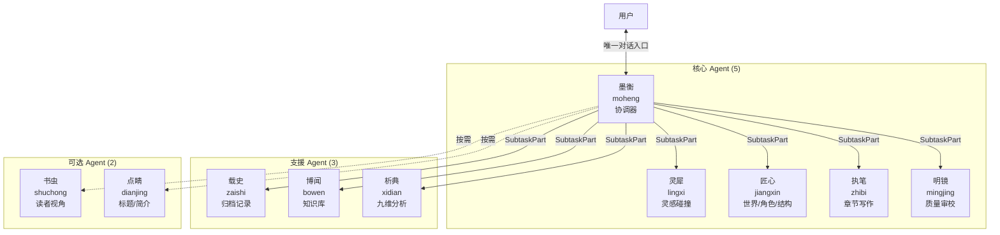
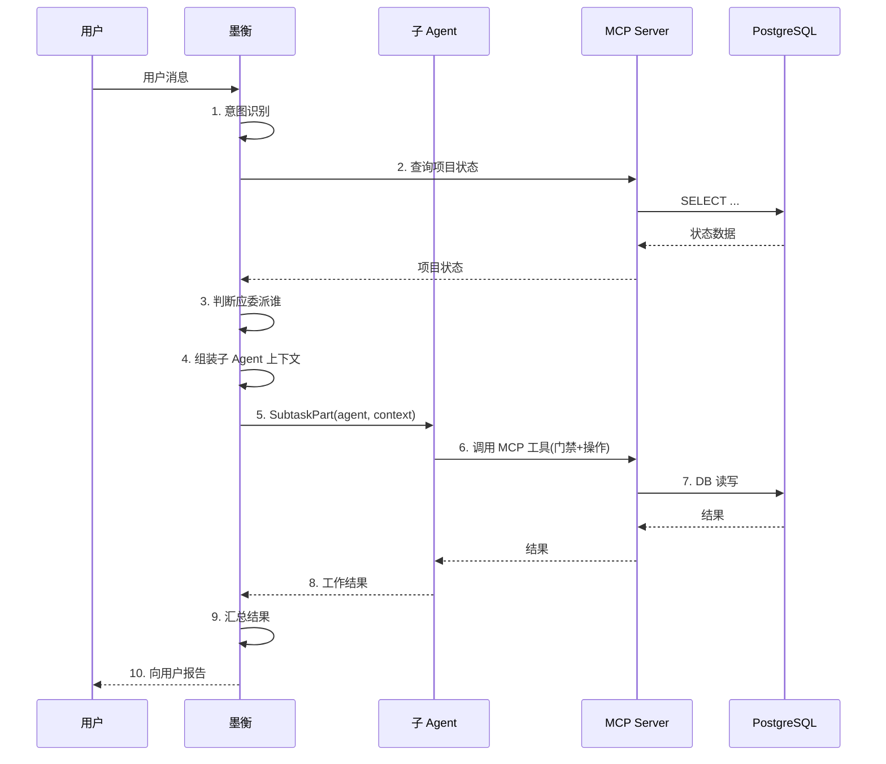
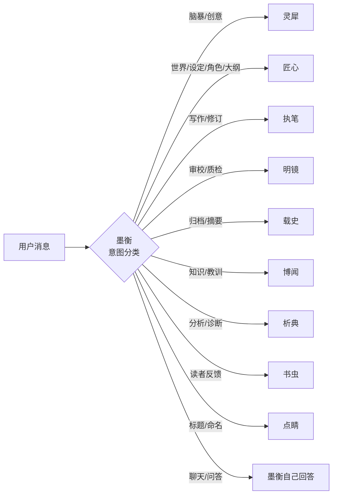
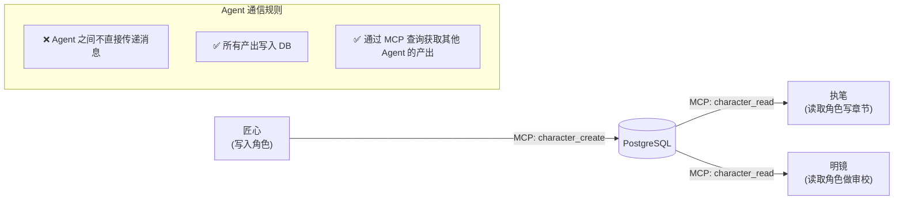
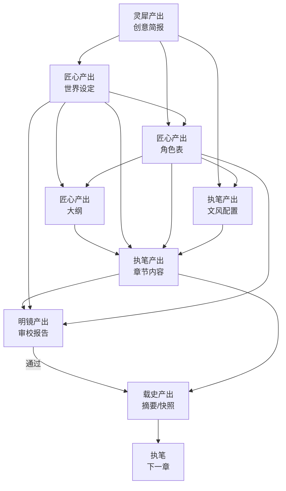
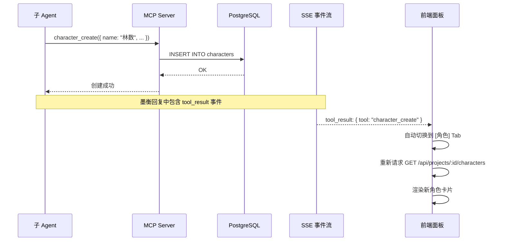

# S5 — Agent 协作设计

> 本章描述 10 个 Agent 的角色定位、墨衡委派机制、子 Agent 产出回流、以及上下文组装策略。

---

## 1. Agent 体系总览

---

## 2. 各 Agent 详细定位

### 2.1 墨衡（moheng）— 协调器

| 属性 | 值 |
|------|-----|
| 角色 | 唯一对用户入口，全流程协调器 |
| 模型 | Claude Sonnet 4（平衡推理与速度） |
| 温度 | 0.3（低温，确保稳定判断） |
| 权限 | read + write + tools + dispatch |

**核心职责**：
1. **意图识别**：解析用户消息，判断应委派给哪个子 Agent
2. **流程引导**：按阶段推进创作，在关键节点给出建议
3. **根因判断**：审校不通过时，判断问题是写作、设定还是角色
4. **上下文组装**：为子 Agent 准备工作上下文（通过 MCP 查询）
5. **结果汇总**：子 Agent 完成后，汇总结果向用户报告
6. **冲突协调**：多个 Agent 产出矛盾时，做最终裁决

### 2.2 灵犀（lingxi）— 灵感碰撞

| 属性 | 值 |
|------|-----|
| 角色 | 创意发散与聚焦 |
| 模型 | Claude Sonnet 4 |
| 温度 | 0.9（高温，鼓励创意发散） |
| 权限 | read + write + tools |

**工作模式（三阶段）**：
1. **发散**：生成 5-8 个创意方向
2. **聚焦**：提炼核心冲突与独特卖点
3. **结晶**：形成结构化创意简报（Creative Brief）

### 2.3 匠心（jiangxin）— 世界/角色/结构

| 属性 | 值 |
|------|-----|
| 角色 | 世界观设计、角色设计、大纲规划 |
| 模型 | Claude Sonnet 4 |
| 温度 | 0.5（中温，平衡创意与结构性） |
| 权限 | read + write + tools |

**三大设计领域**：
- **世界观**：开放式子系统（力量/社会/阵营/地点/术语），自洽检查
- **角色**：四维心理模型（WANT/NEED/LIE/GHOST），关系网络，成长弧线
- **结构**：弧段划分，章节详案，Plantser Brief

### 2.4 执笔（zhibi）— 章节写作

| 属性 | 值 |
|------|-----|
| 角色 | 章节内容生成 |
| 模型 | Claude Sonnet 4 |
| 温度 | 动态（0.5-0.85，按章节类型调整） |
| 权限 | read + write + tools |

**关键能力**：
- 风格引擎：混合格式（YAML 约束 + 散文描述 + 示例段落）
- 温度场景化：5 种章节类型对应不同温度范围
- 多版本择优：可生成多版本供选择
- 修订模式：基于审校反馈局部修订（非全文重写）

### 2.5 明镜（mingjing）— 质量审校

| 属性 | 值 |
|------|-----|
| 角色 | 四轮审校 |
| 模型 | Claude Sonnet 4 |
| 温度 | 0.2（极低温，确保严格一致） |
| 权限 | read + tools |

**四轮审校**：
1. AI 味检测（Burstiness ≥ 0.3）
2. 逻辑一致性（对比 DB 数据）
3. 文学质量（RUBRIC ≥ 7.5）
4. 读者体验（可选）

### 2.6 载史（zaishi）— 归档记录

| 属性 | 值 |
|------|-----|
| 角色 | 章节归档、摘要生成、状态快照 |
| 模型 | Claude Haiku（初筛）+ Sonnet（归档） |
| 温度 | 0.3 |
| 权限 | read + write + tools |

**工作内容**：章节摘要、角色状态快照、伏笔追踪更新、时间线更新、弧段摘要

### 2.7 博闻（bowen）— 知识库

| 属性 | 值 |
|------|-----|
| 角色 | 知识库管理与查询 |
| 模型 | Claude Haiku |
| 温度 | 0.3 |
| 权限 | read + write + tools |

**五类知识**：写作技巧、题材知识、风格专项、经验教训、析典沉淀

### 2.8 析典（xidian）— 九维分析

| 属性 | 值 |
|------|-----|
| 角色 | 作品质量深度分析 |
| 模型 | Claude Sonnet 4 |
| 温度 | 0.4 |
| 权限 | read + tools |

**九维**：叙事结构、角色设计、世界观、伏笔、节奏张力、爽感机制、文风指纹、对话声音、章末钩子

### 2.9 书虫（shuchong）— 读者视角（可选）

| 属性 | 值 |
|------|-----|
| 角色 | 模拟目标读者反馈 |
| 模型 | Claude Haiku |
| 温度 | 0.7 |
| 权限 | read |

### 2.10 点睛（dianjing）— 标题/简介（可选）

| 属性 | 值 |
|------|-----|
| 角色 | 生成书名、章节名、简介、宣传语 |
| 模型 | Claude Sonnet 4 |
| 温度 | 0.8 |
| 权限 | read + write + tools |

---

## 3. 墨衡委派机制

### 3.1 委派流程

### 3.2 意图 → Agent 映射

### 3.3 上下文组装策略

墨衡为子 Agent 组装上下文时，根据任务类型查询不同的 DB 数据：

| 子 Agent | 上下文内容 |
|----------|-----------|
| 灵犀 | 项目基本信息 + 用户原始想法 |
| 匠心(世界) | 创意简报 + 已有世界设定(如有) |
| 匠心(角色) | 创意简报 + 世界设定 + 已有角色(如有) |
| 匠心(大纲) | 创意简报 + 世界设定 + 角色表 |
| 执笔(写作) | Brief + 前文摘要 + 世界设定 + 角色状态 + 伏笔 + 文风 + 教训 |
| 执笔(修订) | 章节内容 + 审校反馈 + 文风 + 教训 |
| 明镜 | 章节内容 + 角色设定 + 世界设定 + 前文摘要 + 通过标准 |
| 载史 | 章节内容 + 角色表 + 伏笔列表 + 时间线 |
| 析典 | 多章节内容 + 角色表 + 世界设定 + 弧段大纲 |

---

## 4. Agent 间通信模型

### 4.1 通过 DB 通信（核心原则）

### 4.2 数据依赖图

---

## 5. 产出回流机制

### 5.1 子 Agent → DB → 面板

### 5.2 面板 Tab 对应的 Agent 产出

| Tab | 产出 Agent | 数据表 |
|-----|-----------|--------|
| 脑暴 | 灵犀 | `project_documents` |
| 设定 | 匠心 | `world_settings`, `locations`, `glossary_entries` |
| 角色 | 匠心 | `characters`, `character_relationships`, `character_states` |
| 大纲 | 匠心 | `outlines`, `arcs` |
| 章节 | 执笔 | `chapters`, `chapter_versions` |
| 审校 | 明镜 | `project_documents` (审校报告) |
| 分析 | 析典 | `project_documents` (分析报告) |
| 知识库 | 博闻 | `knowledge_entries`, lessons |

---

## 6. 模型配置策略

### 6.1 跨模型族原则

| 原则 | 说明 |
|------|------|
| 不同 Agent 可用不同模型 | 匠心用 Sonnet（需要创意），载史用 Haiku（节省成本） |
| 写作用最好的模型 | 执笔、灵犀使用最高质量模型 |
| 审校独立模型族 | 明镜避免与执笔使用同一模型，减少"自己审自己"偏差 |
| 成本分级 | 高频低复杂度任务用便宜模型，低频高复杂度用贵模型 |

### 6.2 温度场景化

| 章节类型 | 温度范围 | 理由 |
|----------|----------|------|
| 日常章节 | 0.7-0.8 | 需要自然的日常对话 |
| 战斗章节 | 0.6-0.7 | 需要紧凑但不失创意的动作描写 |
| 情感章节 | 0.75-0.85 | 需要细腻的情感表达 |
| 悬疑章节 | 0.5-0.6 | 需要严格的逻辑推理 |
| 高潮章节 | 0.65-0.75 | 平衡戏剧张力与合理性 |
