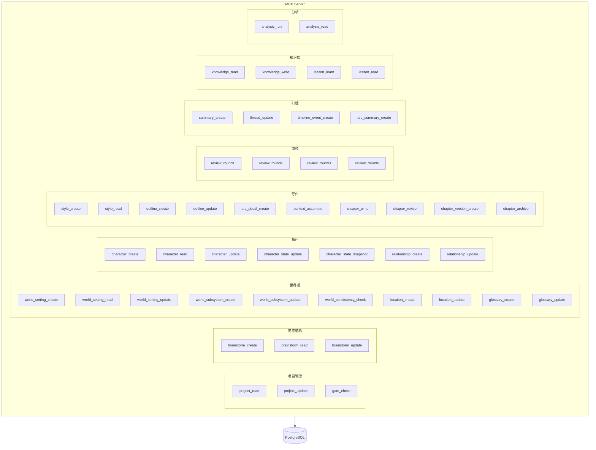
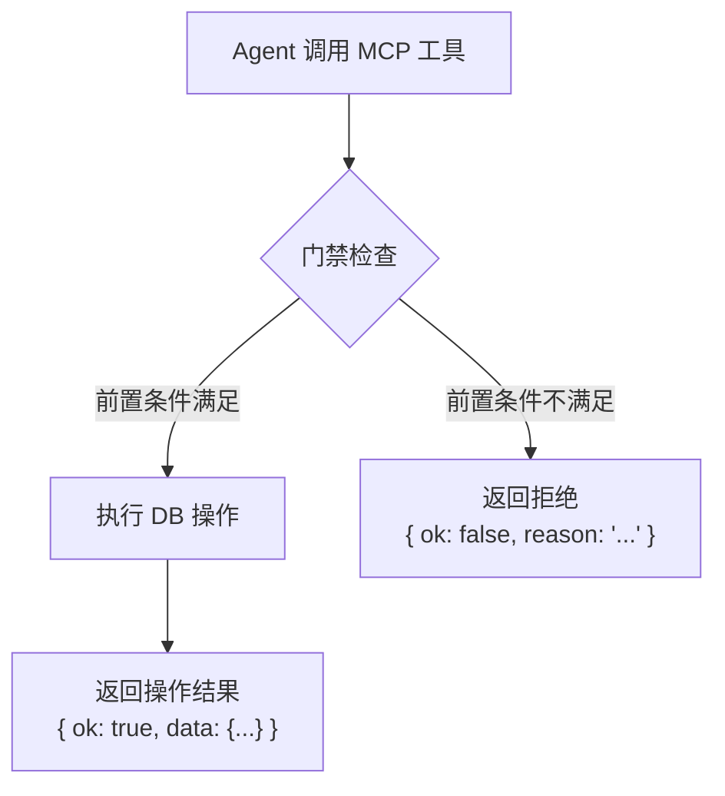

# S6 — MCP 工具与门禁设计

> 本章定义所有 MCP 工具的接口、门禁前置条件和分类体系。

---

## 1. MCP 工具体系总览



---

## 2. 门禁机制设计

### 2.1 门禁架构



### 2.2 门禁实现原则

1. **门禁在工具内部**——每个 MCP 工具在执行前先检查前置条件
2. **不依赖外部状态机**——门禁逻辑全部基于 DB 查询，无内存状态
3. **拒绝时说明原因**——让 Agent 知道缺什么，可以告知用户或自动补救
4. **幂等性**——重复调用同一工具不产生副作用

### 2.3 门禁级别

| 级别 | 含义 | 失败行为 |
|------|------|----------|
| **HARD** | 必须满足，否则操作无意义 | 拒绝 + 返回原因 |
| **SOFT** | 建议满足，但可以跳过 | 警告 + 仍然执行 |
| **INFO** | 提示性信息 | 执行 + 附带提示 |

---

## 3. 工具接口定义

### 3.1 项目管理

#### `project_read`

```typescript
// 读取项目基本信息与状态
input: { projectId: string }
output: {
  ok: boolean,
  data: {
    id: string,
    name: string,
    genre: string,
    phase: "brainstorm" | "world" | "character" | "outline" | "writing" | "completed",
    chapterCount: number,
    wordCount: number,
    createdAt: string,
    updatedAt: string
  }
}
gate: 无（任何阶段可读）
```

#### `project_update`

```typescript
// 更新项目基本信息
input: { projectId: string, name?: string, genre?: string, phase?: string }
output: { ok: boolean }
gate: 无
```

#### `gate_check`

```typescript
// 通用门禁检查（墨衡在委派前调用）
input: { 
  projectId: string,
  action: string,  // "world_design" | "character_design" | "chapter_write" | ...
  params?: Record<string, any>  // 如 { chapterNumber: 1 }
}
output: {
  ok: boolean,
  passed: string[],    // 已满足的条件
  failed: string[],    // 未满足的条件
  suggestions: string[] // 建议动作
}
gate: 无（这个工具本身就是门禁检查器）
```

### 3.2 灵感脑暴

#### `brainstorm_create`

```typescript
input: { 
  projectId: string,
  type: "diverge" | "focus" | "brief",
  content: string  // 结构化 JSON 字符串
}
output: { ok: boolean, documentId: string }
gate: 无（灵感阶段无前置条件）
```

#### `brainstorm_read`

```typescript
input: { projectId: string, type?: string }
output: { ok: boolean, data: Document[] }
gate: 无
```

#### `brainstorm_update`

```typescript
input: { projectId: string, documentId: string, content: string }
output: { ok: boolean }
gate: 无
```

### 3.3 世界观

#### `world_setting_create`

```typescript
input: {
  projectId: string,
  section: "base" | "custom",
  name: string,
  content: string
}
output: { ok: boolean, settingId: string }
gate: 
  HARD: 创意简报已存在（brainstorm type="brief" 存在）
```

#### `world_subsystem_create`

```typescript
input: {
  projectId: string,
  name: "power_system" | "social_structure" | "factions" | string,
  content: string
}
output: { ok: boolean, subsystemId: string }
gate:
  HARD: 基础世界设定已存在
```

#### `world_consistency_check`

```typescript
input: { projectId: string }
output: {
  ok: boolean,
  data: {
    passed: boolean,
    issues: Array<{
      type: "contradiction" | "missing" | "circular",
      description: string,
      severity: "critical" | "warning" | "info",
      affected: string[]  // 涉及的设定/术语 ID
    }>
  }
}
gate:
  HARD: 至少有一个世界设定存在
```

#### `location_create`

```typescript
input: {
  projectId: string,
  name: string,
  description: string,
  connections?: Array<{ targetId: string, type: string, distance?: string }>
}
output: { ok: boolean, locationId: string }
gate:
  HARD: 基础世界设定已存在
```

#### `glossary_create`

```typescript
input: {
  projectId: string,
  entries: Array<{ term: string, definition: string, category?: string }>
}
output: { ok: boolean, count: number }
gate:
  HARD: 基础世界设定已存在
```

### 3.4 角色

#### `character_create`

```typescript
input: {
  projectId: string,
  name: string,
  role: "protagonist" | "deuteragonist" | "antagonist" | "supporting" | "minor",
  profile: {
    want: string,
    need: string,
    lie: string,
    ghost: string,
    personality: string,
    background: string,
    appearance?: string,
    speechPattern?: string,
    goals: string[]
  }
}
output: { ok: boolean, characterId: string }
gate:
  HARD: 世界设定已存在
  SOFT: 至少一个力量体系子系统已定义（警告但允许）
```

#### `character_state_update`

```typescript
// 章节写作后更新角色当前状态
input: {
  projectId: string,
  characterId: string,
  chapterNumber: number,
  state: {
    location?: string,
    mood?: string,
    relationships_changed?: Array<{ targetId: string, change: string }>,
    knowledge_gained?: string[],
    lie_progress?: number  // 0-1, LIE 对峙进度
  }
}
output: { ok: boolean }
gate:
  HARD: 该角色存在
  HARD: 该章节已写入
```

#### `relationship_create`

```typescript
input: {
  projectId: string,
  char1Id: string,
  char2Id: string,
  type: "ally" | "enemy" | "mentor" | "student" | "family" | "rival" | "lover" | string,
  description: string
}
output: { ok: boolean, relationshipId: string }
gate:
  HARD: 两个角色都已存在
```

### 3.5 写作

#### `style_create`

```typescript
input: {
  projectId: string,
  config: {
    preset?: string,  // 9 种预设之一
    yaml: string,     // YAML 约束
    prose: string,    // 散文描述
    examples: string[]  // 示例段落
  }
}
output: { ok: boolean, styleId: string }
gate:
  HARD: 创意简报已存在
  SOFT: 至少 1 个主要角色已定义
```

#### `outline_create`

```typescript
input: {
  projectId: string,
  synopsis: string,
  arcs: Array<{
    title: string,
    startChapter: number,
    endChapter: number,
    coreConflict: string,
    climax: string
  }>
}
output: { ok: boolean, outlineId: string }
gate:
  HARD: 世界设定已存在
  HARD: 至少 2 个主要角色已定义
  HARD: 角色关系网络已建立（至少 1 个关系）
```

#### `context_assemble`

```typescript
// 为执笔组装写作上下文（核心工具）
input: {
  projectId: string,
  chapterNumber: number,
  mode?: "write" | "revise" | "rewrite"  // 默认 "write"
}
output: {
  ok: boolean,
  data: {
    brief: string,           // 章节 Plantser Brief
    worldContext: string,     // 相关世界设定
    characterStates: string,  // 涉及角色状态
    previousSummary: string | null,  // 前文摘要
    styleConfig: string,     // 文风配置
    lessons: string[],       // 相关写作教训
    threads: string[],       // 活跃伏笔
    arcContext: string,       // 弧段上下文
    tokenBudget: Record<string, number>  // 各部分 token 分配
  }
}
gate:
  HARD: 大纲已存在
  HARD: 该章节的 Brief 已定义
  HARD: 文风配置已确定
```

#### `chapter_write`

```typescript
input: {
  projectId: string,
  chapterNumber: number,
  title: string,
  content: string,
  wordCount?: number
}
output: { ok: boolean, chapterId: string, version: number }
gate:
  HARD: 大纲已存在
  HARD: 章节详案(Brief)已定义
  HARD: 角色状态已就绪（涉及角色有状态记录或是第一章）
  HARD: 文风配置已确定
  HARD: 该章节无 "archived" 状态版本（防止覆盖已审校版本）
  SOFT: 世界设定已通过自洽检查
```

#### `chapter_revise`

```typescript
// 基于审校反馈修订章节（局部修改，非全文重写）
input: {
  projectId: string,
  chapterNumber: number,
  feedback: Array<{
    issue: string,
    severity: string,
    suggestion: string,
    lineRange?: [number, number]
  }>,
  revisedContent: string
}
output: { ok: boolean, version: number }
gate:
  HARD: 该章节已存在
  HARD: 有对应的审校报告
```

#### `chapter_archive`

```typescript
input: { projectId: string, chapterNumber: number }
output: { ok: boolean }
gate:
  HARD: 该章节最新版本审校通过
  HARD: 摘要已生成（载史完成归档）
```

### 3.6 审校

#### `review_round1` / `review_round2` / `review_round3` / `review_round4`

```typescript
// 四轮审校接口统一格式
input: { projectId: string, chapterNumber: number }
output: {
  ok: boolean,
  data: {
    round: 1 | 2 | 3 | 4,
    passed: boolean,
    score?: number,          // Round 3 有综合评分
    metrics?: Record<string, number>,  // 各项指标
    issues: Array<{
      issue: string,
      severity: "critical" | "major" | "minor" | "suggestion",
      evidence: string,
      suggestion: string,
      expected_effect: string
    }>
  }
}
gate:
  HARD: 该章节内容已存在
  HARD(Round 2-4): 前一轮已完成
```

### 3.7 归档

#### `summary_create`

```typescript
input: {
  projectId: string,
  chapterNumber: number,
  content: string  // 章节摘要文本
}
output: { ok: boolean }
gate:
  HARD: 该章节审校通过
```

#### `thread_update`

```typescript
// 更新伏笔追踪
input: {
  projectId: string,
  chapterNumber: number,
  threads: Array<{
    threadId?: string,  // 已有伏笔 ID（更新用）
    action: "create" | "advance" | "resolve",
    title: string,
    description: string
  }>
}
output: { ok: boolean }
gate:
  HARD: 该章节审校通过
```

#### `timeline_event_create`

```typescript
input: {
  projectId: string,
  chapterNumber: number,
  events: Array<{
    timestamp: string,  // 故事内时间
    description: string,
    characters: string[]  // 涉及角色 ID
  }>
}
output: { ok: boolean }
gate:
  HARD: 该章节审校通过
```

### 3.8 知识库

#### `knowledge_read` / `knowledge_write`

```typescript
// 知识条目读写
input: {
  projectId: string,
  category: "technique" | "genre" | "style" | "lesson" | "analysis",
  query?: string,    // 读取时的查询条件
  content?: string,  // 写入时的内容
  tags?: string[]    // 标签
}
output: { ok: boolean, data?: KnowledgeEntry[] }
gate: 无
```

#### `lesson_learn`

```typescript
// 从用户修正中学习
input: {
  projectId: string,
  source: string,  // 来源描述（如"第12章用户修改"）
  pattern: string, // 问题模式
  correction: string, // 修正方式
  category: string
}
output: { ok: boolean, lessonId: string }
gate: 无
```

### 3.9 分析

#### `analysis_run`

```typescript
// 启动析典九维分析
input: {
  projectId: string,
  scope: "chapter" | "arc" | "full",
  range?: { start: number, end: number }  // 章节范围
}
output: {
  ok: boolean,
  data: {
    dimensions: Record<string, {
      score: number,
      analysis: string,
      suggestions: string[]
    }>,
    overall: number,
    topIssues: string[]
  }
}
gate:
  HARD: 指定范围内至少有 1 章已归档
```

---

## 4. 完整门禁依赖图

```mermaid
graph TD
  brainstorm["✅ 创意简报存在"]
  
  world_base["✅ 基础世界设定"]
  world_sub["✅ 力量体系子系统"]
  world_check["✅ 自洽检查通过"]
  
  char_main["✅ ≥2 主要角色"]
  char_rel["✅ 关系网络建立"]
  char_1["✅ ≥1 主要角色"]
  
  style["✅ 文风配置确定"]
  outline["✅ 大纲已存在"]
  brief["✅ 章节 Brief 已定义"]
  
  chapter["✅ 章节内容已写入"]
  review_pass["✅ 审校通过"]
  summary["✅ 摘要已生成"]
  
  brainstorm --> world_base
  world_base --> world_sub
  world_sub -.->|"SOFT"| char_main
  world_base --> char_main
  char_main --> char_rel
  
  brainstorm --> style
  char_1 -.->|"SOFT"| style
  
  world_base --> outline
  char_main --> outline
  char_rel --> outline
  
  outline --> brief
  brief --> chapter
  style --> chapter
  world_check -.->|"SOFT"| chapter
  
  chapter --> review_pass
  review_pass --> summary
  summary --> archive["✅ 归档完成"]
```

---

## 5. 错误返回格式

所有 MCP 工具的错误返回遵循统一格式：

```typescript
interface MCPToolResult {
  ok: boolean;
  data?: any;
  error?: {
    code: "GATE_FAILED" | "NOT_FOUND" | "CONFLICT" | "INTERNAL",
    message: string,
    gate_details?: {
      passed: string[],
      failed: string[],
      suggestions: string[]
    }
  }
}
```

**示例**：
```json
{
  "ok": false,
  "error": {
    "code": "GATE_FAILED",
    "message": "无法开始写作第3章",
    "gate_details": {
      "passed": ["大纲已存在", "文风已配置"],
      "failed": ["章节Brief未定义"],
      "suggestions": ["请先让匠心为第3章生成详案"]
    }
  }
}
```
