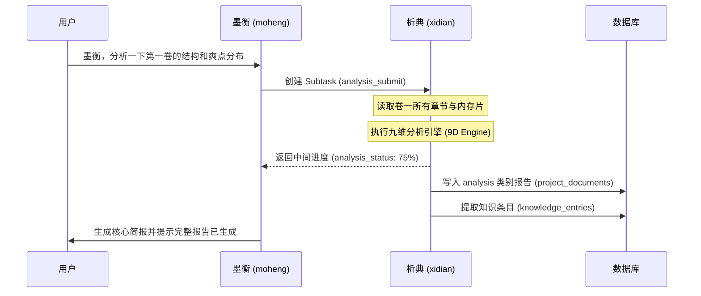
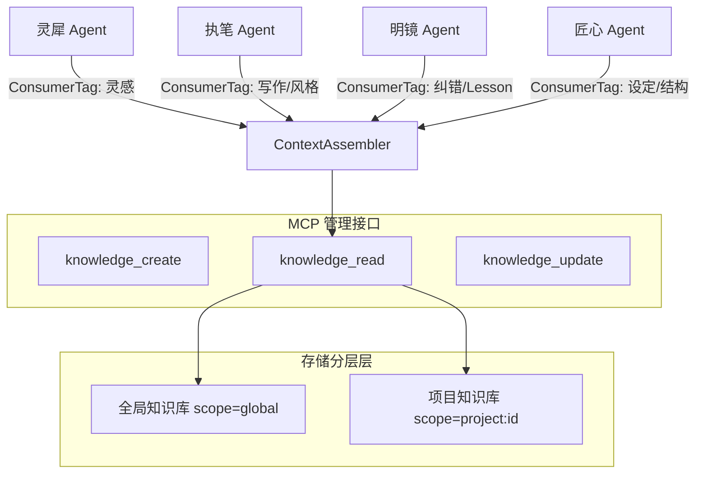
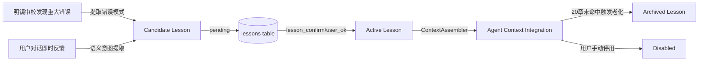
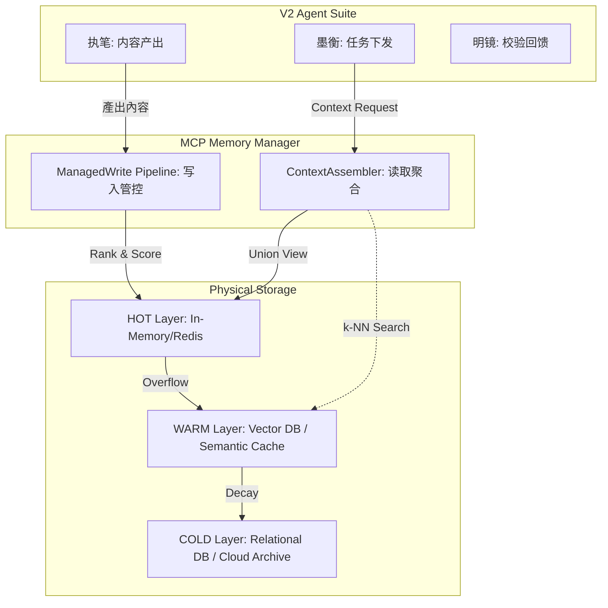
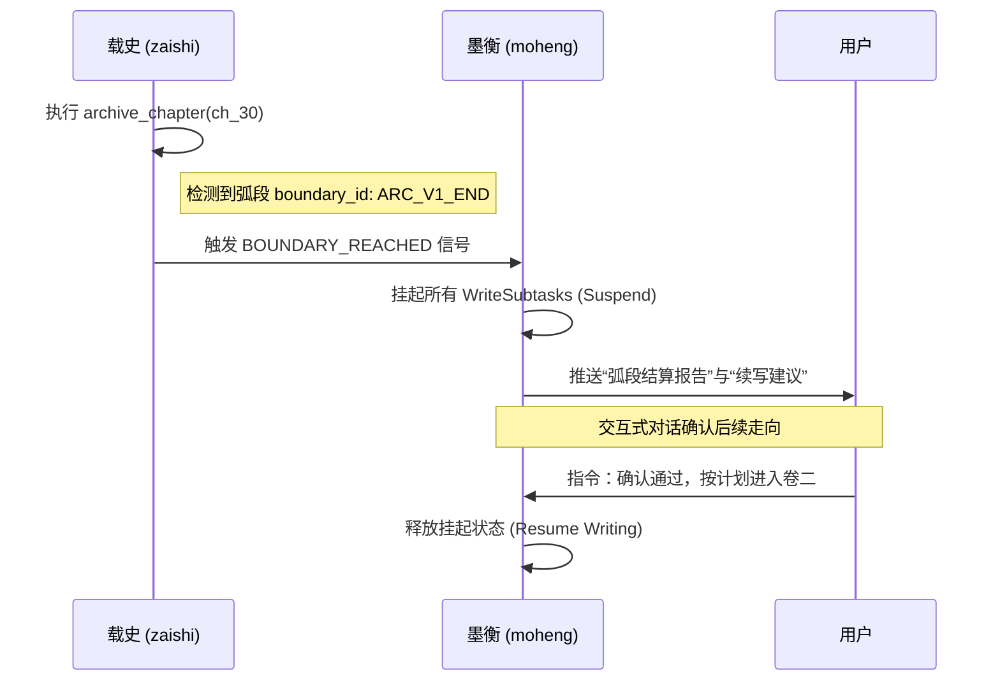

# S7 — 副链路设计

> 一句话导读：副链路（Side-chains）是墨染 V2 架构的“血液净化与免疫系统”，负责深度分析、知识沉淀、自学习进化、螺旋风控与成本审计。

---

## 1. 析典九维分析完整流程

析典（xidian）是 V2 架构中的高级诊断引擎，旨在通过多维度的文学理论框架对作品进行全方位体检，并将碎片化的叙事经验转化为可复用的知识条目。

### 1.1 触发机制
- **弧段完成触发**：载史（zaishi）在归档弧段最后一章时自动触发，对全卷进行复盘。
- **用户手动触发**：用户通过墨衡（moheng）指令（如“分析一下最近三章的伏笔”）即时启动。
- **周期性诊断**：系统配置的里程碑触发，通常为每 5 万字（约 20-25 章）执行一次全量体检。
- **阈值触发**：当 `consistency_state` 记录的未解决线索超过 20 条时，自动提示用户启动清理分析。

### 1.2 九维分析维度与学术溯源
析典采用深度垂直的分析模型，每个维度均挂钩成熟的学术理论，确保分析报告具有专业指导价值：

1.  **叙事结构** (Narrative Structure)：
    -   **理论支撑**：热奈特（Genette）叙事话语（叙述时间、视角、层级）、托多罗夫（Todorov）平衡理论、坎贝尔（Campbell）英雄之旅、普罗普（Propp）叙事功能。
    -   **分析重点**：叙述时间（停顿、跳越、概括）的比例、叙述视角变换的平滑度、结构平衡性（Setup-Conflict-Resolution）的节奏把握。
2.  **角色设计** (Character Design)：
    -   **理论支撑**：九型人格 (Enneagram)、普罗普 (Propp) 角色职能、角色五维模型 (GHOST/WOUND/LIE/WANT/NEED)。
    -   **分析重点**：角色弧光完整度（人物在剧情压力下的转变）、动机逻辑链（是否有降智行为）、角色声音（Voice）的一致性与差异化。
3.  **世界观构建** (Worldbuilding)：
    -   **理论支撑**：布兰登·桑德森 (Sanderson) 三定律、力量体系拓扑学、莫尔 (More) 乌托邦结构。
    -   **分析重点**：逻辑自洽性（背景规则是否被打破）、背景渗透效率（是否大段“说明文字”）、资源/权力分配的博弈平衡。
4.  **伏笔与线索** (Planting & Payoff)：
    -   **理论支撑**：契诃夫之枪 (Chekhov's Gun)、罗伯特·麦基 (McKee) Setup-Payoff 机制、红鲱鱼 (Red Herring) 误导技术。
    -   **分析重点**：线索覆盖率（埋下的线索是否被有效利用）、回收有效性（读者是否能产生“恍然大悟”感）、伏笔埋没深度。
5.  **节奏与张力** (Pacing & Tension)：
    -   **理论支撑**：德怀特·斯旺 (Swain) Scene-Sequel 循环模型、张力曲线模型、热奈特叙事速度。
    -   **分析重点**：行动（Scene）与反思（Sequel）的配比、情绪峰值（High Tension Points）分布、叙事“垃圾时间”检测。
6.  **爽感机制** (Gratification Mechanism)：
    -   **理论支撑**：刘飞宏网文爽感体系、陈紫琼金手指类型学、期待感心理契约。
    -   **分析重点**：期待感建立周期、打脸/爆发的延迟满足感（Delay Gratification）、金手指价值反馈强度、情绪补偿机制。
7.  **文风指纹** (Stylistic Fingerprint)：
    -   **理论支撑**：道格拉斯·比伯 (Biber) 多维分析法、计算文体学 (Computational Stylistics)、CRIE 可读性指数。
    -   **分析重点**：词频偏好（是否重复使用同一形容词）、句式复杂度、意象色彩谱系、感官词（视觉、嗅觉、听觉）占比。
8.  **对话与声音** (Dialogue & Voice)：
    -   **理论支撑**：角色声音辨识度分析、埃尔森 (Elson) 对话归属分析（Dialogue Attribution）。
    -   **分析重点**：对白性格化程度（不看名字是否知道谁在说话）、潜台词（Subtext）占比、信息密度均衡。
9.  **章末钩子** (Chapter Hooks)：
    -   **理论支撑**：起点编辑方法论、悬念设置分类学、断章技术。
    -   **分析重点**：留存驱动力（Hook Strength）、钩子类型多样性（信息钩、情感钩、反转钩）、断章节奏感。

### 1.3 报告存储与知识蒸馏
-   **分析报告 (Report)**：全量报告写入 `project_documents` 表，`category='analysis'`，支持 HTML/Markdown 导出。
-   **知识蒸馏 (Distillation)**：析典将分析中发现的全局规律（如“在快节奏打斗中加入意识流心理活动会导致读者反馈下降”）转化为 `knowledge_entries`。
-   **Consumer Tags (消费者标签)**：每个条目打上标签（灵犀、匠心、执笔、明镜），决定哪些 Agent 应该加载这些经验。
    -   例如：标签为 `[执笔, 明镜]` 的条目，将在执笔写稿和明镜审稿时作为强制约束加载。

### 1.4 流程交互图


---

## 2. 知识库管理流程

知识库是 Agent 族群的“外挂大脑”，确保创作不仅符合大纲，更符合特定题材、风格和历史经验。

### 2.1 五大知识类别详解
1.  **写作技巧** (Technique)：通用创作理论。
    -   *示例*：古风权谋文的称谓规则、第一人称叙事限制。
2.  **题材知识** (Genre)：特定背景设定。
    -   *示例*：量子物理基础（硬科幻用）、道教九品等级体系（修仙用）。
3.  **风格专项** (Style)：用户指定的文风模仿参数。
    -   *示例*：模仿《雪中悍刀行》的草蛇灰线、模仿《诡秘之主》的维多利亚氛围。
4.  **经验教训** (Lessons)：由 Lessons 系统从实操纠错中提取。
    -   *示例*：避免在战斗中描写主角“揉鼻子”（用户特定忌讳）。
5.  **析典沉淀** (Analysis)：析典从作品本身的成功经验中提取。
    -   *示例*：本作品中“妹妹”角色的登场能显著拉高该章节的爽感评价。

### 2.2 MCP 工具接口规范
V2 通过标准的 MCP 接口实现知识库的 CRUD 闭环，确保 Agent 逻辑与数据存储解耦：
-   `knowledge_create`: 新增条目，支持指定 scope（global 共享库或 project 私有库）及 consumer_tags 权限配置。
-   `knowledge_read`: 根据 query 向量匹配和 consumer_tags 进行动态过滤检索。
-   `knowledge_update`: 对已有条目进行版本迭代，支持 `knowledge_versions` 追踪。
-   `knowledge_delete`: 逻辑删除（Soft Delete），标记为 `stale` 状态。

### 2.3 加载策略与 Token 预算分配
`ContextAssembler` 在组装 Agent 提示词时，会根据策略控制知识库条目的注入：

| Type | Strategy | Consumer | Reason |
| :--- | :--- | :--- | :--- |
| 写作技巧 | Eager (always) | 执笔 | 核心准则需时刻保持，防止 AI 自作主张修改写作底层逻辑 |
| 题材知识 | Selective (by genre) | 执笔, 匠心 | 仅加载与当前场景、地图关键词命中相关的条目，节省带宽 |
| 风格专项 | On-demand | 执笔 | 根据当前章节类型（如：过渡章、高潮章、日常章）差异化加载 |
| 经验教训 | Filtered | 执笔, 明镜 | 仅加载与当前章节可能触发的问题标签匹配的活跃教训 |
| 析典沉淀 | Tagged (by consumers) | 灵犀, 匠心, 执笔, 明镜 | 按条目本身的消费者标签精准推送给对应的 Agent 角色 |

**Token 预算分配表 (Token Budget Allocation)**：

| Agent | Total Budget | KB % | 析典沉淀 % | Explanation |
| :--- | :--- | :--- | :--- | :--- |
| 灵犀 (lingxi) | ~16K | ~20% (3.2K) | ~15% (2.4K) | 灵感碰撞阶段最需要大量多元化的素材刺激 |
| 匠心 (jiangxin) | ~32K | ~15% (4.8K) | ~10% (3.2K) | 规划阶段侧重于结构性知识和设定一致性校验 |
| 执笔 (zhibi) | ~64K | ~15% (9.6K) | ~5% (3.2K) | 极大部分预算留给章节上下文，知识仅作宏观约束 |
| 明镜 (mingjing) | ~32K | ~10% (3.2K) | ~5% (1.6K) | 审校主要依据规则和 Lesson 库进行合规性对比 |

### 2.4 知识库分层架构图


---

## 3. Lessons 自学习系统

Lessons 系统负责捕捉创作过程中的实时反馈，实现 Agent 的自发进化和用户偏好的精准对齐。

### 3.1 核心来源详解
1.  **明镜审计驱动 (Review-Driven)**：明镜在审校流程中标记为 `MAJOR` 或 `CRITICAL` 级别的错误（如：人设崩塌、逻辑硬伤、爽感断层），系统自动将错误片段与修正建议提取为 `candidate_lesson`。
2.  **用户对话纠错 (User-Driven)**：用户直接在对话框指出：“这一章对话太水了”或“不要给主角加这些莫名其妙的心理活动”。墨衡（moheng）会通过语义提取，将这些抱怨转化为具体的写作规则。

### 3.2 生命周期管理 (Lifecycle)
-   **pending (待确认)**：初次捕获，标记为草案。
-   **active (激活)**：用户显式点击确认，或经过三章验证未再次触发该错误的“准激活”状态。
-   **archived (归档)**：当一个 Lesson 在连续 20 章内未被再次命中（说明模型已习得或该问题已不存在），自动移出实时上下文。
-   **resolved (已解决)**：针对特定 Bug 的修复，解决后永久存档。

### 3.3 V2 对话确认流程示例
墨衡在对话中主动引导用户沉淀知识：
> **用户**：这一章执笔把主角写得太圣母了，他应该果断杀伐。
> **墨衡**：明白了。我已记录这一反馈。是否要将其作为本项目的通用规则：“在面临敌对目标时，主角必须优先采取果断的反击措施，禁止任何道德纠结描写”？
> **用户**：是的，以后都按这个写。
> **墨衡**：[系统操作] 已将该教训加入 Lessons 库（ID: LS_092），状态：Active。

### 3.4 状态流转图


---

## 4. 螺旋检测三种模式

螺旋检测是 V2 架构的稳定性熔断器，专门针对 AI Agent 在极端负载或逻辑死区时可能产生的异常行为。

### 4.1 模式 1：审校螺旋 (Review Spiral)
-   **定义**：同一章节在“执笔 -> 明镜 -> 执笔”的闭环中审校超过 3 轮，且每一轮的评分提升率低于 5%。
-   **处理机制**：墨衡自动中断重写循环，强制跳出。
-   **用户干预**：系统提供 3 个版本让用户手动挑选，并分析卡壳原因（通常是执笔引导词与明镜校验规则冲突）。

### 4.2 模式 2：膨胀螺旋 (Inflation Spiral)
-   **定义**：单类内存片（如 `consistency_state`）达到 Cap 容量限制，但在执行“按活跃度驱逐”后，新产生的叙事信息依然由于语义冗余导致存储空间无法释放。
-   **处理机制**：强制冻结写入权限，向用户生成压力报告（Pressure Report），要求人工删减过期线索或升级项目额度。

### 4.3 模式 3：矛盾螺旋 (Contradictory Spiral)
-   **定义**：博闻（bowen）在执行知识一致性校验时，发现同一实体（角色、地点、重要物品）在当前章节产生了与历史记录完全互斥的逻辑状态。
-   **现象**：例如角色已归于死亡状态，但新的章节描写显示其活跃；或者世界观设定“无法瞬移”，但角色在本章发生了瞬间位移。
-   **处理机制**：锁定该实体的所有更新操作，高亮冲突位置，由用户进行最终裁决（是历史记错了，还是本章写错了）。

### 4.4 压力报告 (Pressure Report) YAML 示例
```yaml
type: SPIRAL_ALARM
mode: INFLATION
severity: CRITICAL
timestamp: 2026-04-19T14:30:00Z
target_agent: zhibi
details:
  category: consistency_state (实体状态机)
  current_usage: 22500 chars
  cap_limit: 20000 chars
  consecutive_eviction_failures: 3
  last_operation: archive_chapter_pipeline
diagnostics:
  hot_buffer_status: OVERFLOW
  potential_cause: "角色 A 的内心独白在多章内存片中高度重复，驱逐算法识别为高权重常驻内容"
action_taken: AUTO_INTERRUPT_TRIGGERED
user_options:
  - id: force_evict_cold
    label: 强行将非活跃线索转入 COLD 存储 (可能导致遗忘)
  - id: semantic_merge
    label: 启动知识蒸馏，合并冗余信息
  - id: manual_prune
    label: 打开交互式面板手动清理
```

---

## 5. UNM 记忆引擎 V2 实现

V2 将 UNM (Universal Narrative Memory) 逻辑下沉到 MCP Tools 层，实现了内存的“即插即用”和高细粒度控制。

### 5.1 MemorySlice 数据模型
```typescript
interface MemorySlice {
  id: string;                // 全局唯一 ID
  projectId: string;         // 所属项目
  category: 'guidance' | 'world' | 'characters' | 'consistency' | 'summaries' | 'outline';
  scope: string;             // 数据作用域（global / arc:1 / chapter:5 等）
  text: string;              // 核心内容
  charCount: number;         // 内容字符数（用于 Cap 计算）
  tags: string[];            // 语义标签（relevanceTags），加速检索

  // 权重与生命周期
  stability: 'CANON' | 'FIRM' | 'FLEX' | 'TEMP';  // 稳定性等级
  tier: 'HOT' | 'WARM' | 'COLD';                   // 物理存储层级
  priorityFloor: number;     // 最低优先级保底值（防止核心设定被驱逐）
  freshness: number;         // 时效性衰减因子 (1.0 → 0.0)
  referenceCount: number;    // 累计被引用次数

  // 溯源
  sourceChapter: number;     // 产生该片段的章节号
  sourceAgent: string;       // 产生该片段的 Agent（执笔/载史/匠心等）

  // 版本管理
  version: number;           // 迭代版本号
  lastUsedAt: Date;          // 最后被加载时间
}

// 注：consistency 类别的片段额外使用状态机追踪线索生命周期
type ConsistencyStatus = 'PLANTED' | 'DEVELOPING' | 'RESOLVED' | 'STALE';
```

### 5.2 六大类别成长与衰减策略详解
1.  **guidance (引导)**：**引导衰减制**。临时性的写作指令（如：本章要多写景）随章节推移 `freshness` 快速衰减。若被明镜作为“好评标准”引用，则重置新鲜度。
2.  **world (世界观)**：**Canon 保护制**。核心设定被锁定为 `HOT` 层级且不可自动驱逐。非核心设定（如路边的茶馆名字）随引用频率自动在 WARM 和 COLD 间流转。
3.  **characters (角色)**：**活跃度制**。每章节登场（被提及或有对白）则 `referenceCount` +1。若连续 5 章缺席，则热度降级。划分为 HOT（常驻主角）、WARM（重要配角）、COLD（龙套/历史人物）。
4.  **consistency (一致性)**：**状态机管理**。严格追踪线索的生命周期。从未完成的 `PLANTED` 状态到已填坑的 `RESOLVED` 状态。
5.  **summaries (摘要)**：**滑动窗口与跳跃连接**。HOT 层保持最近 3 章的 100% 细节；WARM 层保持当前弧段摘要 + 前一个弧段的全局摘要；COLD 层仅保留关键里程碑。
6.  **outline (大纲)**：**扩展上限制**。单弧段细化后的字数上限受控。若大纲节点膨胀过快，匠心（jiangxin）会强制要求用户进行节点合并，防止叙事发散。

### 5.3 容量配置表 (Cap Configuration)

| Category | HOT (实时带宽) | WARM (检索深度) | COLD (存档) | 自动驱逐策略 |
| :--- | :--- | :--- | :--- | :--- |
| guidance | 2,000 chars | 5,000 chars | ∞ | Least Recently Used (LRU) |
| world | 4,000 chars | 15,000 chars | ∞ | Frequency Based |
| characters | 6,000 chars | 30,000 chars | ∞ | Role-based Filtering |
| consistency | 3,000 chars | 20,000 chars | ∞ | Status-based (Resolved First) |
| summaries | 4,000 chars | 25,000 chars | ∞ | Chronological Sliding Window |
| outline | 5,000 chars | 10,000 chars | ∞ | Hierarchy Compaction |

### 5.4 存储管理架构图


---

## 6. 成本追踪

墨衡（moheng）作为项目的管家，承担全链路的 Token 财务审计职责，确保每一分钱都花在刀刃上。

### 6.1 Agent 调用统计
系统在 MCP Tools 调用层植入拦截器，自动统计以下 Agent 的 Token 吞吐：
-   **核心支出**：执笔 (zhibi)、明镜 (mingjing)。
-   **规划/辅助支出**：墨衡 (moheng)、灵犀 (lingxi)、匠心 (jiangxin)、载史 (zaishi)、博闻 (bowen)、析典 (xidian)。

### 6.2 成本分摊与预警报表

| Agent | Target Model | Weight | Avg. Cost/Chapter | Priority |
| :--- | :--- | :--- | :--- | :--- |
| 执笔 (zhibi) | Claude 3.5 Sonnet / GPT-4o | 60% | ~$0.20 | CRITICAL |
| 明镜 (mingjing) | GPT-4o / Claude 3 Opus | 20% | ~$0.08 | HIGH |
| 墨衡 (moheng) | GPT-4o-mini | 5% | <$0.01 | LOW |
| 其他 (Others) | DeepSeek-V3 / Llama 3 | 15% | ~$0.02 | MEDIUM |

-   **项目累计报表**：在管理控制台实时展示“项目总消耗”、“今日消耗”、“预估完本金额”。
-   **预警机制**：
    -   80% 阈值：墨衡在日常对话中插入“财务友好提示”。
    -   95% 阈值：系统建议用户开启“成本保护模式”，即自动切换到更便宜的 Flash 模型，并减少析典分析的频率。

---

## 7. 弧段边界暂停流程

这是确保大纲逻辑不走偏、作品质量不崩盘的终极控制闸门。

### 7.1 检测与触发逻辑
当载史（zaishi）在归档章节时识别到当前章节序号等于 `arc_plan` 中定义的 `end_chapter`，会通过 EventBus 广播一个 `BOUNDARY_REACHED` 事件。

### 7.2 墨衡的暂停与决策交互
接收到边界事件后，墨衡会立即锁定写作流程，并向用户推送“阶段复盘面板”：
1.  **卷终总结**：析典生成的本卷九维评估报告。
2.  **因果清算表**：博闻列出的“已挖但未填”的坑。
3.  **下一卷路演**：匠心根据本卷产出自动微调后的下一卷细化大纲。
4.  **用户强制决策**：
    -   `CONFIRM`: 确认无误，进入下一卷。
    -   `MODIFY_PLAN`: 手动修改后续大纲。
    -   `REGEN_ARC`: 效果太差，废弃整个弧段重新开始。

### 7.3 边界暂停序列图


---
文件版本：2.1.1 (V2 Core Integration)
最后更新：2026-04-19
作者：Sisyphus-Junior
