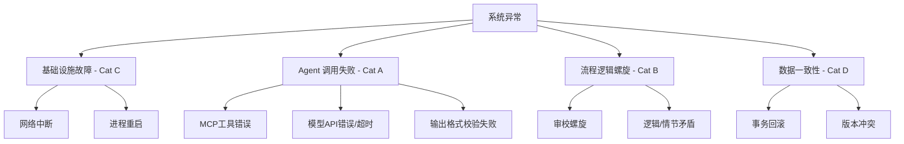
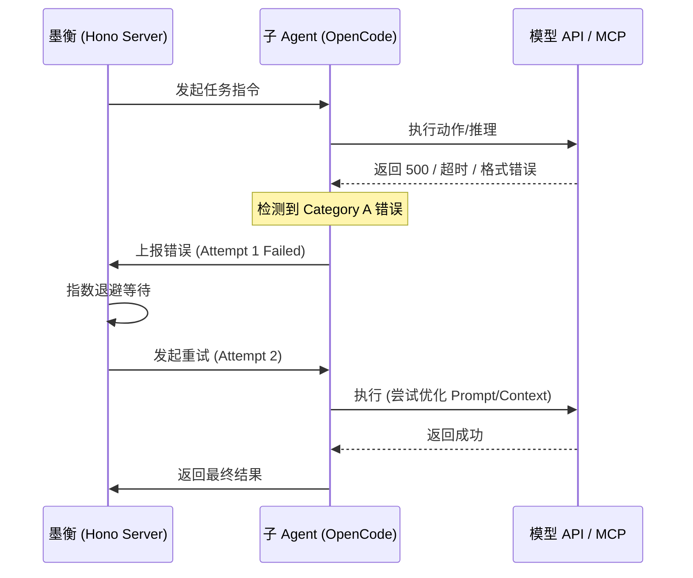
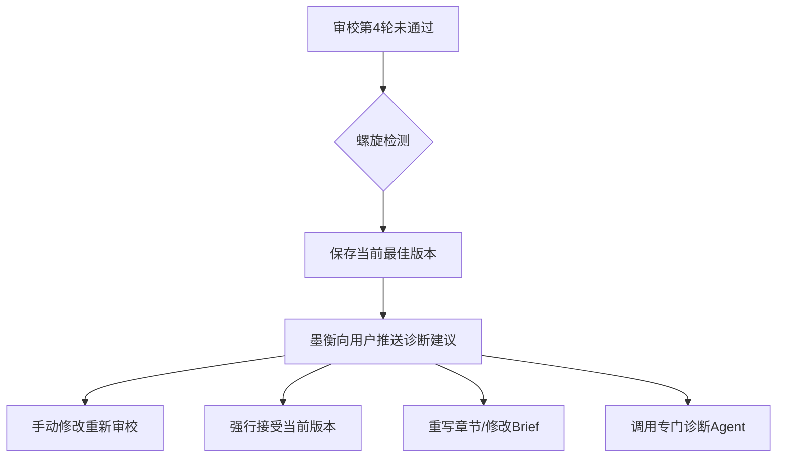
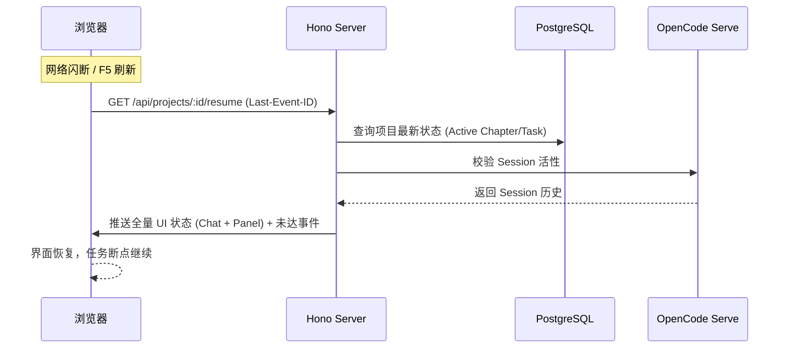
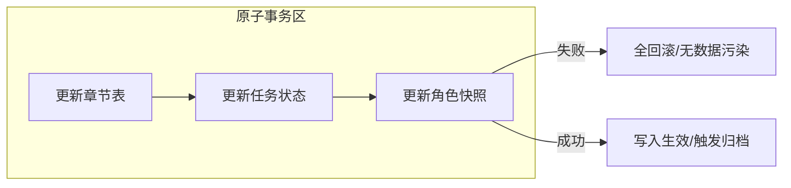

# S8 — 错误恢复

> 一句话导读：构建具备“自愈”能力与“透明”交互的异常处理体系，确保在模型波动、网络抖动或逻辑冲突时，创作流程依然稳健可控。

---

### 1. 错误分类体系

墨染 V2 将错误分为四个核心维度，并根据严重程度（Severity）定义不同的处置路径。

#### 1.1 错误分类（Categories）

- **Category A: 子 Agent 调用失败**
  - 包括 MCP 工具执行错误、模型 API 超时（Timeout）、模型 API 限制（Rate Limit）或服务端错误（5xx）。
- **Category B: 流程螺旋（Process Spirals）**
  - 逻辑层面的死循环，如审校螺旋（评审不通过超过上限）、膨胀螺旋（字数超出约束无法缩减）、矛盾螺旋（情节冲突无法自圆其说）。
- **Category C: 基础设施故障**
  - 网络连接中断、浏览器意外刷新、OpenCode serve 进程崩溃或重启。
- **Category D: 数据一致性问题**
  - 数据库事务失败、版本号冲突（并发编辑）、异步状态不一致。

#### 1.2 严重程度（Severity）

| 级别 | 定义 | 处置原则 |
| :--- | :--- | :--- |
| **FATAL** | 系统级不可用（如数据库挂了、OpenCode 无法连接） | 立即停止所有任务，弹出全局阻塞型报错遮罩，引导重连或等待。 |
| **ERROR** | 任务级失败（如当前章节写入失败、MCP 工具报错） | 自动重试 3 次；若失败，中断当前子流程并交由“墨衡”通知用户决策。 |
| **WARN** | 流程亚健康（如审校轮次过多、模型响应延迟高） | 系统自动干预（如简化 Context），在 Chat 界面弹出轻量化提醒。 |
| **INFO** | 辅助性提示（如模型自动重试成功、缓存命中） | 仅在控制台或诊断面板记录，不干扰用户感知。 |

#### 1.3 错误分类树



---

### 2. 子 Agent 调用失败处理

针对模型层的不可控性，系统通过“自动重试”与“能力降级”确保任务交付。

#### 2.1 重试与降级策略

- **MCP 工具执行错误**：采用指数退避算法（Exponential Backoff）重试最多 3 次。
- **模型 API 超时 (>120s)**：系统自动取消当前请求，削减 `ContextAssembler` 中的非必要背景信息（如旧章节摘要），降低模型推理压力后重试。
- **模型 API 速率限制 (429)**：进入排队队列，按照 5s, 15s, 45s 的间隔重试。
- **模型 API 服务端错误 (5xx)**：重试 1 次，若依然失败，触发“能力降级”，切换至备选模型（如 GPT-4o -> GPT-4o-mini 或 Claude 3.5 Sonnet -> Haiku）。
- **输出格式非法/为空**：校验 Agent 输出的 JSON Schema，若失败则将错误提示作为 System Prompt 反馈给 Agent 进行自修复重试。

#### 2.2 降级矩阵 (Degradation Matrix)

| 场景 | 首选模型 (Primary) | 降级模型 (Fallback) | 降级影响 |
| :--- | :--- | :--- | :--- |
| 章节正文创作 | Claude 3.5 Sonnet | GPT-4o | 文风细腻度略降 |
| 逻辑审校/一致性检查 | GPT-4o | Claude 3.5 Sonnet | 严谨度无明显变化 |
| 摘要提取/简单更新 | GPT-4o-mini | DeepSeek-V3 | 响应速度可能变慢 |

#### 2.3 重试流程序列图



---

### 3. 审校螺旋中断机制

当“明镜”Agent 连续多次不通过“执笔”生成的正文，导致陷入死循环时，系统必须强制干预。

#### 3.1 螺旋检测

- **触发条件**：同一章节的 `review_round > 3`。
- **保护动作**：自动保存当前所有轮次中评分最高（或差异化最大）的 Draft 版本。

#### 3.2 用户干预路径

“墨衡”会在 Chat 界面推送一条“审校僵局”通知，列出所有评审意见的聚合分析，并提供以下选项：

1. **手动修改后重新审校**：用户介入修改争议段落，打破死锁。
2. **降级通过**：接受当前评分最高的版本，强制结束该章任务。
3. **重写章节**：废弃当前逻辑，基于新的 Brief（由用户微调）重新生成。
4. **调整 Brief**：用户放宽字数、冲突度或特定情节的硬性约束。
5. **请求“明镜”诊断**：调用专用诊断 Agent，分析为什么模型无法满足约束（例如：Brief 本身逻辑自相矛盾）。



---

### 4. 网络中断与浏览器刷新恢复

基于 OpenCode Session 持久化与 PostgreSQL 结构化数据，墨染 V2 支持“无缝重连”。

#### 4.1 恢复原理

- **OpenCode Session 状态**：所有对话历史持久化在磁盘，浏览器刷新后，客户端通过 `sessionId` 重新挂载，自动恢复聊天记录。
- **SSE 重连机制**：客户端携带 `Last-Event-ID` 请求 `/api/events`，服务端 Hono 会从 EventBus 缓存中回放该 ID 之后的未达事件。
- **数据恢复**：
  - **正在生成的章节**：存储在 `chapters` 表中，状态为 `draft`。刷新后，信息面板根据 `projectId` 查询最新章节状态，若为 `draft`，则提示“继续创作”。
  - **已归档数据**：由“载史”完成的归档任务是原子性的，一旦完成即可在 DB 查到。

#### 4.2 重连流程图



---

### 5. MCP 工具门禁（Gate）拒绝恢复

门禁系统是 V2 流程管控的核心，当 Agent 尝试违规操作（如在大纲未完成时写正文）时，系统会拦截并引导。

#### 5.1 门禁错误响应格式

```json
{
  "ok": false,
  "error": {
    "code": "GATE_FAILED",
    "message": "无法开始正文创作：大纲尚未完成。",
    "gate_details": {
      "gate_level": "HARD",
      "gate_name": "chapter_write_prerequisite",
      "missing_prerequisites": ["project_outline_completed"]
    }
  }
}
```

#### 5.2 恢复引导

1. **HARD 门禁**：Agent 无法绕过，必须由“墨衡”通知用户，并建议执行缺失的前置任务。
   - *对话示例*：“我们需要先完成大纲，才能保证后续剧情的一致性。要现在开始大纲规划吗？”
2. **SOFT 门禁**：风险提示。若用户在 Chat 中明确表示“忽略并继续”，“墨衡”会携带 `bypass_gate` 标志再次调用工具。
3. **INFO 门禁**：仅作记录，不阻断流程。

---

### 6. 数据一致性保护

确保在发生错误时，系统数据不会处于“中间态”。

#### 6.1 事务边界 (Transaction Boundaries)

- **原子性工具调用**：每个 `mcp-writing` MCP 工具内部对应一个独立的 DB 事务。例如 `chapter_write` 会同时更新 `chapters` 内容和任务状态，要么全部成功，要么全部回滚。
- **归档一致性**：当“载史”归档一章时，必须确保“摘要更新 + 角色状态迁移 + 伏笔状态更新 + 时间线记录”在一个事务内完成。

#### 6.2 并发与冲突控制

- **乐观锁**：`chapter_versions` 表包含 `version` 字段。在保存章节时，若 DB 中的版本号大于请求中的版本号，返回 `VERSION_CONFLICT`。
- **单写者锁定**：基于 SessionManager 维护的锁机制，一个 `projectId` 同一时刻仅允许一个活跃的创作会话，防止多个 Agent 同时操作同一项目。



---

### 7. OpenCode Serve 进程重启恢复

如果后台容器重启，系统需具备自检测和自恢复能力。

- **持久化 Session**：OpenCode Serve 挂载主机卷存储 `sessions.json`，重启后对话 Context 不丢失。
- **健康检查 (Health Check)**：Hono Server 每隔 5s 请求 `GET /global/health`。
- **正在进行的任务**：
  - 如果重启时 LLM 正在生成，“墨衡”会检测到连接异常断开。
  - 等待服务恢复后，“墨衡”通过 `session.messages()` 查询最后一条消息。若为半截回复，则提示用户“由于服务抖动，刚才的生成中断了，是否重新开始？”
- **UI 感知**：顶部出现“正在重连...”Banner，恢复后自动消失。

---

### 8. 恢复优先级矩阵

| 错误类型 | 严重程度 | 优先级 | 核心目标 | 自动恢复？ | 需用户介入？ |
| :--- | :--- | :--- | :--- | :--- | :--- |
| **数据一致性** | FATAL | 1 | 严禁脏数据产生 | 是 (Rollback) | 否 |
| **基础设施** | ERROR | 2 | 保持会话连续性 | 是 (Reconnect) | 否 |
| **Agent 报错** | ERROR | 3 | 确保任务交付 | 是 (Retry/Degrade) | 视重试结果定 |
| **审校螺旋** | WARN | 4 | 打破逻辑死锁 | 否 | 是 |

---

### 9. 异常案例与处置示例

**场景：模型生成的 JSON 损坏**

- **Agent 动作**：调用 `character_update` 试图更新角色，但返回的 JSON 缺少闭合括号。
- **系统处理**：
  1. `core` 层的解析器捕获 `JSON_PARSE_ERROR`。
  2. 构造错误上下文：“你返回的 JSON 格式不正确，请重新输出，确保符合以下 Schema...”。
  3. 将错误发回 OpenCode 进行一次重试。
  4. 若重试成功，用户无感知。
  5. 若重试 3 次依然失败，报错给用户，并提供手动修复该角色数据的入口。

---
